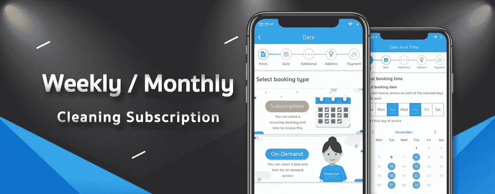

# 加入订阅的行列

> 原文：<https://medium.datadriveninvestor.com/jumping-on-the-subscription-bandwagon-7d8458832457?source=collection_archive---------26----------------------->

[Seekster](http://bit.ly/2D5CvRx) — Subscription for cleaning services

生活变得很方便。多亏了科技，我们可以期待出租车在需要的时候在我们家门口等着，只需在手机上敲几下，食品杂货就能送到，甚至还可以根据需要找到女佣或 T2 技术人员。

按需经济相当无聊。它破坏了消费者的行为，因为他们在个性化和无需做太多就能满足你的需求方面期望更多。

这是订阅产品/服务的上升趋势。我们在许多不同的行业和市场中看到消费者的这种行为。随着市场上提供的订阅服务越来越多，消费者拥有物品的需求越来越少。我们可以看到自己变得更灵活、更轻便，拥有更多的自由和选择，对长期拥有特定产品的义务更少。

你现在可以毫不费力地搬到不同的城市，而不用去寻找公寓或被合同所束缚。[作为 SEA 的领先先驱之一，Flatmonthly](https://www.flatmonthly.com/) 为商务旅行者或数字游牧者提供了恰到好处的解决方案，他们可以根据自己的灵活性简单地订阅短期计划。

市场上的大牌已经为“订阅”生活方式树立了标杆。像拥有超过 1 亿用户的网飞，拥有超过 7000 万用户的音乐流媒体巨头 Spotify，亚马逊 Prime 甚至星巴克。无论是在健康、餐饮、汽车领域，我们看到更多的品牌提供订阅模式，以更好地满足消费者的需求。

是什么让企业和消费者对网飞或订阅模式感兴趣？

*   便利性和客户忠诚度

许多企业选择使用基于订阅的产品的原因之一是它给客户带来的便利。“自动驾驶”更新确保客户不会因为忘记付费而用完产品或暂停服务。有了这样的系统，顾客就不必记得每个月补充或重新订购任何东西。这为他们节省了进行简单和重复购买的思考时间。

*   客户轻松编制预算

另一个让基于订阅的服务非常受欢迎的特性是，它让客户更容易做预算。这是因为订阅通常以统一费率提供产品或服务。这使得客户能够通过预测和控制他们的支出来控制他们的预算。

*   扩展能力

这种模式还允许客户轻松地扩大或缩小规模，而无需担心额外的流程。例如，如果订阅一段时间后，他们需要减少预算，他们可以选择缩减一段时间，直到他们能够恢复正常。

从用户行为来看，另一个需要填补的市场空白是清洁服务订阅。消费者和企业通常不希望每次他们想要保持他们的家或办公室清洁时都要寻找不同的女佣。这些服务通常根据酒店的规模每周安排一次。

Seekster 接受了服务这个市场的挑战，为我们的用户提供每周或每月订阅他们最喜欢的女仆的便利。只需几个简单的步骤，用户就可以让一名合格的女佣打扫他们的家或办公室。通过每月自动计费系统，付款成为他们最不担心的事情。

Seekster weekly 拥有 1000 多个活跃账户，企业和消费者已经确认了订阅该服务的价值，并帮助我们不断开发适合他们需求的产品。

我们希望听到您的想法/反馈。请随时联系 sahib@seekster.co！