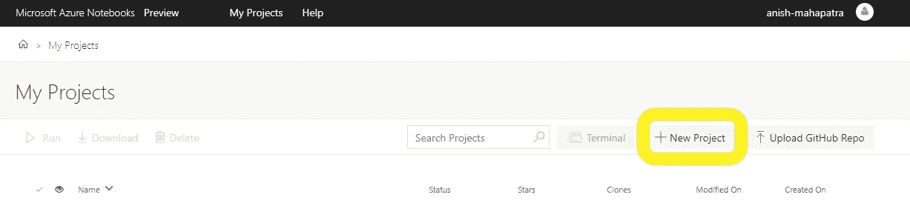
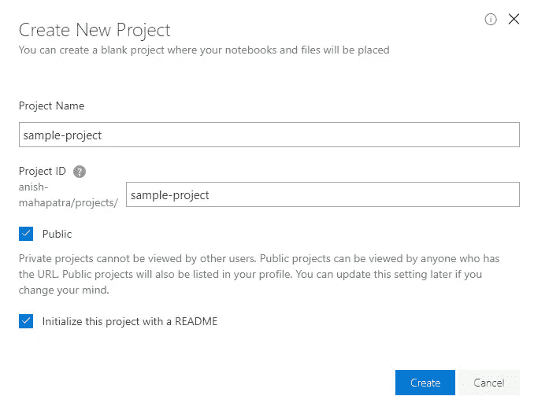
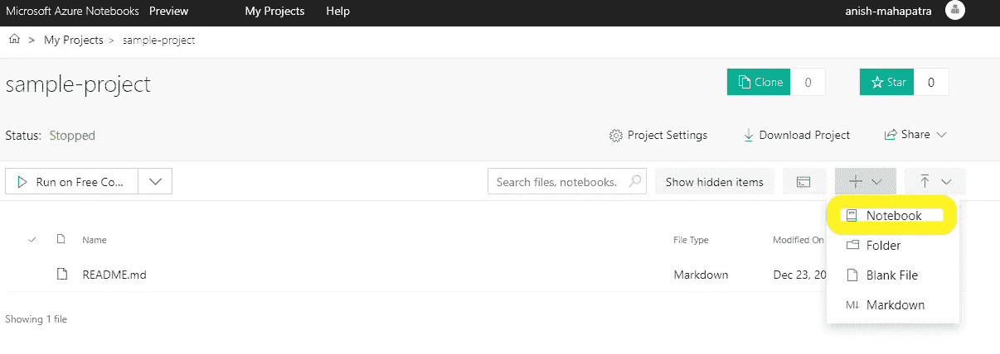
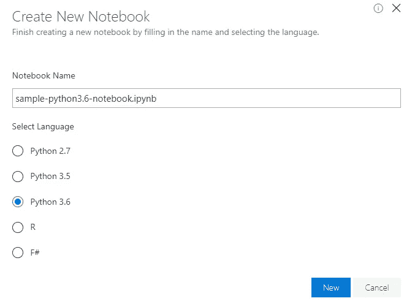
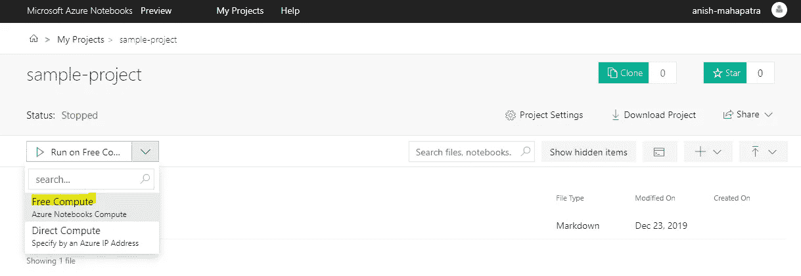
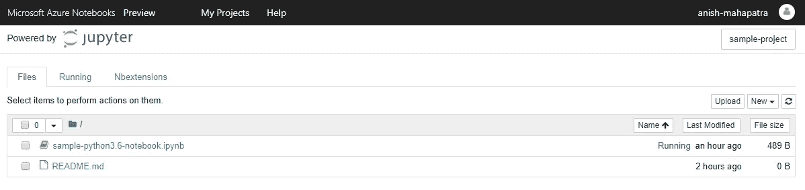
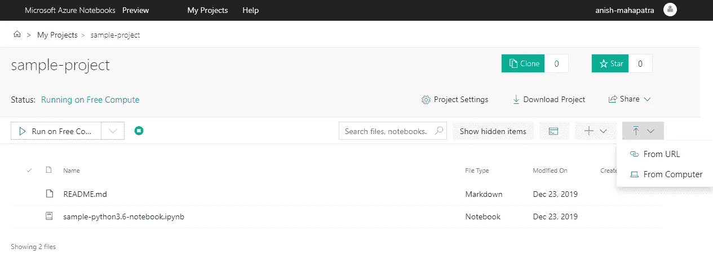
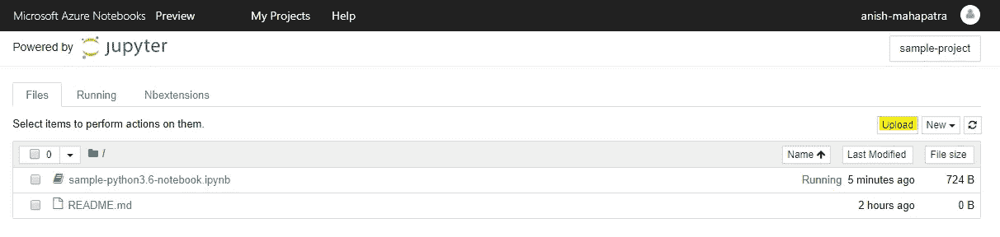

# Jupyter 笔记本崩溃了，所以我在 15 分钟内就在云中部署了我的数据科学项目(免费)

> 原文：<https://medium.datadriveninvestor.com/jupyter-notebook-crashed-so-i-deployed-my-data-science-project-in-the-cloud-in-15-minutes-for-56edc0ac4d0d?source=collection_archive---------1----------------------->

The cloud is a wonderful place.

我曾经玩过一段时间的数据科学算法、机器学习( **ML** )、人工智能( **AI** )、深度学习模型、自然语言处理( **NLP** )、神经网络( **RNN、CNN** )来了解数据科学端到端的应用。我试着在我的 Github [上部署它们。当我试图提交更大的数据集或运行超出本地系统范围的数据科学笔记本时，我面临着许多问题。在我看来，我的](https://github.com/anishmahapatra01/)[本地系统](https://amzn.to/2tCAut5)的规格已经足够好了，我运行的是 4 核 i5(第 7 代)，8GB DDR 4 RAM。然而，当我试图运行比预期更复杂或更长的 Jupyter 笔记本时，我经常有笔记本电脑*抖动*。我尝试了你在网上读到的常见的*技巧和诀窍*:

*   关闭所有其他的 Chrome 标签
*   通过命令终端在 [Anaconda](https://www.anaconda.com/) 和 ran Jupyter 之间切换
*   将笔记本电脑设置从“最佳电池寿命”更改为“最佳性能”
*   仅在连接电源而非电池时运行 Jupyter 笔记本电脑
*   升级系统内存
*   在通过监控工具训练模型的同时监控性能
*   尝试使用 python 中为并行处理优化的包，如 [pandarallel](https://towardsdatascience.com/pandaral-lel-a-simple-and-efficient-tool-to-parallelize-your-pandas-operations-on-all-your-cpus-bb5ff2a409ae) 和 [multiproc](https://towardsdatascience.com/make-your-own-super-pandas-using-multiproc-1c04f41944a1)

然后，我开始考虑升级我的笔记本电脑，试着升级内存，甚至考虑花 10-15 万卢比(1400-2000 美元)买一个我目前买不起的新系统。

 [## 信息图:云之旅|数据驱动的投资者

### 聪明的企业领导者了解利用云的价值。随着数据存储需求的增长，他们已经…

www.datadriveninvestor.com](https://www.datadriveninvestor.com/2018/09/22/infographic-journey-to-the-clouds/) 

当我向一位密友表达我的担忧时，他说我活在过去。我一边试图处理一边小心地解释道:

> 在这个云计算的新时代，人们甚至考虑购买硬件进行处理，而不是将其出租，这是生活在过去。

我心想这一定是一项复杂而艰巨的任务。一些最优秀的开发人员和精通代码的人在配置和部署自己的虚拟机(VM)时一定很艰难。

我没有错，就是这样。虽然这是可行的。

我继续做了一些研究，关于我如何运行一个拥有我在云上使用的所有功能的 Jupyter 笔记本。有几个不错的选择，对它们的全面比较可以在[这里](https://www.dataschool.io/cloud-services-for-jupyter-notebook/)找到。我想要一个尽可能接近经典 Jupyter 笔记本界面的东西，麻烦最少，易于下载和共享——我决定用 [Azure 笔记本](https://notebooks.azure.com/)。随着我继续攻读硕士学位，我将需要在接下来的一年中实现更复杂的模型。

我将需要定期利用更高的计算能力，主要是当我试图训练复杂的模型时，但一般来说，免费层将满足我的数据科学需求的其余部分。

我们来分析一下这对你意味着什么。这意味着总成本约为 10-15 万卢比(1500 美元-2000 美元)的硬件可以在您十年前的笔记本电脑上运行，而成本只是它的一小部分。关于分数，我指的是在₹20/hour(30/小时)以下的固体构型。现在，让我们从如何免费获得这个开始。

在这篇博客中，我将向您介绍以下内容:

1.  Azure Jupyter 笔记本和云
2.  如何运行和部署您的第一台 Azure Jupyter 笔记本电脑
3.  如何在 Azure 上使用本地数据

太棒了，如果你对某个部分感兴趣，我建议你向下滚动到那个部分。

# 1.Azure Jupyter 笔记本和云

点击[这里](https://notebooks.azure.com/)并创建一个微软 ID 或登录页面。在线运行 Jupyter 笔记本有几个选项，如谷歌云平台上的[亚马逊网络服务](https://docs.aws.amazon.com/dlami/latest/devguide/setup-jupyter.html)(AWS)[谷歌 Colab](https://colab.research.google.com/) ，鉴于该平台的易用性和熟悉度，我已经瞄准了 Azure 笔记本。

与本地系统相比，在云上运行 Jupyter 笔记本有一些主要优势:

*   **全球访问**:您可以在世界任何地方访问您的笔记本电脑/存储库，而不是本地系统
*   **弹性**:当训练更复杂的模型或使用更多数据时，您可以使用较低的计算/自由层来运行数据预处理，并移动到较高的计算
*   旧硬件:无论你使用的是最新的笔记本电脑，还是几十年前的旧电脑，只要你有一个浏览器，你就可以在云上部署机器学习模型
*   **易于共享和协作**:凭借直接从 Github 中提取和部署的优势，您还可以与您的同行协作和共享 Jupyter 笔记本电脑，以优化部署和版本控制
*   **Jupyter 笔记本的熟悉度**:虽然我喜欢新的工具和技术，但我多年来一直使用的工具和技术都很熟悉，就快捷方式、选项和布局而言，好的笔记本电脑多年来一直是我们数据科学家事实上的选择

# 2.如何运行和部署您的第一台 Azure Jupyter 笔记本电脑

点击[此处](https://notebooks.azure.com/)访问微软 Azure 笔记本*预览*并导航至“我的项目”选项卡。

Hit the **New Project** button

创建一个示例项目，如下所示。

Creating a sample-project

我们现在可以部署一台 Jupyter 笔记本电脑，并将其部署在云上。在本地部署 Jupyter 笔记本电脑时，使用的计算是本地计算机的配置。当我们在云上部署笔记本电脑时，我们不能从本地获取文件，而是必须上传文件，然后在线运行。现在，选择一个新的 Jupyter 笔记本，并使用**自由计算**层来部署笔记本，如下所示。

Select a new Jupyter Notebook

选择你想用来运行笔记本的内核，我更喜欢 Python 3.5 或更高版本。

Select the Kernel you would like to run, here we have chosen Python 3.6

为此演示选择免费计算层。

Select **Free Compute**: Azure offers 4GB RAM and 1GB Storage in their free-tier along with 1 vCPU

一旦你完成了上面描述的步骤，你应该会看到一个舒适的 Jupyter 笔记本界面，上面有一个微软 Azure 笔记本作为丝带。

The Jupyter Notebook as hosted on Microsoft Azure Notebooks

由于微软最近收购了 Github，Azure 笔记本和 Github 运行良好，您可以克隆/启动您希望关注的项目。

# 3.如何在 Azure 笔记本上处理本地数据:

简单！如果数据小于 1 GB，只需在相关选项卡下上传即可。

## 1.我的项目部分

Upload data from your local system or a link

您甚至可以在这里上传您的整个 Github 资源库(< 1GB)

## 2.点击 Jupyter 笔记本界面中的上传按钮

Use the **upload** button

这可用于将您的数据上传到您当前正在运行的实例中。你可以建立一个文件夹结构，上传 Jupyter 笔记本，CSV，Excel 文件，图片等。

## 结论:

 [## Anish Mahapatra -数据科学家-穆适马公司| LinkedIn

### 我正在努力理解数学、商业和技术如何帮助我们在未来做出更好的决策…

www.linkedin.com](https://www.linkedin.com/in/anishmahapatra/) 

差不多就是这样。Jupyter 笔记本崩溃了，于是我在 15 分钟内把我的数据科学项目部署在云端(免费)。在我接下来的一篇博客中，我将简要记录我如何将 Azure 的计算-数据科学虚拟机和 blob 存储连接到 Azure 笔记本的简化版本。我也写关于千禧一代的[生活方式](https://medium.com/@anishmahapatra/the-millennial-burn-out-is-real-a0acebff25ae)、[咨询](https://medium.com/@anishmahapatra/my-top-5-learnings-as-a-consultant-accc5989ec34)、[聊天机器人](https://chatbotslife.com/how-you-can-build-your-first-chatbot-using-rasa-in-under-15-minutes-ce557ea52f2f)和[金融](https://medium.com/@anishmahapatra/the-investment-guide-for-smart-noobs-9d0e2ca09457)！如果您对此有任何问题或建议，请随时通过 [LinkedIn](https://www.linkedin.com/in/anishmahapatra/) 联系我或关注我 [**这里**](https://medium.com/@anishmahapatra) ，我很想听听您的想法。

下面可以找到后续文章。

 [## 在 15 分钟内在云上运行 Jupyter 笔记本电脑#Azure

### 文章做到了标题所说的。在 Azure 笔记本电脑(免费或付费)上运行 Jupyter Notebook，其成本仅为……

towardsdatascience.com](https://towardsdatascience.com/running-jupyter-notebook-on-the-cloud-in-15-mins-azure-79b7797e4ef6)