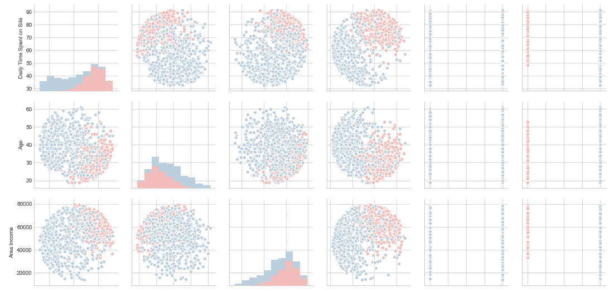
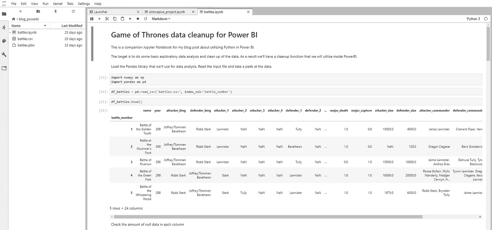

# Jupyter + Pandas =类固醇上的 Excel！

> 原文：<https://medium.datadriveninvestor.com/jupyter-pandas-excel-on-steroids-9b8b94d11178?source=collection_archive---------29----------------------->



探索性数据分析和清理数据是任何机器学习任务最重要的方面之一。如果不正确理解您处理的数据，就无法从模型中获得最佳结果。因此，我决定通过了解熊猫和 Jupyter 来开始我的学习机学习之旅。我不知道它会对我的日常工作产生什么影响，即使不是直接处理数据科学任务。在这篇文章中，我将向你介绍熊猫和 Jupyter，以及如何开始使用它们。我将讲述它的好处，以及它如何部分取代了 Excel 的工作，提高了我的效率。它并不是所有任务的最佳选择，所以我还会提出一些场景，在这些场景中，使用其他工具可能会更好。

# 关于丘比特和熊猫

Jupyter 是一个交互式 web 应用程序，它允许你运行和可视化实时代码(在我的例子中是 Python ),而不是作为脚本或应用程序运行。它还支持添加叙述性文本，您可以在工具本身中创建报告。 [Pandas](https://pandas.pydata.org/) 是一个易于使用的数据结构和数据分析库。这些工具的结合为数据清理和转换、数据分析、数据可视化和简单的统计建模提供了可能性。Jupyter 的真正威力展现出来，因为您有可能利用 Python 可用的所有库。统计可视化的 [Seaborn](https://seaborn.pydata.org/) ，机器学习的 [scikit-learn](http://scikit-learn.org/stable/) ，深度学习的 [keras](https://keras.io/) 等等。



This is what Jupyter looks like

# 优点和缺点

我在很多场合都用过 Jupyter +熊猫，比如；分析每小时的数据以进行预算跟进和开具发票，帮助定位不活跃的移动订阅，在将各种数据作为 Excel 工作簿传递之前对其进行清理，分析调查结果，以及分析 bug 跟踪器数据。以下是我遇到的一些好处:

*   *Python 生态系统* —因为 Python 是一种编程语言，所以你可以用数据做几乎无限的可能性。重复使用代码，利用第三方库，在 Jupyter 中分析后自动执行重复任务等。
*   *从更非传统的格式导入数据*——尽管 Excel 提供了从网页导入表格的基本可能性，但它远不及[网络抓取](https://en.wikipedia.org/wiki/Web_scraping)库或直接从 [PDF 文档导入表格](https://github.com/socialcopsdev/camelot)所提供的可能性。
*   *高效的数据过滤、组合和聚合* — Pandas 允许您进行类似数据库的操作，如连接、分组和查询。此外，它还具有类似于 Excel 的透视功能。
*   *快速原型制作和可视化* —除非我处理简单的数据，否则我使用 Pandas 比使用 Excel 更快地获得想要的结果。尽管我认为自己是一个经验丰富的 Excel 用户。

虽然有很多好处，但也有一些时候这可能不是你的最佳选择。主要原因是陡峭的学习曲线，除非你有某种编程背景。我不会推荐任何人为了替代 Excel 而去学 Python 和熊猫。如果您正在处理简单的数据，请使用 Excel。虽然 Python 生态系统允许对图形和其他可视化组件进行很好的定制，但是如果想要的可视化和定制类型可用的话，您最好还是坚持使用 Excel。

# 如何开始

有几种方法可以在你的电脑上安装 Python & Pandas。如果您是从零开始，可能最快的方法是安装 [Anaconda 发行版](https://www.anaconda.com/download/)，它通过一个安装程序提供您需要的一切。如果您的计算机上已经安装了 Python 环境，您可以使用 pip 安装这些库。打开命令提示符/终端并执行:

```
pip install pandas jupyter xlrd openpyxl
```

为了从 Pandas 中读取和写入 Excel 工作簿，需要使用`xlrd`和`openpyxl`库。

安装说明:[蟒蛇](https://docs.anaconda.com/anaconda/install/)，[蟒蛇](https://realpython.com/installing-python/)，[熊猫](https://pandas.pydata.org/pandas-docs/stable/install.html)， [Jupyter](http://jupyter.org/install.html)

安装完所需的软件包后，您可以通过双击 Anaconda 安装的 *Jupyter 笔记本*图标或执行以下命令来启动 Jupyter:

```
jupyter notebook
```

启动 Jupyter 应该会自动在默认的网络浏览器中打开应用程序。如果没有出现这种情况，请尝试导航到`http://localhost:8888`，这是在您自己的计算机上运行 Jupyter 时的默认地址。下一步是熟悉朱庇特和熊猫。互联网上有很多好的资源，下面是一些帮助你开始的资源:

*   [Jupyter 笔记本教程:权威指南](https://www.datacamp.com/community/tutorials/tutorial-jupyter-notebook) by Datacamp
*   [Jupyter 初学者笔记本:Dataquest 的教程](https://www.dataquest.io/blog/jupyter-notebook-tutorial/)
*   [10 分钟到熊猫](https://pandas.pydata.org/pandas-docs/stable/10min.html)，由熊猫
*   熊猫写的烹饪书
*   [Python 和 Pandas 的数据分析](https://pythonprogramming.net/data-analysis-python-pandas-tutorial-introduction/)Python 编程视频教程
*   [Boris Pashkaver 在 Udemy 上对熊猫和蟒蛇进行数据分析](https://www.udemy.com/data-analysis-with-pandas)

就我个人而言，我从 Udemy 的课程中获得了经验，该课程全面概述了你可以对熊猫做些什么。尤其是在开始的时候，当我处理现实世界的问题时，我经常依赖于在课程中创建的笔记本。希望这让你对尝试熊猫感到兴奋，并让我知道你如何在工作中利用熊猫和/或 Jupyter！