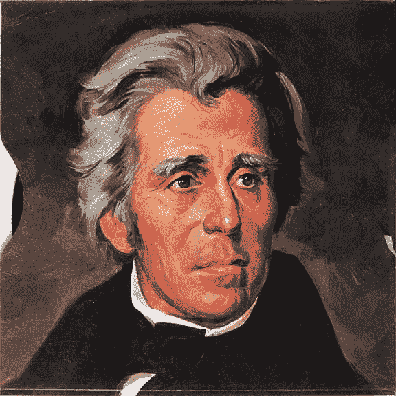

# 就 10 天！！！

> 原文：<https://medium.datadriveninvestor.com/just-10-days-6357baf5149a?source=collection_archive---------6----------------------->

U.S. President Andrew Jackson — killer of central banks

2018 年 6 月 1 日(彭博)"*诉讼揭露德意志银行调查与俄罗斯部长的关系*"揭露他们雇佣政府的子女。官员和报告称，2017 年镜像交易被罚款 6 亿美元。

2018 年 5 月 30 日(**彭博**)“*富国银行的假账户客户将获得‘不完美关闭*”报道称法官称法庭和解是‘最不糟糕’的解决方案。

2018 年 6 月 1 日(**美国消费者新闻与商业频道**)“*尽管利率下调*，德意志银行首席执行官坚持财务实力不容置疑。真的！

2018 年 6 月 1 日(**CNN Money**)“*花旗和德意志银行面临犯罪卡特尔指控*”在澳大利亚。

2018 年 5 月 31 日(**CNN Money**)“*美联储称德意志银行美国业务陷入困境*”披露德意志银行意外向某人发送了一笔 350 亿美元的款项(！)

2018 年 5 月 31 日(**market watch**)“*随着各国央行撤退*，意大利的震动预示着下一轮市场恐慌将带来更多痛苦。”

2018 年 6 月 1 日(**路透社**)“V*isa 称其在欧洲遭受服务中断*”没有解释原因(！)

2018 年 5 月 31 日(**《财富》** ) " *摩根大通首席执行官杰米·戴蒙的薪酬仍然非常非常高*"高达 2800 万美元的年薪(！)

2018 年 5 月 31 日(**The Economist**)“*美国新银行的数量已经跌落悬崖*”让我们在当地社区银行存款的选择更少了。

2018 年 6 月 4 日(**彭博** ) " *(澳洲)联邦银行为贩毒集团洗钱支付创纪录罚款*" 5.3 亿美元(！)

2018 年 5 月 31 日(**华盛顿邮报** ) " *美联储投票放宽旨在阻止高风险银行决策的规则*"...被一个把 CDO 切成碎片的行业变成了归零地。)对于 2008 年的金融危机。

2018 年 6 月 6 日(**CNN Money**)“*富国银行并不是唯一一家拥有假账户的银行*”美国货币监理署(OCC)调查了 40 家银行，但没有告诉我们是哪些银行(！)

2018 年 6 月 7 日( **MarketWatch** ) " *伦敦证券交易所故障*"延迟开市一小时，没有解释原因(！).

2018 年 6 月 8 日(**《卫报》**)*阿根廷在全国抗议声中同意国际货币基金组织 500 亿美元贷款*】这是国际货币基金组织有史以来最大的救助，是国际货币基金组织 2000 年救助阿根廷的重演。

最后，我要结束第一篇关于德意志银行俄罗斯贿赂的文章…

> 2018 年 6 月 4 日( **CBS** )“法国兴业银行因操纵 LIBOR(罚款 7.5 亿美元)和贿赂利比亚官员(罚款 5.85 亿美元)被罚款 1B 美元”。

我们的国家和全球货币体系在 1913 年美国当前的中央银行——美联储成立之初就存在致命的缺陷。1832 年，美国总统安德鲁·杰克森[否决了之前的中央银行](http://avalon.law.yale.edu/19th_century/ajveto01.asp)(名为美国第二银行)。他的否决意见精辟地阐述了他对私人银行家独占性、偏袒性和特权的反对，这些银行家被赋予对作为债务发行的货币行使垄断控制的权利。他对中央银行特有的社会不平等及其腐败和功能失调的框架的描述——如最近 10 天的头条新闻所示——动摇了当时国会的多数意见，通过了将中央银行任期再延长 10 年的修正案。银行倒闭了。是时候让我们有另一个杰克逊了。

