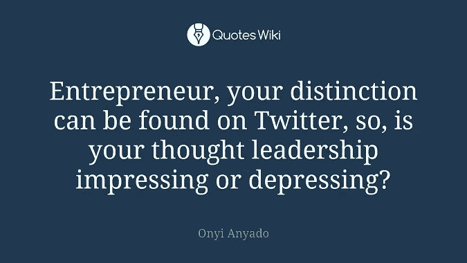

# 只是一个想法:做一个领导者

> 原文：<https://medium.datadriveninvestor.com/just-a-thought-be-a-leader-338d58501f39?source=collection_archive---------0----------------------->

## 真正的思想领袖用创新的想法激励人们

思考得到了一个坏名声。“思想领导力”可以是鼓舞人心的，也可以是令人不快的，这取决于它是如何呈现的。今天的许多企业在工作描述中插入了“思想领袖”，但企业家真的知道思想领袖是什么样的吗？

[阿德尔·德·迈耶](https://twitter.com/AdeldMeyer)对这个话题有一些领先的想法。她是社交媒体专家、直播节目主持人、作家和导师。她与企业家、初创公司、个人品牌和企业主合作，寻找社交媒体中的机会，以及如何将社交媒体用作营销和建立关系的工具。

德·迈耶与 DIYMarketers 的所有者[伊凡娜·泰勒](https://diymarketers.com/)以及营销、战略、领导力和商业顾问[伊凡·伊格贾托维奇](https://twitter.com/IvaIgnjatovic)就思想领导力及其如何帮助商业进行了交谈。

 [## 对区块链来说，这是边玩边学

### 加密货币深入挖掘游戏和营销

cryptocurrencyhub.io](https://cryptocurrencyhub.io/for-blockchain-its-play-and-learn-c6727c36c4b5) 

思想领导力意味着你已经赢得了在你的领域里最值得倾听的人的名声。不要浪费它。确保你所说的是基于事实的。

“思想领袖是见多识广的意见领袖，是他们专业领域的关键人物，”德·迈耶说。“他们是值得信赖的来源，用创新的想法感动和激励人们。”

根据 Ignjatovic 的说法，在过去的 20 年中，“领导力发生了很大的变化，随之而来的是，思想领导力成为成功企业的重要组成部分。”

泰勒也注意到了不同之处。

“过去，思想领袖和有影响力的人仅限于拥有大量受众的人，”她说。"今天，各级领导都有一条长长的尾巴."

德迈耶同意了。

她说:“我喜欢领导力的成熟，并给了更多的领导者如此多的机会。”。“最显著的变化是影响力从线下转移到了线下*和线上*。

“这也让更多的人有机会成为他们所在领域的思想领袖或影响者，”德迈耶说。“必须热爱社交媒体的力量。它真正改变了我们所知的世界。”

# **领导者的想法**

成为思想领袖没有特别的要求。真正的思想领袖会说一些不同寻常的话，让人们停下来独立思考。问题是当人们为了被听到而建立声誉和脱口而出时。

“思想领袖拥有现实生活和学术经验的混合体，”泰勒说。"他们能够用简单的术语交流复杂的概念。"

Ignjatovic 的视野更广。

“思想领袖不仅在他们的业务中，而且在全球范围内创造积极的变化，”她说。

 [## 批判性思维穿透回音室

### 运用思考技巧为你的企业做出更好的决策

becominghuman.ai](https://becominghuman.ai/critical-thinking-pierces-echo-chambers-f4d75b97e455) 

好主意随时随地都会从任何人那里冒出来。

“思想领导力可以来自任何来源——高管、客户、经理、销售人员，”德·迈耶说。“我们都有知识、经验和观点。但最终，思想领袖需要激励你的消费者采取行动——在他们的旅程中迈出下一步。”

所有的企业主不需要成为思想领袖，但“思想领袖”是最新的闪亮物件。许多企业家认为，思想领导力是跟上时代步伐的必备条件。

“不是每个小企业主都需要或想要成为思想领袖，但当你接触到更广泛的受众并成为该主题的‘关键人物’时，它肯定会帮助你发展你的业务，”德迈耶说。

“以理查德·布兰森为例，”她说。“多年来，他的名字已经成为世界上最知名的名字之一。带给他如此多认可的不仅仅是[维珍](https://en.wikipedia.org/wiki/Virgin_Group)，还有他在品牌背后所展现的自我。他让人们了解他，让他的品牌以人为中心。”

Ignjatovic 说，思想领导力应该在较小的领域占据一席之地。

“所有小企业主都应该努力成为思想领袖，”她说。“即使他们不是，这些行动也会改善他们的业务和周围的一切。”

# **创造思维**

泰勒说，无论大小，所有的企业家都应该有思想领袖的心态。

“企业主需要成为他们特定领域的思想领袖，”她说。“他们这样做是因为他们有特定的观点。在某些方面，分享你的想法和激情更容易，但要推动行动和灵感，你真的需要脱颖而出。

“我想到了我当地的园艺师，他有园艺或可持续景观的背景，”泰勒说。“对我来说，那是一个思想领袖。我会选择他的公司，而不是一个只会修剪和种植的人。”

 [## 你的个人品牌定义了最好的你

### 坚持出现并兑现你的承诺

medium.com](https://medium.com/datadriveninvestor/your-personal-brand-defines-the-best-of-you-2f10ce511ea3) 

个人品牌和思想领导力是相关的。你可以亲自给自己打上思想领袖的烙印。只要确定你说的不是空话。

“这难道不是社交媒体和互联网的美妙之处吗？”泰勒问道。“如果你得不到牵引力，你哪儿也去不了。思想领导力和个人品牌之间只有一线之隔。人们可以成为思想领袖，但没人知道他们。”

Ignjatovic 看到了一个紧密的联系。

“思想领导力与个人品牌紧密相连，”她说。“成为专家并不等同于拥有并展示专业技能。个人品牌是“包装”思想领导力是内在的，本质的——没有伪装。"

根据德·迈耶的说法，这两种元素都不是等份的。

“思想领导力和个人品牌是相辅相成的，”她说。“然而，你会发现这个世界上伟大的思想领袖在网上没有强大的个人品牌。

“所以，你可以拥有一个没有影响力的个人品牌，反之亦然，”德迈耶说。“如果你专注于提供一致、高质量的内容——分享知识——你将拥有更大的影响力，并有能力在此过程中教育和赋权他人。”

# **真知灼见**

某些类型的内容会影响你对某人的看法，让你说，“那是思想领袖。”对泰勒来说，“我寻找的是彻底的内容，包含只有在某个领域深入工作过的人才会有的细节或见解。”

对于 Ignjatovic 来说，这样的内容必须是杰出的。

“它必须以一种特殊的方式来写，”她说。“说教者多，教导者少。把知识传授给别人不容易。”

 [## 业务自动化不是自动的

### 更多的小企业上线了，这是一件好事

becominghuman.ai](https://becominghuman.ai/business-automation-is-not-automatic-7157210953af) 

德·迈耶告诫人们不要放弃订婚。

“过度自动化是一个不好的迹象，”她说。“对我来说，思想领袖不会让所有事情都自动化，也不会让他们的观众参与进来。我也关注机器人的参与度。这些很容易发现。”

她还引用了著名的非机器人[克里斯·科赫](https://www.linkedin.com/in/christopherakoch/):“思想领导力是一种基于知识与潜在客户建立关系的方式——而不是基于产品和服务。”

思想领袖有着共同的特质。例如，每个人都有一个平台。有深度的思想领袖利用了这个机会。

Ignjatovic 喜欢移情。

“真正的思想领袖需要它来真正联系和理解他人及其需求，”她说。

泰勒认为，单词很重要。

“每一位思想领袖都必须具备简单明了的沟通能力，”她说。“鹦鹉学舌很容易。一个思想领袖可以简单轻松地交流复杂的想法。”

德迈耶想要附加值。

“思想领袖有帮助、教育或娱乐他人的真诚愿望，”她说。“他们都高度致力于真正改变他们的行业。建立影响力不是一件容易的事情，而且肯定不适合所有人。”

# **社交媒体元素**

如今，社交媒体也是思想领导力的一个重要因素，尽管仅仅是在那里不应该是优先事项。取而代之的是关注社交、可用性和有价值信息的来源。你最终会成为一个默认的思想领袖，而不是法定的。

“社交媒体有能力成就或摧毁一个思想领袖，”泰勒说。“有些人可能很平庸，但拥有出色的社交媒体技能，被认为很棒，反之亦然。”

 [## 社交媒体的未来冲击就在这里

### 数十亿用户释放出数十亿的机会和警告

medium.com](https://medium.com/datadriveninvestor/future-shock-of-social-media-is-here-8b9e0f8f8c4b) 

虽然社交媒体很重要，Ignjatovic 说思想领袖“不必无处不在。人们会去找他们。”

德·迈耶说，无论思想领袖在哪里发表他们的想法，他们都必须是可用的。

“活跃在社交媒体上在当今世界的影响力和思想领导力方面发挥着重要作用，”她说。“这表明你平易近人、真实可信，并且乐于分享你的知识。这更容易建立信任，所以在我看来这是必须的。

“作为思想领袖的有效性确实取决于你的定位、你的职位以及你作为思想领袖的时间长短，”德·迈耶说。“社交媒体并不是每位领导者的必备条件，但它肯定有助于建立信任或分享你的知识，创造影响力或创新。”

# **宽与窄**

成为一个广泛领域或小众领域的思想领袖有什么不同吗？不要大惊小怪。在社交媒体上做好事，说好话。无论是大类还是小众，重要的是你能提供什么，而不是行业。

“对我来说，成为思想领袖是关于利基专长，”Ignjatovic 说。"不管话题有多复杂，它总是一些具体的东西."

德·迈耶并不担心这种差异。

“没有错误或正确的答案，”她说。“有一个专注的专业领域总是更好。

“我们都知道你不可能成为营销方面的专家，但你可以成为脸书专家或推特广告专家，”德·迈耶说。“有一个狭窄的焦点也更容易在那个领域建立影响力，因为你可以真正集中你的时间和精力。”

 [## 用一种特别的方式写博客，开启你的成功之路

### 把你的主张标在一个利基市场上，并每天写下来

medium.com](https://medium.com/datadriveninvestor/blog-your-way-to-success-in-a-special-way-aa07e5364cac) 

泰勒想要更集中的注意力。

“我更喜欢特定领域的思想领袖，”她说。“首先，有空间容纳更多的思想领袖。其次，你可以从利基专家那里获得更好、更深入、更有见地的信息。”

当你开始认为一切都是关于你而不是你所说的话时，你就可能脱离思想领导。真正的思想领袖把自我放在门外。

“一切都始于人民，终于人民，”Ignjatovic 说。“无论如何都要避免与错误的人共事。小贴士:小心挑选。听从你的直觉。”

泰勒说思想领袖应该思考他们是谁。

“作为一个人，你是谁就是一切，”她说。"受自我驱动的思想领袖错过了改变世界的机会."

德·迈耶警告要不惜一切代价避开电气化铁路。

“远离网络政治、宗教、推特战争，不要在酒吧发布那些喝醉的自拍，”她说。"记住，你现在每时每刻都在公众的视线中."

她还强调要忠于你所说的。

“任何人都可以把文字写在纸上，创造一个营销活动，”德迈耶说。“以为领导，是你走路说话的地方。当你开口说话的时候，人们会知道你是否真的是你所在领域的“专家”,你的名声也会说明一切。

“思想领导力是目标，”她说。“内容营销和推广是手段。它们是齐头并进的，但并不是所有的内容营销都包含思想领导力。是一条细线。”

**关于作者**

吉姆·卡扎曼是[拉戈金融服务公司](http://largofinancialservices.com)的经理，曾在空军和联邦政府的公共事务部门工作。你可以在[推特](https://twitter.com/JKatzaman)、[脸书](https://www.facebook.com/jim.katzaman)和 [LinkedIn](https://www.linkedin.com/in/jim-katzaman-33641b21/) 上和他联系。