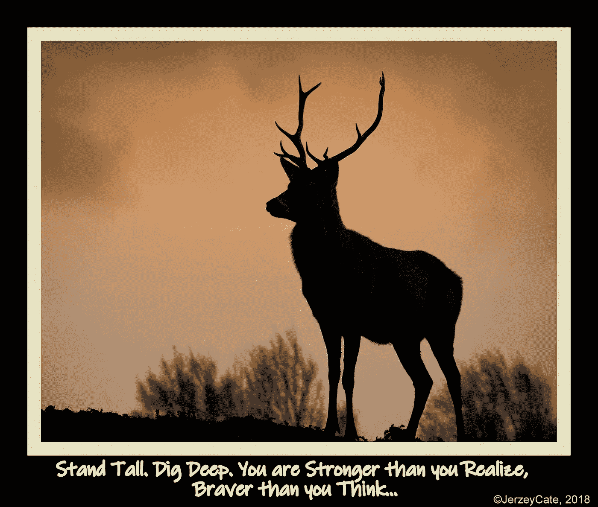

# 做就是了…

> 原文：<https://medium.datadriveninvestor.com/just-do-it-ae9598450474?source=collection_archive---------8----------------------->

有史以来最辉煌的广告口号之一是耐克的“Just Do It”。它创造了数十亿美元的收入。令人印象深刻，但这不是我的口头禅“只管去做”的原因。

由于我们将耐克与运动和田径联系在一起，很容易认为该信息是关于积极运动的。关于召唤意志力。深入挖掘，寻找你从来不知道自己拥有的资源。不管任务有多艰难，都要鞭策自己。就这些了。

但是在你能够做到这些之前——无论你是在赛跑、完成学业还是创业——你还需要有勇气。

只要去做就能建立勇气。

是什么阻碍了一个医生说他们需要更多的锻炼，但是已经 20 年没有系上运动鞋的人？

懒惰？没有。

动力不足？你听到我说“否则”了吧？

**恐惧……**

*   *我会看起来很傻吗？*
*   *我会做错吗？*
*   我会在几分钟内吸进风吗？
*   *别人会嘲笑我吗？*

事实上，在生活中我们尝试的每一件事情中——首先也是最重要的——是什么阻止了我们迈出第一步，迈出第一步？**恐惧……**

恐惧的答案很简单。不容易，但是简单。

*   *我不够好！* ***就这么做*** *。*
*   我还没准备好！ ***说做就做。***
*   *不知道怎么样！* ***说做就做。***
*   我可能会失败！ **说做就做。**

**不要介意**过去的事。

别管你到现在都做了什么。

**别管你不能的理由。**

别管那些说你不行的人。

别管你有多害怕。

不要试图克服所有的挑战。

承认他们。然后把它们放在一边，开始。

*   采取行动。
*   果断行动。
*   到达你想去的地方。

所有这些，在 t 恤、广告牌、帽子、包、盒子、甚至鞋子上都可以看到。*“照做就是了”*印在几代人的脑子里……**很神奇吧**。

耐克开始用一句口号来改变一个行业。看似愚蠢的做法奏效了。

在这个过程中，他们做了一些更有价值的事情。

他们给我们头脑中的那种“微弱的声音”提供了一种简单而有力的回应，来应对困扰我们所有人的怀疑、犹豫、抗拒和恐惧。

做就是了…

JerzeyCate，2018