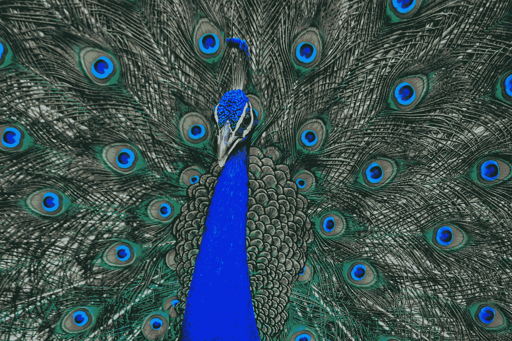
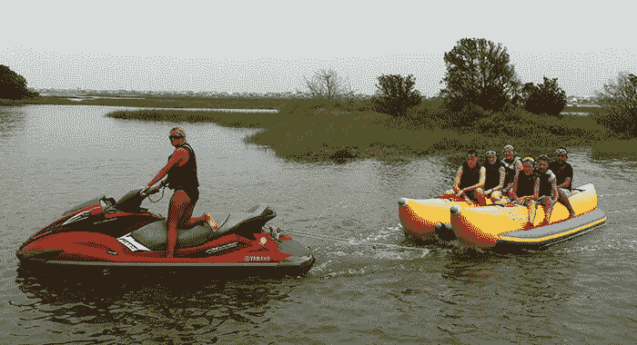
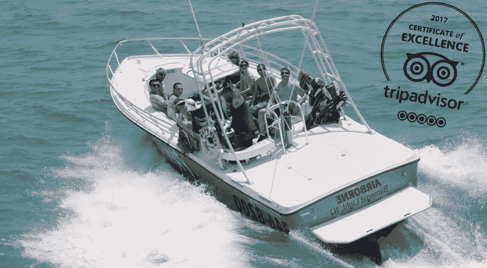

# 做你的事吧

> 原文：<https://medium.datadriveninvestor.com/just-do-your-thing-7be8f656c83?source=collection_archive---------7----------------------->

忘掉那些批评家吧

Photo by [Milind Ruparel](https://unsplash.com/@milind_ruparel?utm_source=unsplash&utm_medium=referral&utm_content=creditCopyText) on [Unsplash](https://unsplash.com/search/photos/peacock?utm_source=unsplash&utm_medium=referral&utm_content=creditCopyText)

对尴尬的恐惧经常会阻止人们去做他们想做的事情。

## 害怕失败或看起来像个傻瓜会让我们在做新的或困难的事情时犹豫不决，因为我们不想在其他人面前搞砸。

如果你脑中的声音在说，“不，不要做。想想 _________ 会怎么想”(用邻居、你的父母、你的朋友、可能会看到你的完全陌生的人来填空)，那么你需要读一下这个。

 [## 摔倒不是失败。数据驱动的投资者

### 你只有在放弃的时候才会失败。每个英雄都会倒下，我们活着就是为了失败者出现的时刻；上升到…

www.datadriveninvestor.com](https://www.datadriveninvestor.com/2019/01/17/falling-isnt-failing/) 

## 无论是创业、换工作、重返校园还是尝试一项新活动，做好自己的事，不要担心那些讨厌的人。

不要让对他人回应的恐惧，不管是认识的还是不认识的，阻止你完成你想做的事情。不要因为害怕看起来愚蠢或不够完美而阻止你享受乐趣或尝试新事物。

这并不意味着你不应该未雨绸缪，通过做好准备来避免错误。

你有没有过想尝试一件事，却又怕搞砸，显得很傻的经历？

有没有什么事情是你想做的，但是你觉得自己太笨、太没经验、太害羞、太老、太胖，或者什么都做不了？

## 我建议你勇敢一点，忘掉被批评或被认为愚蠢的想法，大胆去做。

上周，我和我的儿子、他的妻子以及我 17 岁的孙女一起去度假。我们做的活动之一是滑翔伞。

我有一个与这个活动相关的恐惧。我在 2017 年做了膝关节置换，因为我不能做我应该做的那么多物理治疗，我不能弯曲我的左膝到它应该弯曲的程度。

这使得一些活动难以完成。

我担心我会在玩滑翔伞时受伤。我担心着陆会很困难，我可能会伤到我的膝盖，直到我看了一个视频，展示了如何做到这一点。

它还展示了滑翔伞运动员在回到船上之前是如何将脚浸入海洋中的。它看起来既安全又有趣。

看完视频，觉得可以安全的滑翔伞了。最主要的是，我害怕在其他人面前出丑。现在我觉得我可以不需要任何大的失误就能做到。

然而，当我试图登上那艘载着我们到有帆伞的船上的香蕉船时，确实发生了故障。

[https://www.expresswatersports.com/banana-boat-rides-myrtle-beach/](https://www.expresswatersports.com/banana-boat-rides-myrtle-beach/)

因为我不能给我的左膝施加太大的压力，所以试图跨上香蕉船向前飞奔对我来说是一件非常困难的事情。更糟糕的是，我不得不离开香蕉船，登上滑翔伞。

没有梯子，当我试图把腿放在船上时，香蕉船前后摇晃。

## 我终于设法把我的尸体拖上了船。船上的十几个人看了一场精彩的小丑表演，但我不在乎。

[https://images.app.goo.gl/dA5myy8e5w6s8VER6](https://images.app.goo.gl/dA5myy8e5w6s8VER6)

我比船上的其他人至少大 20 岁，所以我确信他们为这位“老太太”感到难过。我的孙女是个冠军，和我在一起并不感到尴尬。

我曾担心滑翔伞后的着陆，但它进行得很好，就像你在这个视频中看到的人一样。唯一的问题是他们在着陆前把我们“浸”在海里。

## 当我的脚入水时，我的右膝弯曲，而左膝没有。

这使得安全带来回扭曲，然后在我们着陆前伸直。其他每个去玩滑翔伞的人都很顺利地掌握了下降，没有像我一样来回扭动。

## 我看起来像个呆子。

我可能会感到羞耻和屈辱，因为我挣扎着上下船，而且不太优雅的下降，但我一笑置之。我不想让我的尴尬毁了一次美妙的经历。

我本可以拒绝参加这个活动，避免看起来像个笨手笨脚的人，但那样的话，我就错过了与我的孙女一起眺望海岸线时，在海洋上方数百英尺处感受微风的体验。

我不在乎船上的人看着我挣扎着上下船时对我的看法。我不在乎我搞砸了。我和我的孙女有一段美好的经历，我们都会珍惜。

我敢肯定，船上的一些年轻人认为我太老了，不适合玩滑翔伞，特别是因为我的膝盖有问题。他们可能嘲笑我或者批评我，但是我不在乎。

我不想因为害怕尴尬而错过一些有趣和令人兴奋的事情。你也不应该。

## 活下去。笑吧。做一个冒险家。尝试新事物。别管那些批评家了。