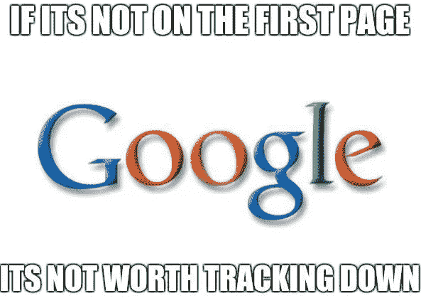
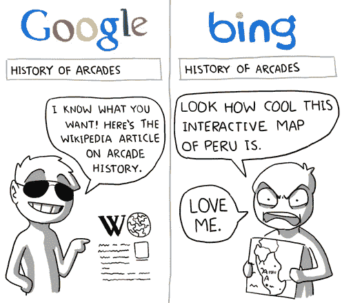
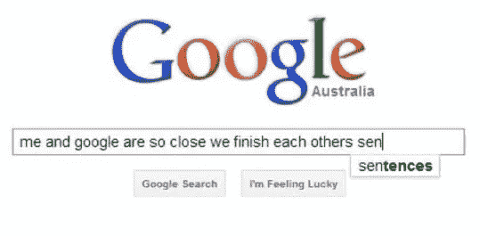
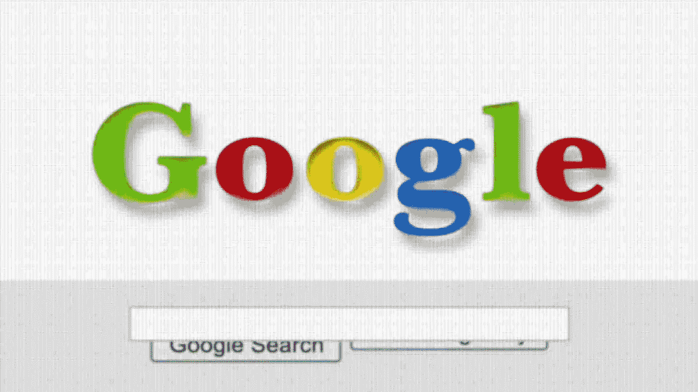

# 谷歌一下就知道了！

> 原文：<https://medium.datadriveninvestor.com/just-google-it-9e0fd15e9e51?source=collection_archive---------18----------------------->

一位名叫史蒂夫·乔布斯的伟大科技巨头曾经说过:“如果你仔细观察，你会发现大多数一夜成名都需要很长时间。”无论是苹果还是谷歌，成功就是成功，公式只有一个。干得漂亮。马克·扎克伯格告诉温克沃斯兄弟，如果他们打算创造脸书，他们早就创造了。换句话说，如果一个想法和一个令人厌倦的代码足以建立一个指数级的公司，那么相当数量的世界人口将由科技巨头组成……但他们不是。那么，是什么让谷歌…谷歌？

简单而聪明的是，谷歌提出了一种算法，它不仅提供了一个数据驱动的搜索引擎，更重要的是，它理解你的在线行为，并为你的研究提供正确的链接。也就是说，如果你用谷歌搜索:Kiki，德雷克的歌会第一个出现，因为它在网上产生了流量，而不是著名的 Kiki Camarena——毒枭的粉丝会知道——在歌曲发布前是第一个搜索到的。这个算法中的代码是如此独特，没有人可以复制，甚至接近。对于所有非编码人员来说，下面的公式就是“不值得追踪”的定义。现在滑下来。

*def find_max (L): if len(L) == 1:返回 L[0]v1 = L[0]v2 = find _ max(L[1:])if v1>v2:返回 v1 else:返回 v2*

以上面的视觉为例，为了理解 Google 的搜索引擎与 Bing 等其他搜索引擎的区别。其他搜索引擎不是生成与搜索最相关的页面——正如谷歌所做的那样——而是生成搜索到的单词数量最多的页面。谷歌并没有止步于此，因为它继续从其多个应用程序中收集你的研究数据，以更好地协助你完成任务。所以，当你在你的 AirBnb 场地登记并可以享用一顿美食时，你点击谷歌应用程序，在你知道之前，下拉菜单就有“你附近的餐馆”了！感觉就像谷歌得到了你，它支持你…你不知道…这是算法。

谷歌产生的大数据本身就是谷歌力量的驱动力。这可能是一个恶性循环，但却是一个美丽的循环。它是如此美丽，以至于它拥有 7.67 万亿美元的净资产。谷歌总裁拉里·佩奇是当今最富有的人。这让你想知道…当他们创造下面的标志时，他们知道它会值这么多吗？

标志背后的故事是另一个时间。目前，一个问题得到了解答，另一个问题也浮出了水面。前者是成为谷歌那样的人需要什么，后者是下一个谷歌会是什么？聪明地工作，你可能就有答案了。更好的是，*谷歌一下就知道了！*

 [## 谷歌

### 搜索世界信息，包括网页、图像、视频等。谷歌有许多特殊的功能来帮助…

www.google.com](https://www.google.com)