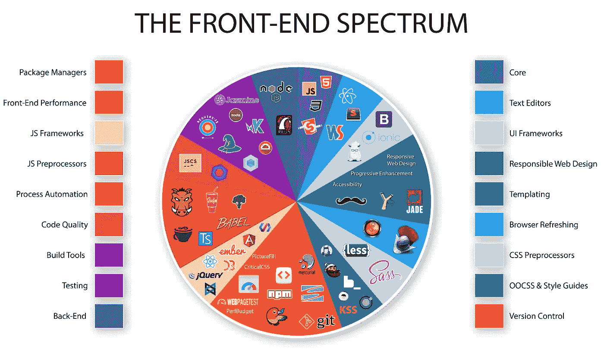
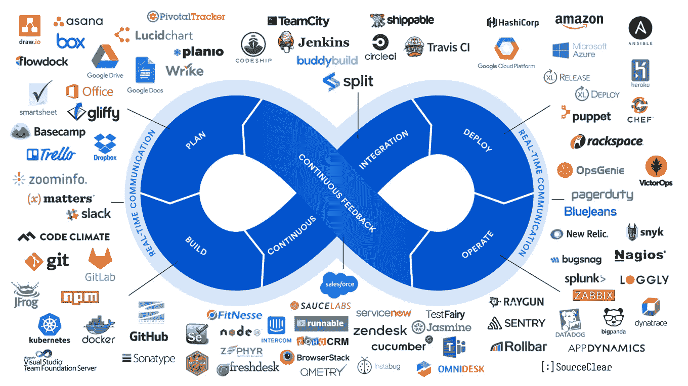

# 你有多少筹码？

> 原文：<https://medium.datadriveninvestor.com/just-how-full-stack-are-you-c838087c081e?source=collection_archive---------3----------------------->

在当今时代，大多数开发人员在 LinkedIn 和他们的投资组合上都有“全栈开发人员”或“全栈工程师”的头衔。但这到底意味着什么呢？这篇文章本质上不是关于谁是全栈工程师，而是关于这个领域的范围或宽度。先从传播这个术语开始吧。

## 谁/什么是全栈开发者

“全栈”是指开发一个应用程序所需的技术集合，包括设计、前端、后端和服务器管理。在这种情况下，“栈”不是指数据结构，而是指用于开发应用的软件层，即所使用的编程语言、数据库或框架。

## 现代全栈开发人员的领域

今天的软件开发人员需要掌握很多东西。然而，我们不能成为万金油。

Full Stack development areas

## 设计

在进行任何开发之前，我们需要勾画出一个原型或者设计用户界面。这对于前端开发人员在使用 HTML 和 CSS 等工具实现产品之前将产品可视化是很重要的。有很多设计工具可供您使用，例如:

*   Dribbble : Dribbble 让设计师们可以轻松分享他们的创作，是灵感的好来源，也是推广你自己作品的好方法。
*   [Figma](http://figma.com) : Figma 让人们设计应用程序和网站的外观，并创建原型来展示用户将如何浏览它们。
*   [Adobe Photoshop](https://www.adobe.com/products/photoshop.html) :被高度评价为世界上最好的图像和图形设计软件。它有各种各样的工具，基本上可以满足你所有的设计需求。
*   Proto.io :为移动应用创建完全交互式原型的最佳原型工具之一。
*   [Mockflow](http://mockflow.com) :非常适合可视化用户界面和创建网站和应用的蓝图。

清单很长，有很多设计工具，但这是我的前 5 个。

 [## 敏捷管理:好的、坏的、丑陋的|数据驱动的投资者

### 公司不断重塑自己，以获得或保持竞争优势和市场份额。这是…

www.datadriveninvestor.com](https://www.datadriveninvestor.com/2019/03/26/agile-management-the-good-the-bad-and-the-downright-ugly/) 

## 前端

一个合格的全栈开发人员应该具备前端事务的功能知识。有许多编程语言、框架、API 和库可以用来开发应用程序的前端。

回到过去，10-15 年左右，前端开发是 HTML 和 CSS 的混合，相当顺利。Javascript 在前端场景的爆发改变了游戏，我们现在可以播放视频，嵌入其他网页等，所有这些都不需要刷新网页。那么作为前端开发人员需要掌握什么呢？

*   ***编程语言—*** 这些包括组织网页的 HTML5，样式化的 CSS 和交互性的 Javascript。
*   ***框架*** — [脸书开发的 React](https://reactjs.org/) ，易学易集成的 [Vue.js](https://vuejs.org/) ，Google 开发的囊括所有平台的 [Angular](https://angular.io/) 。

这个列表中肯定还有更多的条目，比如 [jQuery](https://jquery.com/) 、 [AJAX](https://www.w3schools.com/xml/ajax_intro.asp) 、 [SASS](https://sass-lang.com/) 等等，但是我们现在将讨论这些。

## 后端

在后端有很多事情要考虑。首先是语言的选择。我不会深入研究所需的编程语言，而是更多地关注后端所需的概念。它本质上被称为“服务器端”编程，因为大多数操作发生在服务器端，为前端实现的功能提供动力。

***API 集成***

许多现代应用程序公开了客户端可以用来与应用程序通信的 API，作为后端开发人员，您应该设计任何客户端都可以调用并独立于客户端应用程序发展的 API。

***依赖关系管理***

这里是你和 npm、gradle、作曲家打交道的地方。你需要避免冲突，并充分了解你的环境。

***数据库和缓存***

了解各种数据库管理系统是必不可少的，如 MySQL，MongoDB，Oracle 等。对于缓存，我推荐 [Redis](http://redis.io) (远程字典服务器)，因为它很健壮，支持不同类型的数据结构。

***网络服务器***

Web 服务器，如 Nginx、Apache 等，但我们将在 DevOps 部分讨论这些。

我知道我遗漏了很多，但其他需要考虑的事情包括:

*   如何保护您的应用程序？
*   使用 Django、Laravel、Spring 等特定于语言的框架。
*   编写单元和集成测试的能力。

***软件栈***

两个常见的栈是 LAMP(Linux/Apache/MySQL/PHP)和 MEAN(MongoDB/express . js/AngularJS/node . js)。LAMP 由免费的开源软件组件组成，非常适合动态网站和应用程序。这是最传统的堆栈模型，对于不同的操作系统、服务器和数据库选项会有一些变化。在 LAMP 堆栈中，PHP 可以与 Python 和 Perl 语言互换。MEAN 由 Javascript 驱动，提供了许多构建单页面和多页面 web 应用程序的特性。

## DevOps

DevOps 是“开发人员”和“运营人员”的组合，强调软件开发人员和运营人员或系统的协作和集成，尤其是在生产过程中。这包括代码自动化和部署，以及对应用程序的持续监控。

DevOps tools

软件开发人员可以使用许多 DevOps 工具，包括:

*   [Jenkins](http://jenkins.io) — Jenkins 是 Hudson 的一个分支，是软件项目的一个持续构建系统。
*   TravisCI —一种面向开源项目的托管持续集成服务。它支持 Ruby、PHP、Python、Java、Node.js 等等。
*   [CircleCI](http://circleci.com) — CircleCI 让开发团队有信心在众多平台上快速、一致地进行构建、测试和部署。
*   [Azure DevOps](https://azure.microsoft.com/en-us/solutions/devops/) —团队共享代码、跟踪工作和发布软件的持续交付服务——适用于任何语言，全部在单个包中。
*   [JetBrains team city](https://www.jetbrains.com/teamcity/)—team city 提供了一个温和的学习曲线，因此您可以通过逐步采用其高级特性和功能来快速改进您的发布管理实践。
*   [Docker](http://docker.com) — Docker 使你的整个开发环境的部署比许多其他容器软件更容易和可移植。
*   [Apache Mesos](http://mesos.apache.org/)—Apache Mesos 是一个集群管理器，它简化了在服务器共享池上运行应用程序的复杂性。

还有很多工具我没有列出来，但是我相信上面这些会是理想的，你可以选择你喜欢的工具。

## 云

除了所有这些，开发人员还需要知道什么样的云平台适合托管应用程序。你可以从众多供应商中选择，比如 Heroku、T2、谷歌云、T4、AWS、微软 Azure 和 T7 等。

## 移动的

当然，我们不能忘记手机。近十年来，渐进式网络应用(pwa)的出现势不可挡，因为它们的表现和本地应用一样好。

你可以选择为 Android 和 iOS 开发原生应用，或者使用跨平台框架来弥合这两者之间的差距。出于代码重用的目的，我们可以使用以下跨平台移动框架:

*   PhoneGap[PhoneGap](http://phonegap.com):它将你的应用打包在一个本地应用容器**中，该容器允许 JavaScript 像普通应用一样访问设备级 API。**
*   [Flutter](http://flutter.dev) : Flutter 是 Google 的 UI 工具包，用于从单一代码库为[移动](https://flutter.dev/docs)、[网络](https://flutter.dev/web)和[桌面](https://flutter.dev/desktop)构建漂亮的、本地编译的应用程序。
*   React Native :使用 React 构建原生应用的框架，由脸书开发。
*   Ionic:一个免费、开源的移动 UI 工具包，用于为原生 iOS、Android 和 web 开发高质量的跨平台应用程序——全部来自单一代码库。

## 结论

一个全栈开发人员可以钻研无数的东西。我没有提到的几件事是敏捷软件原则、版本控制、编写单元和集成测试，甚至是如何编写适当的文档，以及更多我们可以添加到列表中的东西。我知道这里面有很多东西，所以你可以选择专攻提到的任何一个领域。领域很广，机会无限。什么都懂一点可能不会让你成为某项技能的大师，但是你可以用这些知识来理解完成一个特定项目需要什么。

那么，你有多少筹码？