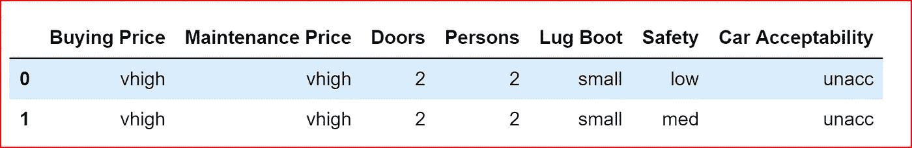
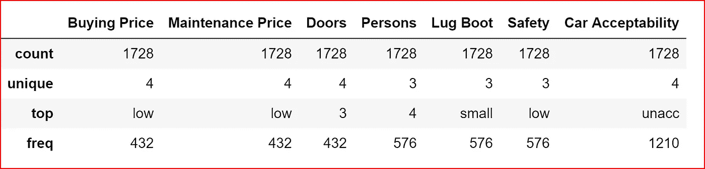
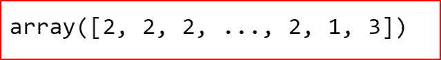
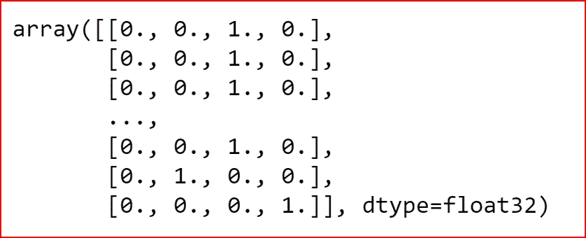
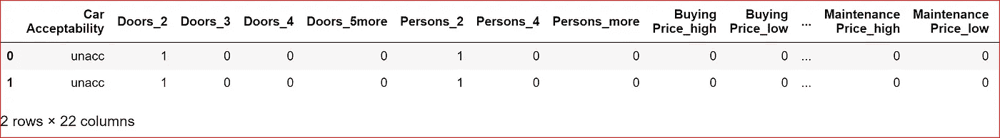
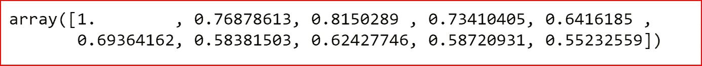

# 人工神经网络中的 k 折叠

> 原文：<https://medium.datadriveninvestor.com/k-fold-and-dropout-in-artificial-neural-network-ea054a89fb4e?source=collection_archive---------2----------------------->

[](http://www.track.datadriveninvestor.com/1B9E)

在这篇文章中，我们将了解如何在人工神经网络中使用 K 折叠交叉验证来执行多类分类。

我们将使用[汽车评估数据集](http://archive.ics.uci.edu/ml/datasets/Car+Evaluation)进行多类分类

**先决条件:**

关于[建立人工神经网络](https://medium.com/@arshren/building-neural-network-using-keras-for-classification-3a3656c726c1)请参考这里。

[K 折交叉验证](https://medium.com/datadriveninvestor/k-fold-and-other-cross-validation-techniques-6c03a2563f1e)

导入基本库并读取数据集。我已经将数据复制到我默认的 Jupyter 文件夹中

```
import numpy as np
import pandas as pd
import seaborn as sns
import matplotlib.pyplot as plt
%matplotlib inlinedataset = pd.read_csv('car_acceptability.csv')
dataset.head(2)
```



我们使用描述方法来了解数据

```
dataset.describe(include='all')
```



我们有几个分类变量和几个数字变量。我们需要将分类变量转换成数字变量。

首先，我们使用 Labelencoder 将分类目标变量转换为数字数据。标签编码器使用 0 和 n_classes-1 之间的值创建标签。因为我们在目标变量中有 4 个类，所以我们的目标变量将有从 0 到 3 的数字数据

```
# creating  target variablesfrom sklearn.preprocessing import LabelEncoder
le = LabelEncoder()
y=le.fit_transform(dataset['Car Acceptability'])
y
```



Encoded target variable

由于我们要解决一个多类分类问题，我们需要将整数的目标类向量转换成二进制类矩阵。当我们将使用的损失函数是 categorical _ crossentropy 时，这是针对多类分类完成的。

```
from keras.utils import to_categoricaloutput_category = to_categorical(y, num_classes=None)
output_category
```



output_category

我们现在将为分类输入要素创建一个虚拟变量

```
dataset_1= pd.get_dummies(dataset, 
                          columns=['Doors','Persons','Buying Price', 'Maintenance Price', 'Lug Boot', 'Safety'],
                          prefix= ['Doors','Persons','Buying Price', 'Maintenance Price', 'Lug Boot', 'Safety'])
dataset_1.head(2)
```



dummy variables for input categorical features

```
# creating input features
X = dataset_1.iloc[:,[1,2,3,5,6,8,9, 10,12,13,14,16,17]]
```

标准化输入要素，使所有输入要素都处于相同的比例

```
#standardizing the input feature
from sklearn.preprocessing import StandardScaler
sc= StandardScaler()
X= sc.fit_transform(X)
X 
```

创建训练和测试数据集

```
from sklearn.model_selection import train_test_split
X_train, X_test, y_train, y_test = train_test_split(X, output_category, test_size=0.3)
```

我们现在构建神经网络并使用 K 折叠交叉验证。K 交叉验证简介。

该技术包括 ***将数据集随机分成 k 组或大小大致相等的折叠*** 。 ***第一个折叠被保留用于测试*** 并且**模型在 k-1 个折叠**上被训练。

该过程重复 K 次，每次使用不同的折叠或不同组的数据点进行验证。


10 fold cross validation. orange block is the fold used for testing

```
#builing the neural net
from keras import Sequential
from keras.layers import Dense
from keras.layers import Dropout
from keras.wrappers.scikit_learn import KerasClassifier
from sklearn.model_selection import cross_val_score
```

我们将在 scikit-learn 中使用 keras 模型，方法是用 **KerasClassifier** 进行分类，或者用 **KerasRegressor** 类处理回归问题。

我们定义一个函数***build _ classifier***来使用这些包装器。***build _ classifier***创建并返回 Keras 序列模型。

我们有 13 个输入特征，2 个隐藏层，每个层有 8 个节点。我们有 4 个使用 softmax 激活函数的输出节点，因为这是一个多类分类问题。

使用的损失函数是分类交叉熵。在二元分类中，我们使用了二元交叉熵

```
# K fold validation
def build_classifier():
    classifier = Sequential()
    #First Hidden Layer
    classifier.add(Dense(8, activation='relu', kernel_initializer='random_uniform', input_dim=13))

    #Second  Hidden Layer
    classifier.add(Dense(8, activation='relu', kernel_initializer='random_uniform'))#Output Layer
    classifier.add(Dense(**4**, activation='**softmax**', kernel_initializer='random_uniform'))#Compiling the neural network
    classifier.compile(optimizer ='adam',loss='**categorical_crossentropy**', metrics =['accuracy'])
    return classifier
```

在构造 **KerasClassifier** 类时，我们将 ***build_classifier*** 函数传递给 **build_fn** 参数。Batch_szie 是 10，我们运行 150 个纪元

```
classifier = KerasClassifier(build_fn=build_classifier, batch_size=10, nb_epoch=150)
```

因为我们已经使用了 KerasClassifier 来扭曲模型，所以我们可以使用 scikit-learn。一旦我们做到了这一点，我们就可以像使用随机森林等任何其他 scikit 算法一样使用我们的神经网络，并执行 10 次交叉验证。

```
accuracies =  cross_val_score(estimator=classifier, X= X, y=output_category,cv=10, n_jobs=-1)
accuracies
```

我们现在可以打印 10 个精度

```
accuracies
```



我们可以得到精确度的平均值和标准差。

```
print(accuracies.mean())
print(accuracies.std())
```


mean accuracy

在下一篇文章中，我们将使用我们如何使用 Dropout 来减少方差，以及我们如何微调我们的神经网络

# 如果你喜欢这篇文章，请鼓掌！