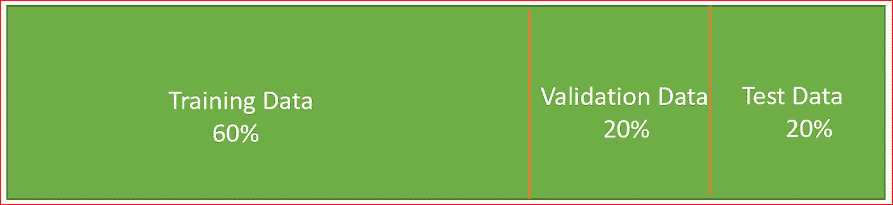
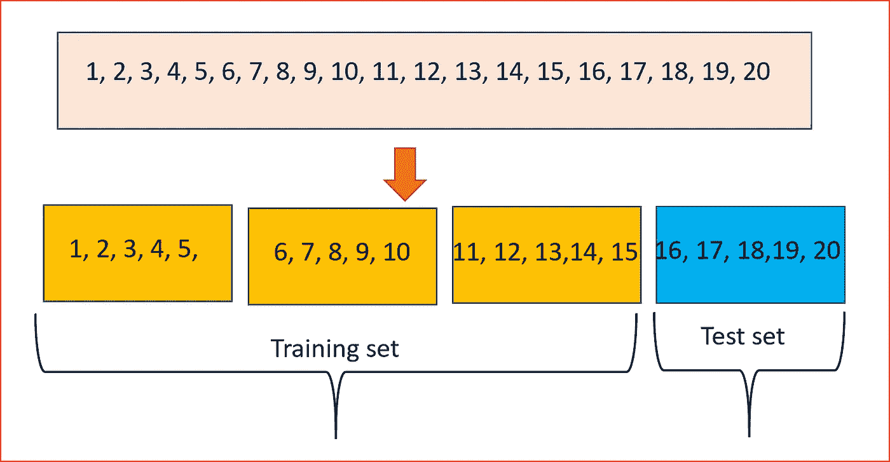
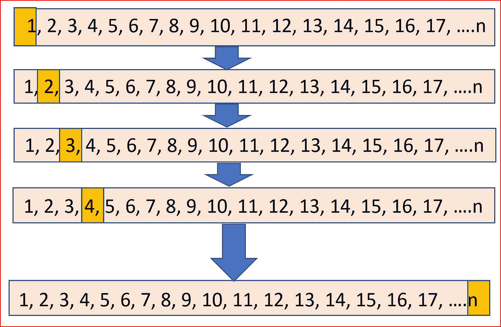
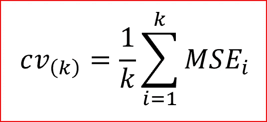
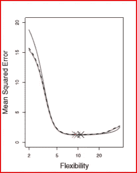
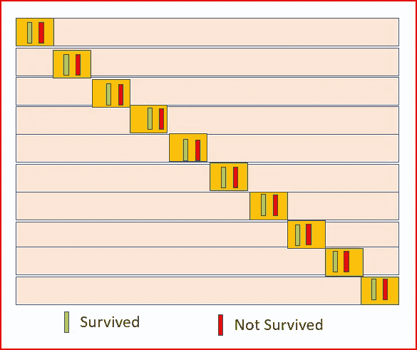
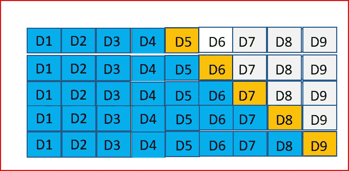

# k 折叠和其他交叉验证技术

> 原文：<https://medium.datadriveninvestor.com/k-fold-and-other-cross-validation-techniques-6c03a2563f1e?source=collection_archive---------0----------------------->

*在这里，我们将了解什么是交叉验证以及我们为什么使用它，交叉验证的不同变体包括 K 折交叉验证。*

先决条件:[机器学习](https://medium.com/datadriveninvestor/machine-learning-demystified-4b41c3a55c99)基础知识，理解[偏差和方差](https://medium.com/datadriveninvestor/bias-and-variance-in-machine-learning-51fdd38d1f86)，以及如何[评估一个模型的表现](https://medium.com/datadriveninvestor/how-to-evaluate-the-performance-of-a-machine-learning-model-45063a7a38a7)

在机器学习中，我们通常将数据集分为训练数据集、验证数据集和测试数据集。

**训练数据 se**t——用于训练模型，它可以变化，但通常我们使用 60%的可用数据进行训练。

**验证数据集** —一旦我们选择了在训练数据上表现良好的模型，我们就在验证数据集上运行该模型。这是数据的一个子集，通常范围从 10%到 20%。验证数据集有助于对模型的适用性进行公正的评估。如果验证数据集上的误差增加，那么我们有一个过拟合模型。

**测试数据集** —也称为维持数据集。此数据集包含从未在培训中使用过的数据。测试数据集有助于最终模型评估。通常是数据集的 5%到 20%。

有时可能只有训练集和测试集，而没有验证集。

*这种方法有什么问题？*

*   由于 ***训练集和测试集*** 之间的样本可变性，我们的模型对训练数据给出了更好的预测，但未能对测试数据进行概括。这导致训练错误率低，但是测试错误率高。
*   当我们将数据集分为训练集、验证集和测试集时，我们只使用数据的子集，我们知道当我们在更少的观察值上进行训练时，模型的性能不会很好，并且 ***过高估计了*** 模型的测试错误率，以适合整个数据集

## 为了解决这两个问题，我们使用了一种叫做交叉验证的方法

什么是交叉验证？

交叉验证是一种统计技术，包括将数据划分为子集，在一个子集上训练数据，并使用另一个子集来评估模型的性能。

为了减少可变性，我们对相同数据的不同子集进行多轮交叉验证。我们将这些多轮验证的结果结合起来，得出对模型预测性能的估计。

交叉验证会给我们一个更准确的模型性能评估

Cross Validation — partition 20 data points into 4 subsets, train on 3 subsets and test on 1 subset

*现在让我们了解几种常见的交叉验证类型*

我们将探索以下交叉验证技术

*   Leave 留一个交叉验证
*   k 折叠
*   分层交叉验证
*   时间序列交叉验证

# 遗漏一个交叉验证— LOOCV

在 LOOCV，我们将数据集分为两部分。在一部分中，我们有一个单独的观察值，这是我们的测试数据，而在另一部分中，我们有来自数据集的所有其他观察值，这些观察值构成了我们的训练数据。

如果我们有一个带有 ***n 个*** 观察值的数据集，那么训练数据包含 ***n-1 个*** 观察值，测试数据包含 1 个观察值。

如下所示，对每个数据点重复该过程。重复此过程 *n 次*会产生**n 次次**次均方误差(MSE)。

Leave One out cross validation LOOCV

**LOOCV 的优势**

*   与只使用数据子集(在上面的示例中为 60%)进行训练的验证集方法相比，我们使用整个数据集进行训练，偏差要小得多。
*   训练/测试数据中没有随机性，因为多次执行 LOOCV 将产生相同的结果

**LOOCV 的缺点**

*   MSE 会随着测试数据使用单一观测值而变化。这可能会引入可变性。如果数据点是异常值，则可变性会高得多。
*   制作成本很高，因为模型要被安装 ***n 次***

# k 折叠交叉验证

这项技术包括 ***将数据集随机分成 k 组或大小大致相等的折叠*** 。 ***第一个折叠被保留用于测试*** 并且**模型在 k-1 个折叠**上被训练。

该过程重复 K 次，每次使用不同的折叠或不同组的数据点进行验证。

10 fold cross validation. orange block is the fold used for testing

当我们重复这个过程 k 次，我们得到 k 次均方误差(MSE)。MSE_1，MSE_2，…MSE_K，因此 K 倍 CV 误差通过取 K 倍 MSE 的平均值来计算

K fold cross validation error

LOOCV 是 K 折叠的变体，其中*K = n。*

典型地，K 倍中的 K 值是 5 或 10。当 K 为 10 时，也称之为 10 倍交叉验证

Source: Introduction to Statistical Learning. Blue line is the true test error, black dashed line in LOOCV test error and orange is 10 fold CV test error

上图显示了真实的测试误差和由 LOOCV 和 10 倍交叉验证估计的测试误差。

**K 倍或 10 倍交叉验证的优势**

*   当 k 的值为 10 时，由于我们仅重复该过程 10 次，所以计算时间减少了。
*   减少偏差
*   每个数据点被精确地测试一次，并用于训练 k-1 次
*   所得估计的方差随着 k 的增加而减小

**K 折或 10 折交叉验证的缺点**

*   训练算法是计算密集型的，因为该算法必须从头重新运行 k 次。

# 分层交叉验证

分层是一种技术，在这种技术中，我们以这样一种方式重新排列数据，即每个折叠都很好地代表了整个数据集。它强制每个文件夹至少有每个类的 m 个实例。这种方法确保一类数据不会被过度代表，尤其是当目标变量不平衡时。

例如，在二进制分类问题中，我们希望预测泰坦尼克号上的一名乘客是否幸存。我们这里有两个等级的乘客要么活了下来要么没活下来。我们确保每个折叠都有幸存乘客的百分比和未幸存乘客的百分比。

Stratified cross validation — each fold contains representation of the the different target categories

分层交叉验证有助于减少偏倚和方差

# 时间序列交叉验证

随机分割时间序列数据没有帮助，因为与时间相关的数据会被弄乱。

如果我们致力于预测股票价格，如果我们随机分割数据，那么它将没有帮助。因此，我们需要一种不同的方法来执行交叉验证。

对于时间序列交叉验证，我们使用前向链，也称为滚动原点。预测所基于的原点在时间上向前滚动。

在时间序列交叉验证中，每天都是一个测试数据，我们认为前一天的数据就是训练集。

D1、D2、D3 等。是每天的数据，用蓝色突出显示的日期用于培训，用黄色突出显示的日期用于测试。

Forward chaining for time series data

我们开始用最少数量的观察值训练模型，并使用第二天的数据来测试模型，我们继续在数据集中移动。这确保我们考虑预测数据的时间序列方面。

希望这篇文章能帮助你很好地理解不同的交叉验证技术

# 如果你喜欢这篇文章，请鼓掌！

## 参考资料:

统计学习导论

# 来自 DDI 的相关帖子:

 [## 用 7 个步骤解释深度学习——数据驱动投资者

### 在深度学习的帮助下，自动驾驶汽车、Alexa、医学成像-小工具正在我们周围变得超级智能…

www.datadriveninvestor.com](https://www.datadriveninvestor.com/2019/01/23/deep-learning-explained-in-7-steps/)  [## 数据科学和软件工程哪个更有前途？-数据驱动型投资者

### 大约一个月前，当我坐在咖啡馆里为一个客户开发网站时，我发现了这个女人…

www.datadriveninvestor.com](https://www.datadriveninvestor.com/2019/01/23/which-is-more-promising-data-science-or-software-engineering/)