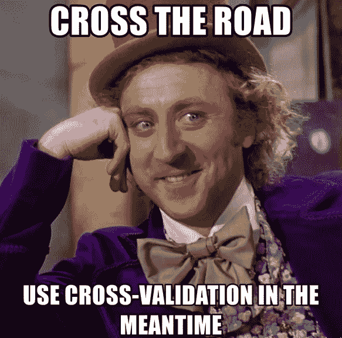
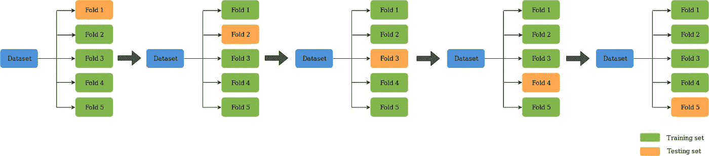
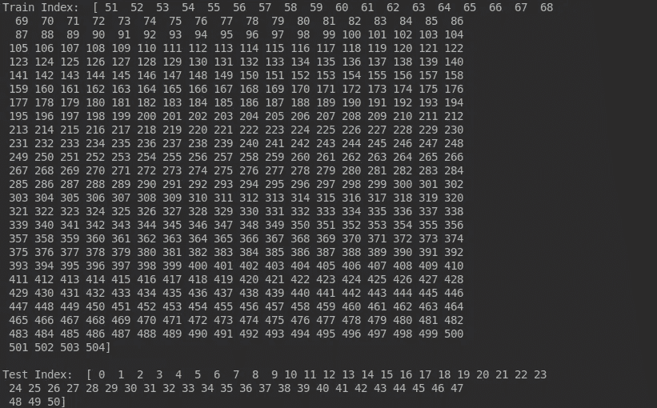

# k 倍交叉验证

> 原文：<https://medium.datadriveninvestor.com/k-fold-cross-validation-6b8518070833?source=collection_archive---------0----------------------->

[](http://www.track.datadriveninvestor.com/J12U)

评估机器学习模型可能非常棘手。通常，我们将数据集分为训练集和测试集，并使用训练集来训练模型，使用测试集来测试模型。然后，我们基于误差度量来评估模型性能，以确定模型的准确性。然而，这种方法并不十分可靠，因为一个测试集所获得的精度可能与另一个测试集所获得的精度相差很大。 *K-fold 交叉验证(CV)* 通过将数据划分为多个折叠，并确保每个折叠在某个点被用作测试集，从而为这个问题提供了一个解决方案。本文将深入浅出地解释什么是 K-Fold CV，以及如何使用`sklearn`库来执行 K-Fold CV。

# **什么是 K 倍交叉验证？**

K-Fold CV 是将给定的数据集分成 K 个 ***K 个*** 的部分/折叠，其中每个折叠在某一点用作测试集。让我们以 5 重交叉验证(K=5)为例。这里，数据集被分成 5 个部分。在第一次迭代中，第一次折叠用于测试模型，其余的用于训练模型。在第二次迭代中，第二个折叠用作测试集，而其余折叠用作训练集。重复该过程，直到 5 个折叠中的每个折叠都被用作测试组。



5-Fold Cross Validation

[](https://medium.com/@krishnihw/my-first-months-earnings-medium-partner-program-4a9aec432497) [## 我从中等合伙人项目中获得的第一笔收入

### 整整 3 周前，也就是 2023 年 1 月 11 日，我被中等合伙人计划录取了。在这三个星期里，我…

medium.com](https://medium.com/@krishnihw/my-first-months-earnings-medium-partner-program-4a9aec432497) 

# **使用 K 倍 CV 评估 ML 模型**

让我们使用 K-Fold CV 评估一个简单的回归模型。在这个例子中，我们将使用 SVR 模型的 RBF 核执行 10 重交叉验证(参考[本文](https://medium.com/datadriveninvestor/a-practical-guide-to-getting-started-with-machine-learning-3a6fcc0f95aa)开始使用 ML 开发模型)。

1.  **导入库**

首先，让我们导入在简单的 ML 模型上执行 K-Fold CV 所需的库。

```
import pandas
from sklearn.model_selection import KFold
from sklearn.preprocessing import MinMaxScaler
from sklearn.svm import SVR
import numpy as np
```

让我们看看我们进口了什么，

[pandas](https://pandas.pydata.org/) —允许轻松操作数据结构。

[numpy](http://www.numpy.org/) —允许科学计算。

[sk learn](https://scikit-learn.org/stable/index.html)—python 的机器学习库。

2.**读取数据集**

现在，让我们将我们将要使用的数据集读取到一个 *pandas* 数据框中。

```
dataset = pandas.read_csv('housing.csv')
```

对于这个例子，我们将使用有 506 条记录的[波士顿房价数据集](https://raw.githubusercontent.com/jbrownlee/Datasets/master/housing.data)。

3.**预处理**

我们现在将指定数据集的特征和输出变量。

```
X = dataset.iloc[:, [0, 12]]
y = dataset.iloc[:, 13]
```

上面的代码表明列索引 0-12 的所有行都被认为是特性，索引为 13 的列是输出的因变量。现在，让我们应用`MinMax scaling`预处理技术来标准化数据集。

```
scaler = MinMaxScaler(feature_range=(0, 1))
X = scaler.fit_transform(X)
```

该技术在指定范围内(在本例中为 0-1 之间)重新缩放数据，以确保某些特征对最终预测的影响不会超过其他特征。

4. **K 倍 CV**

现在，让我们言归正传。

```
scores = []
best_svr = SVR(kernel='rbf')
cv = KFold(n_splits=10, random_state=42, shuffle=False)
for train_index, test_index in cv.split(X):
    print("Train Index: ", train_index, "\n")
    print("Test Index: ", test_index)

    X_train, X_test, y_train, y_test = X[train_index], X[test_index], y[train_index], y[test_index]
    best_svr.fit(X_train, y_train)
    scores.append(best_svr.score(X_test, y_test))
```

我们使用 SVR 模型的 RBF 内核，使用`sklearn`库实现(本文使用默认参数值是为了展示 K-Fold 交叉验证是如何工作的)，用于本例的评估目的。首先，我们指出我们希望数据集被分成的折叠数。这里，我们使用了 10 重 CV ( `n_splits=10`)，数据将被分成 10 重。我们打印出每次迭代中训练集和测试集的索引，以清楚地看到 K-Fold CV 的过程，其中训练集和测试集在每次迭代中发生变化。



Training and testing set in the first iteration of 10-Fold CV

接下来，我们指定要在每次迭代中使用的训练集和测试集。为此，我们使用 K 倍 CV 过程中指定的索引`(train_index, test_index)`。然后，我们在每次迭代中使用 K-Fold 过程的每次迭代的`train_index`来训练模型，并将误差度量值附加到列表中(`scores`)。

```
 best_svr.fit(X_train, y_train)
    scores.append(best_svr.score(X_test, y_test))
```

使用`best_svr.score()`函数计算的误差度量是 r2 分数。F-Fold CV 的每次迭代提供一个 r2 分数。我们将每个分数附加到一个列表中，并获取平均值，以确定模型的整体准确性。

```
print(np.mean(scores))
```

您可以使用这两种方法中的任何一种，

```
cross_val_score(best_svr, X, y, cv=10)
```

或者，

```
cross_val_predict(best_svr, X, y, cv=10)
```

做同样的 10 重交叉验证的任务。第一种方法会给你一个 r2 分数列表，第二种方法会给你一个预测列表。

我希望这篇文章能让你对 K-Fold 交叉验证有一个基本的了解。

感谢阅读！**如果你有兴趣阅读更多内容**，请查看我列表中的文章，

*   [机器学习文章](https://medium.com/@krishnihw/list/machine-learning-5db3a9d0dc83)
*   [权力匕篇](https://medium.com/@krishnihw/list/power-bi-2e19d2237f90)

[](https://medium.com/@krishnihw/my-first-months-earnings-medium-partner-program-4a9aec432497) [## 我从中等合伙人项目中获得的第一笔收入

### 整整 3 周前，也就是 2023 年 1 月 11 日，我被中等合伙人项目录取了。在这 3 周内…

medium.com](https://medium.com/@krishnihw/my-first-months-earnings-medium-partner-program-4a9aec432497) 

下次见…再见！

*参考文献*

[](https://en.wikipedia.org/wiki/Cross-validation_%28statistics%29#k-fold_cross-validation) [## 交叉验证(统计)-维基百科

### 交叉验证，有时被称为旋转估计，或样本外测试是任何各种类似的模型…

en.wikipedia.org](https://en.wikipedia.org/wiki/Cross-validation_%28statistics%29#k-fold_cross-validation) [](https://machinelearningmastery.com/standard-machine-learning-datasets/) [## 实践应用机器学习的 10 个标准数据集

### 擅长应用机器学习的关键是在大量不同的数据集上练习。这是因为每个…

machinelearningmastery.com](https://machinelearningmastery.com/standard-machine-learning-datasets/)