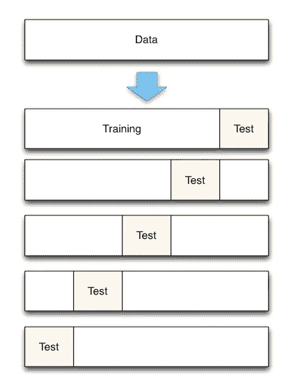
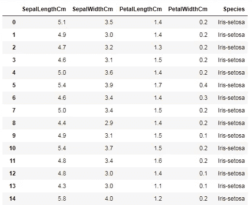
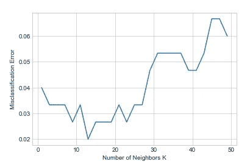

# 用于参数调整的 k 重交叉验证

> 原文：<https://medium.datadriveninvestor.com/k-fold-cross-validation-for-parameter-tuning-75b6cb3214f?source=collection_archive---------0----------------------->

[](http://www.track.datadriveninvestor.com/1B9E)

在这篇文章中，我将解释 K- fold 交叉验证，它主要用于超参数调优。交叉验证是一种评估预测模型的技术，方法是将原始样本分成一个训练集来训练模型，一个测试集来评估模型。我将分步解释 k 重交叉验证。

1.  将数据集分成 k 个相等的分区
2.  使用第一个折叠作为测试数据，其他折叠的并集作为训练数据，并计算测试精度
3.  重复步骤 1 和步骤 2。在不同的时间使用不同的集合作为测试数据。也就是说，如果我们将数据集分成 k 个折叠。在第一次迭代中，第一个折叠将是测试数据，其余的合并将是训练数据。然后我们将计算测试精度。然后在下一次迭代中，第二个折叠将是测试数据，其余的合并将是训练数据。同样，我们将对所有折叠进行操作。
4.  取这些测试准确度的平均值作为样品的准确度。



现在您已经了解了 K- fold 交叉验证是如何工作的。K 的典型值是 10。即 10 倍交叉验证。现在我将解释我们将如何进行 K 倍交叉验证以确定 K 个最近邻中的 K(邻数)。(注意:K-最近邻中的 K 不同于 K-折叠交叉验证中的 K)

感谢 python！sklearn 漂亮地实现了 cross_val_score 来解决我们的问题。它只是几行代码。我们将使用著名的 iris 数据集进行测试。我们的数据如下。我们必须根据现有的数据来确定这种花属于哪一种。



```
#importing necessary modules
import numpy as np
import matplotlib.pyplot as plt
import seaborn as sns
import pandas as pd#splitting into train and test data
from sklearn.cross_validation import train_test_split
X = data.iloc[:, :-1]
y = data.iloc[:, -1]X_train,X_test,y_train,y_test = train_test_split(X,y,test_size=0.3)#fitting k-nearest neighbours algorithm
from sklearn.neighbors import KNeighborsClassifier
knn1 = KNeighborsClassifier(n_neighbors=3)
knn1.fit(X_train,y_train)
y_pred = knn1.predict(X_test)#calculating accuracy
from sklearn.metrics import accuracy_score
print('Acuuracy score is {}'.format(accuracy_score(y_test, y_pred)))############################output##################################
Acuuracy score is 0.9555555555555556
```

我们有大约 95%的准确率。但是在测试数据上表现良好的模型可能在新数据上表现不佳。所以我们必须确定最佳的 k。我们可以使用交叉验证。这里我们将进行 10 次交叉验证。

```
from sklearn.model_selection import cross_val_score
#hyper parameter tuning.Selecting best K
neighbors = [x for x in range(1,50) if x % 2 != 0]
# empty list that will hold cv scores
cv_scores = []
for k in neighbors:
    knn = KNeighborsClassifier(n_neighbors=k)
    scores = cross_val_score(knn, X, y, cv=10, scoring='accuracy')
    cv_scores.append(scores.mean())#graphical view
#misclassification error
MSE = [1-x for x in cv_scores]
#optimal K
optimal_k_index = MSE.index(min(MSE))
optimal_k = neighbors[optimal_k_index]
print(optimal_k)# plot misclassification error vs k
plt.plot(neighbors, MSE)
plt.xlabel('Number of Neighbors K')
plt.ylabel('Misclassification Error')
plt.show()
```



因此 k 个最近邻的最佳 k 值是 k=13。所以我们基于此训练了一个模型

```
knn = KNeighborsClassifier(n_neighbors=13)
knn.fit(X_train,y_train)
y_pred = knn1.predict(X_test)
```

## **参考文献:**

*   [https://github . com/just Markham/sci kit-learn-videos/blob/master/07 _ cross _ validation . ipynb](https://github.com/justmarkham/scikit-learn-videos/blob/master/07_cross_validation.ipynb)