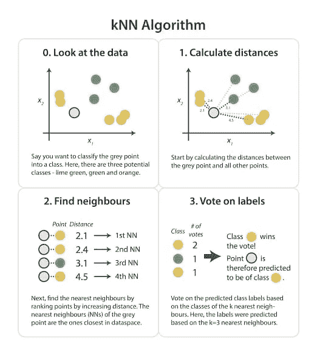
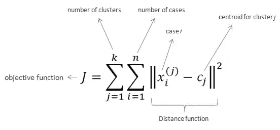
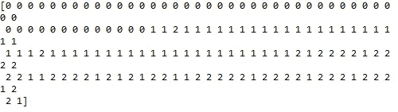
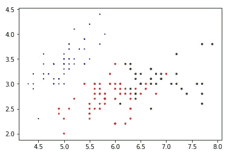

# K-MEANS 和它的工作

> 原文：<https://medium.datadriveninvestor.com/k-means-and-its-working-5c29a3d38523?source=collection_archive---------4----------------------->

[](http://www.track.datadriveninvestor.com/1B9E)

[www.internity.in](http://www.internity.in)

聚类是某些数据点的集合，因为它们具有某些相似性。

是的，K-means 是聚类算法之一。

这是质心模型的一个例子，其中数据点随机分布到不同的簇中。我们在模型中需要的集群数量是预先提到的。然后为每个聚类计算质心，并进行重新分配，将最接近特定质心的数据点分配给该聚类。

我们将回到 K-Means，它正在工作，但在此之前，我们需要学习一个非常基本的东西。在 K-Means 和 KNN 这两种算法之间有很多混淆。它们听起来一样，但这并不意味着它们是一样的。两者完全不同，首先，我们将掩盖它们之间的一些差异。

***——K 的意思是:***


source : [www.mubaris.com](http://www.mubaris.com)

*   如前所述，它是一种用于聚类的无监督学习形式。
*   K-means 中的“K”指的是算法想要用来从数据中学习的聚类数。但是它可能没有被定义，因为它是一种无监督学习的形式。
*   它基本上用于聚类未知的场景，例如，社交媒体趋势、市场细分、异常检测等
*   为了开始模型的工作，任意选择 K 个点。然后，将每个点分配给最近的聚类，在所有操作之后，重新计算每个聚类的质心，并再次形成聚类。

反之， ***KNN:***



source : [www.kdnuggets.com](http://www.kdnuggets.com)

*   它是一种监督学习技术，通常用于聚类和回归问题。
*   KNN 的“K”代表 K 个最近的邻居。根据这 K 个最近邻，对新数据点进行预测。
*   这里的目标变量是预先知道的，没有训练阶段，如。

***K-工作方式:***

它首先从随机选择的一组质心开始，这是每个聚类的起始点，然后以迭代的方式优化聚类。

当质心的值稳定时，它停止优化过程，因为质心的值停止改变并且聚类已经成功。

```
1\. Choose the number of clusters and obtain the data points.
2\. Choose the centroids randomly.
3\. Now next 2 steps will be repeated till the stabilization of centroids take place.
4\. For each data point, find the nearest centroid and assign the data point to that cluster.
5\. For each cluster, new centroid = mean of all points assigned to that cluster.
END.
```



source : [www.mubaris.com](http://www.mubaris.com)

现在，我们将着眼于知识手段的实施:

```
import numpy as np
import pandas as pd
import matplotlib.pyplot as plt #required for plotting the labels
from sklearn import datasets
from sklearn.cluster import KMeans
from sklearn.metrics import accuracy_scoreiris = datasets.load_iris()
x = pd.DataFrame(iris.data) #converting data into pandas dataframe
x.columns = ['sepal_length', 'sepal_width', 'petal_length', 'petal_width'] #renaming the columns
y = iris.targeta = KMeans(n_clusters=3, init='random')
a.fit(x)
print(a.labels_) #it will give us the labels
colormap = np.array(['Red', 'Blue', 'Green'])
z = plt.scatter(x.sepal_length, x.sepal_width, x.petal_length, c=colormap[a.labels_])
print(accuracy_score(y,a.labels_))
```



**This is the output that is generated after we print “a.labels_”**



**This is the plotted graph and shows us the 3 different clusters**

**精度= 0.893333** 这是相当不错的输出。

现在，可以通过更改不同属性的值来优化这个输出。

1.  通过改变 ***random_state*** 的值，我们肯定会看到精度的变化。它为质心初始化生成随机数。
2.  ***init:*** 它用于初始化，默认情况下它的值是“k-means++”，这是加快收敛的最聪明的方法，但我们也可以将值改为“random”，通过这种方式，我们肯定会看到精度的下降。因为这个变量从数据中随机选择 k 行作为初始质心。
3.  ***max_iter:*** 算法一次运行的最大迭代次数。默认情况下，该值为 300，我们可以更改这些值。

还有许多其他的属性，但是这些只是其中的少数几个，它们会以很大的方式影响准确性。

今天就到这里，到那时*快乐编码！！！*