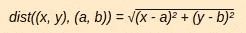
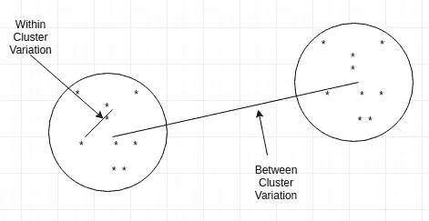

# k 表示聚类

> 原文：<https://medium.datadriveninvestor.com/k-means-clustering-4a700d4a4720?source=collection_archive---------4----------------------->

在之前的故事中，我们了解了有监督和无监督的机器学习算法。K Means 是一种**无监督的**机器学习算法(它不要求输入数据已经被分类)。这种算法对我们的数据分组很有帮助。然后可以将某些单独的机器学习算法应用于这些组。

# 使聚集

聚类是将数据分配到不同的组**(聚类)**中，这样特定组中的观察结果在本质上是相似的。举个例子，

Photo by Google Images

上图显示了 3 个代表蓝色、红色和绿色点的集群。聚类在现实生活中并不准确，当应用于真实数据时会有一些误差。

**算法**

Distance between 2 points in a 2D space Photo by Google Images

**WCV(类内变异):**类中存在的数据点的变异。

**BCV(簇间变异):**2 个簇间的变异。

Photo by Google Images

K 均值算法的目标是最小化类内变异和最大化类间变异。K 中的 K 表示聚类对应于所需的聚类数。

 [## 认知计算——一套被广泛认为是……

### 作为它的用户，我们已经习惯了科技。这些天几乎没有什么是司空见惯的…

www.datadriveninvestor.com](https://www.datadriveninvestor.com/2020/02/19/cognitive-computing-a-skill-set-widely-considered-to-be-the-most-vital-manifestation-of-artificial-intelligence/) 

K 均值算法的目标是最小化类内变异和最大化类间变异。

**步骤 1:** 在待聚类的点中，随机分配 n 个点作为聚类的中心，其中 n 是所需聚类的数量。

**第二步:**以选择的点为随机中心，求所有点之间的距离。

**步骤 3:** 将点分配给最接近的聚类。

这完成了第一次迭代，现在我们有 n 个随机分配中心的集群。

**重新计算中心**

一旦我们在第一次迭代后有了 n 个聚类，我们需要重新计算中心并重新应用该算法。

**聚类中心的 X 坐标=**

(聚类中点的 x 坐标之和)/聚类中点的数量

**星团中心的 Y 坐标=**

(聚类中点的 y 坐标之和)/聚类中点的数量

使用新发现的点作为中心重新应用步骤 2 和步骤 3。当聚类中的点不变时，停止算法。

新发现的聚类是我们算法的最终聚类。

**访问专家视图—** [**订阅 DDI 英特尔**](https://datadriveninvestor.com/ddi-intel)