# k 均值聚类

> 原文：<https://medium.datadriveninvestor.com/k-means-clustering-6f2dc458cce8?source=collection_archive---------1----------------------->

*在本文中，我们用 Python 中的一个例子以一种非常清晰和简单的方式分解了 K-means 聚类算法。*

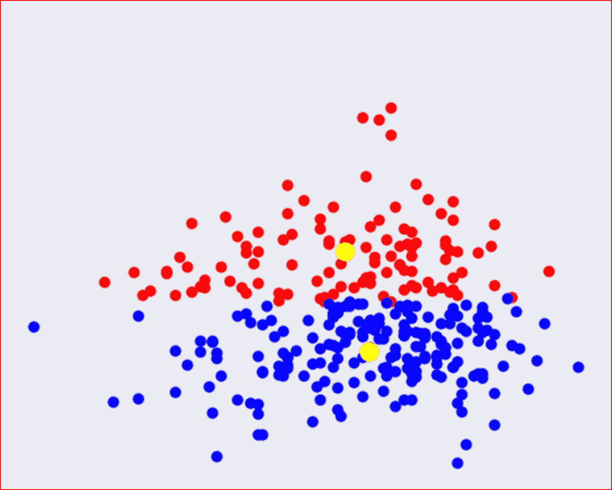

# 什么是集群？

将有共同目的或共同特征的东西集合或分组。

例如:如果你去动物园，你可以在一个区域看到不同类型的鸟类集群，或者在一个区域或一个集群中看到爬行动物。

如果你去杂货店，你会看到所有的乳制品都集中在一个通道，所有的新鲜农产品都集中在另一个通道。

基于上述类比，在 K-means 聚类中，我们将来自一组观察值的相似数据点分组在一起。

在 K-中，意味着我们不知道需要将这些数据点分组到什么组中。

*所以你可能会问，我们如何进行聚类？*

让我们举一个现实生活中的例子，我正在整理我的餐具室，我有以下物品——糖、咖啡粉、面粉、盐、发酵粉、奶酪、冰淇淋。

我可以根据物品的储存温度对物品进行分类——需要冷藏的物品和可以在正常室温下储存的物品。这里我有两个集群

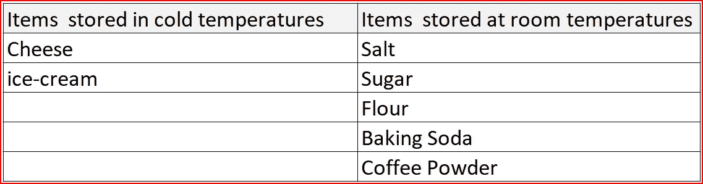

Clustering Items based on Storage Temperature

我们还可以根据使用情况对项目进行分组，如下所示。这里我有三个集群。

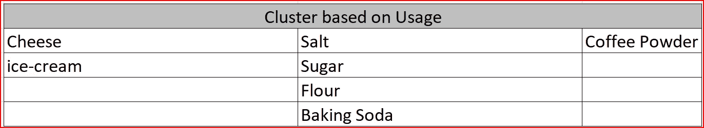

Clustering Items based on Usage

k-means 聚类算法将使用提供给它的最佳可能特征来将相似的项目分组在一起。

*让我用技术术语总结一下什么是 k 均值聚类。*

k 聚类是一种

*   **无监督机器学习算法**
*   **一种迭代算法**
*   **在给定的未标记数据集中寻找组**
*   **帮助将相似的数据点归类到一个簇中。**
*   除了有助于数据点聚类的输入要素之外，不需要预先分类

K-means 聚类算法是一种迭代算法，其中 **K** 指定我们需要对数据点进行分组的聚类数。

*让我们理解 k-means 背后的直觉*

对于 K-means 算法，我们需要执行以下步骤

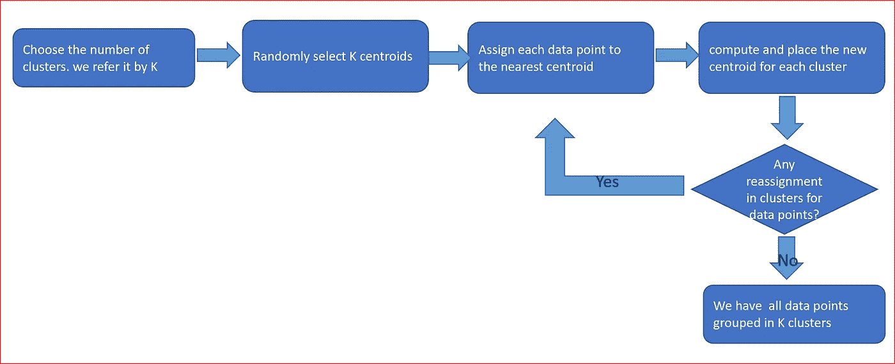

K means algorithm step by step

第一步:选择聚类数。我们称之为 K

第二步:随机选择 K 个质心。这些质心可以来自数据集，也可以是任意随机点

步骤 3:将每个数据点分配到最近的质心

步骤 4:重新计算新的质心，并为每个聚类放置新的质心

步骤 5:基于新的质心，检查数据集中是否有任何数据点可以重新分配给不同的聚类，如果数据点改变了聚类，则转到步骤 3。如果没有发生重新分配，那么所有的数据点被分组为 K 个簇。

*我们现在将对下面绘制的数据集运行这些步骤*

这里我们有员工人数和一个季度休假的次数。我们希望使用 k 均值对数据进行聚类或分组。

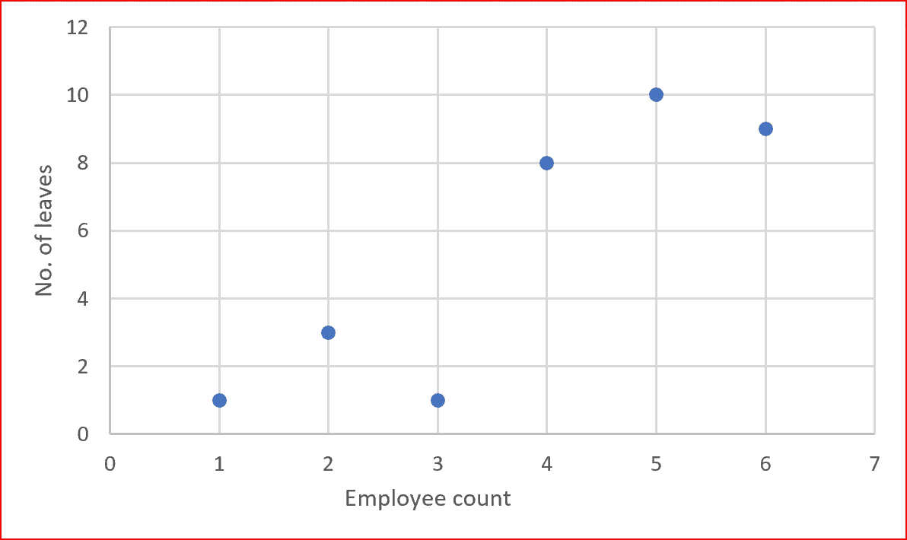

步骤 1:我们选择集群数量 K =2

步骤 2:我们随机选择两个质心，我们的质心是不在数据集中的数据点

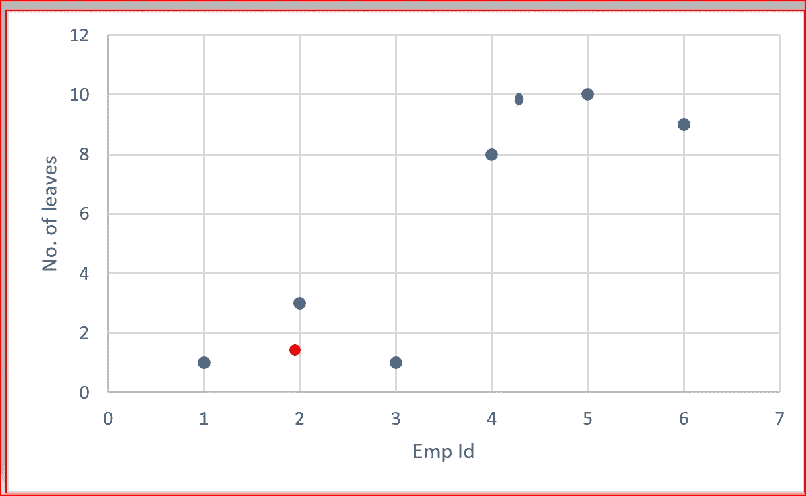

Red and Green are the two randomly selected centroids

步骤 3:将每个数据点分配到最近的质心。我们用**欧几里德距离，**也就是两点之间的**普通直线距离。**

为了识别每个数据点的最近质心，我们在两个质心之间画一条直线，并从连接两个质心的直线的中心画一条垂直线。垂直线有助于将数据点分成不同的簇。

现在，所有数据点都清楚地位于两个不同的集群中

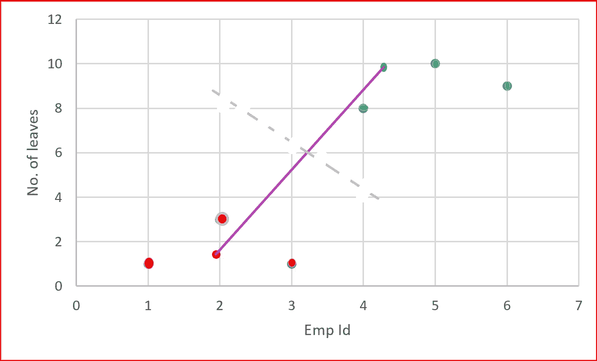

Green data points closest to green centroid and red data points are closest to red centroid

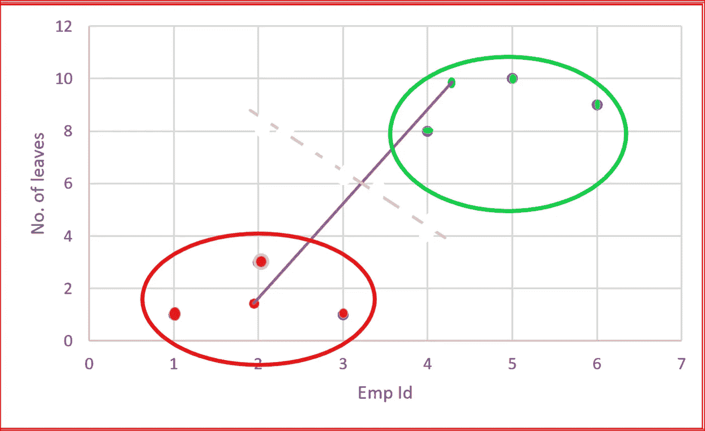

All data points on either side of the dotted perpendicular forms tow different clusters

第四步:计算新的质心，并把它放在每个集群。我们计算聚类中数据点的平均值，并为每个聚类放置新的质心

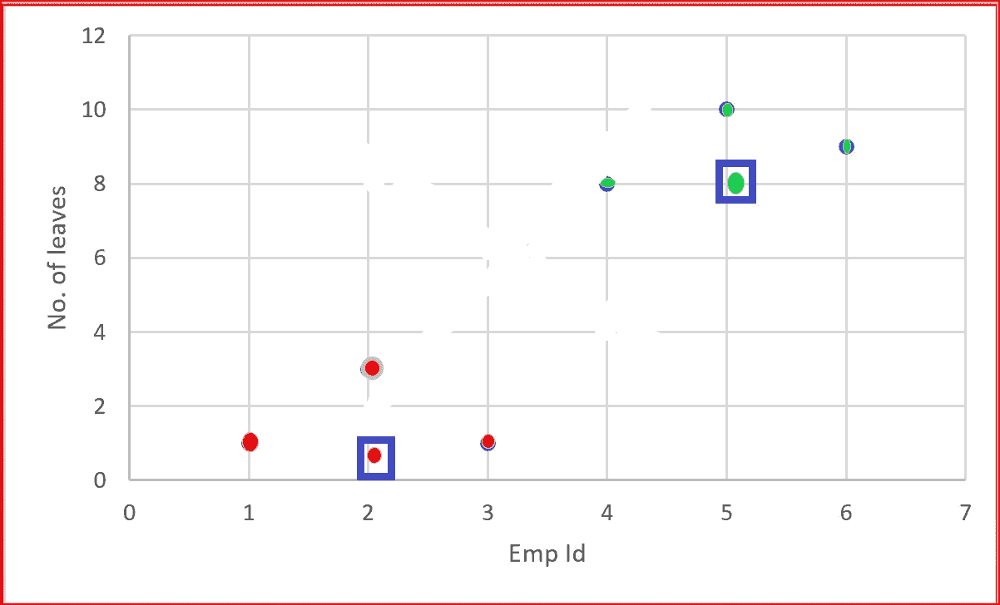

blue square marks the new centroids

步骤 5:检查是否有任何数据点被重新分配到基于新质心的不同聚类。如果我们将数据点重新分配到一个新的聚类中，那么我们需要从步骤 3 开始重复，否则所有数据点将被分组到正确的聚类中。

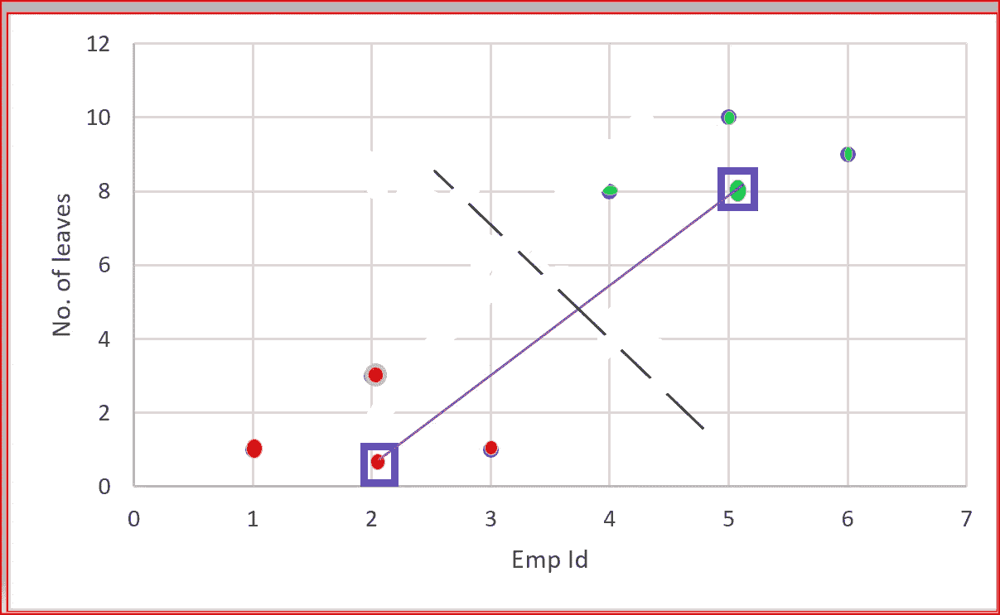

*好的，我明白了，但是你如何决定我们需要多少集群呢？*

为了选择正确的集群数量，我们使用**肘方法**。

肘方法针对不同数量的聚类运行 K-means 算法，并找到每个数据点到聚类质心的平方距离之和，在聚类平方和中也称为

**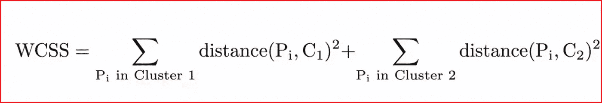**

**在我们的例子中，我们将对 K 值从 1 到 6 运行 K 均值算法。**

**如果我们只有一个聚类，那么我们将找到每个数据点到质心的平方距离之和**

**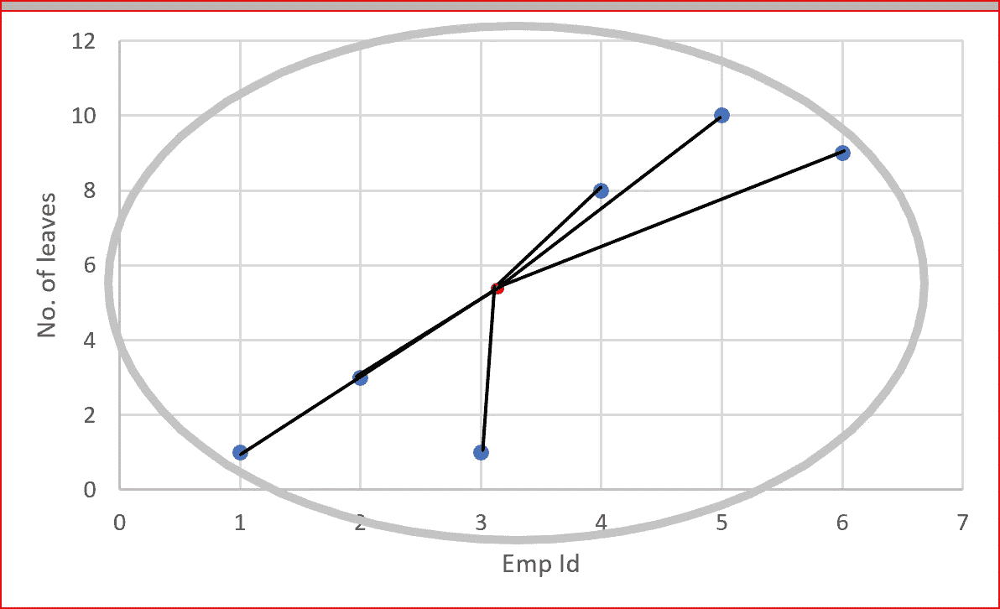**

**within cluster sum of squares for one cluster**

**我们找到一到六个集群的 WCSS，然后用集群的数量绘制 WCSS，如下所示。**

**曲线中弯曲或弯头的位置或距离的突然下降被认为是适当的聚类数。**

**在我们的例子中，我们看到 2，这是适当的集群的数量。**

**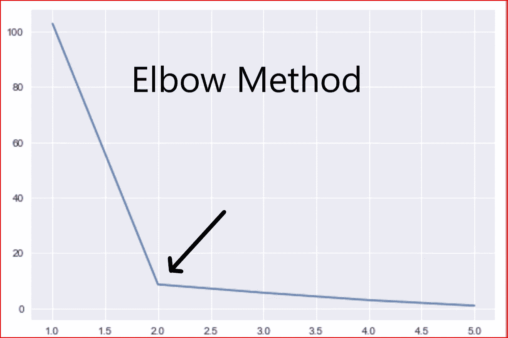**

**我们还需要讨论质心的随机初始化可能出现的问题，也称为**随机初始化陷阱****

# **随机初始化陷阱**

**当质心被随机初始化时，k 均值的每次运行产生不同的 WCSS。质心选择不正确会导致次优聚类。**

**为了解决质心不正确的问题，我们使用 K-means++，在初始化时尽可能地选择质心。**

**这个想法是用质心来创建不同的聚类中心，以获得快速收敛的最佳聚类。**

***让我们用一个例子来解释一下***

**我们有一个数据集，如下面的散点图所示，我们必须将数据分为三类。**

**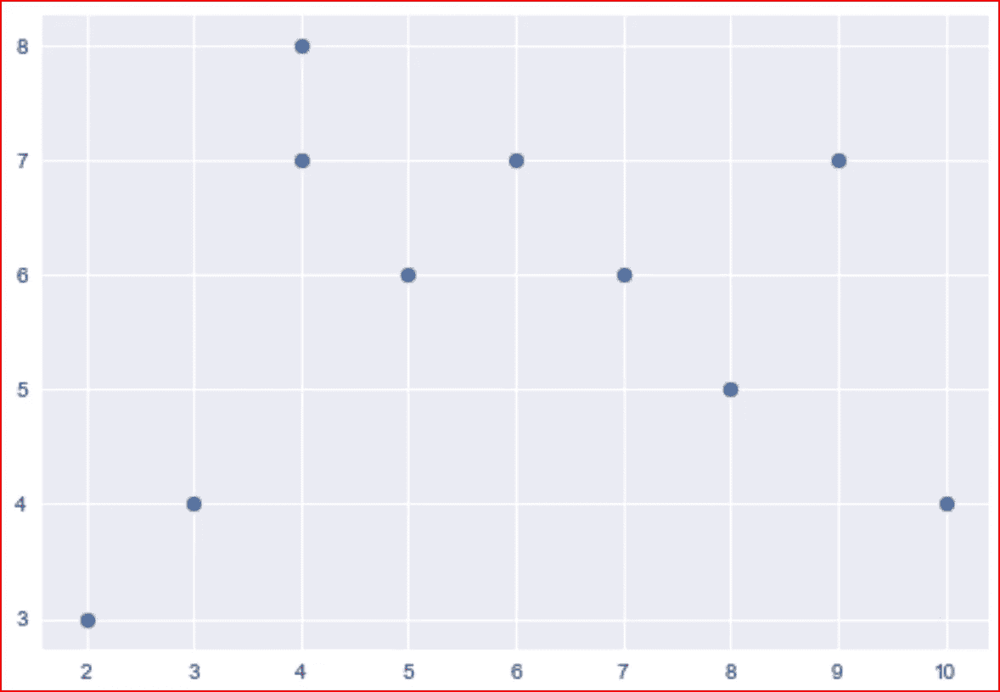**

**Data set for grouping into 3 clusters**

**基于质心的随机初始化，我们有如下所示的聚类 1 和聚类 2**

**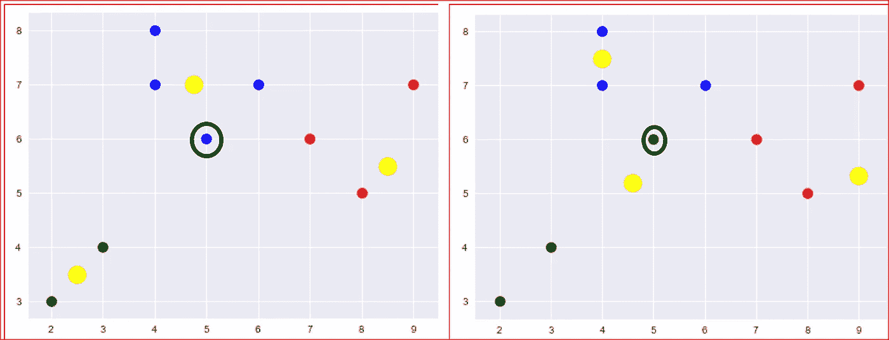**

**different clusters based on different initialization of centroids**

**这表明基于质心的不同初始化，聚类将是不同的。带圆圈的点显示了数据点如何根据质心的不同初始化进行不同的分组**

**这由 k-means++解决，它使用以下算法**

**步骤 1:选择 k 个簇的随机质心**

**步骤 2:计算每个点到每个质心的距离的平方和**

**步骤 3:为数据集中的每个数据点找到最小距离或聚类中心**

**第四步:找出多少个点被分配给每个聚类，并计算每个聚类的平均值，它们成为新的质心。**

**我们基于一个可配置的参数重复这一过程。**

***现在我们知道了 k 均值算法的直觉，让我们举一个简单的例子，更好地理解它。***

**我们采用 http://archive.ics.uci.edu/ml/datasets/Heart+Disease[的心脏病数据集](http://archive.ics.uci.edu/ml/datasets/Heart+Disease)进行 K-均值聚类**

**首先，我们需要导入公共库——numpy、pandas、matplotlib 和 seaborn，我们希望内联显示这些图，所以我们使用***% matplotlib inline*****

```
import numpy as np
import pandas as pd
import matplotlib.pyplot as plt
import seaborn as sns
%matplotlib inline
from sklearn.cluster import KMeans
```

**我们为 KMeans 算法从***sk learn . cluster***导入 ***KMeans*** 。**

**我已经将数据集下载到我默认的 Jupyter 文件夹中，并将其命名为 *heart.csv.***

**将数据读入 heart_data 数据集**

```
heart_data = pd.read_csv("heart.csv")
```

**描述数据集**

```
heart_data.describe()
```

**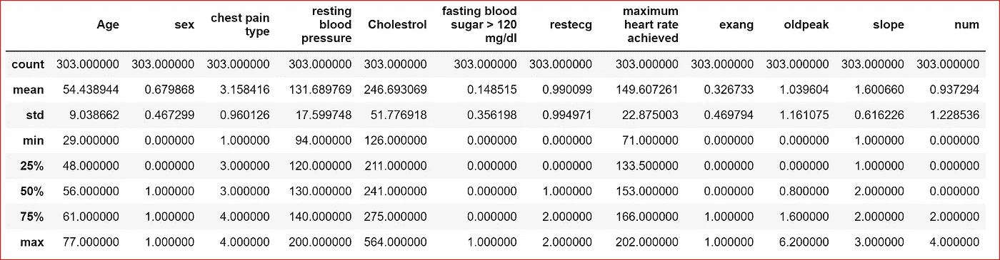**

**Columns were renamed in csv file for descriptive names**

**我们首先尝试使用肘方法，以了解使用 WCSS 的最佳集群数量-在集群平方和。**

**我们应用特征工程并从数据集中选择相关特征**

```
X_heart = heart_data.iloc[:,[0,1,2,3,4,5,6,7]]
```

**让我们打印 X_heart 数据帧中的所有列名**

```
print(X_heart.columns)
```

**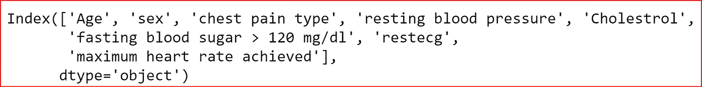**

**column names in X_heart dataframe**

****计算 WCSS****

**我们首先创建一个空列表 *wcss_heart* 来存储不同数量的集群的 wcss 的不同值。**

**我们选择了从 1 到 10 的聚类，并且属性 inertia_ 给出了数据点到它们最近的聚类中心的距离的平方和。**

```
wcss_heart=[]
for i in range(1,11):
    kmeans_heart = KMeans(n_clusters=i, init='k-means++', max_iter=300, n_init=10)
    y_means_heart = kmeans_heart.fit(X_heart)
    wcss_heart.append(y_means_heart.inertia_)
```

**让我们绘制聚类数之间和聚类平方和内的数据。**

```
plt.plot(range(1,11), wcss_heart)
plt.show()
```

**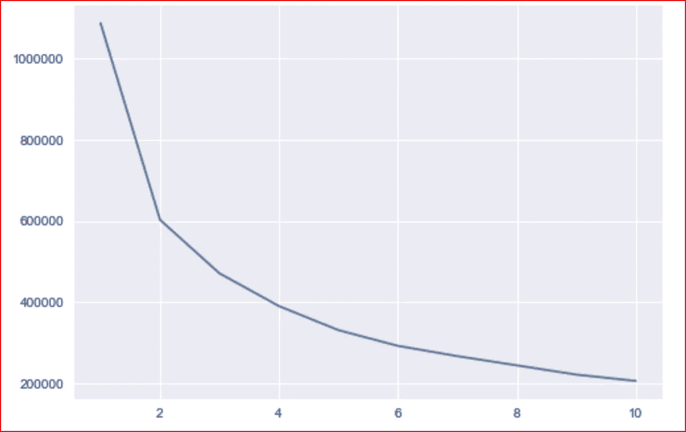**

**elbow method for heart dataset**

**我们看到突然下降发生在 2，因此心脏数据集的最佳聚类数是 2。**

**现在让我们使用 k-means++随机初始化来运行 KMeans**

```
kmeans_heart = KMeans(n_clusters=2, init='k-means++', max_iter=300, n_init=10)
y_kmeans_heart = kmeans_heart.fit_predict(X_heart)
```

**让我们将数据和质心一起可视化**

```
plt.figure(figsize=(10,10))
plt.scatter(X_heart.iloc[y_kmeans_heart == 0,6], X_heart.iloc[y_kmeans_heart == 0,3], s= 100, color = 'red', label ='Need to be healthy')
plt.scatter(X_heart.iloc[y_kmeans_heart == 1,6], X_heart.iloc[y_kmeans_heart == 1,3], s= 100, color = 'blue', label ='Healthy')

plt.scatter(kmeans_heart.cluster_centers_[:,6], kmeans_heart.cluster_centers_[:, 3], s= 300, color = 'yellow', label ='Centroid')plt.title('k-means clustering')
plt.xlabel('Max Heart rate achieved')
plt.ylabel('cholesterol')
plt.legend()
plt.show()
```

**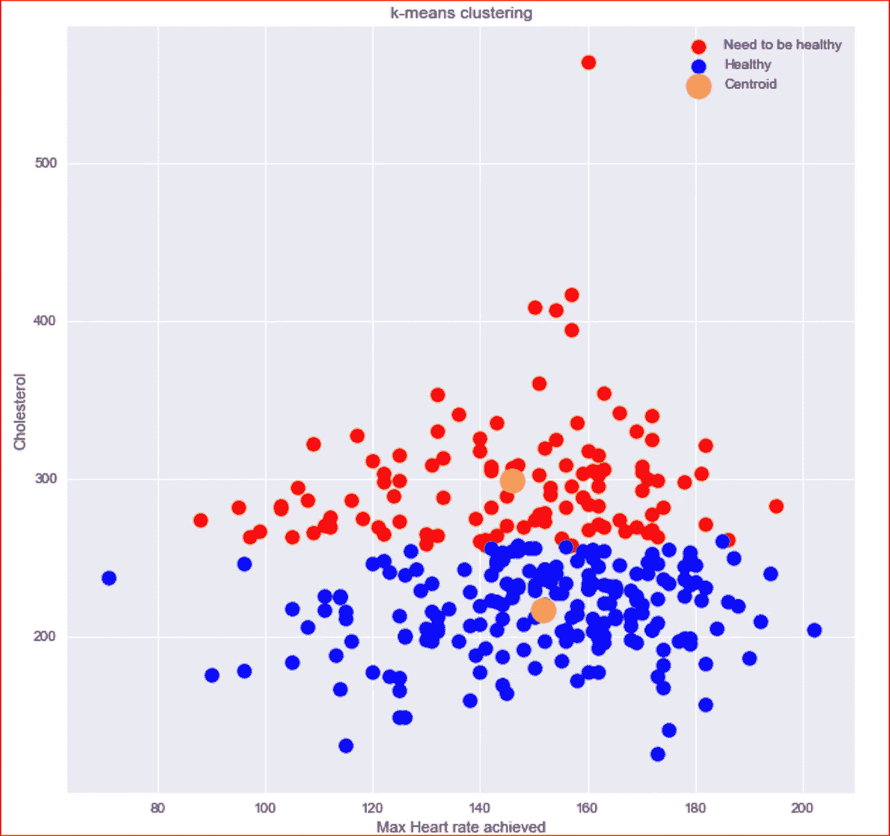**

**clustering based K means using k-means++ initialization**

**上述聚类基于人们达到的最大心率和胆固醇将他们分组，并将他们分组为健康个体和需要更健康的人。**

**我希望这有助于 K 意味着直觉和 python 代码的真实生活的例子**