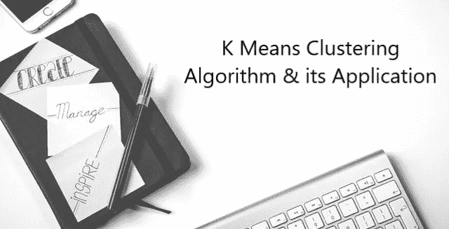

# k 均值聚类算法及其应用

> 原文：<https://medium.datadriveninvestor.com/k-means-clustering-algorithm-its-application-ff9e97297e6e?source=collection_archive---------1----------------------->

# **什么是 K 均值聚类？**

聚类意味着将相似或具有共同特征的事物分组，这也是 k-means 聚类的目的。k 均值聚类是一种无监督的机器学习算法，用于将“n”个观察值聚类成“k”个聚类，其中 k 是预定义的或用户定义的常数。主要思想是定义 k 个质心，每个聚类一个。

K 均值算法包括:

1.  选择簇的数量“k”。
2.  将每个点随机分配给一个簇。
3.  重复以下操作，直到簇停止变化:

*   对于每个聚类，通过取聚类中点的平均向量来计算聚类质心。
*   将每个数据点分配给质心最近的聚类。

在 K 均值中有两件事非常重要，第一是在对数据进行聚类之前缩放变量，第二是查看散点图或数据表，以估计模型中为 K 参数设置的聚类中心的数量。

## 选择最佳 K 值:

选择 k 值的一种方法是使用弯头法。首先，计算 k 的某些值的误差平方和(SSE)。SSE 是聚类的每个成员与其质心之间的距离平方和。如果绘制 k 与 SSE 的关系图，您会发现误差随着 k 的增加而减小，这是因为随着聚类数量的增加，误差应该会变小，因此失真应该会变小。肘法的思想是选择上证指数显著下降的 k 值。

## K-均值聚类的应用:

k-means 可应用于维数较少、数值型且连续的数据。例如文档聚类、识别犯罪多发区域、客户细分、保险欺诈检测、公共交通数据分析、IT 警报聚类等。

另请阅读:[如何利用 K 均值聚类模型解决无监督 ML 问题？](https://engmrk.com/module-17-k-means-clustering/)

*原载于 2018 年 9 月 27 日 datasciencecentral.com。*