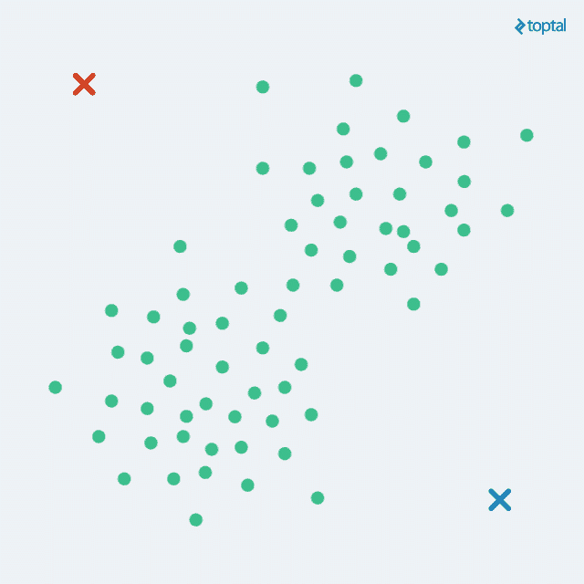
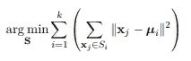
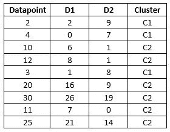
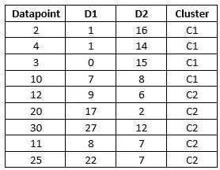
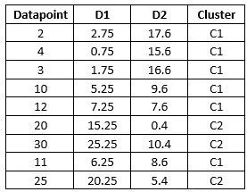
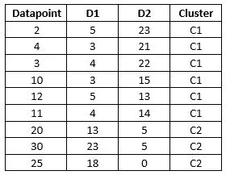
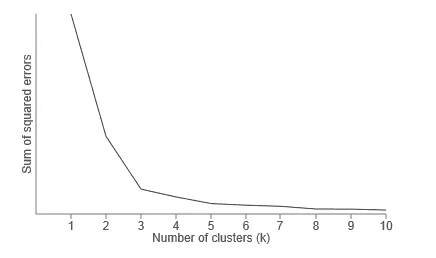

# k 均值聚类

> 原文：<https://medium.datadriveninvestor.com/k-means-clustering-b89d349e98e6?source=collection_archive---------0----------------------->

在我的[前一篇博客](https://medium.com/datadriveninvestor/an-introduction-to-clustering-61f6930e3e0b)中，我们已经看到了集群的一些基础知识。现在让我们试着了解一下 k-means 聚类算法的全貌。

K-Means Clustering

**K-均值聚类语句**

K-means 试图将 x 个数据点划分成 k 个聚类的集合，其中每个数据点被分配给其最近的聚类。该方法由目标函数定义，该目标函数试图对所有聚类最小化聚类内所有平方距离的总和。

**目标函数定义为:**

其中 xj 是数据集中的数据点，Si 是聚类(数据点集), ui 是聚类平均值(Si 的聚类中心)

**K-Means 聚类算法:**

1.选择 k 值，即要形成的簇的数量。

2.从数据集中随机选择 k 个数据点作为初始聚类中心点/中心

3.对于每个数据点:

a.计算数据点和聚类质心之间的距离

b.将数据点指定给最近的质心

4.对于每个聚类，根据聚类中的数据点计算新的平均值。

5.重复 3 和 4 步，直到聚类的平均值停止变化或达到最大迭代次数。

Flowchart of K-Means Clustering

**用一个简单的例子理解**

我们将对以下 K=2 的一维数据集应用 K 均值。

数据集{2，4，10，12，3，20，30，11，25}

**迭代 1**

M2 M1 是两个随机选择的质心/平均值，其中

M1= 4，M2=11

初始聚类是

C1= {4}，C2= {11}

计算欧几里德距离为

D=[x，a]=√(x-a)

D1 离 M1 很远

D2 离 M2 很远

Iteration 1

正如我们在上表中看到的，2 个数据点被添加到 C1 集群，其他数据点被添加到 C2 集群

因此

C1= {2，4，3}

C2= {10，12，20，30，11，25}

**迭代 2**

计算 C1 和 C2 数据点的新平均值。

因此

M1= (2+3+4)/3= 3

M2= (10+12+20+30+11+25)/6= 18

基于下表计算距离并更新聚类

Iteration 2

新集群

C1= {2，3，4，10}

C2= {12，20，30，11，25}

**迭代 3**

计算 C1 和 C2 数据点的新平均值。

因此

M1= (2+3+4+10)/4= 4.75

M2= (12+20+30+11+25)/5= 19.6

基于下表计算距离并更新聚类

Iteration 3

新集群

C1= {2，3，4，10，12，11}

C2= {20，30，25}

**迭代 4**

计算 C1 和 C2 数据点的新平均值。

因此

M1= (2+3+4+10+12+11)/6=7

M2= (20+30+25)/3= 25

基于下表计算距离并更新聚类

Iteration 4

新集群

C1= {2，3，4，10，12，11}

C2= {20，30，25}

我们可以看到，迭代 3 中 C1 和 C2 聚类中的数据点与迭代 2 中 C1 和 C2 聚类中的数据点相同。

这意味着没有数据点移动到其他集群。同样，这些集群的平均值/中心线是恒定的。所以这成为我们算法的停止条件。

有多少个集群？

在我们充分了解我们的数据集之前，选择一个合适的“K”值是非常困难的。

因此，我们需要一些方法来确定和验证我们是否使用了正确的集群数量。对数据集进行分区的基本目的是最小化集群内的差异或 SSE。SSE 的计算方法如下——首先计算每个数据点与其质心之间的差值，然后将计算出的差值的所有平方相加

因此，要找到最佳的集群数量:

对不同的“K”值运行 k-means。例如 K 从 1 到 10 变化，且对于 K 每个值计算 SSE。

如下图所示，在 x 轴上绘制 K 值，在 y 轴上绘制对应的 SSE 值。

Elbow Method

如果 K =聚类数，SSE=0，这意味着每个数据点都有自己的聚类。

从图中可以看出，随着 K=2 到 3，SSE 迅速下降，随着 K 值的进一步增加，SSE 几乎保持不变。

由于突然下降，我们在图中看到一个弯头。所以 K 的值是 3。这种方法被称为肘法。

还有许多其他的技术可以用来确定 k 值。

K-means 是“首选”聚类算法，因为它快速且易于理解。

**列举 K-Means 的一些缺点**

1.结果可能不是全局最优的:我们不能保证这个算法将导致最佳的全局解。开始时选择不同的随机种子会影响最终结果。

2.需要预先指定 K 值:只有当我们对数据集有一个很好的想法时，我们才能期待这个值，如果我们正在处理一个新的数据集，那么可以使用肘方法来确定 K 的值

3.仅适用于线性边界:K-means 假设边界总是线性的。因此，当涉及到复杂的边界时，它就失败了。

4.对于大量样本而言速度较慢:由于该算法访问数据集的每个点，因此当样本量增加时速度会变慢。

所以这一切都是为了 K-Means。我希望现在你对 k-means 实际上是如何工作的有了更好的理解。行业中还有许多其他用于聚类的算法。

感谢阅读！

