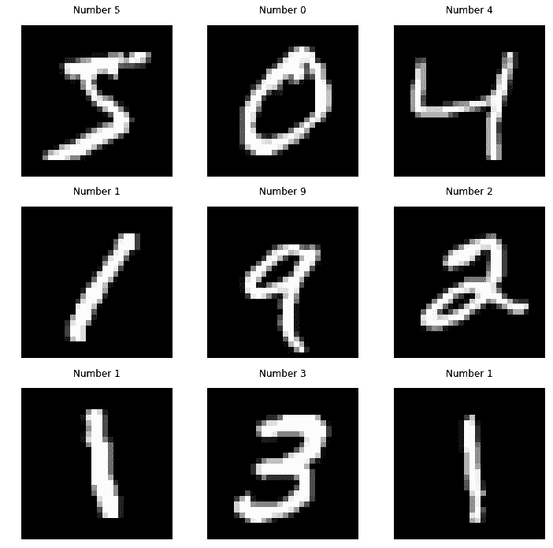
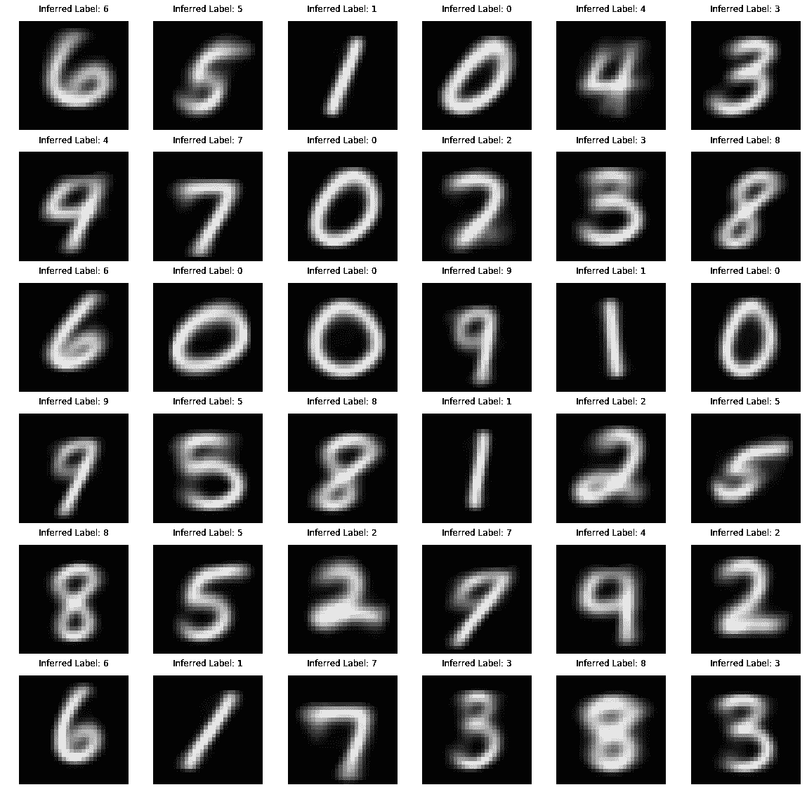

# 用于影像分析的 k 均值聚类

> 原文：<https://medium.datadriveninvestor.com/k-means-clustering-for-imagery-analysis-56c9976f16b6?source=collection_archive---------0----------------------->

让我们通过做一个迷你项目来了解 K-Means。

在这个项目中，我们将使用 K-means 算法来执行图像分类。聚类不限于消费者信息和人口科学，它也可以用于影像分析。利用 Scikit-learn 和 MNIST 数据集，我们将研究 K 均值聚类在计算机视觉中的应用。

[https://giphy.com/gifs/l0HlNBe9Z3Xz9x1Yc/html5](https://giphy.com/gifs/l0HlNBe9Z3Xz9x1Yc/html5)

在本项目中，我们将学习如何:

 [## DDI 编辑推荐:5 本让你从新手变成专家的机器学习书籍|数据驱动…

### 机器学习行业的蓬勃发展重新引起了人们对人工智能的兴趣

www.datadriveninvestor.com](https://www.datadriveninvestor.com/2019/03/03/editors-pick-5-machine-learning-books/) 

*   预处理图像进行聚类
*   部署 K 均值聚类算法
*   使用通用指标评估集群性能
*   可视化高维聚类质心

让我们从导入我们将在这个项目中使用的几个库开始。

# 1.导入 MNIST 数据集

对于这个项目，我们将使用 MNIST 数据集。它可以通过 keras 获得，这是一个我们在以前的教程中使用过的深度学习库。虽然我们今天不会使用 keras 的其他特性，但是从这个库中导入 mnist 会节省我们的时间。它也可以通过 tensorflow 图书馆获得，或者在[http://yann.lecun.com/exdb/mnist/](http://yann.lecun.com/exdb/mnist/)下载。

# 2.MNIST 图像的预处理

存储为 NumPy 数组的图像是二维数组。但是，scikit-learn 提供的 K-means 聚类算法会吸收一维数组；因此，我们需要重塑每张图片。

聚类算法几乎总是使用一维数据。例如，如果对一组 X，Y 坐标进行聚类，每个点将作为长度为 2 的一维数组传递给聚类算法(例如:[2，4]或[-1，4])。如果您使用的是三维数据，数组的长度将为 3(例如:[2，4，1]或[-1，4，5])。

MNIST 包含 28 x 28 像素的图像；因此，一旦我们将它们重新整形为一维数组，它们的长度将为 784。

# 3.k 均值聚类

开始集群的时间到了！由于 MNIST 数据集的大小，我们将使用 scikit-learn 提供的 k-means 聚类的小批量实现。这将大大减少将算法与数据相匹配所需的时间。

MNIST 数据集包含整数 0 到 9 的图像。正因为如此，让我们从将集群的数量设置为 10 开始，每个数字一个集群。

# 4.分配分类标签

K-means 聚类是一种无监督的机器学习方法；因此，我们的 KMeans 算法分配的标签指的是每个数组被分配到的集群，而不是实际的目标整数。为了解决这个问题，让我们定义几个函数来预测哪个整数对应于每个集群。

# 5.优化和评估聚类算法

有了上面定义的函数，我们现在可以确定我们算法的准确性。因为我们使用这种聚类算法进行分类，所以准确性最终是最重要的度量标准；然而，还有其他指标可以直接应用于集群本身，而不考虑相关的标签。我们将使用的两个指标是惯性和同质性。

此外，之前我们假设 K = 10 是合适的聚类数；然而，情况可能并非如此。让我们用几个不同的 K 值来拟合 K-means 聚类算法，然后使用我们的度量来评估性能。

# 6.可视化聚类质心

每个聚类中最具代表性的点称为质心。如果我们处理 X，Y 点，质心就是图上的一个点。然而，由于我们使用长度为 784 的数组，我们的质心也将是一个长度为 784 的数组。我们可以将这个数组重新整形为 28×28 像素的图像，并绘制它。

这些图表将显示每个集群最具代表性的图像。

> 打印('精度:{}\n '。格式(metrics.accuracy_score(y_test，predicted_labels)))

# 预测-精确度:0.9023

关于代码:请参考->[https://github . com/xor aus/K-Means-Clustering-for-Imagery-Analysis](https://github.com/xoraus/K-Means-Clustering-for-Imagery-Analysis)

[https://giphy.com/gifs/ncK1aJlwmpHNu/html5](https://giphy.com/gifs/ncK1aJlwmpHNu/html5)

***更多编程相关玩意儿，关注我上***[***Twitter***](https://twitter.com/xoraus)***&***[***Github***](https://github.com/xoraus)***。***

参考资料:

【1】:[https://en.wikipedia.org/wiki/K-means_clustering](https://en.wikipedia.org/wiki/K-means_clustering)

[2]:[http://yann.lecun.com/exdb/mnist/](http://yann.lecun.com/exdb/mnist/)

[3]:[https://en.wikipedia.org/wiki/MNIST_database](https://en.wikipedia.org/wiki/MNIST_database)

[4]:[https://www . ka ggle . com/ngbolin/mnist-dataset-digit-recognizer](https://www.kaggle.com/ngbolin/mnist-dataset-digit-recognizer)