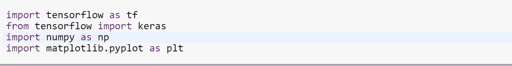
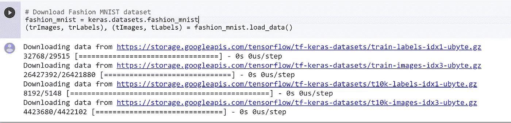
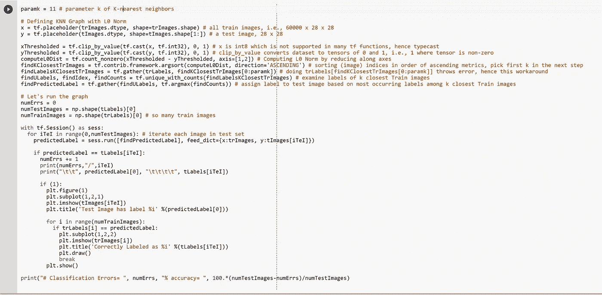
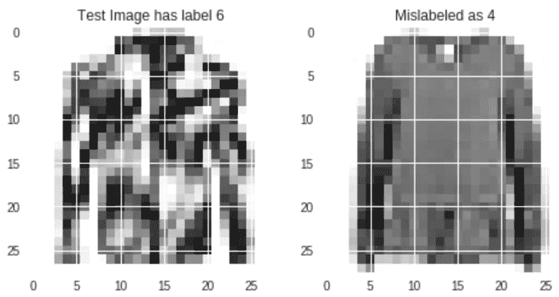
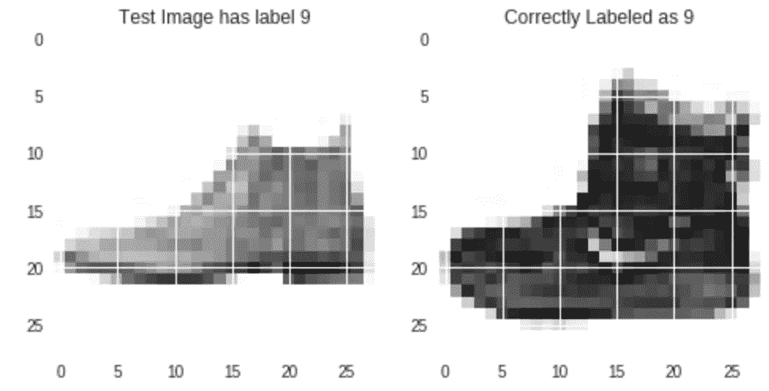
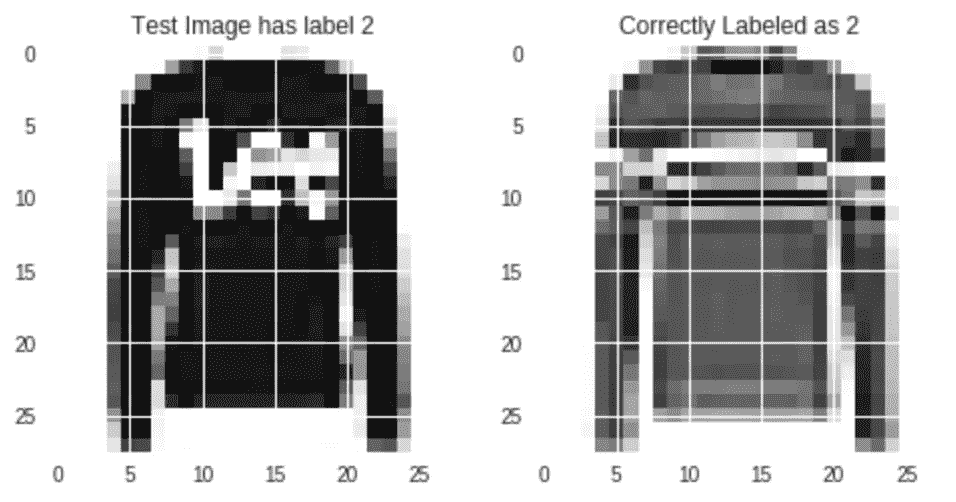

# 第六部分:基于时尚 MNIST 数据集的 K 近邻分类

> 原文：<https://medium.datadriveninvestor.com/k-nearest-neighbor-classification-with-python-numpy-tensorflow-on-fashion-mnist-dataset-d8361187c09c?source=collection_archive---------1----------------------->

# 迄今为止

在 [Part-2](https://medium.com/datadriveninvestor/part-2-basic-classification-neural-network-6d68d32fa4b2) 中，我们已经在时尚 MNIST 数据集上设计、训练和测试了一个反向传播网络。使用 Keras 和 Tensorflow 设计的两层反向投影网络，我们实现了 87.2%的分类精度。在本文中，我们将再次讨论该数据集的分类(或标注)问题，但会应用一种称为 K-最近邻(或 KNN)算法的分类算法。我们将证明 KNN 达到的分类精度只比反向传播网络稍差一点。

# 什么是时尚 MNIST 数据集？

时尚 MNIST 是一个图像数据集，被赋予 10 个独特的标签之一，如上衣、裤子、套头衫、连衣裙、外套、凉鞋、衬衫、运动鞋、包和踝靴。数据集分为两组:训练集和测试集；训练集中有 60000 幅图像，测试集中有 10000 幅图像。每个图像都是一个 28 x 28 的数组，值从 0 到 255。

# k-最近邻算法

k-最近邻(或 KNN)算法是一种非参数分类算法。第 1 部分的反向传播神经网络是一个参数模型，由权重和偏差值参数化。非参数模型，顾名思义，有大量的参数。在时尚 MNIST 的例子中，我们将使用整个列车集作为 KNN 的参数。

KNN 背后的基本思想很简单。给定一个要分类或标记的(测试)向量或图像，找出训练集中“最接近”该(测试)向量或图像的 *k* 个向量或图像。有了 *k* 个最接近的向量或图像，就有了 *k* 个标签。将 k 个标签中最常用的标签分配给(测试)矢量或图像。

## 接近度度量

“最接近”或“接近”的概念取决于我们选择使用的度量标准；例如:

*   **两个向量 x= < x_1，x_2，x_3 >和 y= < y_1，y_2，y_3 >之间的欧氏距离**定义为{(x _ 1-y _ 1)+(x _ 2-y _ 2)+(x _ 3-y _ 3)\}^{1/2}.在学术文献中，你可能会看到这被称为 x-y 的 L2 范数
*   **两个向量 x= < x_1，x_2，x_3 >和 y= < y_1，y_2，y_3 >之间的 L1 距离**定义为|x_1-y_1|+|x_2-y_2|+|x_3-y_3|。
*   **两个向量 x= < x_1，x_2，x_3 >和 y= < y_1，y_2，y_3 >之间的 L0 距离**定义为|x-y|中非零元素的个数。

在本文中，我们将使用欧几里德距离和 L0 距离。

## 在训练集中寻找 k 个最近向量

给定测试集中的一个向量(或图像),如果不计算训练集中所有元素的度量，我们就不能说训练集中的哪些是最接近的。在时尚 MNIST 的情况下，我们计算从测试集到每个元素的向量的“接近度”度量，即，训练集中的 60000 个元素，这将导致 60000 个距离值。可以想象，如果训练集较大，那么查找所有这些距离值就需要更多的时间或计算。

**优化参数 *k* 让我们回顾一下 *k* 的一些极端选择:**

*   如果 *k* =1，则测试向量或图像的标记由训练集中的一个元素确定
*   如果 *k* =60000，则测试向量的标签由训练集中的所有元素确定，并且如果存在类别不平衡，即测试集中有更多具有某个标签的图像，则每个测试向量将获得完全相同的标签。

# 使用欧几里德距离度量的分类

这里，我们使用欧几里德距离度量来确定训练图像与给定测试图像的接近度。在下面的代码片段中，有两个 for 循环，一个循环遍历测试图像，另一个遍历训练图像。我已经设置了参数*k*= 11；尝试使用这个参数。

从运行下面的代码可以看出，这个指标的分类准确性很差。例如，套头衫被归类为 t 恤，裤子被归类为鞋子。总的来说，该度量是无用的，并且所得的分类准确度是差的。

## 复杂性

这个例子中 KNN 的复杂度相当高:对于测试集中的每个图像(有 10000 个图像)，我们计算 60000 个度量(每个训练图像一个)。在填充一个包含 60000 个指标的数组后，我们扫描这个数组以识别出 *k* 个最小的指标。

# 使用 L0 距离分类

这里，我们选择应用 L0 距离来确定训练图像与给定测试图像的接近度。在下面的代码片段中，这是以间接的方式实现的(不是一个优雅的解决方案),但仍然有效。对于每个图像(训练或测试)，我们通过将 1 分配给原始图像中的非零像素并将 0 分配给原始图像中的零像素来生成修改的图像。修改后的图像是只有 1 和 0 的图片。为了确定测试图像和训练图像的接近程度，我们计算它们的修改图像之间的欧几里德距离度量。此指标与测试和训练图像原始副本上的 L0 距离成比例。

显然，生成修改后的图像并存储起来并不是特别有效，但是对于本文的目的来说，这已经足够了。通过运行代码，我观察到这个指标达到了 83.8%的分类精度，顺便说一下，这个精度与我们在这个数据集上使用反向传播网络所达到的精度相差不远。

## 复杂性

从变化到 L0 距离，KNN 的复杂程度没有(很大)变化。因此，上面的复杂性讨论仍然成立。

## Tensorflow 实现

该算法以最适合 Tensorflow 的方式实现。这里，我们首先定义算法的详细图形，然后在一个会话的 Tensorflow 实例中运行它。Tensorflow 代码花了我一点时间来整理。如果您是 Tensorflow 的新手，我建议您浏览这段代码。熟悉该环境的读者可以自由地分享您对如何优化该代码的想法。

我试着用 *k* =1 运行代码，它实现了 83.75%的分类准确率，这与用 *k* =11 实现的分类准确率相似。用 *k* =11，我们可以达到 84%的分类准确率。

Import needed libraries

Download FASHION MNIST Dataset

Tensorflow implementation of KNN Algorithm. KNN uses L0 Distance Metric and achieves 84% classification accuracy.

以下是算法错误分类的实例:

Test Image on the Left is Misidentified as an Item on the Right

Test Image on the Left is Misidentified as an Item on the Right

通过检查上面的例子，很容易看出为什么机器给它们贴错了标签。以下是算法正确分类的实例(注意，这种情况发生率为 84%):

# 摘要

关键要点如下:

*   KNN 是一种非参数分类算法
*   通过适当的距离度量或贴近度度量，KNN 在时尚 MNIST 数据集上取得了接近 **83.8%** 的分类准确率。
*   下面是使用 [Google 联合实验室](https://colab.research.google.com/notebooks/welcome.ipynb)构建的 Tensorflow 代码和详细信息的链接；请随意使用代码并提交您的评论。

 [## 谷歌联合实验室

### 编辑描述

colab.research.google.co](https://colab.research.google.com/github/FreeOfConfines/ExampleNNWithKerasAndTensorflow/blob/master/K_Nearest_Neighbor_Classification_with_Tensorflow_on_Fashion_MNIST_Dataset.ipynb) 