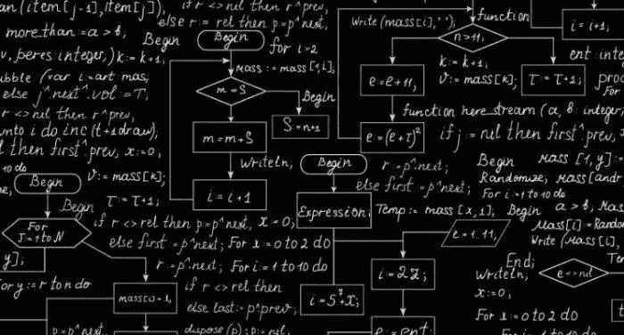
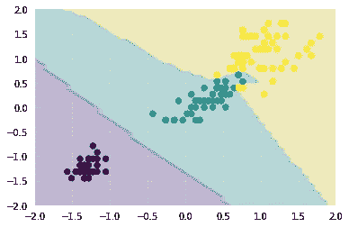

# k-最近邻

> 原文：<https://medium.datadriveninvestor.com/k-nearest-neighbors-abeab8b3ea01?source=collection_archive---------3----------------------->



在这篇文章中，我们将讨论机器学习算法 K-最近邻。K-Nearest 算法背后的直觉是相似的事物彼此靠近。这是一个简单的机器学习算法，通过找到一个观察值的最近邻居来工作。并利用这些数据进行预测。该算法可用于回归和分类问题。

# KNN 算法的步骤

1.  加载数据
2.  将 K 初始化为您选择的数字
3.  对于数据中的每个示例，计算查询示例和数据中的当前示例之间的距离。将示例的距离和索引添加到有序集合中
4.  按照距离从最小到最大的升序对距离和索引的有序集合进行排序

5.从排序的集合中挑选 K 的第一个条目

6.获取所选 K 的标签

7.在回归的情况下，返回 K 个标签的平均值

8.在分类的情况下，返回最常见的，即 K 标签的模式

Knn 模型通过从训练集中确定测试点的 k 个邻居来进行预测。邻居是使用距离作为度量的最接近测试点的 k 个训练点。通常使用欧几里德距离。广义距离度量被称为闵可夫斯基距离，定义为

# **DJ =(∑I | | Xi Xji | | p)1/p，**

这里 dj 是点 xi 和 j 之间的距离，其中 p 是一个整数，当 p=2 时，它相当于欧几里德距离。当我们找到 k 个邻居时，我们可以预测相邻点的标签。如果存在回归的情况，那么预测值将是 K 个邻居的平均值，并且在分类的情况下是 K 个标签的模式。

[](https://www.datadriveninvestor.com/2019/01/23/deep-learning-explained-in-7-steps/) [## 深度学习用 7 个步骤解释-更新|数据驱动的投资者

### 在深度学习的帮助下，自动驾驶汽车、Alexa、医学成像-小工具正在我们周围变得超级智能…

www.datadriveninvestor.com](https://www.datadriveninvestor.com/2019/01/23/deep-learning-explained-in-7-steps/) 

由于 KNN 涉及距离，我们将缩放数据，为此我们将使用标准缩放器。

让我们用 iris 数据集的例子来演示一下

```
%matplotlib inline
import matplotlib
import seaborn as sns
sns.set()
matplotlib.rcParams['figure.dpi'] = 144
from ipywidgets import interact, IntSlider
import matplotlib.pyplot as plt
from sklearn.datasets import load_iris
from sklearn.neighbors import KNeighborsClassifier
from sklearn.preprocessing import StandardScaler
import matplotlib.pyplot as plt
import numpy as npdata_loaded = load_iris()
X = data_loaded['data']
y = data_loaded['target']Xt = StandardScaler().fit_transform(X)def plot_neighbors(n_neighbors=2):
    knn = KNeighborsClassifier(n_neighbors=n_neighbors)
    knn.fit(Xt[:, 2:], y)

    X1, X2 = np.meshgrid(np.linspace(-2, 2), np.linspace(-2, 2))
    y_pred = knn.predict(np.hstack((X1.reshape(-1, 1), X2.reshape(-1, 1))))
    plt.contourf(X1, X2, y_pred.reshape(50, 50)/2, cmap='viridis', alpha=0.25, vmin=0, vmax=0.95)plt.scatter(*Xt[:, 2:].T, c=y, cmap='viridis');interact(plot_neighbors, n_neighbors=IntSlider(min=1, max=36, step=2, description='neighbors'));
```

在 google colab 中运行这段代码，看看我们如何将数据分为 3 类。

