# Python +超参数调优中的 k 近邻

> 原文：<https://medium.datadriveninvestor.com/k-nearest-neighbors-in-python-hyperparameters-tuning-716734bc557f?source=collection_archive---------0----------------------->


Photo by [Christian Stahl](https://unsplash.com/@woodpecker65?utm_source=medium&utm_medium=referral) on [Unsplash](https://unsplash.com?utm_source=medium&utm_medium=referral)

> **“k 近邻算法(KNN)是一种用于分类和回归的非参数方法。在这两种情况下，输入由特征空间中 k 个最接近的训练示例组成。输出取决于 k-NN 是用于分类还是回归”——维基百科**

所以实际上 **KNN** 可以用于**分类**或者**回归**问题，但是一般情况下，KNN 用于分类问题。KNN 的一些应用是在**手写识别**、**卫星图像识别、**和**心电图模式识别**。这个算法非常简单，但是经常被数据科学家使用。

[](https://www.datadriveninvestor.com/2019/01/23/which-is-more-promising-data-science-or-software-engineering/) [## 数据科学和软件工程哪个更有前途？数据驱动的投资者

### 大约一个月前，当我坐在咖啡馆里为一个客户开发网站时，我发现了这个女人…

www.datadriveninvestor.com](https://www.datadriveninvestor.com/2019/01/23/which-is-more-promising-data-science-or-software-engineering/) 

总的来说，KNN 算法工作于**基于其与 **K 邻居**(训练数据)的接近度来分类**新数据。因此，如果新数据被具有类别 1 的训练数据包围，则可以断定新数据包括在类别 1 中。为了更容易理解，请看下面的**插图。**


Sources [Edureka](https://www.edureka.co/blog/k-nearest-neighbors-algorithm/)

上图想用星号对新数据进行分类，如果选择 K = 3，那么会搜索到与星号最接近的 3 个数据。之后，您检查这 3 个数据类。如果从图中看到，最接近的 3 个数据是 B 类中的 2 个和 A 类中的 1 个，那么可以说恒星数据包含在 B 类中，更详细地说，KNN 是如何工作的如下:

**1。确定 K 的值**
第一步是确定 K 的值，K 值的确定因情况不同变化很大。如果使用 **Scikit-Learn** 库，K 的默认值为 5。

**2。用训练数据计算新数据的距离。**
为了计算距离，常用的 3 个距离度量是**欧几里德**距离、**曼哈顿**距离和**闵可夫斯基**距离。

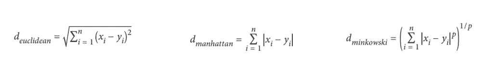

Distances Formula

使用 Scikit-Learn 时，使用的默认距离是欧几里德距离。在闵可夫斯基距离公式中可以看出，有一个超参数 p，如果设 p = 1 那么它将使用曼哈顿距离，p = 2 是欧几里得的。

**3。从新数据中查找最近的 K 邻居。**
计算完距离后，再寻找与新数据最接近的 K 邻居。如果使用 K = 3，则寻找最接近新数据的 3 个训练数据。

**4。新数据类预测。**
确定新数据的类别，选择最接近新数据且数量最多的训练数据类别。

**5。评价。**
计算模型的**精度**，如果精度仍然很低，那么这个过程可以从第 1 步再次重复。

了解了 KNN 的工作原理后，下一步就是用 Python 实现**和**。我将使用 Python Scikit-Learn 库。我将使用的数据集是一个**心脏数据集**，其中该数据集包含患者的特征，无论患者是否患有心脏病。

> 要了解本教程，您至少应该了解:
> 1。 **Python** 中的基础编程。
> 2。用于数据分析工具的 **Pandas** 和 **Numpy** 库。
> 3。用于数据可视化的 **Matplotlib** 和 **Seaborn** 库。
> 4。用于机器学习的库。
> 5。 **Jupyter 笔记本**。

使用 KNN 解决分类问题的步骤如下:
1 .加载**库**库
2。加载**数据集**和
3。**潜行峰值**数据
4。处理**缺失值**
5。
探索性数据分析(EDA)6。造型
7。调谐超参数

> 数据集和完整代码可以在我的 [**Github**](https://github.com/adiptamartulandi/KNN-and-Tuning-Hyperparameters) 下载，所有工作都在 Jupyter 笔记本上完成。

1 加载几个将用于本教程分析的库。我假设您已经安装了这个库。

```
**import pandas as pd
import numpy as np****import matplotlib.pyplot as plt
import seaborn as sns****from sklearn.neighbors import KNeighborsClassifier
from sklearn.metrics import classification_report
from sklearn.model_selection import train_test_split
from sklearn.metrics import roc_auc_score
from sklearn.model_selection import GridSearchCV**
```

2 加载要使用的数据集，数据集包含已接受心脏病检查的患者的历史数据。

```
**df = pd.read_csv('heart.csv')**
```

3 让我们从数据中看到一些大概的信息，以便更熟悉我们的数据。

```
**df.head()**
```

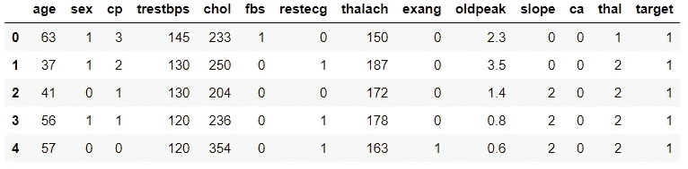

Top 5 Data

```
**df.shape**
```

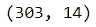

Dimension of Data

```
**df.info()**
```

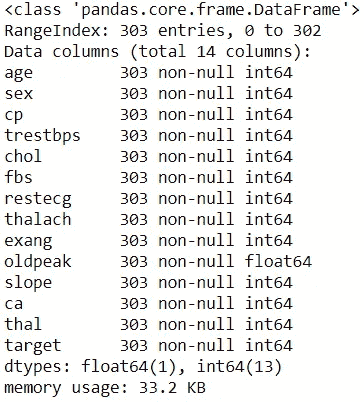

General Information of Data

4 检查是否有缺失数据，如果没有，则可以进入探索性数据分析(EDA)阶段。

```
**df.isnull().sum()**
```

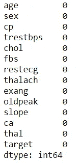

Sum of Missing Values

5 进行探索性数据分析(EDA)以更好地理解我们的数据(只显示了一些，在 [Github](https://github.com/adiptamartulandi/KNN-and-Tuning-Hyperparameters) 上完成)。

```
#Univariate analysis target.
**sns.countplot(df['target'])**
```

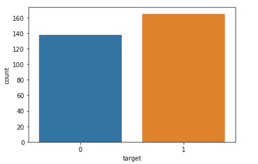

Countplot Feature Target

*   看起来目标特征是平衡的，因为值 0 和 1 的数量相差不大。
*   心脏病值为 0。
*   值 1 表示无心脏病。

```
#Univariate analysis age.
**f = plt.figure(figsize=(20,4))
f.add_subplot(1,2,1)
sns.distplot(df['age'])
f.add_subplot(1,2,2)
sns.boxplot(df['age'])**
```

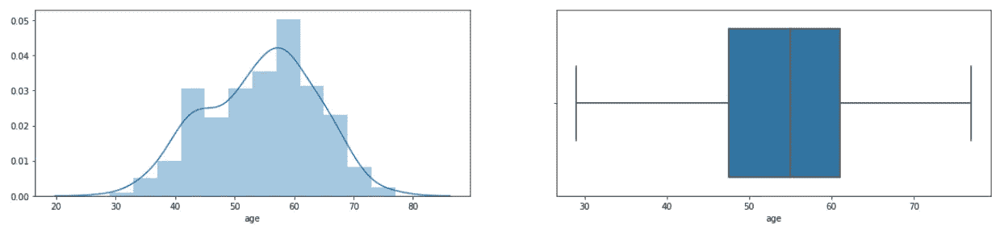

Distplot and Boxplot Feature Age

*   从 distplot 可以看出，数据的密度在 50-60 岁之间，很少有 30 岁以下或 80 岁以上的患者。
*   箱线图显示数据没有异常值。

```
#Univariate analysis sex: 1=male; 0=female.
#Univariate analysis chest pain type (cp): 0=typical angina; 1=atypical angine; 2=non-anginal pain; 3=asymptomatic
#Univariate analysis fasting blood sugar: 1 if > 120 mg/dl; 0 otherwise.**f = plt.figure(figsize=(20,4))
f.add_subplot(1,3,1)
df['sex'].value_counts().plot('bar', color='red')
f.add_subplot(1,3,2)
df['cp'].value_counts().plot('bar', color='green')
f.add_subplot(1,3,3)
sns.countplot(df['fbs'], color='yellow')**
```

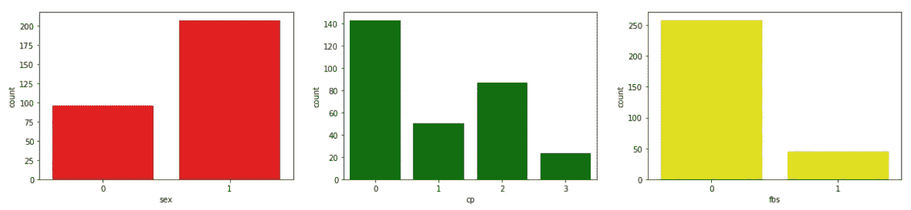

Countplot Feature Sex, CP, FBS.

*   男性患者的数量比女性患者多，甚至是女性患者的两倍。
*   大多数患者的 CP 0 型是典型的心绞痛，最少的是 3 型，无症状。
*   上图显示有很多空腹血糖值低于 120 或 0。

```
#Univariate analysis resting blood pressure (mm Hg) atau trestbps.**f = plt.figure(figsize=(20,4))
f.add_subplot(1,2,1)
sns.distplot(df['trestbps'])
f.add_subplot(1,2,2)
sns.boxplot(df['trestbps'])**
```

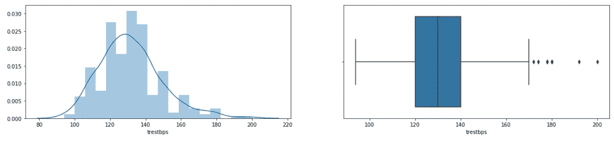

Distplot and Boxplot Trestbps.

*   对于静息血压或 trestbps 的值，大多数数字在 120 到 140 mmHg 的范围内。
*   trestbps 功能有几个异常值。

下一步是制作一个用于预测患者的模型。在这种情况下，我们将使用 KNN 算法。

```
#Create KNN Object.
**knn = KNeighborsClassifier()**#Create x and y variables.
**x = df.drop(columns=['target'])
y = df['target']**#Split data into training and testing.
**x_train, x_test, y_train, y_test = train_test_split(x, y, test_size=0.2, random_state=4)**#Training the model.
**knn.fit(x_train, y_train)**#Predict test data set. **y_pred = log_reg.predict(x_test)**#Checking performance our model with classification report.
**print(classification_report(y_test, y_pred))**#Checking performance our model with ROC Score.
**roc_auc_score(y_test, y_pred)**
```

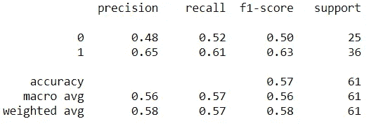

Classification Report

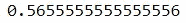

ROC Score

*   从分类报告中可以看出，该模型在精确度、召回率、f1 分数和支持度方面的平均性能为 57%左右。准确度也显示在 57%的数值中。
*   那么对于 AUC 评分，可以看出数值在 56.5%左右。

7 由于性能仍然较低，让我们尝试使用超参数调优来提高模型性能。

```
#List Hyperparameters that we want to tune. **leaf_size = list(range(1,50))
n_neighbors = list(range(1,30))
p=[1,2]**#Convert to dictionary
**hyperparameters = dict(leaf_size=leaf_size, n_neighbors=n_neighbors, p=p)**#Create new KNN object
**knn_2 = KNeighborsClassifier()**#Use GridSearch
**clf = GridSearchCV(knn_2, hyperparameters, cv=10)**#Fit the model
**best_model = clf.fit(x,y)**#Print The value of best Hyperparameters
**print('Best leaf_size:', best_model.best_estimator_.get_params()['leaf_size'])
print('Best p:', best_model.best_estimator_.get_params()['p'])
print('Best n_neighbors:', best_model.best_estimator_.get_params()['n_neighbors'])**
```

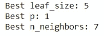

Best Hyperparameters Value

*   从 GridSearch 可以看出，leaf_size 的最佳个数是 5，而最佳距离方法是 Manhattan 或 p = 1。
*   那么 K 的最优个数是 7。

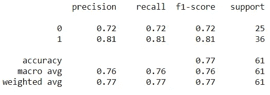

New Classification Report

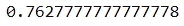

New ROC Score

*   对于所有评估矩阵，使用超参数调整可以将模型性能提高大约 20%到 77%。
*   ROC 值也增加到 76%。

但即使性能提高了 77%，我对我的模型还不确定，我会做一些修改，下周我会分享。我要做的事情之一是使用标准标量重新缩放。

谢谢你读完这个故事，如果有批评或建议，你可以立即评论，如果这个故事是有用的，你可以鼓掌或分享它！