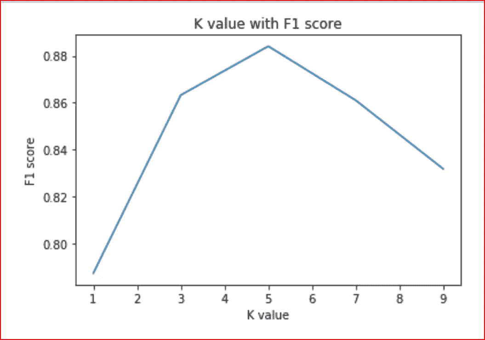
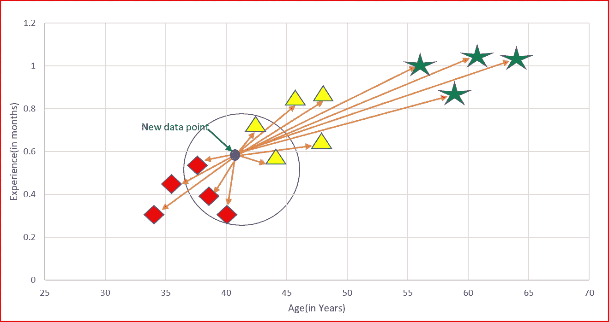
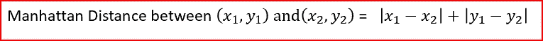
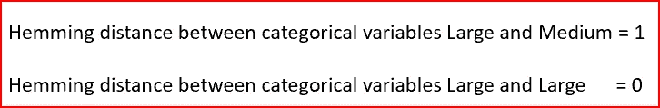
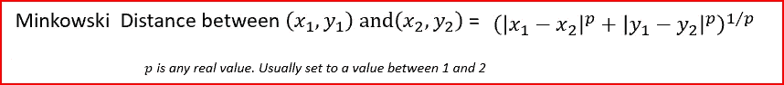
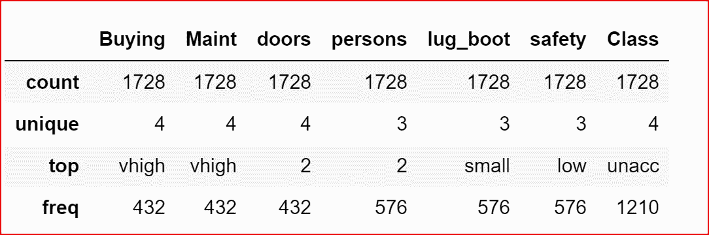
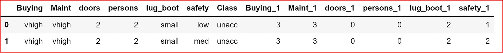

# k-最近邻(KNN)

> 原文：<https://medium.datadriveninvestor.com/k-nearest-neighbors-knn-7b4bd0128da7?source=collection_archive---------1----------------------->

*在本文中我们将了解什么是 K-最近邻，这种算法是如何工作的，KNN 的优缺点是什么。K-means 和 KNN 的区别，最后是一个使用 Python 的 KNN 的例子*

先决条件:[机器学习](https://medium.com/datadriveninvestor/machine-learning-demystified-4b41c3a55c99)， [K-Means](https://medium.com/datadriveninvestor/k-means-clustering-6f2dc458cce8) (好知道)


***什么是 K 近邻？***

K-最近邻是 a

*   **作为目标变量的监督机器学习算法**是已知的
*   **非参数化**，因为它不对底层数据分布模式做出假设
*   **懒惰算法**因为 KNN 没有训练步骤。所有数据点仅在预测时使用。由于没有训练步骤，预测步骤成本很高。热切的学习者算法在训练步骤中热切地学习。
*   用于**分类和回归**
*   使用**特征相似度**预测新点将落入的聚类。

我们举个现实生活中的例子来了解一下。

你搬到了一个新的社区，想和你的邻居成为朋友。你开始和你的邻居交往。你决定选择与你的想法、兴趣和爱好相匹配的邻居。在这里，思维、兴趣和爱好是特征。你根据兴趣、爱好、思维相似度来决定你的邻里朋友圈。这类似于 KNN 的工作方式

***什么是 K 是 K 最近的邻居？***

k 是用于识别新数据点的相似邻居的数字。

参照我们新小区朋友圈的例子。我们选择 3 个邻居，基于共同的想法或爱好，我们想成为非常亲密的朋友。在这种情况下，K 是 3。

KNN 采用 K 个最近邻来决定新数据点属于哪里。这个决定是基于特征相似性的。

***我们如何选择 K 的值？***

K 的选择对我们从 KNN 得到的结果有很大的影响。

我们可以采用测试集，并针对不同的 k 值绘制准确率或 F1 分数。

当 K=1 时，我们看到测试集的高错误率。因此，我们可以得出结论，当 k=1 时，模型过拟合。

对于高 K 值，我们看到 F1 分数开始下降。当 k=5 时，测试集达到最小错误率。这与 [K-means](https://medium.com/datadriveninvestor/k-means-clustering-6f2dc458cce8) 中使用的肘法非常相似。

测试误差率拐点处的 K 值给出了 K 的最佳值。



Plot of K against F1 score for cars database used in python example

我们可以使用 K 倍交叉验证来评估 KNN 分类器的准确性。

***KNN 是如何运作的？***

除了薪水，我们还有年龄和在组织中的经验。我们想预测一个新候选人的工资，他的年龄和经验是可用的。

第一步:**为 K** 选择一个值。k 应该是奇数。

步骤 2: **找出新点到每个训练数据的距离**。

步骤 3: **找到新数据点**的 K 个最近邻居。

步骤 4:对于分类，在 k 个邻居中计算每个类别中的数据点的数量。**新数据点将属于具有最多邻居的类别**。

对于回归，**新数据点的值将是 k 个邻居**的平均值。



K =5\. We will average salary of the 5 nearest neighbors to predict the salary of the new data point

***距离是如何计算的？***

距离可以通过以下公式计算

*   **欧几里德距离**
*   **曼哈顿距离**
*   **海明距离**
*   **闵可夫斯基距离**

欧几里德距离是两点间距离平方之和的平方根。它也被称为 L2 规范。


曼哈顿距离是两点之间差异的绝对值之和



汉明距离用于分类变量。简单来说，它告诉我们两个分类变量是否相同。



闵可夫斯基距离是用于寻找两点之间的距离相似性。当 p=1 时，它变成曼哈顿距离，当 p=2 时，它变成欧几里德距离



***KNN 有哪些利弊？***

## K 近邻的优点

*   简单的算法，因此很容易解释预测
*   非参数的，所以不对底层数据模式做任何假设
*   用于分类和回归
*   与其他机器学习算法相比，最近邻的训练步骤要快得多

## K 个最近邻的缺点

*   KNN 在计算上是昂贵的，因为它在预测阶段搜索新点的最近邻居
*   高内存需求，因为 KNN 必须存储所有数据点
*   预测阶段成本非常高
*   对异常值敏感，准确性会受到噪声或不相关数据的影响。

K-means 和 KNN 有关系还是 KNN 和 K-Means 有区别？

*   KNN 是监督机器学习算法，而 K-means 是无监督机器学习算法
*   KNN 用于分类和回归，而 K-means 用于聚类
*   KNN 的 K 是最近邻的数量，而 K-中的 K 是指我们试图在数据中识别的聚类的数量

***使用 cars 数据集，我们一步步为 KNN 分类器*** 编写 Python 代码

我们将使用 https://archive.ics.uci.edu/ml/datasets/car+evaluation[的汽车数据](https://archive.ics.uci.edu/ml/datasets/car+evaluation)

它有 6 个分类输入变量和一个分类输出变量

我们将运行 KNN 分类器并检查 F1 分数，以[评估模型的性能](https://medium.com/datadriveninvestor/how-to-evaluate-the-performance-of-a-machine-learning-model-45063a7a38a7)。

首先导入所需的库。我们将添加更多的库，因为我们建立 KNN 分类器

```
import numpy as np
import pandas as pd
from sklearn import preprocessing
```

我已经将数据保存在默认的 Jupyter 文件夹中，名为 cars.csv。

将数据读入 dataset_1

```
dataset_1 = pd.read_csv(‘cars.csv’)
```

浏览数据集中的数据并描述所有输入分类变量

```
dataset_1.describe(include=[‘O’])
```



describing Cars categorical input features

通过删除空值来处理丢失的数据(如果有的话)

```
dataset_1 = dataset_1.dropna()
```

我们不能对文本属性运行分类器。我们需要使用 LabelEncoder 转换分类输入特征。LabelEncoder 将分类变量转换成数字。

```
le  = preprocessing.LabelEncoder()
dataset_1['Buying_1'] = le.fit_transform(dataset_1['Buying'])
dataset_1['Maint_1'] = le.fit_transform(dataset_1['Maint'])
dataset_1['doors_1'] = le.fit_transform(dataset_1['doors'])
dataset_1['persons_1'] = le.fit_transform(dataset_1['persons'])
dataset_1['lug_boot_1'] = le.fit_transform(dataset_1['lug_boot'])
dataset_1['safety_1'] = le.fit_transform(dataset_1['safety'])
```

将分类变量转换为数字后，打印前两行。

```
dataset_1.head(2)
```



dataset_1 after applying LabelEncoder

上面的输出显示了分类变量是如何转换成数字的

现在，我们将根据 dataset_1 创建输入要素 X 和输出要素 Y

```
X= dataset_1.iloc[:,[7,8,9,10,11,12]]
Y=dataset_1.iloc[:,6]
```

将 dataset_1 拆分为训练集和测试集。测试集将占数据集 _1 的 40%，训练集将占数据集 _ 1 的 60%

```
from sklearn.cross_validation import train_test_split
X_train, X_test,Y_train, Y_test = train_test_split(X, Y, test_size=0.4)
```

我们现在将创建 KNN 分类器。

我们需要导入***KNeighborsClassifier***因为我们的问题是一个分类问题。对于回归问题，我们使用***KNeighborsRegressor***。

```
from sklearn.neighbors import KNeighborsClassifier
classifier = KNeighborsClassifier(n_neighbors=5, metric='minkowski', p=2)
classifier.fit(X_train, Y_train)
```

这里我们指定了三个参数 n_neighbors=5。这意味着我们将从 5 个最近的邻居中取 vore 用于特征相似性。

新点和数据集中的点之间的距离将使用 minkowski 和 p=2 来计算，因此该距离为欧氏距离。

既然我们已经训练了数据集，我们将适合我们的测试集

```
Y_pred= classifier.predict(X_test)
```

让我们检查一下准确性和 F1_score

```
from sklearn import metrics
print(metrics.accuracy_score(Y_test, Y_pred))
print(metrics.f1_score(Y_test, Y_pred, average=’weighted’)))0.8930635838150289
0.8840592386040468
```

我们可以尝试不同的 K 值，并检查它如何影响准确性和 F1 分数

# 如果你喜欢这篇文章，请鼓掌！