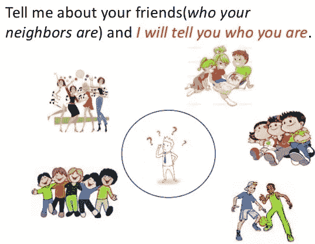
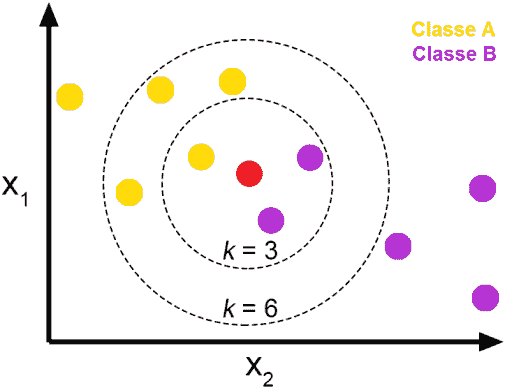
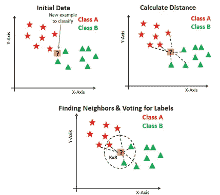
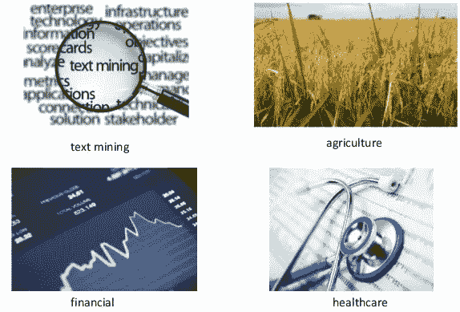

# k 近邻(KNN)算法

> 原文：<https://medium.datadriveninvestor.com/k-nearest-neighbors-knn-algorithm-bd375d14eec7?source=collection_archive---------0----------------------->

## 简介

Simple Analogy for K-Nearest Neighbors (K-NN)

在这篇博客中，我们将讨论最广泛使用的分类机器学习算法之一，即 K 近邻(KNN)算法。K-最近邻(K-NN)是一种简单、易懂、通用的机器学习算法，在许多领域都有应用。

在这篇博客中，我们将尝试了解什么是 KNN，它是如何工作的，在 KNN 使用的一些常见的距离度量，它的优点和缺点以及它的一些现代应用。

# **什么是 K-NN？**

K-NN 是一种**非参数**和**懒惰学习算法**。非参数化意味着对基础数据分布没有假设，即模型结构由数据集决定。

它被称为**懒惰算法**，因为它**不需要任何训练数据点来进行模型生成。**所有训练数据都用于测试阶段，这使得训练更快，而测试阶段更慢且成本更高。

K-最近邻(K-NN)是一种简单的算法，它存储所有可用的案例，并且**基于相似性度量对新数据或案例进行分类**。

# **K-NN 分类**

在 K *-NN 分类*中，输出是一个**类成员**。**一个对象通过其邻居**的多数投票进行分类，该对象被分配到其 *k* 最近邻居中最常见的**类( *k* 是正整数，通常很小)。如果 *k* = 1，那么该对象被简单地分配给该单个最近邻的类。**

为了确定训练数据集中 K 个实例中的哪些与新输入最相似，**使用距离度量**。**对于实值输入变量，最常用的距离度量是欧几里德距离。**

The Red point is classified to the class most common among its k nearest neighbors..

# **欧几里德距离**

*   欧几里德距离是**低维数据集**中最常用的距离度量。它也被称为 **L2 规范**。欧几里德距离是现实世界中测量距离的常用方式。

其中 p 和 q 为 n 维向量，用 **p** = ( *p* 1、 *p* 2、…、 *pn* )和 **q** = ( *q* 1、 *q* 2、…、 *qn* )表示两条记录的 n 个属性值。

*   虽然欧几里德距离在低维中是有用的，但是它**在高维和分类变量**中不太好用。欧几里德距离的缺点是它**忽略了属性之间的相似性**。每个属性都被视为与所有属性完全不同。

# **其他流行的距离测量:**

*   **汉明距离**:计算二元向量之间的距离。
*   **曼哈顿距离**:使用绝对差之和计算真实向量之间的距离。也称为城市街区距离。
*   **闵可夫斯基距离**:欧几里德距离和曼哈顿距离的推广。

# **在 K-NN 算法期间要执行的步骤如下:**

1.  将数据分为训练数据和测试数据。
2.  选择 k 值。
3.  确定要使用的距离函数。
4.  从需要分类的测试数据中选择一个样本，计算到其 n 个训练样本的距离。
5.  对获得的距离进行排序，并获取 k 个最近的数据样本。
6.  根据 k 个邻居的多数投票将测试类分配给该类。

Steps to be carried in KNN algorithm

# **K-NN 算法的性能受三个主要因素的影响:**

1.  用于确定最近邻居的**距离函数**或距离度量。
2.  **决策规则用于从 K 个最近的邻居中导出分类**。
3.  用于分类新示例的邻居的**数量。**

# **K-NN 的优势:**

1.  K-NN 算法非常容易实现。
2.  在大样本限制下接近最优。
3.  使用本地信息，这可以产生高度自适应的行为。
4.  非常容易并行实现。

# **K-NN 的缺点:**

1.  大量存储需求。
2.  计算密集型回忆。
3.  极易受到维度诅咒的影响。

# **K-NN 算法的应用:**

1.  金融——金融机构将预测客户的信用评级。
2.  保健——基因表达。
3.  政治学——将潜在选民分为会投票和不会投票两类。
4.  笔迹检测。
5.  图像识别。
6.  视频识别。
7.  模式识别。

Some Applications of K-NN