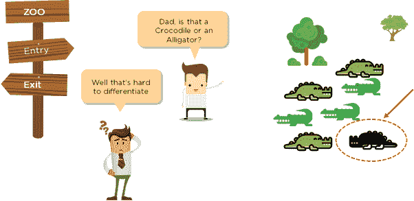
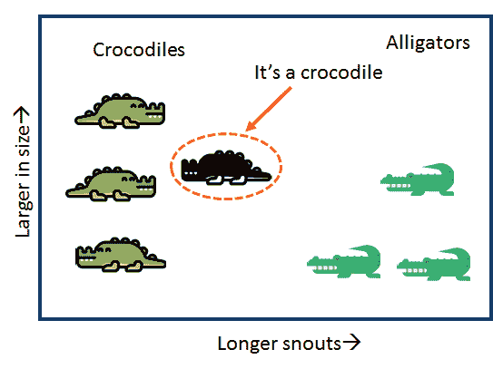

# k 最近的邻居

> 原文：<https://medium.datadriveninvestor.com/k-nearest-neighbours-a3d0024f5405?source=collection_archive---------20----------------------->

Fig1: [https://qph.fs.quoracdn.net/main-qimg-7c205680db327d1736dadfaae3d638ab](https://qph.fs.quoracdn.net/main-qimg-7c205680db327d1736dadfaae3d638ab)

嗨！今天我们将讨论 K 最近邻算法，以及它与我在之前的博客中提到的 KMeans 算法的异同。

## 什么是 KNN？

**KNN** 是一种监督机器学习算法，用于分类和回归问题。考虑图 1 中的问题，KNN 可以帮助我们对未分类的东西是否是短吻鳄进行分类。

KNN 中的“K”是一个超参数，它表示来自特征空间的“K 个最近邻”。这是一种基于实例的懒惰学习，因为计算工作被推迟到分类之后。考虑一个测试数据点，我们计算它与特征空间中存在的所有向量的距离，然后选择最近的“K”个邻居来投票预测测试数据点的标签。一般来说,“K”的值取为奇数，以避免投票中的多数冲突。新的数据点被分配形成多数的标签。当我们说最近邻居时，这里的实际意义是测试点与特征空间中存在的各种数据点的相似性。

例如，假设您必须对特定的动物进行分类，看它是鳄鱼还是短吻鳄，并且您知道短吻鳄的体型较小。当您根据大小绘制特征点时，您会得到下图:

[https://qph.fs.quoracdn.net/main-qimg-c6a1b46c814fd6347dc54750b57fefa8](https://qph.fs.quoracdn.net/main-qimg-c6a1b46c814fd6347dc54750b57fefa8)

因此，你可以很容易地根据新动物与其他动物的大小相似性对其进行分类。

看起来很简单不是吗？但是选择“K”的最佳值可能很困难。

考虑下面的情况:

[https://upload.wikimedia.org/wikipedia/commons/thumb/e/e7/KnnClassification.svg/1024px-KnnClassification.svg.png](https://upload.wikimedia.org/wikipedia/commons/thumb/e/e7/KnnClassification.svg/1024px-KnnClassification.svg.png)

测试样品(绿色圆圈)应归类为第一类蓝色正方形或第二类红色三角形。如果 *k = 3* (实线圆)它被分配到红色类，因为在内圆内有 2 个三角形和只有 1 个正方形。如果 *k = 5* (虚线圆)，它被分配给蓝色类(外圆内的 3 个正方形对 2 个三角形)。

## 如何选择“K”的最优值？

1.  方法 1:将“K”作为“n”的平方根，其中“n”是特征的数量。
2.  方法 2:使用“K”折叠交叉验证或尝试“K”的多个值

“K”的低值可能会有噪声，并受到异常值的影响。

“K”值大是理想的，但也不够大，以至于一个类别的特征很少，会被其他类别否决。

## 如何计算与邻居的距离？

在分类数据的情况下，我们首先需要转换成数值，以便分析距离。然后，我们可以使用欧几里德距离或余弦相似性来识别“K”个最近的邻居。

## KNN 的应用

它广泛应用于异常检测、语义分析和推荐系统。

## KNN 和克曼

在机器学习中，这两种算法经常被混淆。KNN 是一种有监督的机器学习算法，而 KMeans 是一种无监督的算法。在 KNN 中，“K”代表“K”个最近邻，而在 K 均值的情况下，它代表聚类的数量。

关于 KMeans 如何工作的更多细节，请参考我的博客:

 [## 聚类算法

### 顾名思义，集群是形成群体的别名。现在这些组包含可能相似的元素…

medium.com](https://medium.com/@ratikpuri1998/clustering-algorithms-e8b527972fd9) 

我希望这能帮助你开始了解 KNN。想了解更多细节或任何评论，你可以通过 ratikpuri 1998 @*Gmail*. com 联系我。如果你喜欢这个故事，请为它鼓掌！

#机器学习#互联网