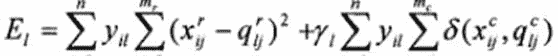
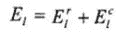

# 混合属性聚类中的 k 原型

> 原文：<https://medium.datadriveninvestor.com/k-prototype-in-clustering-mixed-attributes-e6907db91914?source=collection_archive---------0----------------------->

[](http://www.track.datadriveninvestor.com/1B9E)

Photo by [Fraser Hansen](https://unsplash.com/@fraserhansen?utm_source=medium&utm_medium=referral) on [Unsplash](https://unsplash.com?utm_source=medium&utm_medium=referral)

T **何**世界就是数据的世界。无论我们目光所及之处，我们都能看到数据在每一秒钟都有惊人的表现。数据以数字的形式出现，也以分类的形式出现。机器学习的概念处理从数据中半自动提取知识。它基本上是从一个可能用数据来回答的问题开始的。

机器学习的两个主要类别是监督学习和非监督学习。在这里，我将重点放在无监督学习的概念上，我们从数据中提取一些结构，并由此进行分析。聚类或聚类分析是一种无监督的学习技术，其任务是根据相似性对一组对象进行分组。同一个组或群集中的对象比其他组或群集中的对象彼此更相似。

[](https://www.datadriveninvestor.com/2019/02/18/the-challenge-of-forex-trading-for-machine-learning/) [## 机器学习对外汇交易的挑战——数据驱动的投资者

### 机器学习是人工智能的一个分支，之前占据了很多头条。人们是…

www.datadriveninvestor.com](https://www.datadriveninvestor.com/2019/02/18/the-challenge-of-forex-trading-for-machine-learning/) 

一些流行的数值数据聚类方法和算法如下。

基于代表性聚类-> K 均值聚类算法

层次聚类->凝聚聚类

基于密度的聚类->DBSCAN

谱和图聚类->谱聚类

高斯混合

一些流行的分类数据聚类方法和算法如下。

k 模式算法(高尔相似系数)

压榨机

监狱

GAClast

蛛网算法

搅拌、摇动、点击

仙人掌，酷猫，克洛普

在流行的 K-modes 算法中，距离由两个数据点共享的公共分类属性的数量来度量。

那么，你如何看待同时考虑数值和分类值的数据集呢？上面的方法能行吗？机器如何了解“混合”属性的分组？K 型原型机来了。这是混合属性聚类中 K-Means 和 K-Modes 的简单组合。

**下面是 K 原型算法的简单步骤**

1.从数据集 x 中选择 k 个初始原型，每个聚类必须有一个。

2.将 X 中的每个对象分配到一个其原型与其最接近的集群中。这种分配是通过考虑接下来描述的**相异度度量**来完成的。

3.毕竟，对象已经被分配到一个集群，重新测试对象与当前原型的相似性。如果发现某个对象与另一个集群原型最接近，则更新两个集群的原型。

4.重复 3，直到在完全测试 x 之后没有对象改变它的集群。

如何将对象分配到集群中？这是通过考虑不同的措施。

**相异度度量**

设 X={x1，x2，…，xn}表示一组 n 个对象

Xi = [xi1，xi2，…，xim]每个对象由 m 个属性值表示

首先，X 中的对象被分成 k 个不相交的簇。

那么这个**原型**是什么呢？它是星团的中心。



1–第一组

r —数字属性

c —分类属性

yi1 —对象 Xi 属于群集 1

xi1 —第 j 个属性

聚类 1 中原型的第 qij 第 j 个属性

数字属性的数量

mc —分类属性的数量

m = mr + mc

R1-分类 1 中分类属性的权重

如果 r1 很小，则表明聚类是由数值属性主导的

如果 r1 很大，则表明聚类受分类属性支配

E1=第 1 类中所有元素和原型的差异的最小和

E1r=聚类 1 中所有元素和原型的数字属性差异的最小和

E1c=聚类 1 中所有元素和原型的分类属性的差异的最小和

**算法的实现**

下面是实现 K-Prototype 算法的 5 个简单步骤

1.读取参数

2.初始原型

3.初始分配

4.再（重新）分配

5.程序输出

让我们深入了解一下细节。

**1。读取参数**

在这里读取给定数据库的各种参数。诸如

*总记录数 n

*最大集群数量 k

*每个分类属性的类别数量

*每个属性的名称和类型

*数据库中的属性序列

**2。初始原型选择**

这里随机选择 k 个对象作为 k 个集群的初始原型。

例如，如果 X[i]表示对象 I

对象 I 的第 j 个属性的 X [i，j]值

Prototype_N[i] —是聚类 I 的原型的数字元素

Prototype_C[i] —是聚类 I 的原型的分类元素

**3。初始分配**

数据集 x 的每个对象都被分配到一个聚类中，该聚类与使用先前方法的原型具有最小差异，即相异度。集群原型在每次分配后相应更新。

算法中可用的一些函数如下。

distance()-数值属性的平方欧几里德距离函数

适马()-分类属性与其原型之间差异最小的函数

集群关系[] —对象的集群成员关系

Clustercount [] —集群[i]中的对象数量

SumInCluster[i] —对群集[i]中对象的数字属性求和，并用于更新群集原型的数字属性的值

FrequencyInCluster[i] —记录分类属性的不同值的频率

HighestFreq () —用于获取出现频率最高的分类值，并用于更新原型的分类属性值

**4。重新分配**

这里，必须更新对象的先前和当前集群的原型。当我们运行算法时，控制台显示变量“moves ”,它记录了在该过程中改变了聚类的对象的数量。如果 moves =0，则表明该算法已经获得了最好的结果。

## K 原型集群的简单 python 实现如下。

这里我使用了一个简单的数据集，它是通过 graph API 从脸书提取的。关于在那里实现的细节将单独讨论。下面是包含分类和数字属性的数据集的快照。逗号分隔值分别包括出版商名称、类别分数、类别类型和地名。

```
**240**,**Ransika Fernando**,**0.59375**,**plant**,**No Data
240**,**Ransika Fernando**,**0.04296875**,**outdoor_**,**No Data
240**,**Ransika Fernando**,**0.26953125**,**outdoor_road**,**No Data
241**,**Sachini Jagodaarachchi**,**0.98046875**,**outdoor_mountain**,**Manigala Mountain
242**,**Chathuri Senanayake**,**0.96484375**,**outdoor_mountain**,**Adara Kanda
242**,**Chathuri Senanayake**,**0.1953125**,**building_**,**No Data
242**,**Chathuri Senanayake**,**0.00390625**,**outdoor_**,**No Data
242**,**Chathuri Senanayake**,**0.23046875**,**building_**,**Kuwait
242**,**Chathuri Senanayake**,**0.2578125**,**building_street**,**Kuwait
242**,**Chathuri Senanayake**,**0.015625**,**outdoor_**,**Kuwait
243**,**Nilantha Premakumara**,**0.9453125**,**sky_sun**,**No Data
243**,**Nilantha Premakumara**,**0.75**,**outdoor_mountain**,**No Data
244**,**Chathuri Senanayake**,**0.00390625**,**outdoor_**,**Trincomalee
244**,**Chathuri Senanayake**,**0.6328125**,**outdoor_oceanbeach**,**Trincomalee
245**,**Surangani Bandara**,**0.7734375**,**plant_tree**,**No Data
246**,**Hasitha Lakmal**,**0.4140625**,**people_many**,**No Data
246**,**Hasitha Lakmal**,**0.0078125**,**outdoor_**,**No Data
247**,**Pradeep Kalansooriya**,**0.40234375**,**building_**,**No Data
247**,**Pradeep Kalansooriya**,**0.0078125**,**outdoor_**,**No Data
248**,**Dilini Wijesinghe**,**0.07421875**,**outdoor_**,**Victoria Dam
248**,**Dilini Wijesinghe**,**0.0078125**,**others_**,**Victoria Dam
249**,**Chiranthi Vinghghani**,**0.015625**,**outdoor_**,**No Data
249**,**Chiranthi Vinghghani**,**0.6484375**,**outdoor_waterside**,**No Data
250**,**Janindu Praneeth Weerawarnakula**,**0.671875**,**outdoor_oceanbeach**,**Galle Fort
251**,**Chathurangi Shyalika**,**0.00390625**,**outdoor_**,**No Data
252**,**Chathurangi Shyalika**,**0.9296875**,**trans_trainstation**,**No Data
253**,**Surangani Bandara**,**0.625**,**outdoor_field**,**No Data
253**,**Surangani Bandara**,**0.01171875**,**outdoor_**,**No Data
254**,**Surangani Bandara**,**0.99609375**,**sky_object**,**No Data
255**,**Chathurangi Shyalika**,**0.00390625**,**outdoor_**,**No Data
256**,**Chathurangi Shyalika**,**0.33984375**,**outdoor_field**,**No Data**
```

下面给出的是使用 k 原型算法对上述数据集的分类。

```
#!/usr/bin/env python
import numpy as np
from kmodes.kprototypes import KPrototypes
import matplotlib.pyplot as plt
from matplotlib import style
style.use("ggplot")
colors = ['b', 'orange', 'g', 'r', 'c', 'm', 'y', 'k', 'Brown', 'ForestGreen']#Data points with their publisher name,category score, category name, place name
syms = np.genfromtxt('travel.csv', dtype=str, delimiter=',')[:, 1]
X = np.genfromtxt('travel.csv', dtype=object, delimiter=',')[:, 2:]
X[:, 0] = X[:, 0].astype(float)kproto = KPrototypes(n_clusters=15, init='Cao', verbose=2)
clusters = kproto.fit_predict(X, categorical=[1, 2])# Print cluster centroids of the trained model.
print(kproto.cluster_centroids_)
# Print training statistics
print(kproto.cost_)
print(kproto.n_iter_)for s, c in zip(syms, clusters):
    print("Result: {}, cluster:{}".format(s, c))# Plot the results
for i in set(kproto.labels_):
    index = kproto.labels_ == i
    plt.plot(X[index, 0], X[index, 1], 'o')
    plt.suptitle('Data points categorized with category score', fontsize=18)
    plt.xlabel('Category Score', fontsize=16)
    plt.ylabel('Category Type', fontsize=16)
plt.show()# Clustered result
fig1, ax3 = plt.subplots()
scatter = ax3.scatter(syms, clusters, c=clusters, s=50)
ax3.set_xlabel('Data points')
ax3.set_ylabel('Cluster')
plt.colorbar(scatter)
ax3.set_title('Data points classifed according to known centers')
plt.show()result = zip(syms, kproto.labels_)
sortedR = sorted(result, key=lambda x: x[1])
print(sortedR)
```

希望您对混合属性的聚类有一个简单的了解。