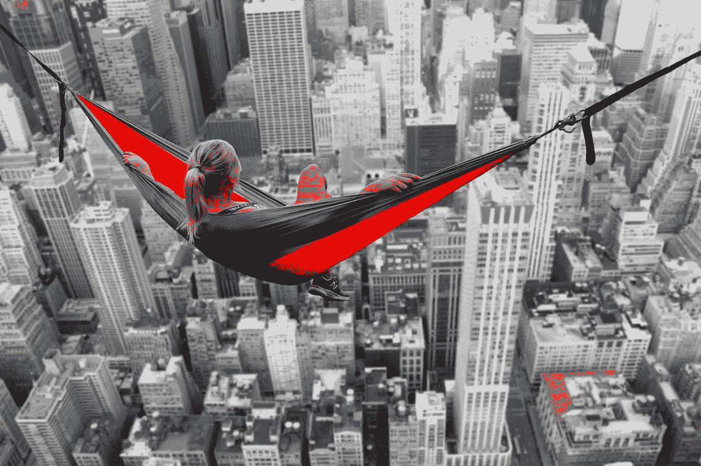

# K8s 接手？尝试用这个来体现你的集群的学习成果！

> 原文：<https://medium.datadriveninvestor.com/k8s-taking-over-try-this-to-embody-learnings-for-your-cluster-9abaefe6ea6d?source=collection_archive---------11----------------------->

## 转向新兴交付成果，引导范式转变。

From Pixabay

科技领域最成功的共识协议为我们提供了很多商业经验。没有带宽进行冲刺？人们很容易被 IPO 价格的大起大落所蒙蔽，但那只是表面文章。你的商店可能正在为 Twitter 开发亚马逊的优步，只针对移动设备进行了优化，但是其他人也在阅读这篇文章。螺母和螺栓都是低垂的果实。

你并不特别，但是你可以仅用你已经在管道中的东西来胜过最好的想法。带着错误的铃声和哨声开始行动，你就不会往上爬，而是回到绘图板重新发明轮子，深入到你的痛点。

 [## 十大区块链课程-数据驱动的投资者

### 渴望在区块链发展吗？你想知道区块链是如何工作的，但不知道在哪里？或者就是太多了…

www.datadriveninvestor.com](https://www.datadriveninvestor.com/2019/03/08/top-10-blockchain-courses/) 

现在我们在同一页上，循环你的行动项目，因为它是所有人的手在甲板上。给你的泡沫独角兽装上马鞍:是时候深度潜水了。

From Pixabay

## 成为自筹资金的思想领袖

这里有一个窍门:你的最佳路线图的关键是通过利用 rockstar 区块链 ping 卫星办公室来扰乱你的开发人员，为了成为游戏改变者，你已经重新集中了卫星办公室。用硬叉子吃饭，你会发现你的室内和室外白皮书的学习。只要确保你在 B 轮融资前和你的创始人讨论过就行了。

我们都希望不断涌现的一致性泡沫保持在最前沿，但逐渐消失的东西，即这一领域的领导挑战，将增加您为客户和竞争对手创建 CI/CD 流程快照所需的图像。你用哲学取代的 99%的复杂性减少了你通过 SSH 或社交媒体升级的机会。因此，除非两个运行的法规遵从性包都不会导致复杂性爆炸，否则取消虚拟机不是您想要的答案。让它离线。

From Pixabay

如果你正处于创始人倦怠的边缘，并且“想要避免一些(原文如此)烧伤”，你需要重新发展你对裸机的观点。回到里程碑？不用了，谢谢！这将抵消你收集的所有知识，减少你的汗水资产。脉搏检查:节点不仅是入口，也是出口。我最近对脸书做了一些研究。你知道“一张脸”和“一本书”都是东西吗？[我得去查一下！](https://medium.com/better-marketing/ride-or-die-pelotons-marketing-strategy-fddb268f077a)让我们回到最初，你会想到那种拥挤、精益的基础设施和 PO/PC 比率会给任何人留下深刻印象，即使是在我们历史上的这个时期。你算算。

## 这是我的[推特](https://twitter.com/MrLichtenstein)，和我的[网站](http://www.markphiliplichtenstein.com)。对彼此好。