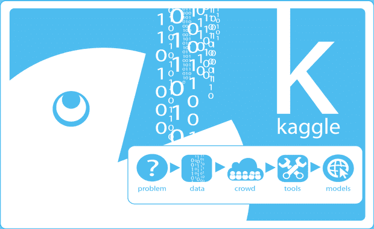
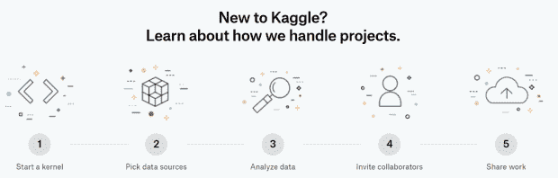

# 面向数据驱动型投资者的 Kaggle

> 原文：<https://medium.datadriveninvestor.com/kaggle-for-data-driven-investors-ed005de31983?source=collection_archive---------30----------------------->

你知道数据科学可以用来帮助保护鲸鱼吗？

随着几个物种的数量急剧下降——有些甚至濒临灭绝，如瓦基塔鼠海豚——成像技术正被用于跟踪世界各大洋中的鲸鱼。

科学家们正在使用照片观察鲸鱼的独特标识符，例如它们尾巴的形状和身体上的标记。

**Kaggle** 最近[发起了一项竞赛](https://www.kaggle.com/c/humpback-whale-identification?utm_medium=social&utm_source=twitter.com&utm_campaign=happywhale-comp-launch)，挑战数据科学家从 [Happywhale 的](https://happywhale.com/)25000 张图片数据库中构建识别鲸鱼的最佳算法。这场比赛只是 Kaggle 为数据科学从业者举办的众多比赛之一，旨在测试他们的技能，帮助推动数据科学领域的发展，并有可能因他们的努力赢得丰厚的现金奖励。

# 什么是 Kaggle？

“世界上最大的数据科学家和机器学习工程师社区的平台”，这是 Kaggle [对自己的描述。Kaggle 归谷歌所有，旨在成为世界上最重要的数据科学家协作环境，通过与充满活力的数据科学家和 ML 工程师社区合作，以及通过自学和实践，提供身临其境的一站式商店来学习和积累该主题的专业知识。](https://www.youtube.com/watch?v=Zm24Dzp1Z4o)

这意味着 Kaggle 对于数据驱动的投资者来说是一个非常有用的工具。

目前，Kaggle 拥有超过 13，000 个数据集，为您提供了一个名副其实的数据金矿。它们涵盖了各种各样的主题——只需快速浏览一下，就能发现最近出版的大量数据集，涵盖了[艺术](https://www.kaggle.com/thedownhill/art-images-drawings-painting-sculpture-engraving)、[气候](https://www.kaggle.com/jsphyg/weather-dataset-rattle-package)、[社会问题](https://www.kaggle.com/russellyates88/suicide-rates-overview-1985-to-2016)和[经济](https://www.kaggle.com/oecd-org/oecd-gdp-by-expenditure-in-constant-prices)。

对于数据驱动的投资，Kaggle 的涵盖金融和投资的[数据集将非常有用。历史加密价格、房价、税收统计和宏观经济数据只是这一类别下提供的一些数据集。](https://www.kaggle.com/tags/finance)

此外，随着其数据世界的不断增长，Kaggle 很可能会为您提供有用的数据，以做出更明智的投资决策——如果不是现在，那么肯定会在不久的将来。

但是如果你看不到你要找的数据，你可以把你自己的数据集发布到 Kaggle 上，并为社区做贡献。

# 但是我们能用这些数据做什么呢？

很多。尤其是如果你精通 Python 和 R，Kaggle 为处理数据和构建数据科学组合提供了一个动态环境。你可以[开始一个你自己的数据科学项目](https://www.youtube.com/watch?v=m2DfpM6MyB8)，或者你可以[探索由社区其他成员创建的](https://www.kaggle.com/explore-projects)项目。

可以说 Kaggle 最有价值的特性是**内核。**这是一个支持协作编码和分析的云环境。本质上，它包含了使您的模型可复制的代码，并允许合作者参与。有 3 种不同类型的内核可用:

*   脚本—按顺序执行代码的文件。您可以用 R 或 Python 来执行脚本。
*   RMarkdown 脚本—执行首选 RMarkdown 代码的脚本—R 和 Markdown 编辑语法的组合—而不是基本 R 代码。
*   Jupyter Notebooks —数据科学家创建和共享代码的流行开源软件，由一系列单元格组成。每个单元格被格式化为 Markdown 格式或您选择的编程语言格式。方便的是，内核允许你从浏览器运行笔记本。

通过从 Kaggle 成千上万公开可用的数据集中进行选择，或者上传你自己的数据，[你只需点击几下鼠标就可以创建你自己的内核](https://www.youtube.com/watch?v=FloMHMOU5Bs)。然后，您可以在内核中使用许多分析功能，比如可视化数据。

内核还使您能够发现一个巨大的开源、可复制代码的数据库，这意味着您可以查看数据科学和 ML 社区正在进行的最新更新。Kaggle [主页](https://kaggle.com/)和[内核列表页面](https://www.kaggle.com/kernels)都提供了已经在网站上发布的内核列表，就高用户参与度或持续受欢迎程度而言，“最热门”的列在最前面。

由于内核是基于云的，您可以在笔记本电脑的浏览器上工作，同时放心地拥有强大的硬件支持(CPU: 4 个 CPU 内核/17gb 内存/ 6 小时执行时间；和 GPU: 2 个 CPU 核心/14gb RAM)。

[来源](https://www.kaggle.com/new-project)

Kaggle 还为那些拥有足够技能的人提供一系列数据科学竞赛。事实上，这种竞赛有可能获得数万美元的奖金，这激励着数据科学专家不仅参与其中，还会成为 Kaggle 社区的活跃成员。

作为一个数据驱动的投资者，为什么不参加[房价竞赛](https://www.kaggle.com/c/house-prices-advanced-regression-techniques)作为实践来提升自己的知识和技能？或者，如果你感觉更有信心，试试[两个适马竞赛](https://www.kaggle.com/c/two-sigma-financial-news)"利用新闻预测股票走势"，有机会赢得高达 10 万美元的大奖？

最终，Kaggle 的社区方面使其成为数据科学发展的沃土。

能够与其他数据科学家和 ML 工程师的庞大且不断增长的社区联系起来解决全球问题是无价的。除了向这些专家寻求建议之外，参与这个社区还为一个人提供了许多发展自己职业网络的机会。

你当然可以回报，把你自己的技能传授给那些想向你学习的人。通过贡献数据科学问题的解决方案、赢得比赛或成为社区的活跃成员，您将能够提升自己的股票和网站的知名度。

最后，对于数据驱动的投资者来说，拥有全面分析数据、利用各种分析工具并与世界各地的许多其他人合作的能力，可能意味着在做出更准确和更明智的投资决策方面取得巨大进展。

*原载于 2019 年 1 月 14 日*[*【www.datadriveninvestor.com】*](https://www.datadriveninvestor.com/2019/01/14/kaggle-for-data-driven-investors/)*。*