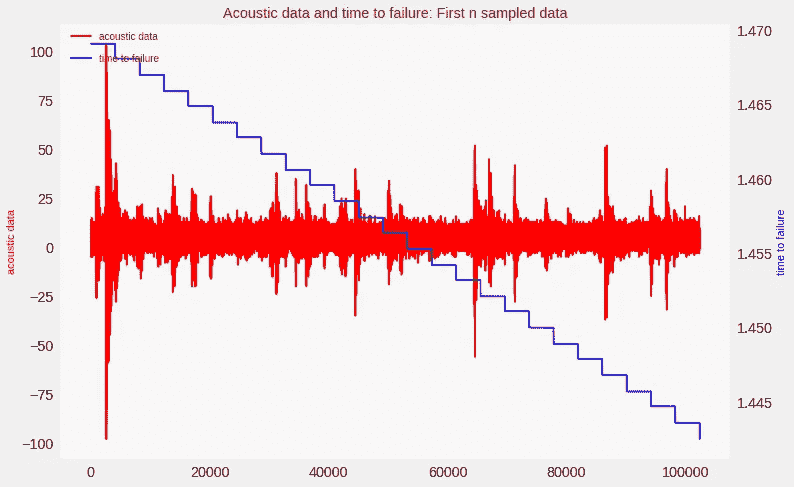

# Kaggle LANL 地震挑战:应用 DNN、LSTM 和 1D-CNN 深度学习模型

> 原文：<https://medium.datadriveninvestor.com/kaggle-lanl-earthquake-challenge-applying-dnn-lstm-and-1d-cnn-deep-learning-models-24206e998651?source=collection_archive---------5----------------------->

[](http://www.track.datadriveninvestor.com/1B9E)

能否尝试用三种不同类型的深度神经网络模型解决同一个问题？我受到了 [Siraj Raval](https://medium.com/u/54526471f9bf?source=post_page-----24206e998651--------------------------------) 的优秀 [YouTube 教程](https://www.youtube.com/watch?v=TffGdSsWKlA)的启发，其中介绍了 [Kaggle LANL 地震挑战](https://www.kaggle.com/c/LANL-Earthquake-Prediction)，并展示了如何使用梯度推进(决策树)和 SVM 回归器为其建立模型。在这里，我展示了我如何修改他的 [Jupyter 笔记本](https://github.com/llSourcell/Kaggle_Earthquake_challenge/blob/master/Earthquake_Challenge.ipynb)并使用 DNN、CNN 和 LSTM 建立模型。修改后的笔记本在[这里](https://github.com/sibyjackgrove/Kaggle_challenges/blob/248940313cea4d5087780962371be993a49ef776/LANL_Earthquake_Challenge_DNN_1D_CNN_LSTM_with_TPU.ipynb)可以买到。

LANL 数据集有点特殊。只有一个特征，即“声学数据”和一个目标输出，即“无故障时间”。但是在训练数据集中有 6.15 亿个样本(一个 9 GB 的 CSV 文件)。

如果您使用下面的代码可视化数据，您会发现“声学数据”实际上是一个序列，每个序列中有 4095 个数据点。序列的“无故障时间”值保持不变。注意，一些序列看起来有一些多于或少于 4095 的数据点。
`#Visualize first 25 sequences + the first datapoint in the next sequence`
`n_samples = 4096*25+1
train_ad_sample_df = train[‘acoustic_data’].values[:n_samples]
train_ttf_sample_df = train[‘time_to_failure’].values[:n_samples]``



## 地震模型 1:密集连接的 DNN(MLP)

在这里，我们使用了 Siraj Raval 在他的原始笔记本中使用的 13 个统计特征。DNN 的代码如下所示:

```
def create_earthquake_MLP_model():
 #Model #1 — MLP
 earthquake_MLP_model = Sequential() # Initialising the DNN
 earthquake_MLP_model.add(BatchNormalization(input_shape = (num_statistical_features,)))
 earthquake_MLP_model.add(Dense(units = 20, activation = ‘relu’))
 earthquake_MLP_model.add(BatchNormalization())
 earthquake_MLP_model.add(Dense(units = 20, activation = ‘relu’))
:
:
 earthquake_MLP_model.add(Dense(units = 10, activation = ‘relu’))
 earthquake_MLP_model.add(Dense(units = 1, activation = ‘linear’))
 earthquake_MLP_model.compile(optimizer = ‘adam’, loss = ‘mse’)
 earthquake_MLP_model.summary() 
 return earthquake_MLP_model
```

如果我们使用 Google Colab 进行训练，最好使用 TPU，因为当训练数据集非常大时，它们似乎比 GPU 工作得更好(根据我的经验)。但是首先，我们需要构建一个 tf.data 迭代器(如果我们想使用 TPU，这是必要的)。

```
def get_training_dataset(batch_size):
 dataset = tf.data.Dataset.from_tensor_slices(
(X_train_scaled,Y_train.reshape(-1,1)))
 dataset = dataset.cache() 
 dataset = dataset.shuffle(1000, reshuffle_each_iteration=True)
 dataset = dataset.repeat() # Mandatory for Keras for now
 dataset = dataset.batch(batch_size, drop_remainder=True)
 dataset = dataset.prefetch(-1) # fetch next batches 
 return dataset # Return the dataset
```

TPU 培训的代码如下。请注意，如果没有选择 TPU 运行时选项，它将使用 GPU 或 CPU。

```
EPOCHS = 500
steps_per_epoch = n_samples//BATCH_SIZE #iterations per epoch
print(f'Iterations per epoch:{steps_per_epoch}')
tpu = Nonetry: # TPU detection
    tpu = tf.contrib.cluster_resolver.TPUClusterResolver() # Picks up a connected TPU on Google's Colab
except ValueError:
    print('Training on GPU/CPU')
if tpu: # TPU training
 strategy = tf.contrib.tpu.TPUDistributionStrategy(tpu)
 trained_model = tf.contrib.tpu.keras_to_tpu_model(trained_model, strategy=strategy)
 print(‘Training using TPU!’)
 history = trained_model.fit(training_input_fn, steps_per_epoch=steps_per_epoch, epochs=EPOCHS) 
else: # GPU/CPU training
 print(‘Training using GPU!’)
 history = trained_model.fit(training_dataset, steps_per_epoch=steps_per_epoch, epochs=EPOCHS)
```

## 地震模型 2: LSTM

由于数据是以序列的形式出现的，LSTM 的可能是一个自然的选择。首先，我们需要创建一个 LSTM 可以接受的训练数据集。为此，我们取声学数据特征的前 n 个样本，并将其重新整形为形状为 ***(样本，序列 _ 长度，1)*** 的张量，其中 ***序列 _ 长度*** = 4095(参见下面的代码)。

```
#Read n samples for training
sequence_length= 4095 
n_sequences = 10000
num_features = 1
BATCH_SIZE = 128 # On TPU, this will be the per-core batch size. 
X_train = pd.read_csv(‘train.csv’,nrows=sequence_length*n_sequences,
usecols =[‘acoustic_data’], dtype={‘acoustic_data’: np.int16})
#Scale input data
scaler = StandardScaler()
scaler.fit(X_train)
X_train_scaled = scaler.transform(X_train)
X_train_scaled = np.float32(X_train_scaled.reshape(-1,4095,num_features))
```

接下来，我们通过在每个序列的末尾(即每 4095 个数据点)提取“失效时间”特征来找到输入数据集。

```
Y_train = pd.read_csv(‘train.csv’, nrows=sequence_length*n_sequences,usecols =[‘time_to_failure’], dtype={‘time_to_failure’: np.float64}).values.reshape(-1,4095,1) 
Y_train = np.float32(Y_train[:,-1,-1]) #Last value at end of sequence
```

接下来，创建 LSTM 模型。请注意，我们只有两个 LSTM 层，后面是两个紧密相连的层。第二 LSTM 层应该仅在序列结束时返回输出，而第一 LSTM 层应该在每个时间步长将输出返回到下一层。

```
def create_earthquake_LSTM_model():
 #Model #2 — LSTM
 print(‘Creating CNN model’)
 earthquake_LSTM_model = Sequential()
 earthquake_LSTM_model.add(LSTM(20, input_shape=(sequence_length,  num_features), return_sequences=True))
 earthquake_LSTM_model.add(LSTM(20, return_sequences=False))
 earthquake_LSTM_model.add(Dense(100, activation=’relu’))
 earthquake_LSTM_model.add(Dense(1, activation=’linear’))
 earthquake_LSTM_model.compile(optimizer = ‘adam’, loss = ‘mse’,  metrics = [‘mse’])
 print(earthquake_LSTM_model.summary())
 return earthquake_LSTM_model
```

创建 TF 数据集和训练的代码与模型 1 的代码相同。

## 地震模型 3:一维 CNN

序列也可以由一维卷积神经网络处理。有趣的是，LSTM 和一维 CNN 使用相同的数据集。创建的一维 CNN 如下所示:

```
def create_earthquake_CNN_model():
 #Model #3–1D CNN
 print(‘Creating CNN model’)
 earthquake_CNN_model = Sequential()
 earthquake_CNN_model.add(Conv1D(100, 10, activation=’relu’, input_shape=(sequence_length, num_features)))
 earthquake_CNN_model.add(Conv1D(100, 10, activation=’relu’))
 earthquake_CNN_model.add(MaxPooling1D(3))
:
:
earthquake_CNN_model.add(Conv1D(160, 10, activation=’relu’))
 earthquake_CNN_model.add(GlobalAveragePooling1D())
 earthquake_CNN_model.add(Dropout(0.5))
 earthquake_CNN_model.add(Dense(1, activation=’linear’))
 earthquake_CNN_model.compile(optimizer = ‘adam’, loss = ‘mse’,  metrics = [‘mse’])
 print(earthquake_CNN_model.summary())
 return earthquake_CNN_model
```

完整的笔记本可以在[这里](https://github.com/sibyjackgrove/Kaggle_challenges/blob/248940313cea4d5087780962371be993a49ef776/LANL_Earthquake_Challenge_DNN_1D_CNN_LSTM_with_TPU.ipynb)找到。感谢阅读，并希望你发现这是有用的。