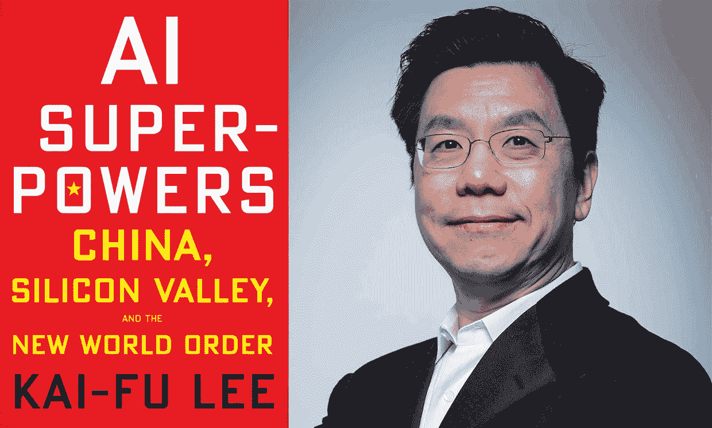
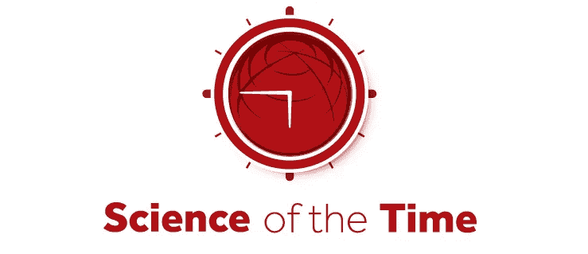

# 李开复

> 原文：<https://medium.datadriveninvestor.com/kai-fu-lee-6130b0affd?source=collection_archive---------24----------------------->

几十年来，李开复一直处于国际人工智能革命的前沿。在离开谷歌成为投资巨头 Sinovation Ventures 的创始人之前，他负责谷歌中国。这家资本公司帮助建设了中国的硅谷:北京中关村。他最近写了*人工智能超级大国，中国，硅谷和新的世界秩序。*在这本书中，他比较了 AI 中国和 AI 美国的力量和未来潜力。中国有一手好牌。

[IEEE Spectrum](https://spectrum.ieee.org/tech-talk/robotics/artificial-intelligence/former-head-of-google-china-foresees-an-ai-crisis)

很长一段时间，两种人工智能方法都在争夺主导地位。在“基于规则”的方法中，人工智能被输入了无尽的规则，以得出智能的结论。当它看到尖尖的耳朵时，它不是猫就是猴子。当它也看到胡须时，猫比猴子更有可能。诸如此类。“神经网络”人工智能主要模仿人脑的分层结构。它没有太多的规则，而是向它的神经网络输入给定现象的无尽样本。例如，国际象棋的走法，或者街景，面孔或者声音。然后，人工智能开始在所有可用的数据中识别模式。通过这种方式，它可以学会识别交通灯、刹车的汽车、你的邻居或将军。这种神经网络方法在很长一段时间内是无效的，因为它需要太多的计算能力。但这已经改变了。人工智能的神经网络方法——也被称为深度学习——现在正在征服世界。谁将领导:中国还是美国？

[analyticsvidhya.com](https://www.analyticsvidhya.com/blog/2018/02/mit-neural-network-chip/)

硅谷显然拥有*先行者*的优势和吸引力。它吸引了最有才华的人工智能天才。但是事情正在改变。现在深度学习 AI 已经搭建扎实，未来十年将大规模实现。在自动驾驶汽车里。在医学诊断中。在国防、教育、营销传播以及其他任何领域。我们没有那么多时间等待下一次突破性的革命(那将是量子计算，但不是再过十年)。我们当前的时代是关于实现深度学习 AI 的。

这个实现阶段不需要顶尖的天才，但是需要一大群受过良好教育的工程师和程序员。工作熟练、训练有素的劳动者。对有着创新想象力的天才的崇敬是西方的典型特征。有纪律的群众是中国的特色。时代似乎有利于后一个国家。

第二个发展加强了这一点。深度学习人工智能的能力随着它可以学习的数据量的增加而增加。俗话说:“没有数据像更多的数据”。在这方面，中国又有优势。手机已经成为最重要的数据来源。中国拥有的数量相当于美国和欧洲的总和。手机也比这里更常用于支付。因此，中国拥有最多的数据点。如果数据是新的石油，中国就是新的阿拉伯。此外，它已经是中国了。

文化因素也有利于中国。硅谷有远见的企业家体现了加州的文化:繁荣并专注于个人和世界的自我发展。脸书想要连接人类。谷歌想要公开所有的知识——并且不作恶。中国企业家从一个完全不同的角度出发。在毛统治时期，他们的(祖父母)三千万人饿死。这就建立了一种强烈的*脚踏实地*的功利主义，与西方的空想热情形成对比。如果胜利是可能的，在中国一切手段都是允许的。包括一些连优步首席执行官卡兰尼克都不敢采取的措施。

中国人的心态也导致了对抄袭的不同看法。在硅谷，这是不被允许的:不是原创！中国人不在乎:只要管用就行。李开复写了中国人工智能竞技场上模仿角斗士相互挑战的故事。最聪明、最顽强的战士会赢，不管胜利是用自己的创造还是抄袭的概念取得的！

尽管如此，中国实际上比以前抄袭的少了。他们建立了一个平行的互联网商业世界，带有强烈的中国特色。优步是西方的胜利，但中国的滴滴出行走得更远。它很快收购了加油站，并开办了自己的维修店，提高了品牌声誉和信任度。优步站在那里看着。几年来，Groupon 在西方做得很好。但其中国同行美团走得更远，在早期阶段就设计了移动支付系统。Yelp 是第一个推荐餐馆的网络巨头。中国大众点评网也这么做，但很快也开始提供送货服务。这三个中国品牌中的每一个现在都比其西方对手更强更大。

李开复的书很好地建议西方对中国表现出更多的谦逊。

*他们从我们这里学到了很多。* **到现在，我们可以从他们身上学到一样多的东西。**

我们是时代的科学。

**作者简介:**
*卡尔·罗德教授博士从事全球未来预测研究——国际酷城狩猎项目。他在阿姆斯特丹、巴塞罗那和上海都有研究职位。他是一位享誉全球的潮流观察家和文化社会学家，以其学术深度和广泛的实证研究项目而闻名。罗德在世界各地举办讲座和演讲——包括学术和商业领域。除此之外，卡尔·罗德还领导着一个由全球市场和趋势研究人员组成的虚拟网络:www.scienceofthetime.com***。时代科学是全球领先的趋势观察和创新研究机构之一，进行最大的国际青年心理趋势研究。**

**你作为一个教育知识机构(大学、理工学院或其他)有兴趣参与国际酷城搜索* [*请点击此处。*](http://scienceofthetime.com/service-title-2/)*

**跟随* [*卡尔罗德上推特*](https://twitter.com/CarlRohde) *和* [*上媒*](https://medium.com/@carlrohde) *。**