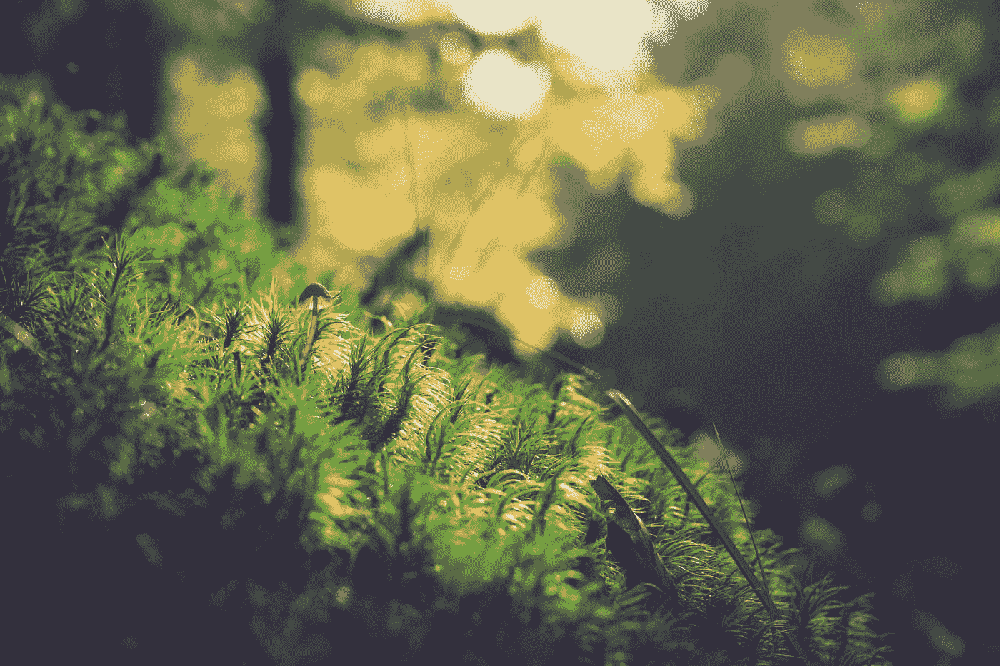
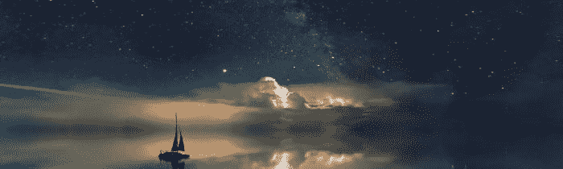

# 保持自然[5 种方法]

> 原文：<https://medium.datadriveninvestor.com/keeping-it-natural-5-ways-da4255eea592?source=collection_archive---------19----------------------->

## 如何在日益人造的世界中正确导航

Photo by [Michael Fertig](https://unsplash.com/@michaelfertig?utm_source=medium&utm_medium=referral) on [Unsplash](https://unsplash.com?utm_source=medium&utm_medium=referral)

> "大自然的一次触摸使整个世界成为一家人."
> ——威廉·莎士比亚

我们人类走得越远，进化的方式越复杂，我们似乎就越迷失在错误的含义、空洞的含义和越来越多的人为因素的迷宫中。

这是一颗有点难以下咽的大药丸，可以用几个例子来更好地解释。

 [## 倦怠耗尽了简单的答案——数据驱动的投资者

### “大多数卫生专业人员知道如何照顾病人，但不知道如何照顾自己。”医疗保健…

www.datadriveninvestor.com](https://www.datadriveninvestor.com/2019/01/15/burnout-exhausts-easy-answers/) 

比如，营销工作变得如此细致和微妙，以至于越来越难区分商业影响和个人影响。社交媒体在很大程度上是罪魁祸首，但老实说，这一切都源于我们渴望消费主义的人类倾向——我们在物质紧迫的背景下培养和积累。但这只是人的本性，并不值得深究，因为它只是意识到这种不可改变的倾向。

我们走向人工的另一种方式在于我们与他人的互动。我们在社交媒体上炫耀自己生活的方式；我们站在不人道的雇主一边，而不是站在普通人一边；我们在材料论证方面取得明显成功的方式，以及我们在品牌识别的基础上形成共同基础的方式。这些都是建立在玻璃基础上的，玻璃基础在内省坍塌之前只能承受这么多重量。

最后一个例子可以在我们日常使用和消费的产品中找到——天然香料现在是一个注册商标的术语；效率要求我们放弃自然，因为它是低效的；致癌物是更便宜、更好、更耐用的原料。我们可以以低得多的成本模拟味道和香味，我们可以将自然界合成为一种非自然的混合物，这种混合物威胁着我们的生物系统，总的来说，威胁着我们的健康。暴利越来越阻碍公正的科学冒险，人类的好奇心在美元符号的重压下慢慢扭曲。

将这几个例子编织在一起，很容易指出一个共同的主题——商业主义。尽管如此，它还不止于此。越来越复杂的通讯方式和近乎即时的信息传递；不可思议的技术进化形式；生活水平指数化。一场完美的风暴正在酝酿中，这场风暴威胁着人们对什么是自然，什么是人类的任何剩余意识。

具有讽刺意味的是，除此之外，我们不一定要担心有没有真正背离人性的自然倾向。尽管我们越来越深地沉浸在人造的神秘水域中，我们仍然坚定地坚持着我们的美德。我们正在揭露企业贪婪的致癌成分，我们正在无休止地辩论面对人工智能，人类意味着什么。换句话说，当我们在这些进化和革命中游泳时，我们对自己做得很好。

当然，我们总是可以做得更好。所有这些噪音，这种媒体和商业主义、技术和物质主义的令人分心的结合——如果我们不小心保持一个路标或带上一个道德指南针，它会让我们危险地转向。那么，我们如何避免迷失方向呢？

保持头脑清醒

无论是现在还是周围的环境。不要在我们找到值得纪念的地方时掏出电话。把一张脑海中的照片看得比装满了无尽照片的虚拟相册更重要。

拥抱生活在现实世界中

而不是在社交媒体中构建的。为自己而活，而不只是在别人眼前。减少外部社会意见的分量。

·重新审视品牌忠诚度，质疑商业主义

我们忠于一个品牌，是因为我们真的，真的，欣赏它的质量，还是因为我们想向别人传递一个信号？我们应该不时地重新考虑我们对商业承诺的信任，不要听信来自公司销售目标的令人信服的奉承。

·保持思维活跃

扩展到第一点，我们应该保持头脑活跃，不断点燃我们的好奇心，而不是在我们想知道的时候简单地查找所有的答案。好奇、思考、想象和同情——这些是我们所拥有的特权。

·批判性思维

我们应该运用远见；回顾与反思；优先考虑价值；考虑什么是长期的满足感，什么不是；透过物质主义的面纱，让我们不再只追随舒适的事物。

像任何事情一样，意识战胜了一切。获得运行整个人类系统的齿轮的概观，而不是从齿轮本身的低视角来看待一切。

事情只会变得更加虚假。随着人工智能从拐角处向我们招手，我们的生物圈日益解体，我们自己与技术的融合——我们慢慢看不到自然生活。

自然生活的真正含义最终取决于我们自己。更加强调现实而不是虚拟现实；寻求与人真正的互动，而不是无偿的交流；生产或消费不含合成物质的产品——这些只是我们保持事物自然的一些方法。

[**读下去:忒修斯之帆**](https://medium.com/the-philosophers-stone/the-sails-of-theseus-f78a904e2063)

Observing reality through the idea of a living universe and acknowledging the force of life