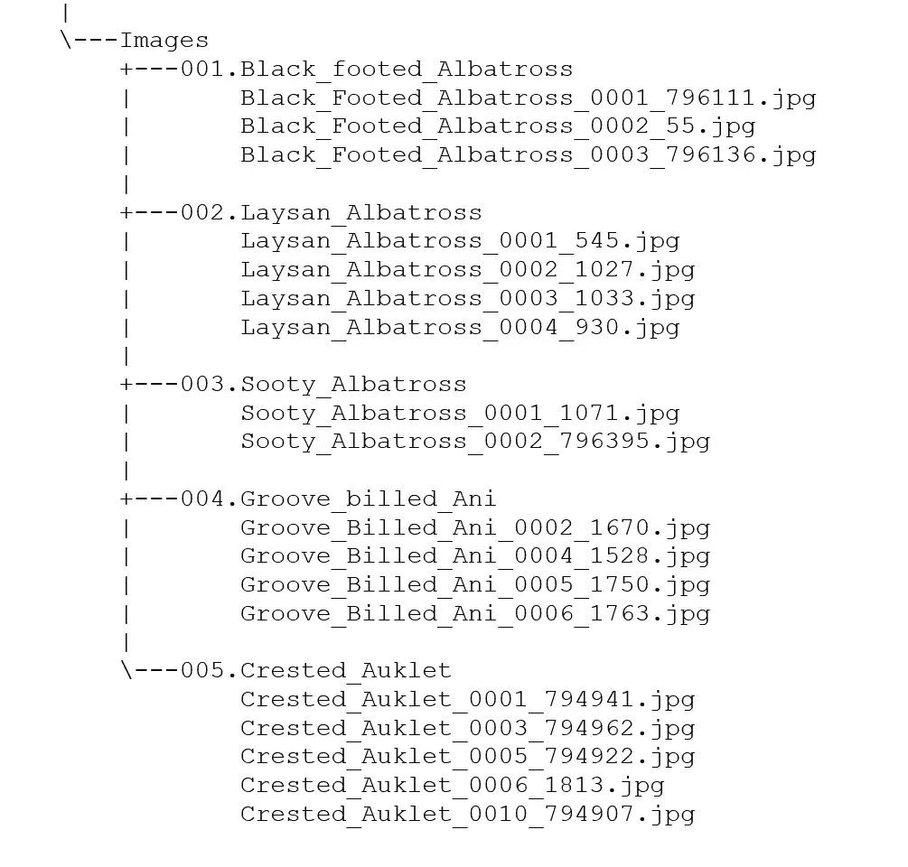
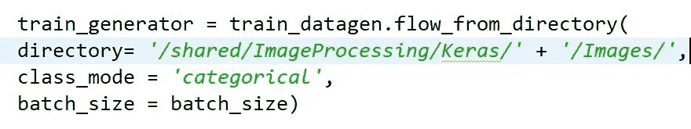
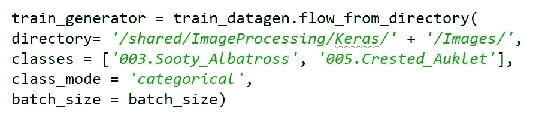
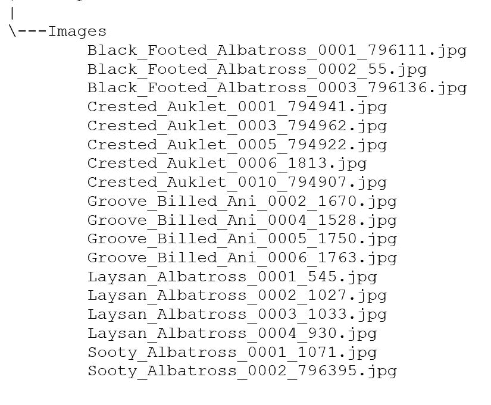
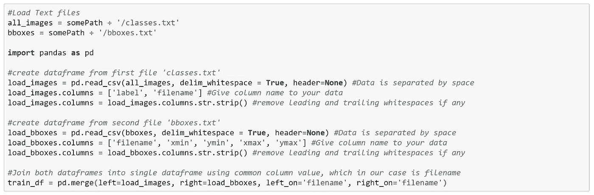
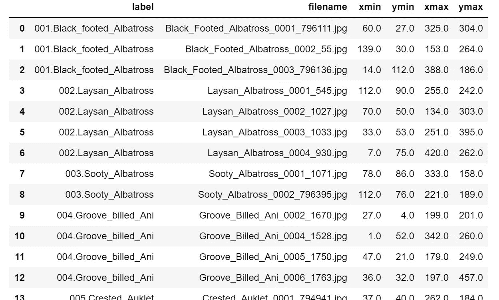
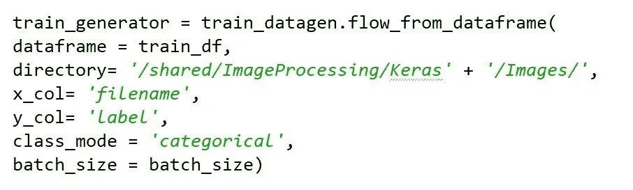
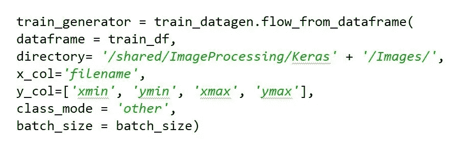
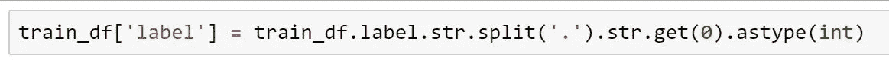
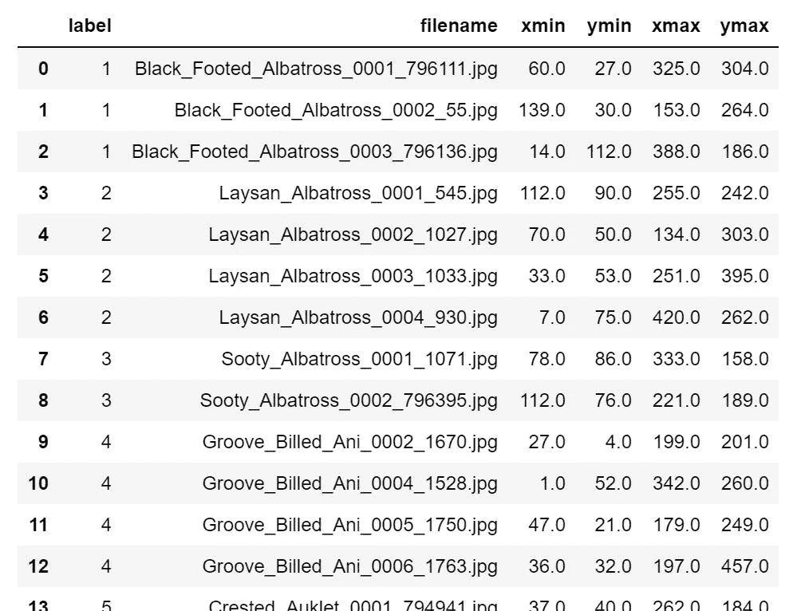

# Keras 图像数据生成器方法:简易指南

> 原文：<https://medium.datadriveninvestor.com/keras-imagedatagenerator-methods-an-easy-guide-550ecd3c0a92?source=collection_archive---------0----------------------->

[Keras](https://keras.io/)

这篇文章/教程将带您了解使用来自 Keras 图像预处理的[**flow _ from _ directory**](https://keras.io/preprocessing/image/)**和[**flow _ from _ data frame**](https://keras.io/preprocessing/image/)**，**的不同方法。下面我们将考虑如何使用 [**ImageDataGenerator 方法**](https://keras.io/preprocessing/image/) **生成批量扩充/归一化数据的不同场景。****

# ****flow_from_directory 方法****

**当图像被分类并放置在各自的类别/标签文件夹中时，这种方法是有用的。这个方法将从文件夹名中自动识别类。对于此方法，要使用的参数有:**

1.  ****目录**值:包含图像子目录(类/标签)的父目录的路径**
2.  ****类**值:应加载图像的类的名称。*如果未指定，将加载所有图像—(可选参数)***
3.  **适合您的需求和型号的其他参数，在这里[不言自明](https://keras.io/preprocessing/image/)**

***下面是目录结构，有子目录(类)和图像文件名(。jpg)***

****

**This directory structure is a subset from [CUB-200–2011](http://www.vision.caltech.edu/visipedia/CUB-200-2011.html)**

**从上面可以看出 ***图片*** 是一个父目录，有多个类别/标签文件夹，恰好是鸟类*(如* ***001)。黑色 _ 高足 _ 信天翁*******002。Laysan _ 信天翁*** *等。)*。在每个类别/标签文件夹中，我们都有相应的图像。在这种设置中，使用 *flow_from_directory 方法*相当简单。***

******让我们来看看 flow_from_directory 方法*** 的两个常见场景***

*****场景 1:加载所有图像*****

***这里我们将*加载所有图像及其类别/标签*(类别/标签将自动从子目录的名称中导出)。我们不需要在方法参数中明确提到类名。下面是这个场景的一个小片段。***

******

***Load all images using flow_from_directory***

*****场景 2:加载特定类别的所有图像*****

***这里我们将只加载特定类别/标签的图像。我们将在方法参数中传递要加载图像的类名。这里我们只载入 ***003 的图片。煤烟 _ 信天翁*** 和***005。Crested_Auklet*** 类。下面是这个场景的一个小片段。***

******

***Load all images for specific classes using flow_from_directory***

# ***流自数据帧方法***

***当*图像仅聚集在一个文件夹*中时，该方法非常有用。换句话说，来自不同类别/标签的图像仅驻留在一个文件夹中。*通常，对于这类数据，会提供一些包含类别和其他参数信息的文本文件*。在这种情况下，我们将使用提供的 [pandas](https://pandas.pydata.org/pandas-docs/version/0.21/generated/pandas.DataFrame.html) 和文本文件创建一个 dataframe，并创建一个有意义的 dataframe，其列具有文件名(**只有文件名，没有路径**)和模型要使用的其他类。对于此方法，要使用的参数有:***

1.  *****dataframe** value:有意义数据的 data frame(*文件名，类列是必须的****
2.  *****目录**值:包含所有图像的父目录的路径。***
3.  *****x_col** value:它将是具有文件名的列(在数据帧中)的名称***
4.  *****y_col** value:它将是具有类/标签的列的名称(在数据帧中)***
5.  ***适合您的需求和型号的其他参数，在这里[不言自明](https://keras.io/preprocessing/image/)***

****下面是目录结构，带有图像文件名(。jpg)****

******

***This directory structure is a subset from [CUB-200–2011](http://www.vision.caltech.edu/visipedia/CUB-200-2011.html) (created manually)***

***从上面可以看出 ***图像*** 是具有多个图像的父目录，而不管它们的类别/标签。在这种设置中，我们使用 *flow_from_dataframe 方法*。为了获得上述图像的有意义的信息，数据集提供了两个(或更多)文本文件，即[***classes . txt***](https://www.dropbox.com/s/pev7ppoyvchod59/classes.txt?dl=0)和[***bbox es . txt***](https://www.dropbox.com/s/rj9g9d1g83l90tw/bboxes.txt?dl=0)**(Dropbox 链接)。我们将使用 Pandas 来创建使用这些文本文件的数据帧。*****

## ****创建数据框架****

****下面是使用上述文本文件创建数据帧的一小段代码:****

********

****Snippet for creating DataFrames using Pandas****

********

****Sample output of resultant train_df dataframe****

*******让我们看看 flow_from_dataframe 方法*** 的三种常见场景****

******场景 1:加载对应类的所有图像******

****在这里，我们将*加载所有图像及其类别/标签*。**我们确实需要**在方法参数中明确提到类名。下面是这个场景的一个小片段。****

********

****Load all images with corresponding class using flow_from_dataframe****

******场景 2:加载对应多个类别的所有图像******

****这里我们将*加载所有图像及其多个类别/标签*。**我们确实需要**在方法参数中用逗号分隔多个类名。下面是这个场景的一个小片段。****

********

****Load all images for corresponding multiple classes using flow_from_dataframe****

******场景 3:加载对应多个不同数据类型类别的所有图像******

****这里，我们将*加载所有图像及其多个类别/标签*。但是问题是列的数据类型是不同的。因此，我们将首先将列转换为类似的数据类型。在数据类型修改之后，**我们需要**在方法参数中明确提到多个类名，用逗号分隔，这对于回归来说是完美的。下面是这个场景的一个小片段。****

****我们将把 *train_df 中的*标签*列转换为 int* ，只保留“.”前的数值(点)。稍后，我们可以参考一个数值来了解图像的类别。****

******

***Changing data-type of label column from string to integer***

******

***An output of train_df dataframe post data-type conversion***

***现在我们的数据框架可以用于回归分析了***

******

***Load all images for corresponding multiple classes with different data-types usingflow_from_dataframe***

> ***我希望这篇文章能帮助你使用常见的 [**ImageDataGenerator 方法**](https://keras.io/preprocessing/image/) 生成批量的扩充/规范化数据。对这篇文章的任何改进都是最受欢迎的。***