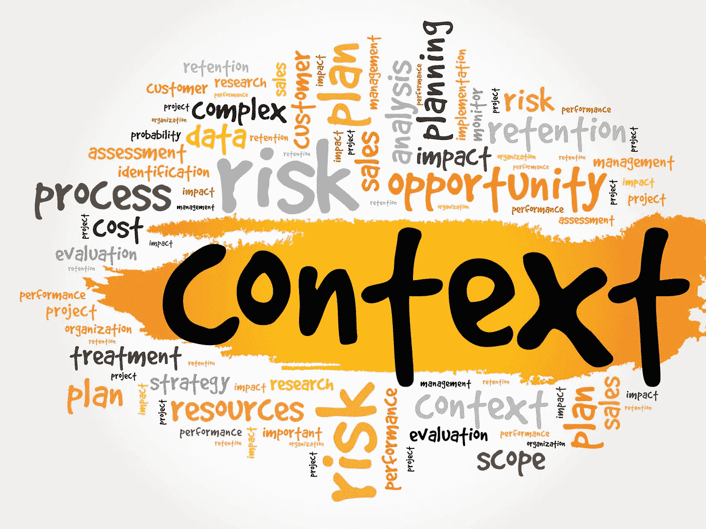
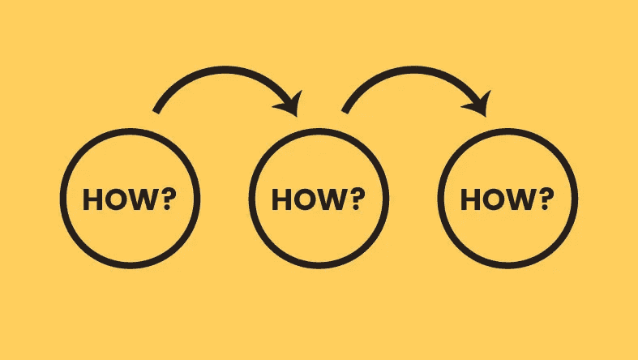

# 用数据讲故事的关键技巧

> 原文：<https://medium.datadriveninvestor.com/key-skills-of-story-telling-with-data-e8e5f7ed1029?source=collection_archive---------23----------------------->

你好，读者们，希望你今天过得愉快，

当我在用数据讲故事的时候。一个想法在我脑海中闪现，描述了为什么不分享讲故事的关键技巧，我不想浪费时间不断重复我们所有的这些定义。所以让我们开始吧，不要浪费任何时间。

# **讲故事**

**问题+数据=故事**

在讲述故事的过程中，问题和数据将发挥同等重要的作用。

如果没有问题或数据，可视化见解就没有任何意义。

# 语境

**上下文**是数据可视化的主要公式，因为它结合了**数据+问题=讲述故事。**

**世卫组织什么**和**如何**是数据可视化最重要的 3 个方面。

**世卫组织**:你要向谁解释问题，例如:经理、团队成员、任何你需要汇报的人等等。

**什么**:你要解决的问题是什么。

**如何**:你将如何解决问题，包括通过数据可视化和结果比较来解决问题。

**推荐**:你需要提交推荐或者你的观点，作为你的最终任务。

**专家提示**:数据可视化并不意味着你只需要获取数据并开始可视化。首先，你需要一支笔和一张纸，写下要实施的背景或分析计划。在此之后，你可以通过从数据中提取洞察力来可视化并最终解释一个详细的故事，从而做出好的决策。

希望你喜欢这个故事。