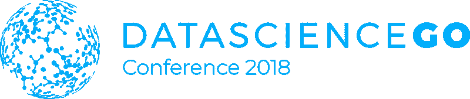

# 从 DataScienceGO 实时流中获得的关键信息

> 原文：<https://medium.datadriveninvestor.com/key-takeaways-from-the-datasciencego-livestream-1ccdd4b8c665?source=collection_archive---------51----------------------->

Image courtesy of Super Data Science

今年我参加了 [DataScienceGO](https://www.datasciencego.com/) 直播。在这篇文章中，我将分享我远程参加会议的主要收获。但是在我们深入探讨之前，让我向您介绍一下这个事件。

data science ego 是一个年度会议，主要致力于帮助人们从事数据科学工作。今年会议的主题是缩小数据科学家供需之间的差距。会议由研讨会、演讲、网络和与志同道合者的一般社交活动组成。这里非常强调社区，但不幸的是，直播观众却被忽略了。大会为现场的参与者提供了三条不同的赛道:从业者、新人、管理者。每一个都为不同的用例提供迎合的内容。直播流包含所有类别的演讲，尽管在线议程中没有明确提到哪个演讲属于哪个类别。

在开幕主题演讲中，该活动的主要组织者基里尔·叶列缅科谈到了市场需求以及这些需求如何不符合数据科学家的需求。尽管数据科学被《T2 哈佛商业评论》评为本世纪最性感的工作。他的主要信息是，我们需要一起缩小这一差距。数据科学家应该更好地关注市场需求，市场应该更好地了解如何在自己的领域应用数据科学，以及实际需要什么能力。我们必须停止寻找数据科学独角兽。

# 成为一名数据科学家需要学习什么？

有几个讲座重点讨论了掌握数据科学所需技能的学习途径。兰迪·劳在题为“掌握基本面”的演讲中阐述了他的观点。他演讲的要点之一是 OSEMN(读作:awesome ),这是单词的首字母缩略词:获取、擦洗、探索、建模和解释。这条路带你从获取数据、清理和转换数据、理解数据、构建和优化模型到最终呈现结果所需的技能。其他有趣的点是数据科学的需求层次(类似于马斯洛)和记住以问题为导向。

Tarry Singh 提出了应用人工智能的五个平台。首先必须掌握统计学和编程等基础知识。其次是数据可视化、分析和相关工具。第三是理解机器学习。第四步是掌握深度学习，最后一步是掌握在医疗保健、制造、汽车行业或航空航天等行业中应用所学技能的技能。你可以阅读刚刚发布的《福布斯》文章中对这 5 个步骤的概述。

Jorge Zuloaga 对这个话题的看法是从人工智能的一点历史开始，慢慢发展到今天的 3 大应用:图像识别、语音识别和推荐系统。他强调了能够弥合业务目标(对话式的和模糊的)和 BI 报告(定量的和精确的)之间的差距的重要性。他补充说，自动化机器学习平台的利用率将会增加。成功解决商业问题的一个技巧是要具体。与其关注客户终身价值的投资回报率，不如着眼于更具体的目标，看看在例如一年的时间里可以节省/增加多少。

# 除了技术能力之外，成功的关键

埃里克·韦伯就软技能在职业生涯中的重要性做了一次很好的演讲。虽然这次演讲是从数据科学家的角度出发，但他提供的技巧是普遍适用的。他定义了软技能由什么组成，为什么需要软技能，以及如何去发展它们。一个有趣的话题是“与首席执行官的一分钟”，他概述了在高管层面谈话时需要关注的要点。我们试图解决的难点是什么，此解决方案与其他解决方案的区别是什么，他们为什么应该信任此模型/解决方案，以及您将如何推销您的想法？

在 2017 年 DSGO 奥运会上，本·泰勒创造了“鲁莽承诺”这个词。今年，Rico Meinl 谈到了那次谈话对他的影响，以及在过去的一年里他是如何决定实践那条指导方针的。这是一个有趣且广为人知的故事，讲述了他如何回到德国开始自己的数据科学会议，学习特定的主题，然后他会站在舞台上在不同的活动中演示等等。最重要的一点是勇敢的承诺，即使是鲁莽的承诺。当你真正致力于一个目标时，大脑会帮你找到解决问题的方法。他的口头禅是:承诺。失败。跟随爱德华·戴明的脚步，不断进步。你可以在[媒体](https://towardsdatascience.com/commit-fail-improve-5c915c33dd86)上阅读他的整个演讲。

> “没有所谓的失败，只有暂时的失败。” *―* 里科·麦尔

本·泰勒今年也举办了一场讲座，即使我没有参加去年的会议，我也能感觉到他在继续上次没有完成的工作。他强调了一个人为了真正脱颖而出需要付出的额外努力。在这种情况下，你想成为局外人。对我来说，三个关键要点是:

*   弄脏你的手——除非你付出实际努力，否则不会有任何收获。
*   努力——找到最大化你努力的方法。
*   准备好超越常规——几乎这个领域的每个人都做过“hello world”类型的教程。做一些特别的事情，让自己与众不同。

# 讲故事的重要性

数据科学项目的优势和最终部署可能取决于以可理解的方式传达项目结果的成败。幸运的是，我们看到了一些关于讲故事和可视化的演讲，以便在这方面有所改进。Kristen Kehrer 谈到了如何通过演示让模型变得栩栩如生。具体地说，我们希望将困惑的利益相关者转变为我们工作的倡导者。她通过对她以前工作的案例研究来探讨这个主题，以及如何以不同的方式来改进信息。关键的要点是思考演示的流程，呈现可操作的结果，推荐后续步骤，熟能生巧。记住要关注模型解决的问题和结果，而不是呈现技术解决方案。请看这篇[的博文](https://datamovesme.com/2018/09/10/effective-data-science-presentations/)了解更多信息。

Nadieh Bremer 展示了令人惊叹的视觉效果和她的数据可视化之旅。她的个人项目分为三个阶段:数据、草图和代码。在决定了一个主题之后，是时候寻找相关的数据了，她给出了许多收集和准备数据的方法。之后，她在纸上画出自己的想象，经常从其他元素中获取灵感。最后，是时候编写解决方案了。她使用 [d3.js](https://d3js.org/) 进行可视化，后来学习创建定制的 SVG 路径。你可以在她的网页上看到这些项目。

Mollie Pettit 对伊利诺伊州的交通停止分析进行了可视化演示。有趣的是，当她在演讲中不断进步时，她是如何展示步骤和细节层次的。对我来说，最大的收获是批判性地解释(中间)结果可能意味着什么，也可能不意味着什么。当你第一次看到结果时，很容易做出草率的结论。此外，我们再次看到了使用 d3.js 的好看的演示和视觉效果。与其他更简单的库或工具相比，用 d3.js 制作视觉效果需要更多的投入和努力，这就是为什么它最适合于 web 上的动态和/或交互式演示。

# 未来是什么样子的？

第二天，Hadelin de Ponteves 做了一个有趣且内容丰富的介绍，但也没有忘记涵盖 AI 更严肃的一面。他浏览了不同用例的当前顶级算法，特别关注深度强化学习，因为它在未来最有潜力。然而对我来说，我认为最重要的一点是他提出了未来需要更好的控制。模型不能再是黑盒，而是我们需要在人工智能方面的透明度和平等对话。

Sinan Ozdemir 从数据隐私和伦理的角度介绍了人工智能的挑战。他举例说明了不同行业面临的挑战，例如刑事司法中使用的有偏见的数据，以及在网络安全领域建立信任。与 Hadelin 类似，Sinan 给出了一些很好的见解，告诉我们在未来可以做些什么来打开黑盒，以便在模型如何执行方面获得更多的透明度。作为一名欧洲人，听到他指出我们在 GDPR 法规等方面如何走在数据隐私的前列，而美国和中国在竞争技术突破方面却落在后面，令人耳目一新。有趣的是，在欧洲，我们似乎更担心我们会因为同样的原因在人工智能领域输给其他大陆。也许我们应该利用我们的优势以及我们在人工智能和数据隐私方面的优势，以便我们为未来做好准备？

还有一个主题为“新兴技术”的讨论小组，成员包括 Mark Skinner(NVIDIA 的高级解决方案架构师)、Rachel Wang(true car 的数据科学经理)、(Ziff，Inc .的首席人工智能官)和世界知名的演讲者、发明家、黑客和企业家 Pablos Holman。我的主要观点是，我们一定不要害怕失败，而是要关注我们能学到什么，以及评估这些资产是否可以转化并重新用于其他有用的东西。如果我们想把失败的风险降到最低，我们应该努力找到正确的问题来解决。当前和未来最受欢迎的技术包括生成式对抗网络、自动驾驶汽车、虚拟现实、云计算和播种机器人！接下来我将回到最后一项。

周六的主题演讲由 Pablos Holman 主持，他谈到了创新和突破性研究。他展示了来自[intelligent Ventures](http://www.intellectualventures.com/inventions-patents/our-inventions)的发明，比如疾病建模、疫苗储存和利用核废料进行能源生产！看到颠覆性创新的可能性以及你如何为让这个世界变得更美好做出贡献，真的很鼓舞人心。这是播种机器人有望在某一天投入使用的地方。帕布罗斯指出，我们需要一种黑客心态和敢于打破规则、遵循自己道路的人，才能达到新的突破。他还强调，技术不能解决我们所有的问题，提到马斯洛的需求层次。

# 结论

总的来说，会议提供了一些有趣的演讲，满足了每个对数据科学领域感兴趣的人的需求。记住这一点很好，我只是通过远程参与会议触及了皮毛。也许明年会有更先进的在线社区讨论和交流解决方案，并为在线参与者提供一个小组/AMA？总的来说，这是一次很好的经历，我可能明年也会参加。这次会议清楚地表明，数据科学的领域是非常广阔的。对于任何渴望从事数据科学职业的人，我会说，最好从你热爱的主题开始，并为此付出努力。精通一件事比什么都学一点点要好，因为这对你脱颖而出没有帮助。你将会有一生的旅程去掌握其他的主题。记住去承诺，失败，改进…重复！