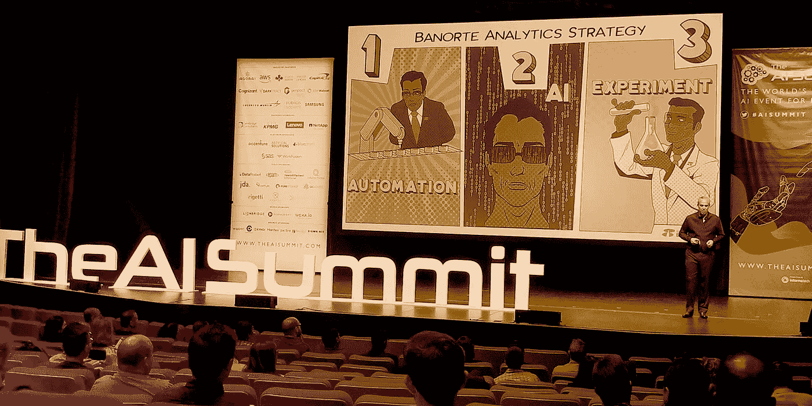

# 今天人工智能领域的关键要点

> 原文：<https://medium.datadriveninvestor.com/key-takeaways-from-todays-ai-landscape-2f004126d20f?source=collection_archive---------3----------------------->

在今年的旧金山人工智能峰会上，渴望学习和分享的人们的交谈声非常明显。为期两天的活动展示了数据和人工智能供应商以及在人工智能产品的利用(和创造)方面取得重大进展的品牌。仅仅是在这次活动中会见来自各行各业的大量公司，就突显出随着技术的成熟，有多少企业正在认识到人工智能的潜力。受到所有学习的启发，我想分享我的主要收获:

# **关键要点**

1.  **AI 是跨行业能力**

许多跨行业的企业(CPG、媒体/娱乐、金融科技、医疗保健等。)正在投资发现人工智能如何提高自己。行业正在意识到人工智能的力量超过了机器人流程自动化(RPA)的能力。在一个消费者根据他们最近的最佳体验来判断而不管它来自哪里的时代，使用人工智能将成为提供服务和个性化的要求。

 [## DDI 编辑推荐:5 本让你从新手变成专家的机器学习书籍|数据驱动…

### 机器学习行业的蓬勃发展重新引起了人们对人工智能的兴趣

www.datadriveninvestor.com](https://www.datadriveninvestor.com/2019/03/03/editors-pick-5-machine-learning-books/) 

**2。****AI 产品的体验设计是所有人的机会**

当前的人工智能产品景观关注于技术方面，因此忽视了产品的可用性。在这方面，人工智能正在像许多其他技术驱动的创新一样取得进展:想法第一，技术第二，在产品差异化概念从“技术能做什么”演变之后，设计/可用性紧随其后到“产品的易用性如何？”有了人工智能，企业仍然专注于产品。像 [design sprints](https://www.moonshotio.com/design-sprint/) 这样的工具可以帮助他们将可用性与产品设计结合在一起，而不是将可用性作为后期的优先事项。

**3。** **人工智能价值链需要战略**

AI 不仅仅是一种技术；这是一个价值链，可以影响企业运营的方方面面，包括它如何为合作伙伴和客户提供价值。对于企业来说，人工智能价值链的规模构成了挑战。他们知道他们组织内部的各种功能都可以被 AI 改变。但他们还不知道人工智能价值链的哪些部分与每个人工智能功能相一致。

**4。** **AI 天赋是很多人的缺点**

大多数公司在试图建立数据、见解和/或人工智能团队时，都感到人工智能领域的技能短缺。最受欢迎的职位是数据科学家和数据工程师。然而，企业需要更好地了解他们是否真的需要这些技能，因为引入的平台需要较少的技术专业知识来设置和获取见解。企业可以确定所需的内部数据/人工智能知识水平的一种方法是，评估企业是否正在将人工智能用于辅助服务或构建人工智能产品。

**5。** **AI 迭代互补**

机器可以(在一定程度上)自我学习——但“机器学习”并不意味着机器像科幻电影所暗示的那样变得高度智能和自我意识。这里有一个简单的类比:人工智能就像一个正在成长的孩子——他们从那些更有经验的人那里学习，就像一个孩子从妈妈或爸爸那里学习，并在他们的周围进行实验。机器学习模型是 AI 的基础，需要用规则和不同的数据集(真实的和合成的)进行训练。随着时间的推移，这些机器学习模型将会成熟，开始与人类一起“思考”，达到更大和越来越可靠的水平。

**6。** **需要一个灵活的 AI 平台**

灵活的平台对于数据科学家和数据工程师高效工作至关重要，尤其是在管理整个数据管道并从中提取价值时。正如我的同事，产品工程和人工智能实践副总裁吴颖·高所说，“在大数据的游戏中，谁能有效地从数据中获得洞察力，谁就能赢。但他们首先需要一种可靠的方式将这些数据转化为资产。这就是人工智能的用武之地。”点击查看吴颖[关于这个话题的更多信息。](https://en.pactera.com/pactai-can-turn-your-data-ai-gold)

**这一切意味着什么——人工智能正在快速进化**

随着数字主导的公司建立人工智能平台，我们将在未来几年看到大量新的应用用例出现。今天的核心用例，如欺诈检测或自动售票，只是触及了人工智能潜力的表面。受益于新的用例，企业(最终)将能够利用目前数据湖中的丰富见解。

为了让消费者认识到人工智能的潜力，企业应该将其应用于造福人类的实用用途——例如提高生产率、增强个性化或简化决策点。当企业想出要解决哪个(现实世界)问题时，他们就可以识别要操作的正确数据，从而获得解决问题所需的洞察力。通过投资人工智能，企业将能够利用人工智能无与伦比的速度、更深的覆盖范围和更广的规模，帮助人们不仅完成可以轻松完成的任务，还可以完成无法完成的任务。

最后，我相信用人工智能解决实际问题的最好方法是为人们创造可爱的体验。怎么会？通过设计以人为中心的解决方案。对于人工智能来说，这种必要性尤其突出。人工智能是一种不经常与可爱联系在一起的技术，也绝对不是以人类为中心的技术，尽管它可能是如此。在我看来，无论你是刚刚开始你的人工智能之旅，还是试图从你的人工智能平台中获取更多价值，这都是完全正确的。我们构建的产品应该为他们服务的人提供可爱的体验和结果，它们越能无缝地融入我们用户的生活方式，我们就做得越好——人工智能有能力智能和准确地告知如何实现这一点，所以我们为什么不利用它呢？