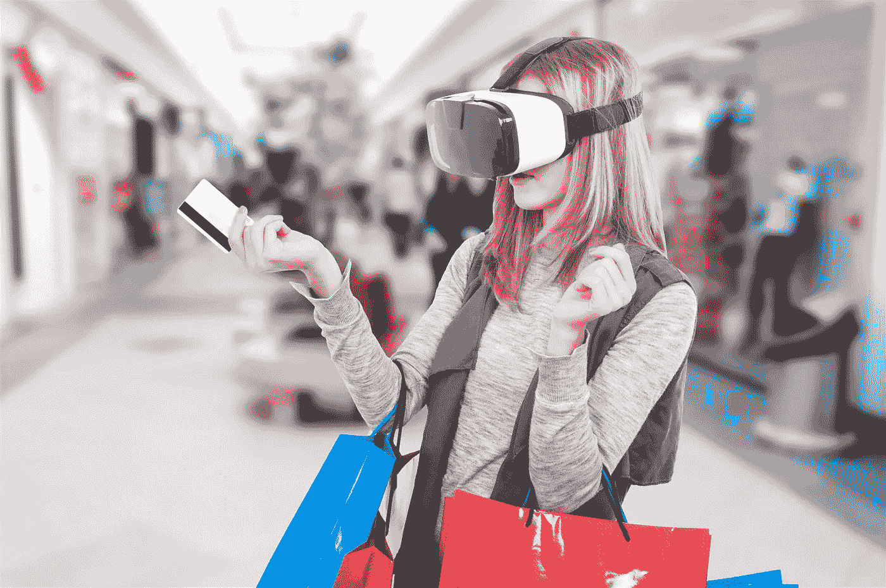

# 关键技术将在 2019 年跨越主要行业成为主流

> 原文：<https://medium.datadriveninvestor.com/key-technologies-will-leap-into-the-mainstream-across-major-indistries-in-2019-2e5f08917f8e?source=collection_archive---------27----------------------->

全球技术咨询公司 DataArt 发布了对 2019 年技术趋势的预测，描绘了将出现显著增长的领域。

> DataArt 总裁*[*尤金·戈兰*](https://www.dataart.com/about-dataart/leadership/eugene-goland) *表示:“2019 年的技术格局将以前所未有的速度发展，推动企业及其领导者创造未来的产业。”*“虽然在过去的十年中，创新有时会让人感觉非常危险，但今年将会看到许多主流企业超越最初的颠覆者，带来将对我们开展业务的方式产生重大影响的变革。”*

*DataArt 的领导团队认为 2019 年有以下趋势:*

## *金融——数字化是当今的词汇*

*   *随着全球开放银行计划现在为授权的金融科技公司提供对客户银行账户的开放 API 访问，2019 年将是真正的数字化最终进入行业的一年。以客户为中心的全渠道产品和服务将开始出现在银行、保险和投资管理领域，这些产品和服务展示了对多种客户角色和旅程的真实理解，构建在领先的数字平台上。这只是个开始，但至少是个开始。现在，在向客户提供数字服务方面，该行业可以开始赶上电子商务、社交媒体和打车。*
*   *从数字货币交易所到加密衍生品合约，加密货币的热潮将会蔓延。加密资产的场外交易将继续其急剧上升的趋势。资产管理公司将越来越多地在他们的投资组合中加入加密资产。与此同时，区块链的分布式账本技术将越来越多地成为一种有益的力量，从劳动密集型的错误百出的流程(如结算、对账和贸易融资)中节省精力、时间和成本。富达对 2018 年所有区块链用例的强烈兴趣和支持；纽交所；纳斯达克；CBOE；CMEJP 摩根、法国兴业银行(以及银行间信息交易所的所有 75 家机构)和许多其他机构将确保 2019 年创纪录。*

## *医疗保健和生命科学——拯救生命的人工智能将推出*

**

**随着人工智能和远程医疗等医疗保健技术趋势不断成熟，我们将开始看到它们融合到整体数据驱动的智能平台中，从而加快医疗保健的交付和精度。”* — [Daniel Piekarz](https://www.dataart.com/about-dataart/leadership/daniel-piekarz) ，SVP，医疗保健和生命科学*

*   *随着项目从测试阶段进入现实世界的整合，人工智能将成为投资者和医疗从业者的主要兴趣。算法将进一步发展，变得更快、更准确。虽然目前，在大多数情况下，人工智能用于试点项目中，尚未部署，但更多的将用于现场场景。到目前为止，只有几家制药公司在其流程中集成了基于人工智能的解决方案，但随着数据(推动基于人工智能的医疗保健向前发展的火车头)的发展，我们将开始看到第一批潜在救命的基于人工智能的解决方案的部署。远程医疗将扩大其覆盖范围。远程医疗系统将从几个试点开始起步，并将为更多人所用，这将对医疗保健标准产生巨大的积极影响，因为在手术中排队变得不那么常见。*

## *媒体和娱乐—“选择你自己的冒险”将成为首选方法*

**

*"*媒体和娱乐公司需要投资实现核心系统的现代化，以支持敏捷、不断发展的业务模式，抛弃传统的工作流程。这一切都是为了将数据放在上下文中，为用户带来有意义的个性化产品。”*——[谢尔盖·布多夫](https://www.dataart.com/about-dataart/leadership/sergey-bludov?utm_source=medium.com&utm_medium=referral&utm_campaign=m-regular&utm_content=da-datadriveninvestor-keytechs)，SVP [媒体&娱乐](https://www.dataart.com/industry/media-and-entertainment?utm_source=medium.com&utm_medium=referral&utm_campaign=m-regular&utm_content=da-datadriveninvestor-keytechs)*

*   *“选择你自己的冒险”将在电视上试用，邀请戏剧、动作和其他系列的观众参与设计符合他们偏好的情节，提供不同场景的选择。这项革命性的技术将动摇娱乐工作的核心。想选出你心目中的电影英雄吗？想选择哪个角色获胜吗？明年，娱乐界将开始试验一项将永远改变我们观看方式的技术。*
*   *体育生态系统将专注于向市场提供更多以粉丝为中心的产品。随着更多的州通过体育博彩法案，一个合法化的赌博市场将完全出现。在 NBA 和 MBL 最近宣布之后，更多的职业体育联盟将与博彩运营商达成数据共享协议。智能服装、人工智能、计算机视觉、增强(和虚拟)现实将推动运动员和球迷的下一代观看和体育场体验，增强数据驱动的体育文化。*
*   *音乐行业正在与价值差距和过时的商业模式进行斗争。技术创新将在建立新的收入模式、数据收集和透明度体系方面发挥至关重要的作用。更广泛地采用音乐识别技术(MRT)将是公平版税分配的下一个前沿。虚拟现实表演和人工智能生成的音乐等新音乐格式将要求版权法和版权管理系统不断现代化。*

## *旅游和酒店*

**

*“在日益成熟的数据分析和普遍数据保护需求的推动下，增强的个性化和安全性之间将达到新的平衡。” — Max Zhdanov，旅游和酒店副总裁*

*   *人工智能旅行解决方案将会飞速发展。我们已经见证了人工智能解决方案在旅游和酒店行业的部署取得了巨大成功，我们预计这一进展将呈指数级增长。该技术能够显著改善客户服务，同时节省人力资源，这使得人工智能非常适合该行业，预计新的创新应用将在 2019 年快速到来。*
*   *自助服务将显著增加，从而带来长期的成功。研究表明，消费者对自助服务解决方案的兴趣越来越大，行业将通过技术的扩展来满足这种发展，消除客户与人交互来完成交易的需要。随着消费者的期望，语音辅助技术将会激增。*

## *零售和分销*

**

**全球零售领袖将大力投资连接实体购物和网上购物。因此，线上到线下的跟踪和归因工具最值得关注*。- [德米特里·巴格罗夫](https://www.dataart.com/about-dataart/leadership/dmitry-bagrov)，英国数据艺术公司董事总经理*

*   *零售商将加大投入，通过在所有渠道——网络、手机、店内、户外、任何地方——提供卓越和高度个性化的购物体验来赢得顾客。*
*   *随着 5G 的引入，个人语音助理将变得更加突出，这将为亚马逊、谷歌、苹果和微软等公司的语音商务带来更快的增长速度。*
*   *语音识别将成为圣杯。我们预测，大多数公司将优先部署语音识别功能，而不是图像识别功能。所有人都将关注语音商务。*

## *区块链*

*   *区块链将改变保险业。我们希望看到这一领域的蓬勃发展，重点是探索“许可的区块链”和智能合同的应用，这些合同旨在解决与检查、控制和协调相关的低效率和延迟问题。*

## *物联网*

*   *设备将变得越来越强大，实现本地数据处理和人工智能功能。它将减少数据传输量和对云的依赖，并为业务提供更大的灵活性和敏捷性。*
*   *边缘计算将对那些需要根据复杂的实时数据分析立即采取行动的行业(制造业、公共安全)以及云连接可能受到限制的行业(航运和物流)产生重大影响。*

## *伊加明*

**

*"*数据分析在保持竞争优势方面将变得越来越重要。合并和合作为更多的定制化创造了新的机会。利用这些数据可以成功测试新模型。”* — [迈克尔·布雷特](https://www.dataart.com/industry/betting-and-gaming/team#michael-brett)，伊加明副总裁*

*   *美国联邦体育博彩禁令的结束无疑创造了巨大的机会，但这股淘金热有其局限性，并不适合所有人。首先，还不清楚哪些州会给体育博彩开绿灯。其次，进入市场的相关成本很高。因此，每个人都希望通过合作或收购获利。规模较小的行业参与者可以选择合作或观望形势如何发展。*

*【www.dataart.com】最初发表于**。***