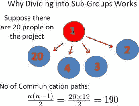
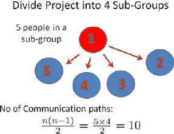
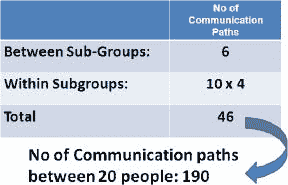

# 项目管理中成功沟通的关键

> 原文：<https://medium.datadriveninvestor.com/key-to-successful-communication-in-project-management-b46a8704ce5b?source=collection_archive---------11----------------------->

> "交流中最重要的事情是听到没说出来的话."彼得·德鲁克

根据 [PMI 研究](https://www.businesswire.com/news/home/20130522006700/en/PMI-Project-Budget-Risk-Due-Ineffective-Communications)无效的沟通会对项目的成功执行产生负面影响。公司在项目上每花费 10 亿美元，就有 1 . 35 亿美元的风险，而这 1 . 35 亿美元中的 7500 万美元(56%)因沟通不力而面临风险，这表明组织迫切需要在企业层面解决沟通不足的问题。

根据计算技术产业协会(CompTIA)发布的[网络民意调查](https://www.computerworld.com/article/2543770/it-management/survey--poor-communication-causes-most-it-project-failures.html)显示，沟通不畅是项目失败的头号原因，资源规划不足排在第二位，而不切实际的截止日期是项目失败的第三大原因。

# **通信客户端开发的关键问题**

如果你知道[五个项目中有一个因无效沟通而失败](http://2020projectmanagement.com/resources/communication-management/communication-the-key-to-successful-project-management)，那么你就意识到了沟通的重要性。项目经理 90%的时间都花在沟通上。他们是项目开发中的关键角色，也是在项目开发的沟通部分负有最大责任的人。

在开发过程的执行阶段，可能出现的第一个问题是信息不完整。您团队中的一名成员知道所有信息，但没有与整个团队分享。他们没有所有的信息，也许不会包括一个重要的功能，因为他们没有完整的信息。另一种可能是，客户提供了所有信息，但项目经理未能与整个团队分享这些信息。为此，项目经理必须将所有信息传递给每个成员，并确保他们在执行的每个阶段都有完整的信息。项目经理正在与来自客户方的 1-3 个人交谈，他们之间的良好沟通非常重要，这样他们就可以将所有信息传递给项目经理，然后由项目经理传递给整个团队。

另一件让团队慢下来或者导致问题的事情是对改变的请求。客户可以意识到他/她想要包括一些特征或者改变现有的特征。他们必须意识到这些变化会导致最终流程交付的延迟。另一件事是项目经理必须与开发人员和测试人员进行沟通。如果是一些结构性的变化，那么会有很多需要改变的地方，团队成员之间会有很多的交流，因为有可能会出错。

客户并不完全确定他/她想要实现什么，这种情况并不少见。他们知道他们想要一些变化或功能，但他们不完全确定它应该是什么样子，或者他们不知道像这样的功能已经实现-放置两个相似的功能是没有用的。项目经理有责任确保客户的愿望得到满足，并且没有不充分的步骤。

最后但同样重要的是客户的反馈。有时，他们只是不要求终端用户提供反馈，也不把它交付给开发团队，或者他们需要太多的时间来交付。这可能会造成沟通不畅，并因重新开发而导致更大的成本。

# **团队内部沟通**

沟通客户——开发团队并不是唯一效率低下的团队，团队成员之间的沟通也是如此。项目经理和团队之间的关系是最重要的——他/她必须理解所有的信息并传递给整个团队。所有步骤都必须清晰，每个人都必须知道自己的职责。为了朝着同一个目标努力，整个团队必须能够看到最终的结果。定期报告项目状态对项目的成功至关重要。

开发人员和测试人员之间可能会发生误解，主要原因是糟糕的文档。测试人员根据规范来验证功能，如果有遗漏或者没有考虑到的东西，每个测试人员都会找出他/她认为正确的东西。在开发人员和测试人员之间的交流中使用 scrum 技术可以解决这个问题——每一个特性都是立刻开发和测试的。

当我们谈论工具时，团队使用项目管理工具并在那里交流是很好的，但是它们必须是一致的。使用太多的工具会导致一个问题，因为一个会在吉拉记录，而另一个会在特雷罗记录。这样你就不会把所有的信息都放在一个地方。还有，避免一路上交流，不写下来。可能会发生这样的情况，你很快解决了一些问题，却没有在你的项目管理工具(PMT)中记录下来，并且忘记了它。把所有的信息都放在你的 PMT 里，这是追踪一切的唯一方法。

如果你在一个小团队中工作，在某个领域只有少数专家，那么像病假这样的意外情况会给你带来大麻烦。当关键开发人员生病，不能在一个项目上工作时，整个过程必须停止。出于这个原因，避免小团队的开发人员，因为他们太依赖于每个团队成员，不能很快取代任何人。

项目开发是一个持久的过程，你可能不会只做一个项目，而是同时做几个项目。在工作的时候，经常会有一个人突然出现并吸引你的注意力。好的项目经理必须处理这些情况，并对开发人员参与的每一个项目给予同样的关注。

# **如何减少一些沟通渠道？**

当你和一小群人交流时，沟通不畅是可能的。但是当你和一大群人交流时，这几乎是不可避免的。随着项目规模的增长，它将涉及更多的团队成员，沟通的复杂性将呈几何级数增长。

在这些情况下，一个关键的解决方案是将团队分成小组。这样，你将会缩小一些沟通线路，从而减少沟通失误的可能性。让我们以一个 20 人的项目团队为例。

Image: [https://www.pmi.org/learning/library/overcoming-communications-complexity-ambiguity-projects-6631](https://www.pmi.org/learning/library/overcoming-communications-complexity-ambiguity-projects-6631)

如上图所示，在这种情况下，您拥有的通信通道数量为 190。如果您将团队分成 4 个小组，您将有 10 条沟通途径:

Image: [https://www.pmi.org/learning/library/overcoming-communications-complexity-ambiguity-projects-6631](https://www.pmi.org/learning/library/overcoming-communications-complexity-ambiguity-projects-6631)

如果你有四个子组，那么一个项目经理需要处理的沟通途径的数量只有六个。

Image: [https://www.pmi.org/learning/library/overcoming-communications-complexity-ambiguity-projects-6631](https://www.pmi.org/learning/library/overcoming-communications-complexity-ambiguity-projects-6631)

总之，通信路径的总数:

Image: [https://www.pmi.org/learning/library/overcoming-communications-complexity-ambiguity-projects-6631](https://www.pmi.org/learning/library/overcoming-communications-complexity-ambiguity-projects-6631)

正如你所看到的，通过这种方式，通信路径的数量要少得多，出错的可能性也低得多。将您的团队分成小组将确保您在沟通中保持顺畅。

# **成功沟通的工具**

1.  团队沟通工具

您应该与您的远程团队保持持续的沟通。你的工作正在进行中，你必须被告知它的阶段。此外，您的产品在开发阶段会发生变化，每次变化都必须在您和您的团队之间进行沟通。最快的方法是使用软件，让你留在圈子里。你可以选择 [Slack](https://slack.com/) 或 [Chanty](https://www.chanty.com/) 等工具进行实时交流。

2.视频会议工具

由于通信是远程团队成功的关键因素，视频通话是不可避免的。如果你想从你的团队经理那里得到一份每日报告或者解决一些突发的问题，你可以使用诸如 [Skype](https://www.skype.com/en/) 、 [Google Hangouts](https://hangouts.google.com/) 或者 [Zoom](https://zoom.us/) 这样的工具来保持联系。您的团队也可以与您共享屏幕，这样您就有了一个已完成工作的可视化演示。

3.项目管理工具

如果你管理一个敏捷的远程团队，这就是项目管理。项目管理工具如[吉拉](https://www.atlassian.com/software/jira)、[特雷罗](https://trello.com)或 [ActiveCollab](http://www.activecollab.com) 允许你组织和跟踪工作。他们让你运行和监控团队，看到他们的进展，通过电子邮件获得更新通知，并分配任务给不同的团队成员。有了这些工具，你将永远拥有所有的信息和团队工作的轨迹。

4.软件开发和设计工具

无论是大型企业还是初创企业，软件开发人员和设计人员都是每个组织的重要组成部分。您可以使用优秀的工具来提高远程开发人员的工作效率。 [Bitbucket](https://www.atlassian.com/software/bitbucket) 是一个针对你的代码的项目管理。它为您的团队提供了一个规划项目、协作编写代码、测试和部署的地方。远程开发团队可以轻松地在功能上进行协作，执行代码审查，并定期推出软件更新。

[InVision](https://www.invisionapp.com/) 是一个产品设计协作平台。构建 UX 原型是不可思议的，在手绘白板上一起工作，与团队分享并收集反馈。

# **结论**

我们做的每一个项目都基于我们与客户和团队内部沟通的有效性。管理层仍然经常认为这是常规项目管理任务中“发生”的事情。然而，没有一个经过深思熟虑的沟通策略和正确的工具，以及详细的信息，你的项目将注定失败。