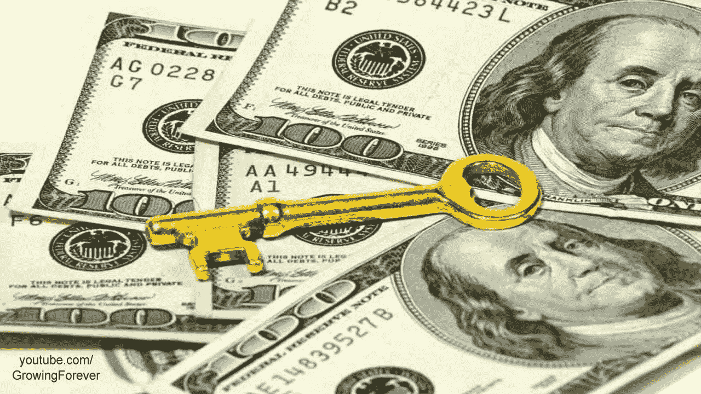

# 成功的关键:正确的钱

> 原文：<https://medium.datadriveninvestor.com/keys-to-success-the-right-money-3cdd722abbff?source=collection_archive---------54----------------------->

初创公司面临着许多挑战，但其中一家确实鹤立鸡群。对于任何读者来说，这种特殊的挑战就是资金，这应该不足为奇。钱是必不可少的，这不是秘密也不是谎言。在我开始在一家初创公司工作之前，我就知道这一点，我相信每个人都知道钱的价值，只要看看 DJ Khalid 的快照故事就知道了——钱是一个主要的关键。然而，我在 Eazel 的经历和我们寻求资金的过程告诉我，虽然钱对一家初创公司来说确实至关重要，但找到合适质量的钱可能比数量更重要。

钱不仅仅是钱。为了找到合适质量的资金，与合适的投资者接触是必不可少的。在我寻找合适资金的过程中，我需要面对合适的人。艺术界很小，有它的好处也有它的对手，所以印象就是一切。参加画廊开幕式，在聚会上闲聊，或者随意交谈都可能成为会见资助者的潜在场所。这很好，然而，这意味着我和我的团队必须时刻保持最佳状态，坦率地说，这很累人。幸运的是，正如本系列前面所讨论的，我有幸与一个极其勤奋和积极的团队一起工作，他们和我一样对我们的产品充满热情。

不幸的是，作为一家初创公司的年轻创始人，找到合适的资金变得更加困难。为了找到合适的资金，不仅要了解风险资本家的世界(这是通过我在科尔比大学的教育和在硅谷银行的工作经历介绍给我的)，而且还要了解更多的经验。随着我在 Eazel 时间的推移，我的经验也在增加。尽管如此，我可以具体地说，在我的融资经历中，始终存在的力量一直是对 Eazel 愿景的投入。

正确的资金来源与你一样对你的创业投资和机会主义，所以克服团队和产品的挑战是必不可少的。对于 Eazel 来说，找到合适的投资者是至关重要的，因为我们的业务不是为了产生即时回报而设立的；合适的投资者应该感兴趣，而不仅仅是被标准所吸引，而是被使命所吸引。一旦我建立了一个充满激情的团队和具体的产品，向真正对我们的愿景感兴趣并愿意与我们合作、提供反馈并最终帮助我们将使命变成现实的资助者推销 Eazel 就变得更加容易了。