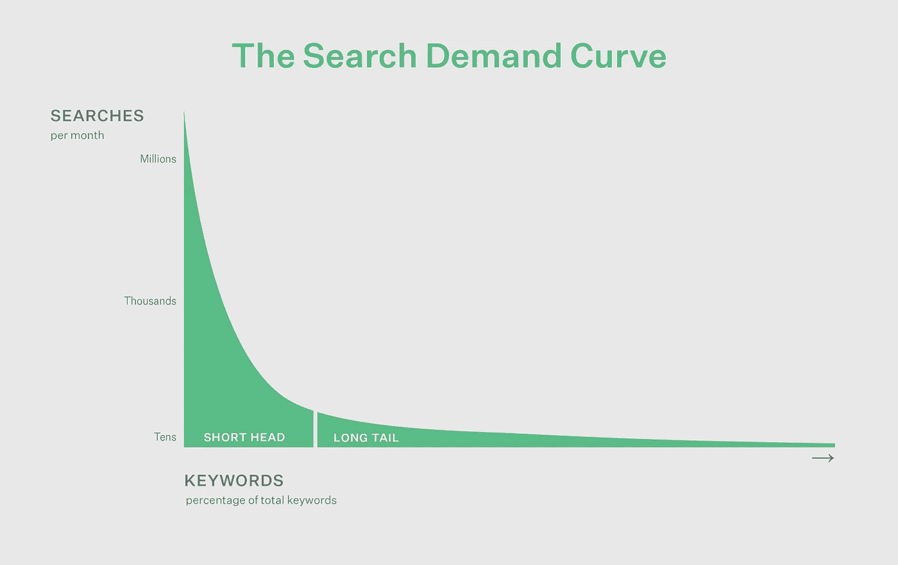
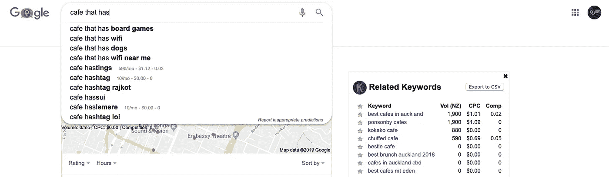

# 谷歌广告的关键词研究——从哪里开始？

> 原文：<https://medium.datadriveninvestor.com/keyword-research-for-google-ads-where-to-start-1a0d373a52b0?source=collection_archive---------5----------------------->

[*This blog was originally published for Springload*](https://www.springload.co.nz/blog/keyword-research-google-ads-where-start/)

关键词研究是任何高效付费或有机搜索活动的基础。但是你需要知道什么才能开始呢？

**想象一下这个场景:**你的父母明天就要来了，而你完全忘记了预订晚餐。你是做什么的？你拿出手机搜索我附近的*餐馆*。现在想象一下，你在搜索的另一方——一个餐馆老板正在寻找座位——难道你不想让你的时髦小酒馆成为他们在搜索结果中看到的第一个地方吗？

# 将您的业务放在 SERP 上

像上面这种情况每天都会发生数百万次。当搜索者正在做一些初步的研究，回顾他们的选择，或者将要做一个决定的时候，在搜索引擎结果页(SERP)上显示你的业务显然是很重要的。靠近顶端的位置增加了搜索者发现你的业务的机会。但是如何在合适的时机获得突出的搜索位置呢？有两种方法:

1.  使用搜索引擎优化(SEO)技术在有机搜索结果中排名。
2.  使用付费搜索广告平台，如谷歌广告，来支付位置。

你甚至可以两样都做。关键词研究对这两种情况都有帮助，但在这篇博客中，我们将主要关注谷歌广告的关键词研究。

如果你需要复习一下谷歌广告，看看我之前的博客[了解谷歌广告](https://www.springload.co.nz/blog/getting-know-google-ads/)。

 [## 2019 年需要关注的 20 个数字营销趋势和技术——数据驱动的投资者

### 展示本周的电子学习模块。做一个终身学习者！关于技术、金融、工作场所的每日剂量…

www.datadriveninvestor.com](https://www.datadriveninvestor.com/2019/02/04/20-digital-marketing-trends-techniques-to-watch-out-for-in-2019/) 

# 从关键词研究开始

关键词研究应该永远是你计划搜索营销活动的第一步。它揭示了用户实际搜索的内容，因此您可以创建内容来直接回答这些搜索查询。如果你在谷歌广告上开展付费搜索活动，关键词搜索有助于降低你的每次点击成本(CPC ),并获得比竞争对手更高的排名。

# 理解相关性、竞争和频率

但是在你开始之前，了解一些关于为你独特的谷歌广告活动选择正确关键词的事情是有帮助的。

## 关联

确保您选择的关键词与您的产品相关，并与您网站上的内容保持一致。广告排名(Google 如何决定你的广告在搜索结果中的位置)的一个主要因素是登陆页面体验。这是用户点击你的广告时到达的页面。

你选择的关键词应该在登陆页面和相关的广告上突出显示。

## 竞争

有些关键词竞争很大，带动了很高的 CPC。这些词可能具有很高的商业意图，意味着用户准备采取行动。例如*在线订购鲜花*或者*我附近的咖啡*。

它们也可能是“短尾”关键词，通常是简短的常用搜索短语，如*运动鞋*或*最新消息*。

因为这些关键词在竞价者中的受欢迎程度，CPC 被抬高了。你需要考虑是否值得在某些搜索词上竞争。

## 频率

你需要选择人们正在搜索的关键词。所以选择搜索量高的词条很重要。但是你不应该总是追求最高音量。预算较少的企业在竞价“长尾”关键词时可能会取得更大的成功。这些关键词更便宜，因为它们的搜索量更低，竞争更少。

例如，对*批量购买有机可乐*的竞价可能会比*购买软饮料*的搜索量少得多。但是如果你提供批发有机可乐，你可能会建立你的关键词列表。

Keywords in the short head have high search volume, and therefore higher competition and price. But as they become longer and more obscure, they’re cheaper to bid on, with search volume and competition declining.

# 建立你的关键词列表

## 从电子表格开始

既然你理解了这些因素，你就可以开始建立你的关键词列表了。有几种不同的方法可以做到这一点，许多工具都有帮助，但我总是从电子表格开始。

首先写下与你的产品相关的所有关键词，记住我的客户会通过什么搜索来找到我？

在这些地方寻找可以考虑的词语:

*   你自己的网站
*   您的 Google 搜索控制台帐户中的搜索词报告
*   谷歌在搜索栏中的建议
*   [关键词无处不在](https://keywordseverywhere.com/)浏览器插件
*   谷歌关键词规划器找到相似的词和短语。

Left: Using Google’s suggestions | Right: The Keywords Everywhere browser plugin

## 搜索量和竞争指标

在工作表中，为搜索量和竞争添加列。这些信息可以在谷歌的关键字规划工具，关键字无处不在，和其他第三方工具。这些帮助你了解每个关键词的频率(搜索量)和竞争情况。请注意，这些发现应该被认为是一般的，大概的估计。

## 扩大你的关键词研究

对于广泛的关键字研究，您可以在关键字规划器中导出关键字和指标的完整列表。通过将这些列表聚合到一个电子表格中，并使用过滤器控件将它们组织到主题中，您可以构建一个搜索主题的主列表，为您的内容和 SEO 策略提供信息。我特别推荐这种方法给那些希望一开始就有大笔预算的人。

# 为谷歌广告选择正确的关键词

现在你已经有了相应数据的列表，选择你想关注的内容。上面列出的因素将指导你——相关性、竞争性和频率。

## 保持预算紧张

如果你的预算不多，就寻找低竞争、高相关性的关键词。

长尾关键词通常符合这些条件，利用利基或与你的业务相关的独特价值。如果你在卖二手白色家电，不要试图排在*买冰箱*的前面，靠进你的利基市场，用*买二手冰箱*来说你的顾客的语言。

## 或者，用更大的预算

有了更大的预算，你就不需要太担心竞争，但你仍然要考虑高相关性，高容量的关键字。

相关性在这里是至关重要的，因为出价高于竞争对手并不一定会导致排名高于他们。谷歌更喜欢高质量、高相关性的广告。尽管与处于你产品边缘的受众建立联系很有诱惑力，但这极不可能带来投资回报，而且会影响谷歌广告的质量分数。一家海鲜餐馆不应该为了改变某人的晚餐计划而投标我附近的*墨西哥餐馆*。

## 不要忘记负面关键词

在你的研究过程中，你可能会遇到一些与你的产品无关的关键词。不要忽略这些。

同样重要的是建立你的负面关键词列表来过滤掉不想要的点击。当某个词或短语出现在搜索查询中时，你的负面关键词列表会告诉谷歌广告不要显示你的广告。

如果你销售高端高尔夫球杆，你可能会想在你的负面关键词列表中添加像*便宜、免费、租用、出租、*和*折扣*这样的词。这阻止了人们点击你的广告，意识到它太贵，并迅速离开——浪费点击意味着浪费广告支出。

# 投入时间

所以你在想:*“这可能需要一段时间，我甚至还没有开始写广告或建立账户！”*

你花越多的时间研究关键词，建立和完善你的列表，你得到的价值就越大。从长远来看，前期的时间成本是值得的——无论你是在用小预算寻找长尾关键词，还是一家大公司试图用一个广泛的列表来覆盖你的基础。一个好的列表将会降低你的点击费，提高你的质量分数，并为你的内容和营销策略提供信息。

## 研究关键词，定期

让关键词研究成为你营销策略的一部分，每六个月重新审视一次。如果你的业务是季节性的，你可以以较小的增量更频繁地这样做。根据您的业务需求做出最佳判断。

# 应用你的关键词研究

该表现在可用于各种后续步骤:

*   你可以用它来开始构建你的谷歌广告账户
*   通知你的网站内容决策，以提高搜索引擎优化
*   为新的网站内容，甚至是为你的企业提供的新产品出谋划策
*   深入了解客户的说话方式
*   衡量对你提供或正在考虑提供的产品的需求。

# 需要帮助吗？

如果你正在努力设置，或者只是没有时间——spring load 可以帮助你。要了解我们在谷歌广告账户管理方面的更多服务，[联系](https://www.springload.co.nz/contact/)。

[*这个博客最初是为 Springload 发布的。*](https://www.springload.co.nz/blog/keyword-research-google-ads-where-start/)