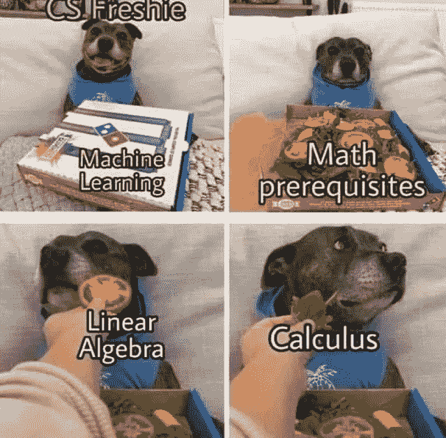
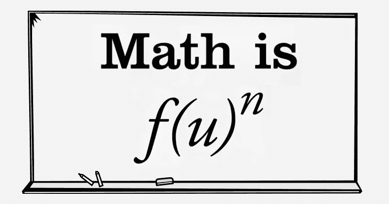

# 从数据科学开始

> 原文：<https://medium.datadriveninvestor.com/kicking-off-in-data-science-e4e1a8683aa8?source=collection_archive---------2----------------------->

Source: [http://www.marketreportgazette.com/wp-content/uploads/2019/08/Data-Science-and-Analytics-market.jpg](http://www.marketreportgazette.com/wp-content/uploads/2019/08/Data-Science-and-Analytics-market.jpg)

数据科学家是 21 世纪最性感的工作。数据科学的声誉正呈指数级上升，预计在未来几个月(我相信是几年)会变得更受欢迎。

> 那么，你如何从数据科学开始，并在当今最性感的技术领域发展基本技能呢？

我不是数据科学方面的专家，我原本是一名计算机科学工程师，对数据科学充满了热情(因为我会经常使用数据科学这个词，所以我们就称它为 DS)。DS 都是我自学的(我会在这篇文章里告诉你怎么学的)。我是这一领域的持续学习者，我写这篇文章是为了帮助那些想赶上 DS 列车，但仍然不知道如何做的人。自从我[在 LinkedIn](https://www.linkedin.com/posts/souha-gaaloul_dataabrscience-womenabrinabrengineering-empoweringwomen-activity-6607605920937586688-8Z4c) 上发表了我在 [Zindi](https://zindi.africa/) 举办的由 IEEE 举办的[数据科学竞赛](https://zindi.africa/competitions/sea-turtle-rescue-forecast-challenge/leaderboard)中获得第三名之后，我收到了大量的信息，询问我如果你不是专业的话，如何培养 DS 技能。在本文中，我将根据我阅读的几篇文章和我自己的经验，为您提供一个进入 DS 世界的起点。

因此，如果您不喜欢在移动应用程序或 web 应用程序中创建按钮和表单，如果您不热衷于处理 web 服务器、HTML 标签等(无意冒犯那些喜欢这样做的人，这是一个品味问题)，如果您喜欢摆弄数据，喜欢建立统计模型来解决现实世界的问题，那么这篇文章就是为您准备的。

附注:我确保大部分材料都是开源的，每个人都可以使用。*全民数据科学！*只需点击链接，就能找到材料。

我会告诉你不要担心，这并不像统计模型这个词看起来那么可怕。我按照我认为应该具备的技能进行排序，从构建基础到完成一个漂亮别致的屋顶，只有当你有一个良好的基础时，这个屋顶才会坚固，所以我建议你按照排序进行。但是，如果你出于某种原因时间紧迫，你可以*立即*跳到数据科学课程，但你*必须*回到其他技能，因为这些技能不仅对成为数据科学家至关重要，而且是最好的数据科学家之一。我希望你喜欢你的阅读并发现它是有帮助的。

附言:你可以关注 DataCamp 上的这个[职业数据科学家专题，它将向你介绍我将在本文中提到的几乎所有基本要素，共有 26 门课程。](https://www.datacamp.com/tracks/data-scientist-with-python)

# 编码技巧

要开始你的 DS 之旅，你必须有基本的编码知识，并且你必须掌握至少一门面向 DS 的编程语言。至于面向 DS 的编程语言，有很多:Python、R、Julia、Scala 等等。但是我最喜欢的(也是基于[这篇文章](https://businessoverbroadway.com/2019/01/13/programming-languages-most-used-and-recommended-by-data-scientists/)的大多数数据科学家的)当然是 PYTHON！[根据栈溢出](https://stackoverflow.blog/2017/09/06/incredible-growth-python/) Python 是**发展最快的主要编程语言。**

Source: [https://stackoverflow.blog/2017/09/06/incredible-growth-python/](https://stackoverflow.blog/2017/09/06/incredible-growth-python/)

哇！对！Python 现在是 IT 中最有价值的技能之一，也是 DS 中的必修技能。

因此，如果你对 Python 知之甚少或一无所知，没关系，你会很快赶上，因为与我学过的其他编程语言(C、C++、PHP、Java 或 R)相比，Python 的语法是最容易学的。所以不要害怕。你可以从简单但有效的课程开始，比如 W3schools 的课程，或者如果你喜欢视频讲座，试试 DataCamp 或任何你喜欢的资源。

我也鼓励你参加 [Hackerrak 30 天编码挑战](https://www.hackerrank.com/domains/tutorials/30-days-of-code)并选择 Python 作为编程语言。这将有助于您发展解决问题的技能以及 Python 知识。

因为仅仅写代码是不够的，你还必须写干净、可读和有效的代码，我认为你应该做的另一件事是获得数据结构的良好知识。知道什么时候使用什么结构以及为什么使用是非常重要的。为此，你可以参加名为[算法工具箱](https://www.coursera.org/learn/algorithmic-toolbox/home/welcome)的课程，也可以阅读这本书:*通过编程和解谜学习算法*因为最好的学习方式是边玩边学！

# 一些统计和数学知识

有些人即使听到“数学”或“统计学”这个词也会感到迷惑，如果你是这种情况，我推荐你读一本叫做*的书，这本书有助于用真实世界的例子解释统计学和数学之谜。我刚开始读它，我喜欢它！*

*对于每个数据科学家来说，Kaggle [统计上也有这个有用的内核。](https://www.kaggle.com/vipulgandhi/statistics-for-every-data-scientist)*

*我还推荐我目前在 Coursera 上学习的一个专业，名为[机器学习数学专业](https://www.coursera.org/specializations/mathematics-machine-learning?)，重温你的高中或大学数学知识，弥合那些奇怪而复杂的公式与它们在机器学习中的应用之间的差距。*

*你不必成为下一个高斯或毕达哥拉斯。关键是要熟悉数学和统计公式和概念，因为你在学习机器学习课程时会遇到它们，它们实际上是其中必不可少的一部分，所以理解它们会很好。*

**

*Source: [https://www.studymumbai.com/wp-content/uploads/math-is-fun.jpg](https://www.studymumbai.com/wp-content/uploads/math-is-fun.jpg)*

# *数据库管理和数据技能*

*正如你将在许多工作机会中看到的，SQL 知识是必须的。这并不奇怪，因为作为一名数据科学家，你需要处理存储在数据库中的数据。所以，从在 [W3schools](https://www.w3schools.com/sql/) 或 [DataCamp](https://www.datacamp.com/courses/intro-to-sql-for-data-science) 上学习 SQL 开始吧(这只是一个 SQL 入门课程，所以如果你选择了这门课程，我建议你再找一门专注于连接和高级 SQL 查询的课程)。*

*之后，你可以参加一个更面向 DS 的课程，比如:[Coursera 上的数据争论、分析和使用 SQL 的 AB 测试](https://www.coursera.org/learn/data-wrangling-analysis-abtesting/home/welcome)。*

# *最后，数据科学！*

*我在 DS 的旅程是从参加[著名的 Coursera 课程机器学习开始的，该课程由伟大的吴恩达在斯坦福在线开设](https://www.coursera.org/learn/machine-learning)。本课程将通过专注于建立如何处理机器学习问题的直觉，向您从头到尾介绍机器学习的基础知识。它并不专注于编程技能，因为该课程是在 Octave(它是 Matlab 的开源双胞胎)中教授的，而是致力于建立对机器学习是什么、其类型、在哪里使用以及如何评估的深刻理解。我认为这是一门好的课程。*

*之后给你推荐一个不是免费的，但是很值得的课程，就是:[Udemy](https://www.udemy.com/course/the-data-science-course-complete-data-science-bootcamp/)的 Python 数据科学 Bootcamp。这个训练营很棒，因为*

1.  *它用的是 Python Yey！*
2.  *它在最初几周向您介绍数据可视化，这在数据科学中是必不可少的。*
3.  *使用 Pandas 和 Scikit-learn(这两个都是基本的和非常有用的 Python 库)来清理和理解数据会让您的手变脏。*
4.  *它几乎涵盖了所有类型的算法，介绍了 NLP(自然语言处理)、大数据甚至深度学习(使用 Tensorflow)。*

*整个套餐！是的，我认为上这门课会帮助你决定你更喜欢研究什么样的问题，它会让你对 DS 和 ML 有一个更实际的看法。*

*正如我所说，这个课程不是免费的，但它是值得的，你可以在 edx 或 Coursera 上找到免费的替代课程。*

*我也推荐你读一本书(如果你是一个书迷的话)，书名是[用 Scikit-Learn & Tensorflow](http://index-of.es/Varios-2/Hands%20on%20Machine%20Learning%20with%20Scikit%20Learn%20and%20Tensorflow.pdf) 进行机器实践学习。*

*之后可以学习 Tableau 或者 PowerBI 之类的数据可视化工具。我参加了 [*Udemy 的课程 Tableau 10 A-Z:数据科学实践 Tableau 培训！*](https://www.udemy.com/course/tableau10/)*

*你可以学习非常需要的大数据工具。我推荐 IBM 专业化认证的[高级数据科学](https://www.coursera.org/specializations/advanced-data-science-ibm)。我参加了专业化的第一门课程，正如你可以从 IBM 课程中所期待的，它非常好，所以我也计划参加专业化的其他课程。*

*如果你愿意，你可以深入研究深度学习算法。Coursera 上有几门很好的课程。*

****P.S*** :关于课程可以在网上搜索；你可以找到奖学金例如，Udacity 不时提供奖学金，Udemy 提供减免，如果你搜索互联网*或*你可以找到一些免费课程，你可以尽情观看 Coursera 的资料，我会解释你在 Coursera 上的选择。*

*正如你肯定注意到的，我是 Coursera 的粉丝，课程的质量是惊人的。对于那些以前没有使用过 Coursera 的人，我鼓励你使用。要获得课程的免费访问权限，您可以点击“注册”，向下滚动，在左下方您会找到“审计本课程”(更多解释，请访问[此链接](https://learner.coursera.help/hc/en-us/articles/209818613-Enrollment-options))，选择此选项后，您将无法访问已评分的内容，并且在课程完成后不会获得证书。这就引出了我们的第二个选择，经济资助！您可以通过点击“经济资助”(在“注册免费”按钮旁边)申请经济资助，只需回答两个问题，即您为什么需要经济资助以及本课程将如何帮助您。在你提出申请的 15 天后，你将会收到经济资助的回复。你不想等 15 天吗？没关系，你可以选择审计选项，开始课程，直到你的经济援助被批准。当心 7 天免费试用期，它会取消你的经济援助申请。*

*我还建议经常阅读 Medium、【https://towardsdatascience.com/】、【https://hackernoon.com/】、[、](https://machinelearningmastery.com/)上的文章，了解人工智能和科技领域的最新发现。*

*一定要参加当地的比赛。有趣的是，我一直害怕独自参加比赛(也许是害怕失败？)而我第一次做的时候，就中了奖！这是有史以来最好的感觉。即使你没有赢，你也会在短时间内认识新的人，学习新的东西，相信我，这是值得的。我个人承担了尽可能多的参加 DS 比赛的责任。*

*活跃在 Kaggle 上，即使不参加比赛，看别人的内核，也会发现很多好东西，好做法。还有就是我前面提到的平台 Zindi(我们的非洲 Kaggle)它有很多有趣的比赛，不要犹豫去试试吧！*

*这就对了。沿着这条路走下去，你就会成为一名数据科学家。永远渴望学习和发现新技能。*

*这可能看起来势不可挡，但请相信我，一旦你迷上了，你就再也不想停下来了！*

*如果你有任何其他建议，请不要犹豫，在评论中提出来，如果你觉得这篇文章有帮助，请为我鼓掌。谢谢你。*

**预测快乐！**