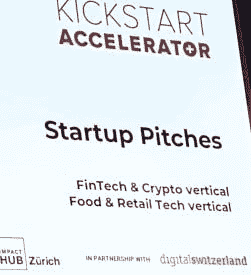
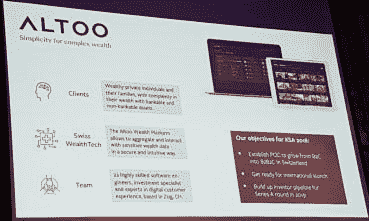
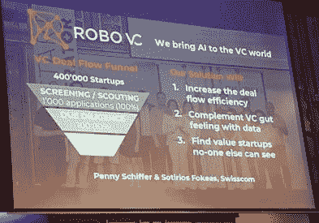

# Kickstart 加速器计划隆重开幕

> 原文：<https://medium.datadriveninvestor.com/kickstart-accelerator-program-grand-opening-e3b4935db56d?source=collection_archive---------20----------------------->

我很好奇谁会是今年 6 周 [**Kickstart 加速器**](https://kickstart-accelerator.com/program/) 项目的获胜者，该项目专注于早期和晚期创业公司的发展。在项目期间，初创公司将关注 4 个主要的垂直市场。他们肯定会尽量利用提供给他们的资源。许多专家、导师、外部专家和内部教练都在确保团队以最高速度工作，并拥有他们提高创造力和发展创业思维所需的一切。

我很高兴作为金融科技和密码领域的专家参与这个项目，我可能会见证新独角兽公司进入市场**的诞生。在盛大的开幕式上，我听了所有初创公司的 2 分钟演讲，观看了他们的工作以及与潜在投资者和支持者的交流。老实说，团队的选择花了相当多的时间，精英中的精英有机会上台展示他们最大的激情。我已经有了我最喜欢的球队，我会为他们祈祷的。我将列出所有参加竞赛的初创公司，然后再多说一些特别吸引我注意的 2 家公司，我真的相信它们会在市场上不断增长。**不知道你们有没有同样的赌注**！我邀请你在六个星期后看看我的博客，以了解谁将是赢家！看起来，这将是一个繁忙而激动人心的月份！**

如前所述，有 4 个垂直领域的初创公司参与竞争，并努力开发以下市场的产品:

1.  **EdTech & Learning** —关于如何扰乱教育市场并为教学活动提供一些创新解决方案的想法。

**参与该垂直领域的初创公司:**

*   代码打开
*   不同
*   Gnowbe
*   实验室主任
*   潜力
*   共享学院
*   蒂奇
*   写阅读器
*   Migros Klubschule

**2。智能城市&基础设施**——致力于通过改善城市的公共服务和基础设施，建设更智能、更安全、更有弹性、反应更迅速的城市。

**参与这个垂直行业的创业公司:**

*   阿武希
*   BlockDox
*   氟化粉末
*   蜂群思维
*   高瀚宇动力公司
*   佩迪乌斯
*   能源审计

**3。fin tech&Crypto**——寻找能够为瑞士跨国银行、风险投资和行业合作伙伴提供尖端解决方案的初创公司。主题包括:开放银行业务、分布式账本和智能合约技术、财富管理和加密。

**参与这个垂直行业的创业公司:**

*   [Altoo](https://altoo.io/)——简单换复杂的财富。Altoo Wealth Platform 使富有的个人及其亲属能够以简单直观的方式整合他们的总财富并与之互动。这是一个你可以收集所有资产并监控其总价值的地方。该平台使复杂和分散的数据变得简单，易于分析和管理。我推荐在 [Altoo](https://altoo.io/) 网站上试用演示。

*   **robo VC**——robo VC 是来自 [Swisscom Ventures](https://www.swisscom.ch/en/ventures.html) 的一个内部创业项目，像一家初创公司一样运作。他们建立了基于人工智能技术的筛选交易工具。依我看，这是个很有前途的主意！让我们考虑一下风险投资业务，以及分析师/合伙人应该分析的初创企业或早期创始人的数量，以得出一些风投希望最终投资的潜在初创企业的候选名单。这些数字很大，需求也相当可观。这些工具将有助于侦察和研究过程的早期阶段。RoboVC 目前有一个赞助商，因此开发工作正在进行中。

*   特拉克蒂
*   尤卡拉卜
*   阿斯忒瑞亚
*   银行工资
*   金融科技数据库
*   高斯算法
*   报告 ix
*   共振 X

**4。食品和零售技术**-对具有高增长潜力的市场中的激进食品和零售创新感兴趣。

**参与这个垂直行业的创业公司:**

*   阿尔弗
*   贝索
*   卢卡盒子
*   房屋
*   奥利克
*   亚罗克

原帖发表于[投资激情](https://investinginpassion.com/2018/10/09/kickstart-accelerator-program-grand-opening/)。