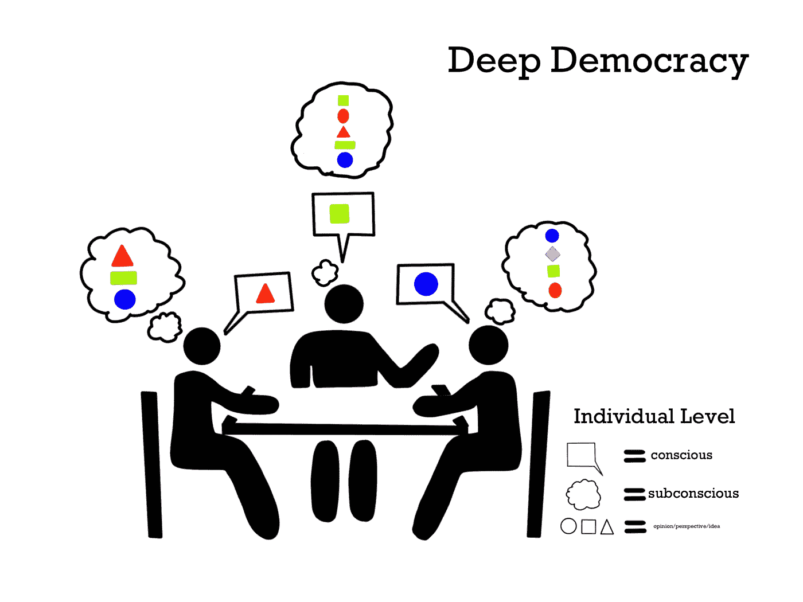
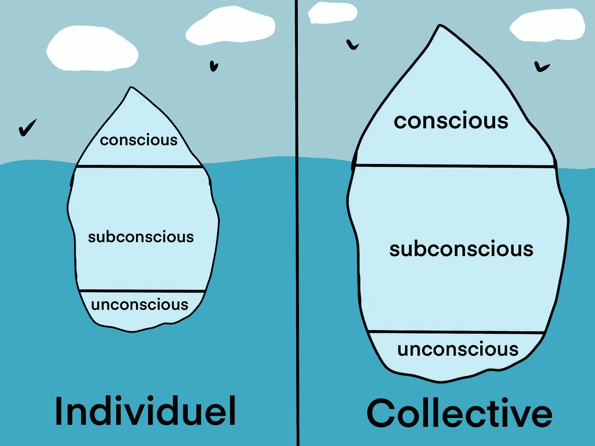
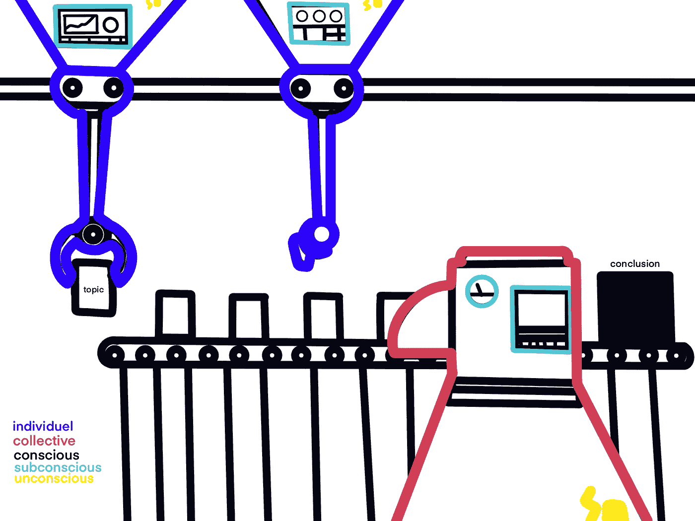
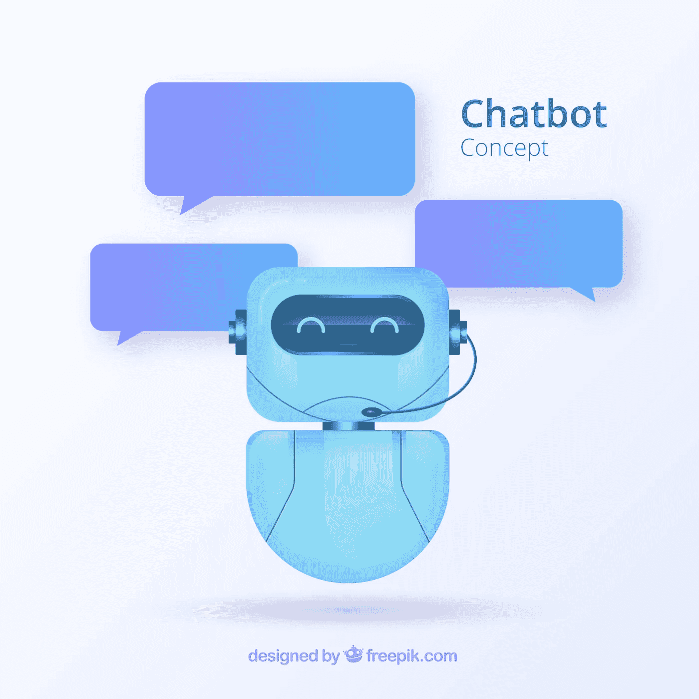
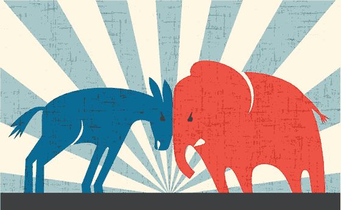

# 如何改进任何会议

> 原文：<https://medium.datadriveninvestor.com/kill-all-unproductive-meetings-d2ddba39f87e?source=collection_archive---------6----------------------->

让我们面对现实吧。

做决定很难。

在任何组织中，我们自上而下和自下而上都面临同样的问题。

 [## 艾预测:“颠覆，然后是生产力”|数据驱动的投资者

### 人们越来越担心，随着机器学习和互联网的普及，所有白领工作都将消失

www.datadriveninvestor.com](https://www.datadriveninvestor.com/2018/08/06/ai-forecast-disruption-then-productivity/) 

在执行层面，我们面临着指挥链中的沟通错误、自我中心和偏见等问题。

同样，在团队层面，我们面临着与共识不一致的恐惧，避免冲突，偏袒，意见一致或小团体形成，以及无法获得创造性的群体思维。

以上只是群体问题，在个人层面，我们可以体验到无法倾听、无法清晰地讲述故事或想法、情绪障碍、注意力持续时间缩短等。

对自己诚实一点，这个月你有多少次参加了一个你必须出席的会议，因为各种各样的原因，你不能像你预期的那样发表意见。

在这个令人厌倦的会议之后，你回家的时候还在想你为什么要去参加这个会议，这看起来像是浪费时间。

# 精益和敏捷

现代商业模式，如[精益思维](https://en.wikipedia.org/wiki/Lean_thinking)和[敏捷产品开发](https://www.cleverism.com/agile-product-development-introduction/)，通过引入[冲刺](https://www.youtube.com/watch?v=AuktI4lBj6M)和[scrum](https://www.atlassian.com/agile/scrum)，已经减少了很多这样的沟通问题。

> 简而言之，在 scrum 中，可行的信息在多个团队之间共享，例如，项目的整个过程、学到的经验教训、潜在的障碍，以及新参与方的介绍，比如股东、新团队成员或外包专家。
> 
> sprint 在一周内处理几个月的工作，通过多学科的合作来简化整个公司的工作。

在 sprint 中，会使用某种创造性的会议形式来优化效率和效果。从而优化任何产品、服务或战略开发的时间表和预算。

不是因为沟通不畅而在后期遇到困难，例如在生产团队和营销部门之间，而是每个团队都有一名成员参与到 sprint 中。

受增长黑客的启发，sprinting 使用[快速实验](https://www.youtube.com/watch?v=XBqM17MKz6U)，首先测试最小可行的产品、服务或策略。

当实验结果证明确凿时，你就加倍下注。

scrum 和 sprint 都实现了一个开放的空间，在这里员工敢于失败，并被允许有争议的观点。他们结合了时间管理的优势，设计思维来刺激开放和有效的沟通。

这些系统建立在应该避免冲突的前提上，因此在开始这样的努力之前，它们需要高度的团队精神。

# 团队理解

因此，在我看来，一个团队可以达到三个层次的理解。

1.  一个好的团队是出于需要而形成的，他们用他们在技能舞台上得到的东西工作。

2.一个优秀的团队了解每个成员的心理。换句话说，他们知道如何根据每个人的个性来调整他们的交流。

3.一个优秀的团队掌握成员决策的哲学基础。他们知道是什么让每个人都兴奋。

大多数组织、公司、非政府组织都有很多一流的团队。

跨国公司通常有时间进行团队建设练习，人们在练习中了解团队中其他人的心理偏好。

但是 [MBTI](https://www.16personalities.com) 、[大五](https://www.truity.com/test/big-five-personality-test)、[九型人格测验](https://enneagramtest.net)等心理测验还没有进入主流文化。

在极少数像 Bridgewater Associates LP 这样的顶尖公司中，他们已经将团队建设、管理和沟通系统化，并建立了一个只产生持续优秀团队的原则框架。

# 避免冲突

在没有大量资源可供利用的小公司和组织中经常发生的事情是，他们使用两个度量标准来创建职能团队。

*   像任何团队一样，技能组合必须多样化，以更快的速度前进。
*   与个人相比，为了提高速度，他们努力调整兴趣以避免决策疲劳。

> 决策疲劳是指由于误解、价值观冲突、错误信息或缺乏团队领导而无法就某个主题达成共识的过程。

决策疲劳会降低任何类型团队中任何成员的认知、生产力和社会意识。

问题是，双方的一致会导致偏见、狭隘的视野和传统的创造性思维。

# 逃跑

所以我们又回到了起点。

太多的一致或不一致对团队内部的任何交流都同样不重要。

米尔纳和 T2 发现，冲突具有挑战现状和最大化团队努力的巨大潜力。

**他们创造了** [**深度民主的框架，**](https://www.youtube.com/watch?v=S5PAuXF7dLk) **可用于任何会议，将显著提高个人和团队层面的生产力、效力、效率。**

# 深度民主背后的科学

在我看来，深度民主是防止决策疲劳的最佳制度。

在给出蓝图之前，我们先讨论一下背后的心理。

[深度民主系统](https://lewisdd.com)建立在这样一个原则上，即避免冲突会导致比通过团队分析等方式确保达成共识时更糟糕的决策。

这个框架使用了量子物理学、精神分析、冲突研究、通信科学和心理学的理论。

# 量子定位

要么叫量子定位，要么叫量子观点。

它基于量子物理中的叠加原理

在人类现实中，一个物体有一个固定的轨迹。在量程中，领域对象可以同时位于多个位置或“地点”。

这意味着，取决于人类何时观察到一个粒子，它将处于状态 0 或 1。

[Illustration of the quantum physics concept known as “superposition.” In the ordinary classical world, a skateboarder could be in only one location or position at a time, such as the left side of the ramp (which could represent a data value of 0) or the right side (representing a 1). But if a skateboarder could behave like a quantum object (such as an atom), he or she could be in a “superposition” of 0 and 1, effectively existing in both places at the same time. credit N. Hanacek/NIST](https://www.nist.gov/blogs/taking-measure/local-realism-bells-inequality-and-t-shirts-entangled-tale?fbclid=IwAR0Y7tC9pwat0_7Y7kUMXIsHrACX2x348zKdIIHS7k0o9WLgzu2S1Ovh5j0)

与沟通有什么联系？

我们的个人观点是基于独特的决策系统形成的。

这些心理偏好基于个性、经验、偏见和可用信息。

当人们思考的时候，他们正在合成一张引导我们做出某个决定的心理地图。

从表面上看，所有的交流都是通过言语、文本、图像或肢体语言来表达的。

量子定位认为，人们持有多种立场或观点。

在小组中表达的意见，经过了严格的心理偏好系统，是对各种选择进行比较的结果。

Because of mental preferences, people choose one argument over the other.

# 潜意识

尽管无意识头脑中储存了更多的位置，但这些位置在思维中还不可用，因为它们太抽象，头脑无法量化或添加不同的值。

在深度民主中，所有的交流都发生在两个维度上:集体空间和个人区域。

每个维度都有三个不同的层次:意识或口语层次，潜意识或思维层次，以及无意识或不可及的层次。

像冰山一样，水面下的物质比水面上的多。

Deep Democracy dimensions and levels

维度确定了信息的位置。而级别则讨论信息的可访问性。

所以定义是:

*   个人意识:一个人在某一特定话题中说出的观点、观点、立场或立场。
*   个人潜意识:个人正在思考或与某一主题相关的想法、观点、观点或立场的集合。
*   个体无意识:主体之间的各种联系，没有一种外部活动的帮助，是不能随意接近的。
*   集体意识:在房间内分享的观点、观点、立场或立场的整体，集中在讨论的主题上。
*   集体潜意识所有观点、观点、立场或立场的整体，安全地保存在所有个体的精神领域中。
*   集体无意识:抽象的整体，在会议中没有适当的引导，小组是无法理解的。

# 群体决策

群体共识的过程类似于流水线的过程。

Deep Democracy Line

线是群体意识流，产品是主题或想法的隐喻。

添加到产品中的机器是个人，他们根据自己的设定，或者称为心理偏好，为讨论中的主题增加价值。

这些主题通过一个包装机器，就像一个有意识的集体头脑，将想法扎根于现实。

它以一种合适的折衷方式连接了个人的所有不同设置。这符合公司或团体的使命。

这个例子中所有的人或机器都由同一个来源提供动力，即思考所需的无意识或精神能量(/电)。

# 既不是弗洛伊德的也不是荣格的

深度民主这个术语是由心理治疗师阿诺德·明德尔首次提出的。

> 民主，因为某一主题内的所有观点都同等重要。
> 
> 深层，因为这个群体深入到交流或“所有交流”的表层之下。

**然而，深度民主与精神分析有很大不同，因为解剖每个人的潜意识是费时的。**

此外，潜意识中并没有被压抑的信息。

相反，它更好地解释为未开发的创造潜力。

这些维度和层次存在于在物理空间中与人的任何对话中。

我创造了一个例子，来说明量子定位、维度和能级是如何相互作用的。

# 商务会议示例

Photo by [You X Ventures](https://unsplash.com/@youxventures?utm_source=unsplash&utm_medium=referral&utm_content=creditCopyText) on [Unsplash](https://unsplash.com/search/photos/meeting?utm_source=unsplash&utm_medium=referral&utm_content=creditCopyText)

想象一下，为一家拥有多个团队的电动汽车制造商工作。

因为[特斯拉](https://www.ndtv.com/world-news/elon-musk-releases-all-tesla-patents-to-help-save-the-earth-1986450)选择与公众分享他的专利，许多初创公司加入了这个市场，利用[埃隆·马斯克](https://en.wikipedia.org/wiki/Elon_Musk)为人类做的好事。

高层管理人员想出了一些办法来降低与竞争对手闹翻的风险。

行政部门建议重新分配营销预算的重要部分。

该公司在预算分配方面有明确的政策，并将首先访问下级团队，以获得额外的反馈或其他想法。

各个团队的领导召开了一次会议，人力资源部的 Jane 被选为主持人，因为她有很好的人际交往能力。

Jane 很清楚这可能会成为一场激烈的争论，她偏向于营销团队，因为她曾经是该部门的一员，在那里仍然有一些好朋友。

如果投票出现僵局，她选择不参与投票，因为她不想在朋友和公司之间做出选择。

source: [Favoritism at the workplace](https://medium.com/hush-speak-up-make-work-better/favouritism-at-workplace-35ef926ebbd5) — writer: [Anand Prakash](https://medium.com/@anandprakash_31198) — publisher: [Hush — Community for Employees](https://medium.com/hush-speak-up-make-work-better)

包括简本人在内，有七个人出席了会议。

当 Jane 就上级的建议征求反馈时。人们不喜欢它，但他们认为这是生存所必需的，并开始集思广益。

房间里的每个人都开始就备选方案进行头脑风暴，因为他们一致认为该提案对某些因素的重视不够。

营销总监辩称，他们已经从[增长黑客](https://www.youtube.com/watch?v=khycfkmMovQ)开始，这大大降低了不良广告活动的财务风险，并且可以减少一点支出。

销售总监告诉人们，他们正在向新的 [CRM](https://www.youtube.com/watch?v=hnEQq7kNFWo) 过渡，需要他们的预算用于团队的 CRM 教育。

首席产品开发人员和产品设计师同意，只要不挑战公司当前的使命，他们可以采取一些削减措施。

合规与法律服务部主管表示，他愿意通过以培训的形式雇佣一些新人才来裁员。

客户服务总监坚持自己的立场，称上次公司面临危机时，他和他的团队采取了一些削减措施，并辩称该轮到别人了。

每个人都列出一个建议，并单独告诉他们小组他们认为最好的方法是什么。

因为许多提议看起来相似，所以人们聚集在一起，提出更有力的理由。

# 冲突

Photo by [Ming Jun Tan](https://unsplash.com/@mingjuntan?utm_source=unsplash&utm_medium=referral&utm_content=creditCopyText) on [Unsplash](https://unsplash.com/search/photos/two?utm_source=unsplash&utm_medium=referral&utm_content=creditCopyText)

结果是两个提议:

建议 A:财务劣势应公平分配。换句话说，它应该适用于所有可能受到冲击的部门，因为它们对公司的生命线并不重要。

提议 B:倾向于上层管理层关于裁员的提议，但坚持 10%的裁员将与最初计划中提议的相同，因为通过使用增长黑客技术和新的 CRM 提高了生产率。

提案 A 得到了首席产品开发人员和产品设计师的支持，因为产品开发对于保持竞争优势至关重要。

提案 B 得到了客户服务总监和销售总监的支持，因为他们的团队不必削减预算。

经过一番劝说后，营销总监加入了 A 组，合规和法律服务总监加入了 b 组。

现在简遇到了一个难题。

双方都有有效的论证结构来支持他们的主张。

简试图权衡每个计划的利弊，她担心自己的决策无法摆脱偏见。

Photo by [Tim Gouw](https://unsplash.com/@punttim?utm_source=unsplash&utm_medium=referral&utm_content=creditCopyText) on [Unsplash](https://unsplash.com/search/photos/meeting?utm_source=unsplash&utm_medium=referral&utm_content=creditCopyText)

**冲突视角**

如果我们鸟瞰，我们会看到，在会议的集体意识中，两种意见各持己见，像拳击比赛中那样针锋相对。

许多个人潜意识的想法已经被带到了意识之光下。

你可以看到量子定位，其中多个个体有一种相同的方法来解决问题。

你可以看到，基于各种各样的原因，许多人愿意做出一些回报，甚至对他们各自团队的目标做出妥协。

如果我们将他们的心理地图可视化，你会看到许多共同的论点，导致一些人“同意”，另一些人“不同意”。

**领导**

成为一名优秀的领导者意味着尽最大努力保护他们在会议中所代表的团队成员的利益，而不背离公司的原则和使命。

因此每个人都坚持自己的立场。

结果就是利益冲突。

# 不可避免的偏见

如果世界是非黑即白，人们是[经济人](https://en.wikipedia.org/wiki/Homo_economicus)群体的一部分，那么肯定会有赢家。

在我看来，几乎没有人能够在任何涉及人们生活的决策中做到客观和理性。除非你是反社会者或精神病患者。

以过程为导向的心理学发现，如果分享新的见解，每个人仍然可以转向任何一方或获得新的视角。

在精神领域，他们能够通过赋予他们价值，在头脑的背景下概念化他们的一些想法。

这样，想法就从无意识层面被提取出来，并被放入潜意识层面。

因此，在集体无意识中，所有抽象的思想都被集合在一起，总有各种不同的观点被储存。

Photo by [Paweł Czerwiński](https://unsplash.com/@pawel_czerwinski?utm_source=unsplash&utm_medium=referral&utm_content=creditCopyText) on [Unsplash](https://unsplash.com/search/photos/molecules?utm_source=unsplash&utm_medium=referral&utm_content=creditCopyText)

无意识的集体就像车窗上的雨滴(想法)的集合，坚持他们的位置。

除非它们接触到另一个雨滴(外界信息)，给予它必要的动量和重力向下坠落(改变群体内的定位)。

## 原创思想家

所以每个团队都有这样一只奇怪的鹅，相对于其他人表达的观点，他对手头的事情有一个不正常的观点。

大多数情况下，当这只奇怪的鹅提出这样的观点时，他或她选择放弃那个有争议的立场，因为害怕在(激烈的)争论中受到双方的攻击。

过程导向心理学坚持认为，整个群体在听到这种独特的观点后，会重新评估自己的立场。

通过这样做，群体可以进入他们个人无意识的某个部分，然后增加到集体意识中。

这种对无意识集体的接触改变了这个群体的整体方向，使之变得更好。

# 回到这个例子

这个例子中的怪鹅是客户服务主任杰里。他一直在秘密制定一项降低成本、提高利润率的计划。Jerry 计划利用内部开发来创建一个聊天机器人，这将允许他的员工专注于 FAQ、呼叫和文本服务等的改进。

[source](https://www.freepik.com/free-photos-vectors/background">Background vector created by freepik - www.freepik.com)

这个项目已经进行了几个月，但是 Jerry 还没有为一个可行的提议制定出所有的事实或详细的预测。

上一次，当杰瑞向他的上司提出一个想法时，没有研究支持，这个计划适得其反。由于杰里勤奋工作的道德规范，管理层采取了一个信念的飞跃。

> 没有[路线图](https://www.productplan.com/roadmap-basics/)或者相反的[战略](https://www.infinityconcepts.net/2011/09/the-difference-between-a-plan-and-a-strategy/)在大多数时候注定会失败。

这个计划没有成功，管理层责怪杰里，这使他的职业道路倒退了几年。

现在他是一名董事，但他不愿意拿自己的职位冒险。

Jerry 擅长思考未来，但他的弱点之一是认识到其他人的创造能力。

他不知道的是，首席产品开发和首席设计师的 Elisa 和 Tom 也有类似的客户服务聊天机器人的想法，但还没有找到时间讨论潜在的合作。

Elisa 心中已经有了一个时间表，Tom 也在他的子弹日记中勾画了一些 UI 想法。

Elisa 和 Tom 都是非常有创造力的人，这意味着他们有很多想法，其中聊天机器人的想法是其中之一。

他们都有注重细节的个性，这意味着他们的注意力完全集中在这次会议上，为提案 A 奔走，这意味着他们的创意现在被推到了幕后。

换句话说，他们的创造性想法保持在无意识的水平。

# 把它放在一起

通过深度民主的镜头，分享(冲突/)有争议的信息将允许其他个人通过重新评估他们在某个主题中的定位来获得洞察力

每次分享新信息时，都会在三个级别中的一个级别触发。

如果深层民主系统存在，主持人会从他的潜意识中提取 Jeries 的想法，这将把 Elisa 和 Toms 的想法从潜意识转移到潜意识中。

这样做的话，团队将会在当时发挥出最大的创造性思维潜力。

总而言之，以过程为导向的心理学发现

*   一个团体的共识从来都不是固定的。
*   **协议并不总是最好的选择。**
*   **因此，应该勇敢地面对冲突，以最大限度地发挥创造性思维，即使这意味着可能会暂时扭曲群体动态。**

# 消除部落主义

[source](http://jlifeoc.com/tribalism/)

除了进入集体无意识，深度民主也阻止了我们大脑中爬行动物部分偏向群体中某些个体的倾向。

*这种偏见最常由* [*光环效应*](https://www.youtube.com/watch?v=tW-U1q5uQ3M) *造成:如果崇拜某个人物，我们更容易相信这样的人。*

例如，如果畅销书《每周四小时工作制》的作者蒂姆·费里斯(Tim Ferris)宣称如何有效地管理你的时间以写出更好的书。

我不太倾向于质疑他在这个问题上的权威，因为他是我们这个时代非常有成就的作家。

从纯粹客观的角度来看，人们可能会说，尽管他在职业生涯中写了很多书，但他目前的主要焦点是名为“蒂姆·费里斯秀”的播客。

根据这种推理，更活跃的作家可能会对写书有更好的见解。

除了光环效应，你还有性别偏见、T2 效应、T4 效应、专家偏见、T5 偏见和 T6 偏见等等。

根据作者巴斯特·本森的说法，共有 175 种偏见，这本书讲述了富有成效的争论的艺术。

此外，诺贝尔奖得主丹尼尔·卡尼曼在他的书《快速思考与慢速思考:T21》中指出，由于偏见的种类繁多，没有人能够时刻警惕偏见。

甚至麦肯锡的也同意，男人天生就有偏见，这在他们的文章《战略决策中的扭曲和欺骗》中有所体现

> 公司在制定战略决策时不能忽视人的因素。他们可以通过更多地意识到认知偏见误导他们的方式，通过回顾他们的决策过程，以及建立建设性辩论的文化，来大大提高他们做出好决策的机会。

因此，我们的意识永远无法跟踪我们思维中的所有偏见。

# 深度民主的蓝图

而不是成为虚无主义者，说人类注定因为认知偏差而无法正常交流。

> 我想说，大多数偏见都可以通过残酷的诚实和有效的沟通来解决。

如果有深度民主，杰里会分享他的想法。

现在我给你一个在任何会议中实施深度民主的框架。

总共有五个阶段，其中四个是深度民主的必要阶段。

# 0.角色

你首先决定谁将是这次会议的主持人。我建议选择情商最高的人，而不是领导素质最好的人。永远用手投票。

同样，在短跑比赛中，培训师为对话创造开放的空间，并让人们对自己的行为负责。

主持人没有投票权，所以如果你是会议的领导者并且对会议有清晰的愿景，尽量不要成为主持人。

如果是这样的话，你仍然可以注入想法，但是如果要投票的话，你就不能支持它们了。

会议中的其他人地位平等。首席执行官或更高级管理人员加入时也不例外。

然后继续确定谁来承担秘书的职责。喜欢听而不喜欢说或者有总结或快速打字天赋的人可能是个不错的选择。

我总是建议人们定期在角色之间转换。

人们将能够感知每个人是如何对待领导、总结、诊断等的。

随着时间的推移，小组将会更好地理解不同的沟通方式。

The facilitator usually stands next to the whiteboard — Photo by [Austin Distel](https://unsplash.com/@austindistel?utm_source=unsplash&utm_medium=referral&utm_content=creditCopyText) on [Unsplash](https://unsplash.com/search/photos/leader?utm_source=unsplash&utm_medium=referral&utm_content=creditCopyText)

# 1.登记入住

首先，主持人以一个“类似 scrum”的开场问题开始，这被称为签到阶段。

以下是一些例子:

*   你感觉如何？
*   你能简单概述一下你的一天吗？(最多 3 分钟)
*   你为什么想参加这个会议，为什么不想参加这个会议？

这些问题提高了小组的同情意识，帮助那些不能通过肢体语言或直觉来识别的人。

此外，这也是一种训练团队同理心的练习。

亲小费，保持轻松愉快，强调简短但直接的交流。

# 2.主题清单

然后，主持人要求会议中的每个与会者首先想出他们想谈论的一些主题，并写在白板上。

然后人们可以为谈话的顺序提出建议。

小组再次举手表决，主持人选出获胜顺序。

在继续之前，主持人必须询问那些不支持获胜顺序的人，他们是否想增加一些规则，或者对一致意见是否满意。

你可以坚持的一些规则:

*   稍微改变一下顺序，当你或其他人不得不提前离开，并认为他们或你的反馈对会议的其余部分至关重要时，调整你的日程安排的优先级。
*   或者对一个话题设定具体的时间限制，不要陷入那些“哲学导向的人”的长篇大论中，在那里会议的节奏似乎被放慢到蜗牛赛跑。

再次投票，当论证对改变有效时，大多数人会妥协。

Photo by [Thomas Drouault](https://unsplash.com/@thomasdrouaultphotography?utm_source=unsplash&utm_medium=referral&utm_content=creditCopyText) on [Unsplash](https://unsplash.com/search/photos/brainstorming?utm_source=unsplash&utm_medium=referral&utm_content=creditCopyText)

# 3.报告、集思广益/决策

关于题目顺序的一些提示。

在一个负责协调其他团队的教育咨询团队尝试了深度民主之后，他们为 Bildung 学院的学生制定了一年计划。

我们了解到，更新最好放在主题顺序的第一位，因为一个“无关紧要”的报告可以激发其他团队成员的许多新想法。

通过优先报告，你可以防止回到一个已经确定的话题。

然后继续头脑风暴或决策。

**头脑风暴**

对于头脑风暴，主持人必须清空小组成员的头脑。

制作蜘蛛网或使用便利贴在固定的时间内写下尽可能多的想法(10 或 5 分钟最好)。

然后，如果你想得到最好的想法，让人们将相似的想法有机地组织起来，或者让人们挑选任何不是他们自己的想法，给他们一个固定的时间(3 到 5 分钟)来解释为什么这个想法对公司或组织最有利，等等。

如果你正在寻找一些其他的创造性练习，看看[会话实验室](https://www.sessionlab.com/library/idea_generation)。

**决策**

对于决策，主持人要求每个人详细阐述他们的立场。

主持人通过写在白板上来总结这一立场，这样其他人就不会忘记其他观点。

由于使用了不具体的词语，这些概括的版本在被写下来时经常被意见持有人纠正。

此外，这有助于期权持有者组织自己的想法，让其他参与者清楚明白。

然后在盘点结束后，主持人询问是否有人想提供任何其他想法、立场、观点等，现在或永远保持沉默。

大多数时候，每个人都已经给出了他们不同的观点。

但是有时候，当主持人提醒大家没有坏主意的时候。人们会添加他们之前不想分享的立场或观点，因为他们认为他们无法正确论证。

> 提醒人们，在会议中没有任何想法或话题是无价的。

在深度民主中经常发生的是，一个独特的想法，会被其他人捍卫，就像那个把它插入群体的人。

因此，主持人必须确保人们有共同的观点，即使他们还没有资源或事实来支持他们的主张。

然后举手表决，你继续下一个话题。

**一些注意事项**

**议题清单并不是要在会议结束时完成的，虽然可以在会议中完成。**

它的功能是不断地对谈论的话题进行优先排序。结果是讨论的“非生产性”话题减少了。

随着人们将自己的目标公开化，大型团队的参与度将显著提高。

因此，人们会感到更加充实，会议成为一个有趣的地方，在那里你永远不会感到无聊。

# 4.授权和规划

对于委派，秘书保留了一份待办事项清单。在假设某些人喜欢做一件事是因为他们最适合做这件事之前。

问人们他们喜欢做什么。经常会有意想不到的合作，团队的表现将受益匪浅。

主持人在会议结束时对下一次会议进行了规划，最大限度地减少了单独联系每个人以查看他们的日程安排中是否有时间的工作。

# 5.检验

Photo by [Alexis Brown](https://unsplash.com/@alexisrbrown?utm_source=unsplash&utm_medium=referral&utm_content=creditCopyText) on [Unsplash](https://unsplash.com/search/photos/communication?utm_source=unsplash&utm_medium=referral&utm_content=creditCopyText)

结账不是强制性的。

但是，如果你开始实施这个系统，思考诸如开放空间、非暴力沟通、有效性和效率以及角色互动等主题是一个好主意。

这显示了非信徒的结果。

# 在中断的情况下

辅导员是对集体行为负责的人。

因此，当中断发生时:

*   开玩笑，偶尔开个玩笑是好的，但是当人们笑不出来或者一直傻笑的时候，就有事情发生了。
*   个人言论或侮辱
*   该组总容量的增加或减少

当这种中断发生时，主持人必须做出判断。

这个小组是否处于只使用与主题不相符的词的危险地带。相反，就属于潜意识领域的概念进行间接交流。

或者这只是一个非实质性的话题，可以通过说类似这样的话回到主题。

你的意思是… …根据题目吗？

或者你能详细说明你所说的和我们正在讨论的话题之间的联系吗？

当中断危及集体的集体努力时。这个小组已经把话题转移到了无意识领域。其中他们谈到具体的对象，但事实上是指其他更抽象的概念。

主持人必须大声说出来，我相信我们正在进入危险地带。

通常，小组中的其他人会同意他们不知道其他人在谈论什么，或者他们觉得房间里很紧张。

主持人必须提出问题。

你现在真正想的是什么？

或者是什么引发了我们关于这个话题的对话中的特定反应？

我的建议是，在你清点人们的想法之前，给人们两分钟的喘息时间。

当你不得不作为调解人介入时，我们会深入，因此被称为深度民主。

深度潜水并不经常发生，但一旦发生，就必须立即解决，否则紧张情绪会像癌症一样在你的团队中蔓延。

Photo by [Mohamed Ahzam](https://unsplash.com/@mohamed_ahzam?utm_source=unsplash&utm_medium=referral&utm_content=creditCopyText) on [Unsplash](https://unsplash.com/search/photos/diving?utm_source=unsplash&utm_medium=referral&utm_content=creditCopyText)

# 潜水深度示例

例如，在一次关于教育项目的会议上，与会者对价格上涨以及事实如何呈现给公众感到不安。

深入研究之后，我们发现那不是真正的问题。

当领导层做出最终决定时，其他团队的一些成员感到被排除在外。

因此，问题是由志愿者的理想主义和领导层的组织现实之间的紧张关系造成的。

在有序的场合，这通常是个人的事情，其中某个人无意识地伤害了房间里的另一个人或感觉受到了伤害，或判断被意外地呈现为事实，产生了错误的假设。

# 结论

总结一下，

主持人的主要角色是评估对话发生的维度。

在社会动态领域，主持人必须确定对话是集体的还是两个人之间的。

此外，主持人必须指出哪些是公开分享的，哪些是在群体无意识中保留的。

一些简单的提醒:

*   **总是用手投票**
*   **根据兴趣优化题目，而不是根据成绩经常发生的事情。**
*   **用一个主持人来控制每个人，创造非暴力的交流和有争议的空间。**
*   所有的立场、想法都应该大声表达出来，并且同等重要。

声明:这个博客反映了我对深度民主的体验。它应该与深度民主培训有许多相似之处，但在某些方面可能会有所偏差。正如我常说的，不断尝试，直到找到正确的点。