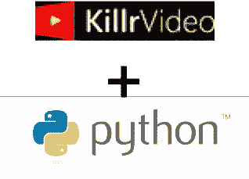
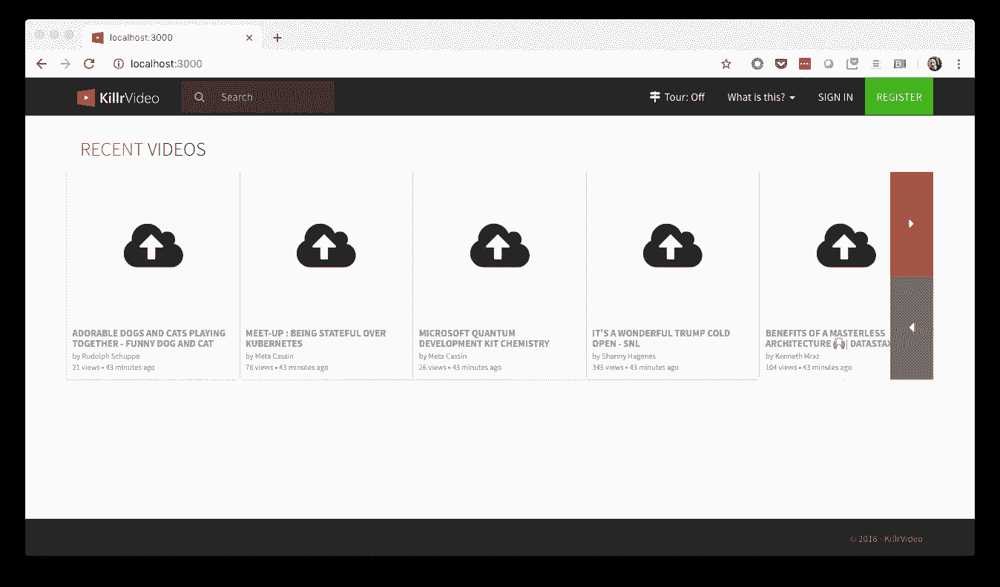

# KillrVideo Python 角。1—背景故事

> 原文：<https://medium.datadriveninvestor.com/killrvideo-python-pt-1-the-backstory-5c38191fb330?source=collection_archive---------6----------------------->

## 使用 DataStax Python 驱动程序开发应用程序

在忙了一个秋天的旅行，在纽约市的 Strata 做宣传，参加了几个 T2 的 DataStax 开发者日的活动后，我有了一个月不用旅行的特权。我认为这是我考虑了一段时间的开发项目的最佳时机:用 Python 创建一个 [KillrVideo](http://killrvideo.github.io) 参考应用程序的实现——特别是[微服务层](https://killrvideo.github.io/docs/guides/architecture/)。

如果你不熟悉的话，KillrVideo 是学习 Apache Cassandra 和 DataStax Enterprise 的参考应用程序，由 [Luke Tillman](http://twitter.com/luketillman) 、 [Jon Haddad](http://twitter.com/rustyrazorblade) 等人创建。你可以在 GitHub 上找到 [killrvideo-python 库。](https://github.com/KillrVideo/killrvideo-python)

# 为什么是 Python？

首先，我想我已经阐明了我开始这个项目的一些原因。这里他们很简单:

*   我从未在 Python 中做过深层次的开发——成长的机会！
*   Python 目前在 TIOBE 索引中排名第三，并且还在上升。Python 驱动程序也是下载量最高的 Cassandra / DSE 驱动程序之一。然而，使用这些驱动程序的例子并没有我希望的那么多。
*   我秘密计划在某个时候将无服务器功能整合到 KillrVideo 中。嗯，也许不再是秘密了。我们可以潜在地使用 Python(或者当然是 JavaScript)来做这件事。

Python 在计算行业中似乎有一个混合的名声。一方面，它越来越受欢迎，[尤其是在数据科学和数据工程领域](https://www.netguru.com/blog/why-python-is-growing-so-quickly-future-trends)，我想这是因为它的灵活性和易用性。对于我们这些自称为软件开发人员的快速增长的人群中的许多人来说，它是我们遇到的第一语言之一。

另一方面，我知道有些工程师会因为性能之类的[抱怨而看不起在生产系统中使用 Python。就我个人而言，学习 Python(和 JavaScript)的最大困难是动态类型，这当然与它是一种解释型语言有关。我承认我发现自己在这个项目中使用了大量的`print()`和`type()`调用来导航类型不匹配。我学到的另一个重要知识是，你应该尽可能多地在命令提示符下构建原型。](https://www.techrepublic.com/article/fastest-growing-programming-language-pythons-popularity-is-still-climbing/)

# 应用开发方法

我坦率地承认，有一个因素极大地简化了应用程序开发工作:其他语言中服务层实现的可用性，如 [Java](https://github.com/KillrVideo/killrvideo-java) 、 [Node.js](https://github.com/KillrVideo/killrvideo-nodejs) 和 [C#](https://github.com/KillrVideo/killrvideo-csharp) 。为此，我非常依赖于之前由 [DuyHai Doan](http://twitter.com/doanduyhai) 和 [David Gilardi](http://twitter.com/SonicDMG) 在 Java 实现方面所做的大量工作。

所以我的开发过程是一次实现一个服务，利用 Java 实现所使用的相同算法和查询。当我开始工作和阅读 Java 代码时，我发现为服务创建一个[功能规范](https://killrvideo.github.io/docs/development/functional-specs/)会非常有用，可以让下一个人更容易地用新语言创建实现。我用这个来引诱 [Adron Hall](http://twitter.com/adron) 做一个 golang 实现；).

顺便说一句，我一次处理一个服务，按照 [KillrVideo 集成测试](http://github.com/killrvideo/killrvideo-integration-tests)暗示的顺序。由于 KillrVideo 应用程序中的大多数操作都与用户相关联，因此要实现的第一个服务是用户管理服务，其次是视频目录服务。

After 3 weeks of work on KillrVideo Python services, it finally occurred to me to run the Webapp, which of course uncovered a bug — no preview images!

# 还会有更多

以下是我计划在本系列中涉及的一些方面，没有任何特定的顺序:

*   使用 DataStax Python 驱动程序进行 Cassandra、搜索和图形查询，包括 *cqlengine* mapper 的优缺点
*   在 Python 中使用 *GRPC*
*   服务发现和 *Etcd*
*   利用 Python 库快速完成工作—电子邮件地址验证、停用字词删除等。
*   [KillrVideo 集成测试](http://github.com/killrvideo/killrvideo-integration-tests)方法
*   通过卡夫卡实现 KillrVideo 事件
*   Aleksandr Volochnev[正在进行的 KillrVideo Docker 部署和向 Kubernetes 的迁移。](http://twitter.com/HadesArchitect)

感谢阅读。我很高兴[阿曼达·莫兰](http://twitter.com/AmandaDataStax)同意在这个项目上与我合作，并希望有任何有兴趣帮助我的人做出贡献！

**本系列的下一篇文章:** [**用 ProtoBuf 和 GRPC 开发 Python 应用**](https://medium.com/@jscarp/python-app-dev-with-protobuf-and-grpc-e5bff779783d?source=your_stories_page---------------------------)