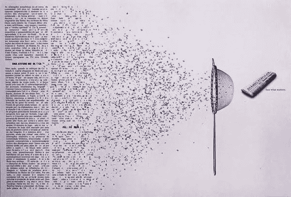
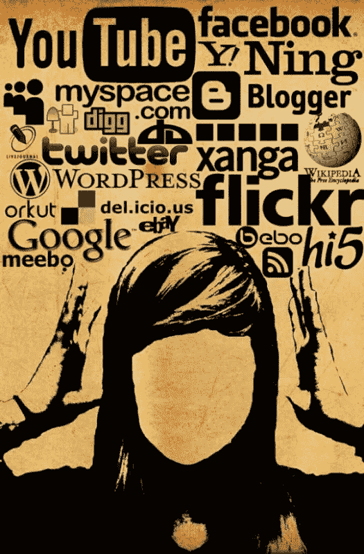

# KISS——如何在信息过载的时代高效地使用互联网和消费内容

> 原文：<https://medium.datadriveninvestor.com/kiss-how-to-productively-use-the-internet-and-consume-content-in-the-age-of-information-overload-de27de541b0a?source=collection_archive---------24----------------------->

两个月前，我和我的一位同事进行了一次谈话，在谈话中我随机提出了一个问题，“马尔科姆·格拉德威尔说，如果我们全心全意地投入到我们热爱或想要擅长的任何事情上一万个小时，我们就会掌握它。然而，我们在这里，每天都在生活，但既不享受也不擅长。”

当我思考这个问题一周的时候，我发现我们在工作-生活-网络的平衡上如此纠结。互联网？你什么意思？想想你今天在互联网上花了多少时间——我们使用互联网的时间几乎等于我们的工作时间，而在工作日，它超过了我们与我们所爱的人、家人和朋友在一起的时间。所以，我决定控制自己的生活，平衡工作之外、上网和工作中的生活。

我仍处于试验阶段。但是，我必须告诉你，我一直在“富有成效地”使用互联网。你有没有想过你使用互联网是为了什么？你测量你的上网时间吗？但是互联网很像食物。我们在醒来的那一刻，在休息的间隙，用它来发布突发新闻，这样的例子不胜枚举。

在互联网时代，互联网是我们生活中不可或缺的一部分。可以说它就像我们的数字宠物。但是，现在是我们考虑如何利用它为我们造福，而不是让它控制我们的生活的时候了。

所以，我重新审视了我是如何消费内容的。然后，我根据我希望如何消费内容来构建结构。但是，由于我们也查看娱乐新闻，也用它来分散注意力，我设计了一个叫做 [#KISS](https://www.facebook.com/hashtag/kiss?source=note) 的方法。在我开始之前，要注意的一点是，在过去的 20 年里，我们消费内容的方式已经从单纯的阅读扩展到了看和听。因此，了解你将依赖哪些来源来消费内容，因为这因人而异。我们的上网习惯和饮食习惯一样独特。我们能关注的只是一个宽泛的分类。

在这篇文章中，我将简要阐述它所代表的含义:

知识:从世界事务到政治到体育的知识。把这个当做新闻吧。但是我不是早上第一件事就吃，而是在一天结束时吃，或者最好是每周一次。

想象力:任何激发创造力的小说。这可以是看电影、听有声读物或故事播客或看书。

精神上的:精神上的指的是你贴近内心的东西。喝了这个会让你精神振奋。可以是观看你最喜欢的音乐家的音乐会，查看一位艺术家的采访以了解他或她是如何工作的，等等。我最近在读沃尔特·伊萨克森写的关于达芬奇的传记，这对我来说是精神上的。

S — Skills: Skills 相当宽泛。因此，我把它进一步分为 4 类:消费能提高你的 a)职业技能的内容，b)你在你的激情领域中需要超越的技能，c)你需要更好地管理现在的技能。比如个人理财、饮食等。d)你明天需要的技能。这可能会也可能不会直接影响你。但是，如果你在技术领域或在一个不断变化的环境中，你宁愿把精力集中在学习新的东西上，以更好地适应明天的世界！

去吻万维网吧！