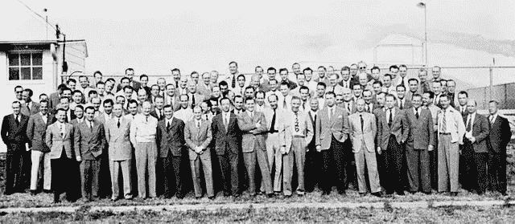

# 基特勒的闪电战

> 原文：<https://medium.datadriveninvestor.com/kittlers-blitz-e41bbc5f6810?source=collection_archive---------1----------------------->

VHF Radio Operator on German Tank. Source: Twitter [**Fräulein Feldgrau**‏ @Glockengeist](https://twitter.com/Glockengeist)

## 谁在推动媒体？

*“媒体决定我们的处境”*，已故[弗里德里希·基特勒](https://en.wikipedia.org/wiki/Friedrich_Kittler)(1943-2011)，一位有影响力的德国媒体研究学者在他的著作[《留声机、电影、打字机》](https://www.amazon.com/Gramophone-Film-Typewriter-Writing-Science/dp/0804732337/ref=sr_1_1?s=books&ie=UTF8&qid=1545717044&sr=1-1&keywords=Kittler)中说。另见我最近的帖子[把精神赶出人文学科](https://medium.com/@gert.gast/driving-the-spirit-out-of-the-humanities-ff93c3c3b762)。但是谁来“决定”媒体呢？对基特勒来说，答案显而易见，那就是军队。军方在欧洲和德国推动媒体技术。受到一些媒体学者的广泛批评，其中包括[《留声机、电影、打字机》](https://www.amazon.com/Gramophone-Film-Typewriter-Writing-Science/dp/0804732337/ref=sr_1_1?s=books&ie=UTF8&qid=1545717044&sr=1-1&keywords=Kittler)的译者温斯罗普-扬，他写道，

> 一个可能让一些读者感到不安的因素是基特勒对军事应用产生的技术创新的虚拟崇拜，这些技术创新是军事战斗的副产品。…基特勒得出了一个名副其实的媒体谱系，在这个谱系中，战争扮演着所有技术之父的角色。

Royal Postal Agency in Overath, Bergisches Land, 1890\. Stagecoach with mailmen Source: [Wikipedia](https://de.wikipedia.org/wiki/Postkutsche#/media/File:OvK%C3%B6niglichePostagentur1890.jpg)

不过，我觉得基特勒的分析还是挺正确的。他的立场首先是基于对媒体技术的透彻理解，以及对德国和欧洲媒体技术“处境”的敏锐认识，在欧洲，经历了 1870 年法德战争、第一次世界大战、第二次世界大战和冷战的国家一直高度军事化。

出于显而易见的原因，媒体和通信受到国家的严格控制。例如，在整个 19 世纪和 20 世纪初，德国的邮政服务包括电话和铁路都是政府经营的，广播和后来的电视也是如此。

直到 19 世纪，通信系统和工具的范围从罗马的道路系统到拿破仑时代的军事信号系统，前者是为了让军队、信使和各省税收的移动而建造的，后者包括光学电报线路和后来最终也用于民用的电报。然后在 19 世纪后期，我们发现短波无线电在海军通信中的使用，并且在第一次世界大战后，陆军退伍军人手中的军用无线电设备被平民发现了新的用途。媒体技术在二战中继续崛起。早在战前，英国、法国、德国、意大利、日本、荷兰、苏联和美国的研究人员，“*独立地、神不知鬼不觉地，开发出了导致现代版雷达的技术”(* [*【维基百科】*](https://en.wikipedia.org/wiki/Radar) *)* )。

VHF(甚高频)无线电被用于德国和后来的美国坦克。在第二次世界大战中，在计算机时代来临之际，情报部门成功解密了德国的无线密码通信。正是艾伦·图灵和他的团队，在 2014 年的电影[《模仿游戏》](https://en.wikipedia.org/wiki/The_Imitation_Game)中讲述，由本尼迪克特·康伯巴奇(Benedict Cumberbatch)饰演艾伦·图灵，标志着二战结果的转折点。

基特勒系统地看到媒体系统分为三个阶段。

*   从美国内战开始，声学、光学和脚本的存储技术:电影、留声机和人机系统、打字机。
*   第二阶段从第一次世界大战开始，为每种存储内容开发了适当的电子传输技术:无线电、电视和它们的“更秘密的对应物”。
*   第三阶段，自第二次世界大战以来，从打字机到解密，1936 年的数学可计算性给了未来计算机的名字。

用基特勒的话说，

> 甚高频坦克通信和雷达图像传输技术，这些军事发展与电视齐头并进，**意味着总动员、摩托化和闪电战……**
> 
> 战斗机和潜艇这两种新的武器系统需要无线通信，就像军事指挥需要真空管技术来控制高低频一样。然而，坦克同样需要通讯，所以坦克闪电战的战略家古德里安上校将被迫求助于第一次世界大战时期的信鸽。
> 
> 相反，他的装甲楔子，“从最前线的坦克到师、军和陆军司令部”，与他的敌人不同，装备了甚高频[无线电]。“引擎是坦克的灵魂，”古德里安常说，“而无线电，”内林将军补充道，“是它的头号武器。”那时和现在一样，甚高频无线电将领导真空降至零。(基特勒，1999 年)

这解决了坦克的传输问题，而面向大众的无线电广播解决了战争努力的宣传问题。著名的“戈培尔的雪纳瑞”(一种廉价的无线电接收器，以纳粹帝国宣传部长约瑟夫·戈培尔的名字命名，被称为“戈培尔的鼻子”)，到 1939 年，德国每家每户都有 1150 万无线电广播订户([维基百科](https://de.wikipedia.org/wiki/Joseph_Goebbels))。

根据基特勒的说法，蜡筒被用于存储记录议会会议，但这些在战斗中毫无用处。然而，到 1940 年，像巴斯夫和 AEG 这样的公司开发出了磁带。正是第三帝国宣传部对这种强大的存储媒体感到高兴。当然，基特勒引用了陆军宣传部长的话:

> 陆军宣传部长少将·冯·韦德尔回忆说:
> 在战地记者的无线电设备方面，我们基本上也依赖于宣传部的发展。这也适用于适当的车辆。当谈到坦克师，空军，或海军的一部分，原始战斗录音的机会受到阻碍的事实，我们不能获得稳定和水平的支持生产光盘。起初，我们被迫将就一下迟来的急件。一个重大的变化发生在磁电话被发明并被彻底设计用于战争报道之后。来自空中、行驶中的装甲车或潜艇等的原始战斗报告。，现在成了令人印象深刻的第一手资料。

30 年后，小型盒式录音带成为这项技术最受欢迎的民用设备。

Wernher von Braun Source: [Wikipedia](https://en.wikipedia.org/wiki/Wernher_von_Braun)

第二次世界大战结束后，盟军对德国媒体技术的盗用并没有随着德国磁性电话磁带而结束。掠夺的意义远不止于此，它将决定未来几年的政治和媒体格局。Wernher Magnus Maximilian Freiherr von Braun(1912 年 3 月 23 日—1977 年 6 月 16 日)，是德国火箭技术发展的领军人物(V2 火箭)，在英国引起了如此大的混乱。作为“T2”行动“回形针”T3 的一部分，他和大约 1600 名其他德国科学家、工程师和技术人员一起被秘密转移到美国。他成为了美国火箭技术和空间科学(NASA)之父。没有他和其他人就没有弹道导弹，没有导弹就没有登月、卫星通信和 GPS，没有 GPS 就没有谷歌地球。但最重要的是，没有互联网，这似乎不是那么明显。

A group of 104 [rocket scientists](https://en.wikipedia.org/wiki/Aerospace_engineering) (aerospace engineers) at [Fort Bliss, Texas](https://en.wikipedia.org/wiki/Fort_Bliss,_Texas) ([Wikipedia](https://en.wikipedia.org/wiki/Operation_Paperclip))

但正是与苏联进行核交流的威胁启动了计算技术在多个地点的传播，从而避免了如果导弹击中中央计算机而导致的科技灾难。

自 20 世纪 60 年代初以来，[兰德公司](https://en.wikipedia.org/wiki/RAND_Corporation)的[保罗·巴兰](https://en.wikipedia.org/wiki/Paul_Baran)一直在研究能够在核战争中幸存的系统，并发展了*分布式自适应信息块交换*的想法。

由美国国防部[资助的**高级研究计划局网络** ( **ARPANET** )是第一个](https://en.wikipedia.org/wiki/United_States_Department_of_Defense)[实现协议套件](https://en.wikipedia.org/wiki/Packet-switching) [TCP/IP](https://en.wikipedia.org/wiki/TCP/IP) 的分组交换网络。这两项技术成为了互联网的技术基础。

军事卫星技术渗透到民用领域，例如 GPS 为我们的智能手机提供位置数据；互联网被移交给民用(大学和 90 年代后期的商业)，军用无人机技术也转为私有。VR、AR、AI 开发都有军方参与。所以基特勒是完全正确的。

基特勒可能没有预见到的是，其他与媒体相关的东西以一种意想不到的、相当险恶的方式从军事转向了民用。但是他有一种预感，他写道:

> 但是磁带超越了所谓的普通大众的听觉体验，也彻底改变了秘密传输。根据品钦的说法，“操作员发誓他们能分辨出是哪个人送的-
> 的手。”结果，德国反间谍机构(Abwehr)记录了每一个特工的“笔迹”……在他们出国执行秘密任务之前。只有磁带可以向 Canaris(德国反间谍局长)和他的手下保证“坐在另一端的真的是他们的特工，而不是敌方特工。”

受到这次成功的鼓舞，反间谍机构从防御转为进攻。

> 因为敌人还不拥有磁带，反间谍机构能够传播其**著名的 Funkspiele(电台
> 游戏)，尽管他们的名字并没有导致数百万人在扬声器前娱乐，而是导致了 50 名英国特工的死亡。Abwehr 设法抓获并遣返了空降到荷兰的特工。就像什么都没发生一样，他们被迫继续用自己的笔迹进行传输。德国向伦敦(或者，在一个类似的案例中，向莫斯科)传递的恐怖信息吸引了更多的特工进入了反间谍机关的圈套。通常情况下，情报机构会与他们的特工一起为这种情况安排紧急信号，例如使用旧代码，犯荒谬的错误，或者插入或省略某些标点符号的字母。转换后的特工发出的每一条莫尔斯信息都被录音、分析，如果需要的话，还会在传输前进行处理。(基特勒，1999 年)**

所以第一批黑客开始于德国反间谍机构！今天，我们将称之为网络战，以及平民背景下的“假新闻”，由平民媒体出于政治目的传播，正如我们在过去几年中所观察到的那样。最新的重磅消息来自德国新闻杂志《明镜周刊》，该杂志承认其一名顶级记者多年来一直在伪造报道。

事实上，军事情报战和民间宣传之间的界限已经变得模糊不清，可能一直都是如此。路透社报道称，“黑客开始揭露总部位于苏格兰的‘诚信倡议’是英国政府资助的宣传机构”，不仅针对俄国，甚至针对女王陛下的反对党领袖杰里米·科尔宾 [*(RT，2018)*](https://www.rt.com/news/446809-integrity-initiative-third-leak-uk/amp/?__twitter_impression=true) *。*

军方在好莱坞媒体复合体中的作用也有据可查……*独家:* [*文件揭露好莱坞如何代表五角大楼、中情局和国家安全局*](https://medium.com/insurge-intelligence/exclusive-documents-expose-direct-us-military-intelligence-influence-on-1-800-movies-and-tv-shows-36433107c307) *(塞克&阿尔福德，2017)。美国军事情报机构影响了 1800 多部电影和电视节目。*

基特勒在 2006 年接受约翰·阿米蒂奇采访时，对自己的政治立场相当坦率。

> 因为每当我们欧洲的知识分子试图分析美国帝国的意识形态时，我们总是需要一种强有力的解毒剂来对抗美国浅薄且常常相当愚蠢地谈论美国民主的优点。正如你所提议的，让我们来研究一下美国正在进行的伊拉克战争。目前经济形势危急的美帝国想要控制地球上第二大油田，这难道不明显吗？因此，对我来说，美国对伊拉克的战争主要是为了石油，即使其中很大一部分也是为了帮助美国的朋友以色列实现其在中东的目标。

最后，基特勒坚持认为*“我相信战争至少是
所有高速信息和通信技术之母。”他称赞美国总统德怀特·艾森豪威尔(Dwight Eisenhower)*“当他创造了军事工业综合体这个术语时，他说得很好，因为他立即看到了战争、技术和商业之间的联系。**

对他来说，从电报到坦克无线电再到计算机，再到截获编码无线电指令的转变，不仅仅是自由人类代理人相互争斗的故事，也是军事技术的故事

当然，媒体技术是由科学家和工程师发明创造的，由私人或大学资助。然而，当这些发明被证明对军事有用时，资金滚滚而来，政府慷慨支持，推动了大规模的进一步发展。所有国家的军队在媒体技术和技巧发展中的决定性作用将持续到未来，特别是在人工智能和机器人等技术方面。

**参考文献:**

阿米蒂奇，J. (2006 年)。从话语网络到文化数学:弗里德里希. a .基特勒访谈。理论、文化与社会 23(7–8):17–38。从 http://tcs.sagepub.com/content/23/7-8/17[取回](http://tcs.sagepub.com/content/23/7-8/17)

凯特勒，f .，&温思罗普-杨，g .).(1999).*留声机、胶卷、打字机*。斯坦福，加州:斯坦福大学出版社。

凯特勒，F. (1996 年)。传播媒介的历史。*c 理论，* *Ga114* 。检索于 2012 年 7 月 4 日，来自 http://www.ctheory.net/articles.aspx?id=45

Secker，t .和 Alford，M. (2017 年 7 月 4 日)。独家报道:文件揭露了好莱坞如何代表五角大楼、中央情报局和国家安全局发动战争，美国军事情报机构影响了 1800 多部电影和电视节目。检索自[https://medium . com/insurge-intelligence/exclusive-documents-expose-direct-us-military-intelligence-influence-on-1-800-movies-and-TV-shows-36433107 c307](https://medium.com/insurge-intelligence/exclusive-documents-expose-direct-us-military-intelligence-influence-on-1-800-movies-and-tv-shows-36433107c307)

温伯格(2012 年)。结构的冷模型:弗里德里希& # 183；基特勒与克里斯托弗& # 183；温伯格的访谈。文化政治，8，3–375-384。DOI:10.1215/17432197–1722109

温思罗普-杨(2011 年)。基特勒和媒体。英国剑桥:政治出版社。