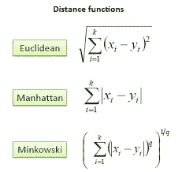
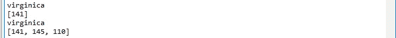

# KNN 算法及其从头实现

> 原文：<https://medium.datadriveninvestor.com/knn-algorithm-and-implementation-from-scratch-b9f9b739c28f?source=collection_archive---------1----------------------->

[](http://www.track.datadriveninvestor.com/1B9E)

KNN 是一种广泛使用的分类技术。它属于监督学习。这是一个非参数的，基于实例的懒惰学习算法。其主要目的是使用包含不同数据点的介质，这些数据点被分成不同的类，用于预测输入样本点的输出。

*非参数表示:*它不对底层数据分布做任何假设。这是有用的，因为现实世界中的实际数据并不总是遵循理论假设，因此，KNN 来拯救我们了。

*基于实例:*我们的算法并不显式地学习模型，而是试图记忆训练实例，这种东西被用作预测阶段的“知识”。

与其他算法相比，KNN 是最受重视的算法，因为它计算时间短，易于解释输出。

这个算法是如何工作的？

答案很简单。


source : [www.towardsdatascience.com](http://www.towardsdatascience.com)

现在让我们看看这个图像，有两个类，蓝色正方形和红色三角形。现在我们需要预测问号的输出类。

在第一个例子中，我们取 K=1，这意味着问号将属于其数据点最接近它的那个类。因为这里我们只讨论 1 个最近邻，所以我们可以看到问号的最近邻是一个蓝色方块。因此，很明显，问号将属于蓝色方块。

但是在我们取 k=3 的第二种情况下，我们需要取问号到它的邻居的前 3 个最近距离。而经过计算 ***欧氏距离*** ，可见问号将属于红三角。

那么这个欧几里德距离是什么，为什么用它来预测输出？



source : [Saedsayad](http://www.saedsayad.com)

在这张图片中，我们看到了 KNN 使用的三种不同的距离。这里 y 是训练实例，x 是我们需要预测输出类的点。

*   正在计算 x 和每个训练观察值之间的距离 d。我们称之为数据集中的“K”点，即最接近 x 的点。K 通常是奇数，以防止出现平局的情况。
*   现在，条件概率正在为每一类计算，也就是说，一组点中带有特定类标签的分数。

```
P(y = j|X = x) = 1/k * ∑  I(y(i)=j)
I(x) here is the indicator function, which says 1 if the argument is true for x and 0 otherwise.
```

*最后，我们的输入 x 被分配给具有最大概率的类。*

为了最终确定 K 的值，我们需要访问两个参数，训练错误率和验证错误率。


**This is the curve of training error rate.**

正如我们所看到的，k=1 时的错误率为 0，这是因为离任何一点最近的点就是该点本身。如果 k=1 时的验证误差为 0，我们会选择 k=1，但看看验证误差曲线。


**Validation Error**

很明显，我们过度拟合了数据。为了获得 K 的优化值，我们可以绘制验证曲线并获得 K 的优化值。K 的这个值将用于所有预测。

下面是 Knn 的**伪码**:

```
1\. Load the Data.
2\. Initialize the value of K.
3\. For predicting the output class for the test data, iterate from 1st data point to the total number of data points.
3.1 Calculate distance between test data and each row of training data by the help of euclidean distance.
3.2 Sort the calculated distance in ascending order.
3.3 Get the top K rows from the sorted array.
3.4 Now find out the most frequent class of the rows.
3.5 Return the predicted class for the test data.
```

实施:

```
import pandas as pd
import numpy as np
import math
import operator
x = pd.read_csv("iris.csv")
print(x.head()) 
def ED(x1, x2, length): #it is used for calculating euclidean distance
    distance = 0
    for x in range(length):
        distance += np.square(x1[x] - x2[x])
    return np.sqrt(distance)def knn(trainingSet, testInstance, k): #here we are defining our model

    distances = {}
    sort = {}

    length = testInstance.shape[1]

    for x in range(len(trainingSet)):
        dist = ED(testInstance, trainingSet.iloc[x], length)
        distances[x] = dist[0]
    sortdist = sorted(distances.items(), key=operator.itemgetter(1))
    neighbors = []
    for x in range(k):
        neighbors.append(sortdist[x][0])
    Votes = {} #to get most frequent class of rows
    for x in range(len(neighbors)):
        response = trainingSet.iloc[neighbors[x]][-1]
        if response in Votes:
            Votes[response] += 1
        else:
            Votes[response] = 1
    sortvotes = sorted(Votes.items(), key=operator.itemgetter(1), reverse=True)
    return(sortvotes[0][0], neighbors)
testSet = [[6.8, 3.4, 4.8, 2.4]]
test = pd.DataFrame(testSet)
k = 1
k1 = 3result,neigh = knn(data, test, k)
result1,neigh1 = knn(data, test, k1)
print(result)
print(neigh)
print(result1)
print(neigh1)
```



**Output Generated**

所以，是的，我们已经从头开始实施了。

*编码快乐！！！*