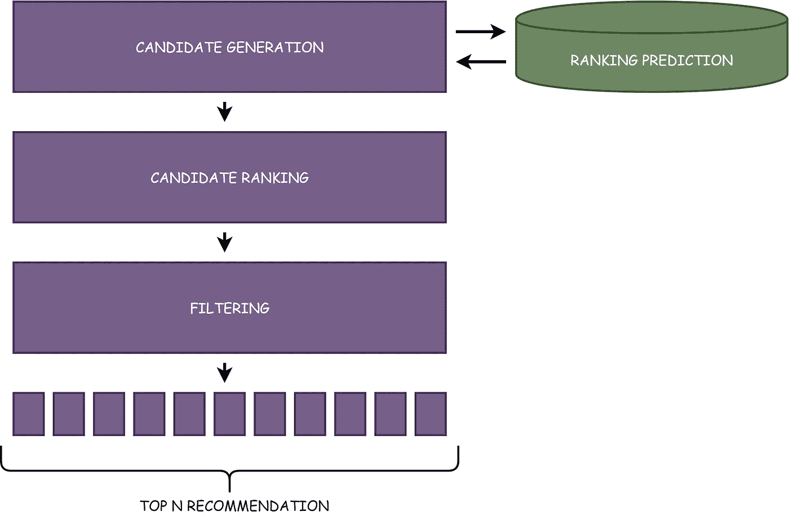
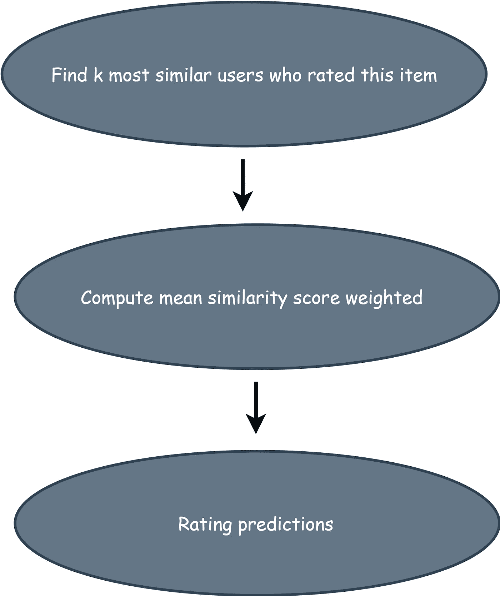
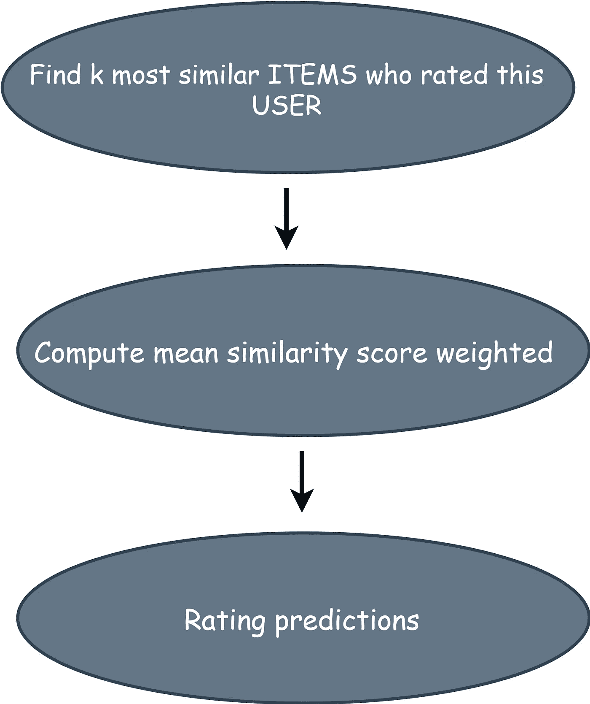
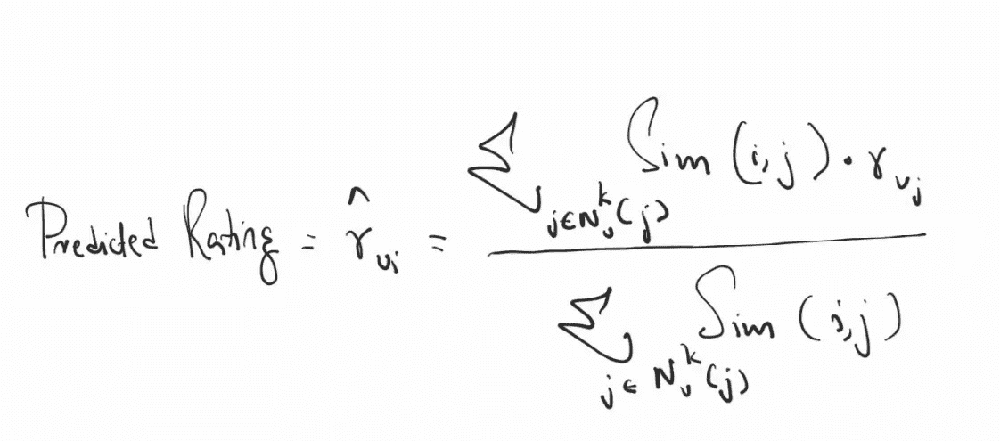

# KNN 建议—第 6 部分

> 原文：<https://medium.datadriveninvestor.com/knn-recommendations-part-6-520a7f4227f6?source=collection_archive---------8----------------------->

# 目录:

1.  介绍和建议框架
2.  评估推荐系统
3.  基于内容的推荐
4.  基于邻域的协同过滤
5.  基于用户和项目的协同过滤
6.  KNN 建议
7.  矩阵分解
8.  深度学习—简介
9.  受限玻尔兹曼机器
10.  AutoRecs
11.  亚马逊 DSSTNE 和鼠尾草制造商
12.  现实世界的挑战和解决方案

下面的架构展示了应用于“评级预测”推荐系统的协同过滤。

这是一种**高效的方法！**

 [## 机器学习的外汇交易挑战|数据驱动的投资者

### 机器学习是人工智能的一个分支，之前占据了很多头条。人们是…

www.datadriveninvestor.com](https://www.datadriveninvestor.com/2019/02/18/the-challenge-of-forex-trading-for-machine-learning/) 

但是因为我们预测评级值，我们可以使用测试/训练或交叉验证来测量系统的离线准确性；哪个**在研究界有用！**

# 基于用户的 KNN 推荐

*   仍然使用用户-用户相似性矩阵作为其核心
*   我们正在深入研究数据，并试图做出评级预测
*   复杂的方法——这是一件坏事！！

# 基于项目的 KNN 建议

*   简单的方法比复杂的方法对我们更有利
*   这更像是铲进框架

最重要的是，离线度量不能作为选择一个框架的纯粹基线。

# 基于翻译的建议(2017)

我们将项目嵌入到一个“过渡空间”中，在这个空间中，用户被建模为对项目序列进行操作的平移向量。例如，如果用户观看了汤姆·克鲁斯的电影，然后再次观看他的电影，则向用户推荐汤姆·克鲁斯的电影是一种有效的方法。

*   优于所有其他方法(命中率)
*   正在研究中(有希望)
*   在线提供的代码和数据

## 下一个>>>