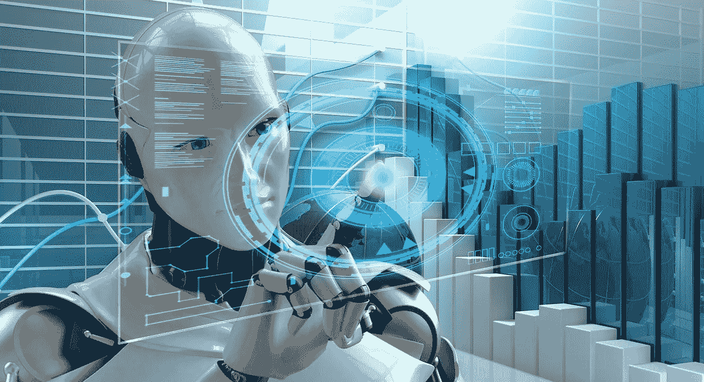

# 知道如何为企业有效利用人工智能

> 原文：<https://medium.datadriveninvestor.com/know-how-to-leverage-artificial-intelligence-for-businesses-effectively-b62f3549708e?source=collection_archive---------11----------------------->

**Why Artificial Intelligence Is Important for Businesses Today?**

事实上，技术正在悄悄地进入我们的生活，现在它已经开始在商业和人们的工作方式中显示出它的影响。仍然有许多企业不知道如何在他们的工作场所完全使用这些技术。

与人们认为人工智能技术具有威胁性不同，它在彻底改变人们的生活方面发挥了重要作用，目前仍处于早期阶段。如果你计划与可靠的 [***AI 发展公司***](https://www.weblineindia.com/artificial-intelligence-development.html)**在印度*发展业务，你将获得一切机会让你的业务天翻地覆，优化运营，减少低效，节省大量资金。*

*我们可以称人工智能为下一次伟大的技术革命。它完全改变了收集、存储和使用数据或信息的方式。*

# *人工智能在商业中的蓬勃发展*

*人们个人生活的很多方面都被 AI 接管了。我们现在使用 Cortana 或 Siri 通过简单的命令来完成简单的任务。早期的企业试图通过多任务处理来实现这一点。多任务处理的一个主要问题是，人们发现很难同时处理许多事情，这导致了错误和注意力不集中。*

* [## 今年值得关注的人工智能趋势——数据驱动的投资者

### 预计 2019 年人工智能将取得广泛的重大进展。从谷歌搜索到处理复杂的工作，如…

www.datadriveninvestor.com](https://www.datadriveninvestor.com/2019/02/19/artificial-intelligence-trends-to-watch-this-year/) 

有了人工智能，多任务处理成为可能，因为它将通过自动化处理所有琐碎的任务，让你的员工专注于项目中更重要的领域。大量人工处理的业务流程现在由人工智能负责。如果这些行业不能利用现有的和新增加的人工智能工具，那么他们将更有可能在竞争中落后于其他人。

# 企业如何从人工智能中获益？

**因此，让我们来看看如何将人工智能的力量用于您的业务。**

## 客户服务

公司完全理解客户服务的重要性以及它如何影响公司。如果这方面出了什么问题，事情就会变得很糟糕，非常糟糕。有很多例子表明，人们不再访问网上商店，随之而来的是糟糕的客户服务体验。人们没有兴趣与一些不智能的机器进行对话，在实际与客户服务代理交谈之前，他们会等待答案并多次转移到不同的机器。

通过聊天机器人，可以分析客户数据并提供智能见解，从而有效地帮助客户。一些解决方案将帮助您将您的客户支持与 Salesforce、Magento 和 Zendesk 等资源相集成，并使您可以在不同的消息平台上使用，如 Skype、Facebook Messenger、Slack 和 Whatsapp。

聊天机器人应用开发公司正在整合人工智能，以便将情商纳入机器人代表。

## 信息技术和安全

企业利用人工智能的最佳方式是在 IT 和安全领域。根据塔塔咨询服务公司 2017 年对 835 家公司进行的 [**调查**](http://sites.tcs.com/artificial-intelligence/) ，44%的公司正在使用人工智能来检测和解决安全漏洞。41%的人正在使用人工智能解决技术相关问题。34%的人使用它来应用自动化，这有助于减少生产管理工作。

根据 [**Gartner**](https://www.healthcareitnews.com/news/ai-will-usher-new-generation-advanced-security-software) 预测，到 2020 年，至少 75%的安全软件工具将拥有基于人工智能、启发式或机器学习算法的指令性和预测性分析。

如今，解决方案可以主动预防问题，而不是被动检测恶意软件和持续威胁。

## 企业管理

人工智能可以帮助你管理许多商业管理活动，如规划商务旅行，支持决策，安排团队会议和会议。据估计，决策支持方面的支出在未来几年将会增加，到 2025 年将成为最高 It 支出的一部分。

今天出现了许多商业管理软件，它们能够为企业提供出色的功能。

## 财务和会计

[**根据福布斯**](https://www.forbes.com/sites/forbesfinancecouncil/2017/03/13/how-ai-cloud-and-robots-will-revolutionize-smb-accounting/#7e080a2c10b7) ，埃森哲指出，未来几年，80%的会计和财务相关任务将实现自动化。

在审计过程中，毕马威自 2015 年以来一直使用迈凯伦应用技术公司的创新技术。这实际上是为非审计和审计客户开发工具的过程，利用了预测分析能力。通过使用这些工具，可以评估和质疑预测，以评估客户资产负债表上的资产。

## 人力资源

问问任何一个人力资源人员，招聘、面试和入职的过程会有多费力和繁琐！所以从他们的角度来看，应用人工智能真的是一件令人兴奋的事情。

基于人工智能的应用程序可以帮助筛选候选人，找到合适的匹配，安排面对面的面试——从而确保具有合适潜力的候选人到达办公室。

## 营销和销售

这是商业成功的主要领域之一。几年前，不可能使用人工智能技术来改善你的营销和销售部门，但现在你可以轻松做到这一点。

今天，基于人工智能和机器学习的解决方案可以帮助你根据人口统计找到合适的受众或受众群体。这有助于有效的广告。广告可以针对不同平台上的不同受众群体进行优化，从而提供优化的广告来提高转化率。

## 结论

随着越来越多的公司致力于为企业开发人工智能技术，你应该加快你的业务，以便你可以利用更新的技术。自动化是此类解决方案的关键，您的企业将能够简化流程并轻松节省足够的工时。如果你的企业不能发展和适应不断变化的技术趋势，它将无法留在竞争激烈的市场。

## 您可能也喜欢阅读:

> [**人工智能技术的未来**](https://dzone.com/articles/2019-lets-take-a-look-into-the-future-of-ai-techno)
> 
> [**人工智能塑造和引领未来电子商务的 12 种强大方式**](https://www.linkedin.com/pulse/top-13-ways-artificial-intelligence-shaping-taking-future-solanki/)*