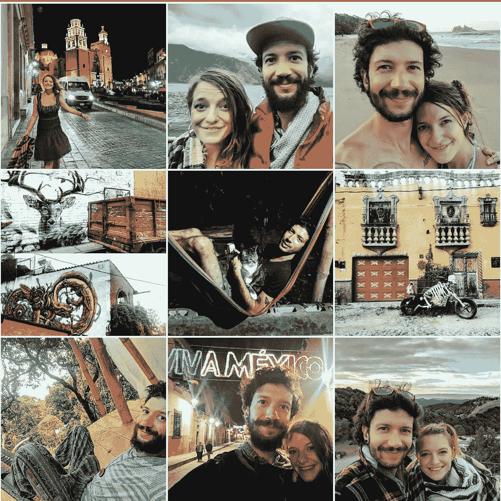
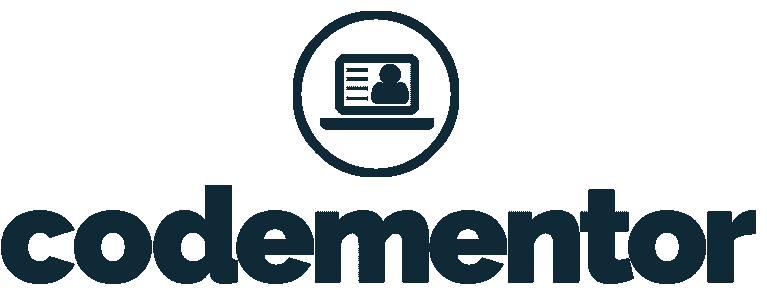

# 懂 Web 开发？明天成为数字游牧者。

> 原文：<https://medium.datadriveninvestor.com/know-web-development-become-a-digital-nomad-tomorrow-c137a4666e4d?source=collection_archive---------9----------------------->

你想环游世界，但你只是在等待一份完美的远程工作，这份工作可以让你在任何地方登录，并付给你一大笔钱，这样你就可以过上你梦想的生活！

Instagram photos from 2019 of my wife and I in Mexico, Costa Rica and Guatemala

**那是两年前我所在的地方。** **后来我得到了那份工作！全职，6 位数，我可以在美洲任何有高速网络的地方工作。没有人需要告诉我两次。我和妻子卖掉并赠送了我们的大部分东西，搬出了我们昂贵的城市公寓，搬到墨西哥去实现梦想！**

## 我的理想工作进行了六个月，我辞职了。

为什么？因为虽然工资很高，让我和妻子过上了梦寐以求的生活，但这份工作压力大、难度大，占用了我大部分的时间和精力。在周末，我几乎没有精力去真正享受这种令人惊叹的新生活。但是我有很多钱——这让我意识到——我需要的远没有我想的那么多。我习惯了在旧金山湾区维持收支平衡。现在我在墨西哥！

对于一个美丽的地方，我的租金是每月 500 美元。食品杂货还不到我所付金额的三分之一。去看电影要花 2 美元——外加爆米花。我意识到我已经完成了我梦想生活的一半。另一半呢？为自己工作，而且只做我想做的事。在我辞掉那份梦寐以求的工作 8 个月后，我和妻子比以往任何时候都更加过着我们梦想中的生活。**在其中的 6 个月里，我主要通过一对一指导人们进行 web 开发来养活自己。我也为金钱和物物交换做一些自由编码。这是你可以在保留全职工作的同时从明天开始做的事情。这可以支持你在墨西哥和危地马拉这样便宜但美丽且文化丰富的国家每周进行几次治疗，我今天就在壮观的阿蒂特兰湖上！**

Lake Atitlan, Guatemala

有两个平台让这变得很容易，[Chegg.com](https://www.chegg.com/tutors/tr/7CHMOU/)和 [Codementor.io](https://www.codementor.io/i/5jcn8hhqxi) 。这些平台非常不同，但对于想在世界任何地方赚钱的程序员来说都非常有用。我会解释和权衡每一个的利弊。

# 齐格

[Chegg.com](https://www.chegg.com/tutors/tr/7CHMOU/)是一个面向大学生的网站，提供一些服务，包括购买和销售教科书，我用它来做什么，连接导师和学生，促进会议以及支付。

在 Chegg 网站上，你注册成为一名导师，并设定你的专业领域。然后学生发布他们的帮助需求，你会看到适合你的专业技能的帖子。人们登录网站寻求各种工作的帮助，但最受欢迎的学科似乎是编程和计算机科学。学生们正在寻求各种各样的帮助，从建立一个简单的网站，到解决高级 CS 课程中的困难任务。

[齐格网](https://www.chegg.com/tutors/tr/7CHMOU/)每小时付给导师 20 美元，这在三藩市不会让你走得很远，但在像阿蒂特兰湖这样的地方就很不错了！在去年冬天的期末考试周，Chegg 将高需求科目的导师工资提高了一倍，包括计算机科学和编程。我在这个平台上工作了三周，每小时挣 40 美元，帮助学生解决大部分相当简单的问题。

Chegg 有一些我不喜欢的地方，这就是为什么我现在大多使用 Codementor。

一个是许多学生把 Chegg.com 作为让其他人为他们工作的一种方式。如果像我一样，你对帮助人们作弊不感兴趣，你将不得不费力地通过许多这样的请求。另一个原因是，有许多非常低努力的求助，我想象一个睡眼惺忪、过度疲劳的学生像僵尸一样，把他们作业的一部分复制粘贴到求助表上，没有任何上下文。我读过几十个求助请求，在结束时我比开始前更困惑。这没什么大不了的，你可以无视他们，但我要说的是，当人们筋疲力尽，绝望地寻求帮助时，他们会发布什么样的废话，这有点令人惊讶。我不禁认为一定有更好的方法来教育我们的年轻人，但那是以后的事了。

最后，导师的统一费率对这个平台来说绝对是个骗局。再好的家教也没办法把你的小时提升。不过没关系！这就是 Codementor.io 的用武之地！

# 共同导师

[Codementor](https://www.codementor.io/i/5jcn8hhqxi) 是一个很棒的平台，可以把需要代码帮助的人和能够提供帮助的人联系起来。学员可以通过 CodementorX 计划申请一次性帮助、长期指导、发布自由职业者的工作，甚至发布需要人们参与的大型项目，一旦你在基本平台上展示了一些技能，你就可以申请该计划。

在 [Codementor](https://www.codementor.io/i/5jcn8hhqxi) 上，有学生寻找作业的帮助，有自学的人寻找指导，有职业开发者寻找专业知识，有初创企业创始人寻找咨询。我见过从“帮我处理 HTML 和 CSS”到“寻求一个密码学博士来帮助保护数据”的请求。

在 [Codementor](https://www.codementor.io/i/5jcn8hhqxi) 上，你可以设定自己的小时数，这意味着你可以在建立自己的声誉和技能的同时发展自己的业务和提升自己的等级。在 Codementor 上，我每小时赚 60 美元！人们收费从 20 美元到 100 多美元不等。这是有成本的——code mentor 收取高达 20%的费用。你使用他们的平台越多，费率就越低，所以这里有一些机会。

我主要使用 Chegg，直到我在 Codementor 上站稳脚跟，现在我主要使用 Codementor，因为我可以赚 3 倍的钱。但是如果 Codementor 很慢并且我有时间的话，我还是会跳上 Chegg，看看我是否能快速赚几个钱。

# 并排分解

## 金钱

**齐格**:每小时 20 美元统一费率
**共同导师**:设定自己的费率，共同导师收取 20%(最高)

## 用户界面

**齐格** : 3/5
**协同导师** 5/5

## 机会

**Chegg**:3/5——根据一年中的不同时间而变化。

## 全部的

**Chegg**:3/5——一个很棒的平台，让你舒适地做一名 CS 导师，并赚取一些额外的美元
**code mentor**:5/5——一个奇妙的平台，可以让你从明天开始全职旅行。我过去 6 个月的生活来源。

在这两个平台之间，与我遇到的人交换我的技能，做一点自由职业，并在我旅行的时候接一些其他的工作(现在我和我的妻子兼职经营一家小咖啡馆和酒店)，我们可以想保持多久就保持多久——我们没有计划搬回美国！如果我在这份压力很大的工作上再呆上 10 年，我们能像现在这样攒够钱提前退休吗？不，不仅仅是通过辅导和指导。但随着我的时间和精力被释放出来，我可以规划和发展自己的创业想法，并付诸行动。我有一个宏大的计划，围绕我最深的激情建立自己的事业——这是我以前几乎没有时间去思考的事情。

此外，当我围绕这一点建立网络存在时，它允许我自己进行更多的一对一指导，而没有一个平台窃取我的一些钱！

# 其他选择？

自由职业者和教师还有很多其他的机会。你可以创建一门课程，在 Udemy.com 上发布，或者在 Upwork.com 或 Freelancer.com 从事自由职业。人们实现梦想的方式有无数种——这只是赋予我最多力量的两个平台。

## 找导师？

直接给我发电子邮件到[alexwhite5d@gmail.com](mailto:alexwhite5d@gmail.com)或者在[共同导师](https://www.codementor.io/i/5jcn8hhqxi)上找到我。
看看我的[文章](https://medium.com/@awhit012/1-1-mentorship-the-happy-medium-between-self-learning-and-the-developer-bootcamp-53e34df169f7)关于为什么一对一指导是学习编码的最好方式之一。

## 想了解更多关于成为数字流浪者的信息吗？

查看我关于旅行时使用 Paypal 和 Venmo 的文章(T7)和关于使用 Google Fi 作为数字流浪者的文章(T9)。

我还可以一对一地指导你如何成为一名数字流浪者。给我发邮件到 alexwhite5d@gmail.com。我还为那些想重新找回自己精神世界的人，以及那些想走出自己的路并开始实现梦想的人提供生活指导。

## 喜欢这篇文章吗？

查看我迄今为止最受欢迎的帖子，关于用投资应用 Stash、Acorns 和 Robinhood 投资两年的[。](https://medium.com/datadriveninvestor/i-used-acorns-robinhood-and-stash-for-2-years-this-is-what-i-learned-and-earned-21baf91dda0e)

## 想了解我的旅行吗？

在 [Instagram](https://www.instagram.com/alexwhite5d/) 上查看我

This could be you! Good luck and happy travels! The life you dream of eagerly awaits you.

## 来自 DDI 的相关故事:

 [## 数据科学和软件工程哪个更有前途？-数据驱动型投资者

### 大约一个月前，当我坐在咖啡馆里为一个客户开发网站时，我发现了这个女人…

www.datadriveninvestor.com](https://www.datadriveninvestor.com/2019/01/23/which-is-more-promising-data-science-or-software-engineering/)