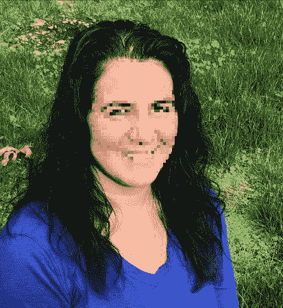

# 认识你的脸，你的头发

> 原文：<https://medium.datadriveninvestor.com/know-your-face-and-your-hair-fab5af265a22?source=collection_archive---------6----------------------->

Photo by [Nadine Shaabana](https://unsplash.com/@nadineshaabana?utm_source=medium&utm_medium=referral) on [Unsplash](https://unsplash.com?utm_source=medium&utm_medium=referral)

“头发，头发，头发，头发，头发，头发，头发
流它，给它看
只要上帝能让它长出来
我的头发……”

即使对于一个被认为是半个黑人的女孩来说，我的头发也从来没有意义。嗯，还有我的肤色。后者可以用一个事实来解释，那就是一个白人奴隶主和我的黑人祖先之间明显有一些混合——这在美国的非裔美国人社区很常见。我的祖父是相当浅肤色的，他的父亲在我见过的唯一一张黑白照片上看起来是白人。现在我们已经做了 DNA 测试，我知道那个我以为是我祖父的人确实是半个白人。

 [## 流氓基因组编辑扭曲 DNA 伦理|数据驱动的投资者

### 基因组编辑是科学的前沿。这在道德上也是有问题的，在许多方面可能是非法的…

www.datadriveninvestor.com](https://www.datadriveninvestor.com/2019/02/18/rogue-genome-editing-twists-dna-ethics/) 

另一方面，我的头发就不一样了。当我去理发时，理发师经常会评论我的头发有多厚。不，我不是说有一头浓密的头发，而是每一缕头发都很浓密。它既不是“黑”头发，也不是白头发。我总觉得我的头发看起来像那些蓝色头发的巨魔娃娃，看起来像他把手指插进了电灯插座。我的头发是直的，但卷曲。我不知道该拿它怎么办。如果我在里面放了“黑人女孩”的产品，它看起来很油腻。我因为太想成为黑人而被嘲笑。

在经历了人生的震惊几天后，当我得知我不是半个黑人，出生证明上的男人不是我的生父时，我的头发开始卷曲。不是浓密的卷发，而是非常明显的波浪。我年轻的时候想要卷发。我甚至试过一次烫发。只有一次，因为卷发不粘，但烫发只会让我的头发看起来更亮。现在，我的头发在我的脸上挂着美丽的波浪，我并不激动。

我新发现的头发只会加剧我每次在镜子里看到自己时的恐惧感。我的脸现在是一张陌生人的脸。我完全不知道自己是谁。我的倒影不再属于我，我也不知道它属于谁。照镜子的时候看到一个不认识的人在回头看你，是挺无所适从的。如果我不得不看着镜子，我眯着眼睛看着自己，试图模糊我看到的人的边缘，因为它不再是我了。

从小到大我爸爸都不在身边。有几次我感到失去父亲的压力，我会比较他和我的照片，试图找到任何相似之处。就像我之前说的，我可以解释我的肤色。我遇到过很多和我一样肤色白皙的混血儿。我的头发，我想它只是混淆了，既不是黑色也不是白色，而是介于两者之间，一种我独有的组合。但我的脸是另一个故事。

我从自己的映像中看不到我的父亲。现在我已经花了很多时间检查人们和他们潜在的生父的照片，我已经很擅长看照片并找出相似之处。我看耳朵，特别是耳垂，还有眼睛和下巴的形状。我妈妈是我唯一能从自己脸上看到影子的人。在发现我的 NPE 身份后，当我看着镜子里的自己时，我仍然可以看到她，但不确定我还看到了谁。我躲着自己的倒影。

在确定山姆·鲁宾斯坦是我的生父后，我非常想要一张照片。我联系了我的亲生父母，他们建议我在旧报纸上找一张他的照片。我确实阅读了存档的报纸文章中所有 500 多篇提到山姆的文章，但我发现的几张照片模糊不清。很难看清他的容貌。所以我联系了一些组织和其他认识他的人。幸运的是，由于他的慈善事业，西雅图歌剧院的公共档案馆里有几张照片。我仔细端详这些照片，就像一个艺术收藏家得到了一幅伦勃朗的画。

现在当我照镜子时，我在自己的映像中看到了山姆。我的耳朵(还有我中间儿子的)就像山姆和他儿子的一样。哦，我的眼睛，形状是他的翻版。我盯着照片，想知道我是否能分辨出他棕色眼睛的颜色，我的眼睛像威士忌。山姆的左眼比右眼略小，就像我一样。为什么我以前没有想过这种特质是从哪里来的？

我犹太教入门课上的一个同学建议我听这个非正统的播客，我立刻就上瘾了。对于一个不是在犹太家庭长大的人来说，这是一个被犹太文化包围和吸收的好地方，至少每次一小时。《180 集》采访了犹太妇女档案馆的执行主任朱迪思·罗森鲍姆，她提到他们最受欢迎的博客帖子是关于犹太人的头发和她的卷发。

我不得不看邮报。。。上面写道，“‘犹太人的头发’似乎指的是深色的、卷曲的、通常是卷曲的头发。”这就是 ME I 思想。我听了播客，我们能谈谈犹太人的头发吗？我理发时所有的考验和磨难现在都有了意义。我有犹太人的头发。现在当我照镜子时，我喜欢我的头发——我知道我在看谁。我去找了一个专门做卷发的理发师。她教我如何处理我的新发型和卷发。在给她讲我的故事时，她说重大压力事件改变你头发的构成并不罕见。

我带着对犹太传统的自豪走在街上。我爱我的头发，因为我知道它从哪里来，我从哪里来。